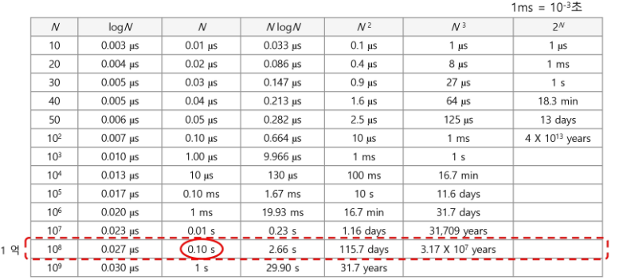

# Algorithm

> 유한한 단계를 통해 문제를 해결하기 위한 절차나 방법
>
> ##### 컴퓨터 용어로 사용, 컴퓨터가 어떤 일을 수행하기 위한 단계적 방법
>
> ##### 어떠한 문제를 해결하기 위한 절차


## I. 알고리즘 표현 법

>#슈도 코드    #순서도


### 1. 슈도코드

> 특정 프로그래밍 언어의 문법을 따라 쓰여진 것이 아니라, 
>
> 일반적인 언어로 코드를 흉내 내어 알고리즘을 써 놓은 코드.


```python
def calcSum(n) :
    sum = 0
    for i in range(1, n+1):
        sum = sum + i
    return sum
print(calcSum(100))
```

```
5050
```

**의사 코드**로 흉내만 내는 코드

실제적인 프로그래밍 언어로 작성된 코드처럼 **컴퓨터에서 실행할 수 없음**

특정 언어로 **프로그램을 작성하기 전**에 알고리즘을 대략적으로 모델링하는데 쓰임


### 2. 순서도

>프로그램이나 작업의 진행 흐름을 순서에 따라 여러 가지 기호나 문자로 나타낸 도표


**흐름도**, 프로그램의 논리적인 흐름, 데이터의 처리 과정을 표현하는 데 사용

**프로그램을 작성하기 전**에 프로그램의 전체적인 흐름과 과정 파악을 위해 필수적으로 거쳐야 하는 작업


## 3. 무엇이 좋은 알고리즘인가?


- 정확성 : 얼마나 정확하게 동작하는가? 높을수록 알고리즘 성능이 좋음.
- 작업량 : 얼마나 적은 연산으로 원하는 결과를 얻어내는가? 적을수록 성능이 좋음.
- 메모리 사용량 : 얼마나 적은 메모리를 사용하는가? 메모리 사용량이 적을수록 좋음.
- 단순성 : 얼마나 단순한가? 단순할수록 좋은 알고리즘.
- 최적성 : 더 이상 개선할 여지 없이 최적화되었는가? 개선이 여지가 없을수록 최적화 된 알고리즘.


## II. 알고리즘 성능 분석

>어떤 알고리즘을 사용하느냐에 따라 문제를 해결하는 데 차이가 남.


### 1. 작업량 비교


####  (1) 작업량 비교 예제

- case 1. 

  1부터 100까지 각각 더하기 : 총 99번의 연산

- case 2.

  숫자의 갯수 *(첫번째 숫자 +  마지막 숫자) / 2 : 덧셈 1번, 곱셉 1번, 나눗셈 1번 총 3번의 연산


##### 더하려는 범위가 클수록 연산 횟수의 차이가 커진다.


#### (2) 작업량 성능 분석 

- 시간 복잡도

  - 실제 걸리는 시간 측정 : 프로그램이 실행되는 환경에 따라 달라질 수 있음.
  - 실행되는 명령문의 개수를 계산 : 일반적으로 사용

  case 1.

  ```python
  def calcSum(n) :
      sum = 0  # 1번
      for i in range(1, n+1):   #1번
          sum = sum + i         #1번 , 총 2회의 연산을 n번 수행함
      return sum
  print(calcSum(100))
  ```

  ```
  1 + n*2 = 2n + 1 [시간 복잡도]
  ```

  case 2.

  ```python
  def calcSum(n) :
      return n*(n+1) // 2  #3번
  ```

  ```
  3 [시간 복잡도]
  ```

  

- 시간 복잡도를 표현하는 방법

  - 빅-오(O) 표기법

    - 시간 복잡도 함수 중에서 가장 큰 영향력을 주는  n에 대한 항만을 표시
    - 계수(Confficient)는 생략하여 표시

    
    
    - n개의 데이터를 입력받아 저장한 후 데이터에 1씩 증가시킨 후 각 데이터를 화면에 출력하는 알고리즘의 시간복잡도는?
    
  
  O(n)
  
  
  

요소 수가 증가함에 따라 각기 다른 시간복잡도의 알고리즘은 아래와 같은 연산 수를 보인다.
  


시간 복잡도별 실제 실행 시간 비교



  ##### 어떤 알고리즘을 선택해야 하는가?

|             | A 알고리즘 | B 알고리즘 |
| ----------- | ---------- | ---------- |
| 시간 복잡도 | logN       | N^2        |
| 걸리는 시간 | 1초        | 100일      |

프로그램을 실행하기 전에 시간 복잡도의 개념을 이용하여 예측, 비교 가능

  

  

