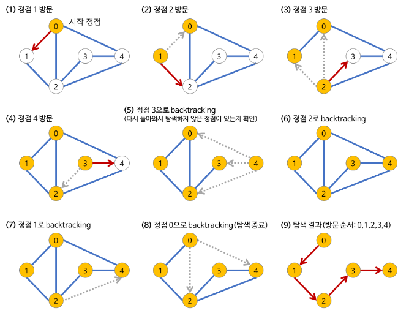

# DFS

> 깊이 우선 탐색(Depth-First-Search)


## Goal

> - 깊이 우선 탐색의 개념
> - 깊이 우선 탐색의 특징
> - 깊이 우선 탐색의 과정
> - 깊이 우선 탐색의 구현


## I. 깊이 우선 탐색(DFS, Depth-First Search)이란?

> 깊이 우선 탐색의 개념


#### 깊이 우선 탐색이란

임의의 노드에서 시작해서 다음 분기로 넘어가기 전에 해당 분기를 완벽하게 탐색하는 방법

- 미로를 탐색할 때 한 방향으로 갈 수 있을 때까지 계속 가다가 더 이상 갈 수 없게 되면 다시 가장 가까운 갈림길로 돌아와서 이곳으로부터 다른 방향으로 다시 탐색을 진행하는 방법과 유사
- 넓게(Wide) 탐색하기 전에 깊게(deep) 탐색하는 것
- 사용하는 경우: **모든 노드를 방문** 하고자 하는 경우에 이 방법을 선택한다.
- 깊이 우선 탐색(DFS)이 너비 우선 탐색(BFS)보다 좀 더 간단하다.
- 단순 검색 속도 자체는 너비 우선 탐색(BFS)에 비해서 느리다.


## II. 깊이 우선 탐색(DFS)의 특징

>깊이 우선 탐색의 특징


- 자기 자신을 호출하는 순환 알고리즘의 형태를 가지고 있다.
- 전위 순화(Pre-Order Traversals)를 포함한 다른 형태의 트리 순회는 모두 DFS의 한 종류이다.
- 이 알고리즘을 구현할 때 가장 큰 차이점은, 그래프 탐색의 경우 **어떤 노드를 방문했었는지 여부를 반드시 검사** 해야 한다는 것이다.
  - 이를 검사하지 않을 경우 무한루프에 빠질 위험이 있다.


## III. 깊이 우선 탐색의 과정

>  깊이 우선 탐색의 과정



1. 시작 노드를 방문한다.
   - 방문한 노드는 방문했다고 표시한다.
2. 시작 노드와 인접한 노드들을 차례대로 순회한다.
   - 시작 노드와 인접한 노드가 없다면 종료한다.
3. 시작 노드와 이웃한 노드를 방문했다면, 시작노드와 인접한 또 다른 노드를 방문하기 전에 먼저 방문한 노드의 이웃 노드들을 전부 방문해야 한다.
   - 방문한 노드를 정점으로 DFS를 다시 시작하여 이웃 노드를 방문한다.
4. 방문한 노드를 전부 완벽하게 탐색했다면 다시 시작노드로 돌아가 다른 이웃 노드를 방문하고 전 과정을 반복한다.
   - 즉, 방문한 노드를 전부 완벽하게 탐색한 뒤에야 시작 노드를 방문할 수 있다는 뜻이다.
   - 아직 방문이 안 된 정점이 없으면 종료
   - 있으면 다시 그 정점을 시작 정점으로 DFS 시작한다.


## IV. 깊이 우선 탐색(DFS)의 구현

>1. 명시적인 스택 사용
>2. 순환 호출 이용


### 1. 순환 호출 이용

#### Code

```python
import sys
sys.stdin = open('input.txt')

def DFS(v):
    stack = []
    stack.append(v)
    visited[v] = 1
    print(v, end=' ')
    
    while stack:
        for w in G[v]:
            if not visited[w]:
                stack.append(w)
                v = w
                visited[w] = 1
                print(v, end = ' ')
                break
        else:
            v = stack.pop()

V, E = map(int,input().split())
G = [[] for _ in range(V+1)]
visited = [0 for _ in range(V+1)]

for _ in range(E):
    u, v = map(int, input().split())
    G[u].append(v)
    G[v].append(u)

DFS(1)
```

#### Input

```
7 8
1 2
1 3
2 4
2 5
4 6
5 6
6 7
3 7
```

#### Output

```
1 2 4 6 5 7 3 
```


### 2. 순환 호출 이용

#### Code

```python
import sys
sys.stdin = open('input.txt')

def DFS(v):
    visited[v] = 1

    print(v, end = '') 

    for w in G[v]:
        if not visited[w]:
            DFS(w)

V, E = map(int,input().split())
G = [[] for _ in range(V+1)]
visited = [0 for _ in range(V+1)]

for _ in range(E):
    u, v = map(int, input().split())
    G[u].append(v)
    G[v].append(u)

DFS(1)
```

#### Input

```
7 8
1 2
1 3
2 4
2 5
4 6
5 6
6 7
3 7
```

#### Output

```
1 2 4 6 5 7 3 
```

