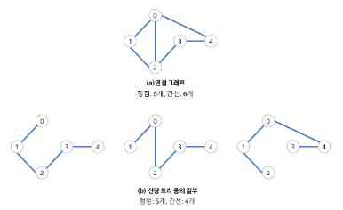
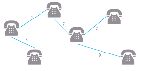
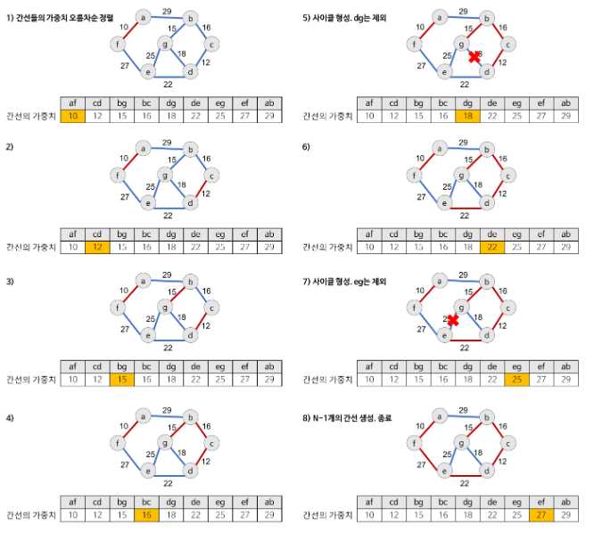

# MST(Minimum Spanning Tree)

> 최소 신장 트리

 

 

### Goal

> - [x] Spanning Tree의 개념과 특징을 이해할 수 있다.
> - [x] Spanning Tree의 사용 사례
> - [x] MST의 개념과 특징을 이해할 수 있다.
> - [x] MST의 사용 사례
> - [x] MST의 구현 방법

   

   

## I. Spanning Tree란?

> 그래프 내의 모든 정점을 포함하는 트리

  

- **Spanning Tree = 신장 트리 = 스패닝 트리**
- Spanning Tree는 **그래프의 최소 연결 부분 그래프** 이다.
  - 최소 연결 = 간선의 수가 가장 적다.
  - n개의 정점을 가지는 그래프의 최소 간선의 수는 (n-1)개이고, (n-1)개의 간선으로 연결되어 있으면 필연적으로 트리 형태가 되고 이것이 바로 Spanning Tree가 된다.
  - 즉, 그래프에서 일부 간선을 선택해서 만든 트리이다.

## II. Spanning Tree의 특징

   

- DFS, BFS을 이용하여 그래프에서 신장 트리를 찾을 수 있다.
- 하나의 그래프에는 많은 신장 트리가 존재할 수 있다.
- Spanning Tree는 트리의 특수한 형태이므로 모든 정점들이 연결 되어 있어야 하고 **사이클을 포함해서는 안된다.**
- 따라서 Spanning Tree는 그래프에 있는 **n개의 정점을 정확히 (n-1)개의 간선으로 연결** 한다.

  

  

## III. Spanning Tree의 사용 사례

> 통신 네트워크 구축

   

- 예를 들어, 회사 내의 모든 전화기를 가장 적은 수의 케이블을 사용하여 연결하고자 하는 경우
- n개의 위치를 연결하는 통신 네트워크를 최소의 링크(간선)를 이용하여 구축하고자 하는 경우, 최소 링크의 수는 (n-1)개가 되고, 따라서 Spanning Tree가 가능해진다.

   

   

## IV. MST 란?

> Spanning Tree 중에서 사용된 간선들의 가중치의 합이 최소인 트리

- MST = Minimum Spanning Tree = 최소 신장 트리
- 각 간선의 가중치가 동일하지 않을 때 단순히 가장 적은 간선을 사용한다고 해서 최소 비용이 얻어 지는 것은 아니다.
- MST는 간선에 가중치를 구려하여 최소 비용의 Spanning Tree를 선택하는 것을 말한다.
- 즉, 네트워크(가중치를 간선에 할당한 그래프)에 있는 모든 정점들을 가장 적은 수의 간선과 비용으로 연결하는 것이다.

   

   

## V. MST의 특징

  

- 간선의 가중치의 합이 최소여야 한다.
- n개의 정점을 가지는 그래프에 대해 반드시 (n-1)개의 간선만을 사용해야 한다.
- 사이클이 포함되어서는 안된다.

## VI. MST의 사용 사례

> 통신망, 도로망, 유통망에서 길이, 구축 비용, 전송 시간 등을 최소로 구축하려는 경우

- 도로 건설
  - 도시들을 모두 연결하면서 도로의 길이가 최소가 되도록 하는 문제
- 전기 회로
  - 단자들을 모두 연결하면서 전선의 길이가 가장 최소가 되도록 하는 문제
- 통신
  - 전화선의 길이가 최소가 되도록 전화 케이블 망을 구성하는 문제
- 배관
  - 파이프를 모두 연결하면서 파이프의 총 길이가 최소가 되도록 연결하는 문제

  

   

## VII. MST의 구현 방법

> - Kruskal MST 알고리즘
> - Prim MST 알고리즘

### 1. Kruskal MST 알고리즘

> 탐욕적인 방법(greedy method)을 이용하여 네트워크(가중치를 간선에 할당한 그래프)의 모든 정점을 최소 비용으로 연결하는 최적 해답을 구하는 것

   

- 탐욕적인 방법
  - 결정을 해야 할 때마다 그 순간에 가장 좋다고 생각되는 것을 선택함으로써, 최종적인 해답에 도달하는 것
  - 탐욕적인 방법은 그 순간에는 최적이지만, 전체적인 관점에서 최적이라는 보장이 없기 때문에 반드시 검증해야 한다.
  - 다행이 Kruskal 알고리즘은 최적의 해답을 주는 것으로 증명되어 있다.
- MST(최소 비용 신장 트리)가 `1)최소 비용의 간선으로 구성됨` `2)사이클을 포함하지 않음`의 조건에 근거하여
  **각 단계에서 사이클을 이루지 않는 최소 비용 간선을 선택**한다.

### 2. Kruskal 알고리즘의 동작

#### [과정]

1. 그래프의 간선들을 가중치의 오름차순으로 정렬한다.
2. 정렬된 간선 리스트에서 순서대로 사이클을 형성하지 않는 간선을 선택한다.
   - 즉, 가장 낮은 가중치를 먼저 선택한다.
   - 사이클을 형성하는 간선을 제외한다.
3. 해당 간선을 현재의 MST(최송 비용 신장 트리)의 집합에 추가한다.

### 3. Kruskal 알고리즘의 구체적인 동작 과정

> Kruskal 알고리즘을 이용하여 MST(최소 비용 신장 트리)를 만드는 과정

  

- **간선 선택을 기반**으로 하는 알고리즘
- 이전 단계에서 만들어진 신장 트리와는 상관없이 무조건 최소 간선만을 선택하는 방법

