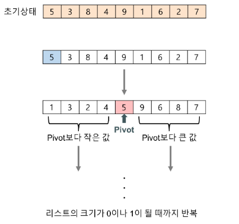
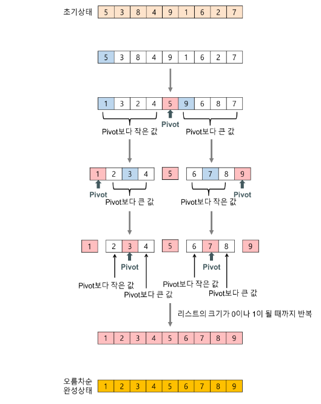
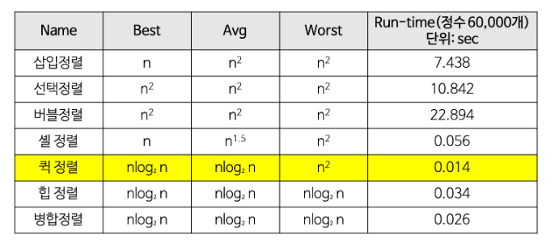

# Quick Sort

> 분할 정복 알고리즘
>
> 평균적으로 매우 빠른 수행 속도를 자랑하는 정렬

​          

### Goal

> - [x] 퀵 정렬(Quick Sort) 알고리즘을 이해한다.
> - [x] 퀵 정렬(Quick Sort) 알고리즘을 구현해 본다.
> - [x] 퀵 정렬(Quick Sort) 알고리즘의 특징
> - [x] 퀵 정렬(Quick Sort) 알고리즘의 시간 복잡도
> - [x] 퀵 정렬(Quick Sort) 장, 단점 분석

​            

   

## I. Quik Sort 알고리즘


- 불안정 정렬에 속하며, 다른 원소와의 비교만으로 정렬을 수행하는 비교 정렬에 속한다.
- 분할 정복(Divide and Conquer) 알고리즘
  - 매우 빠른 수행 속도를 자랑
  - 병합 정렬(Merge sort)와 달리 퀵 정렬은 비균등하게 분할한다.
- 분할 정복(Divide and Conquer) 방법
  - 문제를 작은 2개의 문제로 분리하고 각각을 해결한 다음, 결과를 모아서 원래의 문제를 해결하는 전략.
  - 분할 정복 방법은 대개 순환 호출을 이용하여 구현한다.


## II. Quick Sort 과정

> Pivot을 이용하여 Pivot을 기준으로 수를 분류하여 정렬하는 알고리즘

​                       

1) 리스트 안에 있는 한 요소를 선택한다. 이렇게 고른 요소를 **피벗(Pivot)** 이라고 한다.

2) 피벗을 기준으로 피벗보다 작은 요소들은 모두 피벗 왼쪽으로 옮겨지고 피벗보다 큰 요소들은 모두 피벗의 오른	쪽으로 옮겨진다.

3) 피벗을 제외한 왼쪽 리스트와 오른쪽 리스트를 다시 정렬한다.

- 분할된 부분 리스트에 대하여 순환 호출을 이용하여 정렬을 반복한다.
- 부분 리스트에서도 다시 피벗을 정하고 피벗을 기준으로 2개의 부분 리스트로 나누는 과정을 반복

4) 부분 리스트들이 더 이상 분할이 불가능 할 때까지 반복한다.



​                 

## III. Quick Sort 알고리즘의 구체화

> 퀵 정렬은 **분할(Divide)**, **정복(Conquer)**, **결합(Combline)**의 3단계로 이루어진다.

​           

- 분할(Divide) : 입력 배열을 피벗을 기준으로 비균등하게 2개의 부분 배열(피벗을 중심으로 피벗보다 작은 요소들, 피벗보다 큰 요소들)로 분할한다.
- 정복(Conquer) : 부분 배열을 정렬한다. 부분 배열의 크기가 충분히 작지 않으면 **순환 호출**을 이용하여 다시 분할 정복 방법을 적용한다.
- 결합(Combine): 정렬된 부분 배열들을 하나의 배열에 합병한다.
- 순환 호출이 한번 진행될 때마다 최소한 하나의 피벗은 최종적으로 위치가 정해지므로, 이 알고리즘은 반드시 끝난다는 것을 보장할 수 있다.



​       

   

#### Python Code

```python
def quick_sorted(arr):
    if len(arr) > 1:
        pivot = arr[len(arr)-1]
        left, mid, right = [], [], []
        for i in range(len(arr)-1):
            if arr[i] < pivot:
                left.append(arr[i])
            elif arr[i] > pivot:
                right.append(arr[i])
            else:
                mid.append(arr[i])
        mid.append(pivot)
        return quick_sorted(left) + mid + quick_sorted(right)
    else:
        return arr
```

​               

​        

## IV. Quick Sort의 시간 복잡도

​          



​        

​             

## V. Quick Sort 알고리즘 특징

​            

​             

#### 장점

- 속도가 빠르다
  - 시간 복잡도가 O(nlog<sub>2</sub>n)을 가지는 다른 정렬 알고리즘과 비교했을 때도 가장 빠르다.
- 추가 메모리 공간을 필요로 하지 않는다.
  - 퀵 정렬은 O(log n)만큼의 메모리를 필요로 한다.

​                    

#### 단점

- 정렬된 리스트에 대해서는 퀵 정렬의 불균형 분할에 의해 오히려 수행시간이 더 많이 걸린다.
- 퀵 정렬의 불균형 분할을 방지하기 위하여 피벗을 선택할 때 더욱 리스트를 균등하게 분할할 수 있는 데이터를 선택한다.
  - 리스트 내의 몇 개의 데이터 중에서 크기순으로 중간 값을 피벗으로 선택한다.

​      

​      