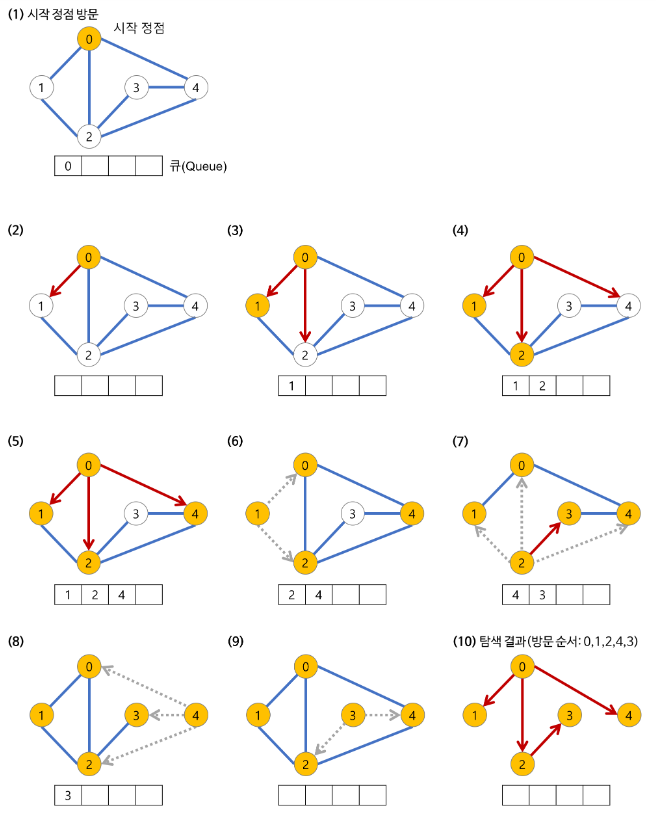

# BFS

> 너비 우선 탐색(Breadth-First-Search)


## Goal

> - 너비 우선 탐색의 개념
> - 너비 우선 탐색의 특징
> - 너비 우선 탐색의 과정
> - 너비 우선 탐색의 구현


## I. 너비 우선 탐색(BFS, Breadth-First Search)이란?

> 너비 우선 탐색의 개념


#### 너비 우선 탐색이란

임의의 노드에서 시작해서 인접한 노드를 먼저 탐색하는 방법

- 시작 정점으로부터 가까운 정점을 먼저 방문하고 멀리 떨어져 있는 정점을 나중에 방문하는 순회 방법.
- 즉, 깊게(deep) 탐색하기 전에 넓게(wide) 탐색하는 것이다.
- 사용하는 경우: **두 노드 사이의 최단 경로** 혹은 **임의의 경로를 찾고 싶을 때** 이 방법을 선택한다.
  - 지구상에 존재하는 모든 친구 관계를 그래프로 표현한 후 Ash와 Vanessa 사이에 존재하는 경로를 찾는 경우
  - 깊이 우선 탐색의 경우 - 모든 친구 관계를 다 살펴봐야 할지도 모른다.
  - 너비 우선 탐색의 경우 - Ash와 가까운 관계부터 탐색
- 너비 우선 탐색(BFS)이 깊이 우선 탐색(DFS)보다 좀 더 복잡하다.


## II. 너비 우선 탐색(BFS)의 특징

>너비 우선 탐색의 특징


- 직관적이지 않은 면이 있다.
  - BFS는 시작 노드에서 시작해서 거리에 따라 단계별로 탐색한다고 볼 수 있다.
- BFS는 **재귀적으로 동작하지 않는다.**
- 이 알고리즘을 구현할 때 가장 큰 차이점은, 그래프 탐색의 경우 **어떤 노드를 방문했었는지 여부를 반드시 검사** 해야 한다는 것이다.
  - 이를 검사하지 않을 경우 무한루프에 빠질 위험이 있다.
- BFS는 방문한 노드들을 차례로 저장한 후 꺼낼 수 있는 자료 구조인 큐(Queue)를 사용한다.
  - 즉, 선입선출(FIFO) 원칙으로 탐색
  - 일반적으로 큐를 이용해서 반복적 형태로 구현하는 것이 가장 잘 동작한다.
- 'Prim', 'Dijkstra' 알고리즘과 유사하다.


## III. 너비 우선 탐색의 과정

>  너비 우선 탐색의 과정



1. 시작 노드를 방문한다.
   - 큐에 방문된 노드를 삽입한다.
   - 초기 상태의 큐에는 시작 노드만이 저장
     - 즉 시작 노드의 이웃 노드를 모두 방문한 다음에 이웃의 이웃들을 방문한다.
2. 큐에서 꺼낸 노드와 인접한 노드들을 모두 차례로 방문한다.
   - 큐에서 꺼낸 노드를 방문한다.
   - 큐에서 꺼낸 노드와 인접한 노드들을 모두 방문한다.
     - 인적합 노드가 없다면 큐의 앞에서 노드를 꺼낸다.
   - 큐에 방문된 노드를 삽입 한다.
3. 큐가 소진될 때까지 계속한다.


## IV. 너비 우선 탐색(BFS)의 구현

>자료 구조 큐(Queue)를 이용


### 자료 구조 큐(Queue)를 이용

#### Code

```python
import sys
sys.stdin = open('input.txt')

def DFS(v):
    stack = []
    stack.append(v)
    visited[v] = 1
    print(v, end=' ')
    
    while stack:
        for w in G[v]:
            if not visited[w]:
                stack.append(w)
                v = w
                visited[w] = 1
                print(v, end = ' ')
                break
        else:
            v = stack.pop()

V, E = map(int,input().split())
G = [[] for _ in range(V+1)]
visited = [0 for _ in range(V+1)]

for _ in range(E):
    u, v = map(int, input().split())
    G[u].append(v)
    G[v].append(u)

DFS(1)
```

#### Input

```
7 8
1 2
1 3
2 4
2 5
4 6
5 6
6 7
3 7
```

#### Output

```
1 2 4 6 5 7 3 
```


### 2. 순환 호출 이용

#### Code

```python
def bfs(u):
    queue = list()
    queue.append(u)
    check[u] = 1

    while queue:     
        u = queue.pop(0)
        result.append(u)
        for v in G[u]:
            if not check[v]:
                check[v] = 1
                queue.append(v)


V, E, n = map(int,input().split())
G = [[] for _ in range(V+1)]

for _ in range(E):
    u, v = map(int,input().split())
    G[u].append(v)
    G[v].append(u)

for v in G:
    v.sort()
    
result = list()
check = [0]*(V+1)  
bfs(n)
print(*result) 
```

#### Input

```
4 5 1
1 2
1 3
1 4
2 4
3 4
```

#### Output

```
1 2 3 4
```

