# Back Tracking

> 비효율적인 경로를 차단하고 갈수있는 가능성이 있는 루트를 검사하는 방법.

​                          

### Goal

> - [x] 백트래킹(Backtracking) 알고리즘을 이해한다.
> - [x] 백트래킹(Backtracking)  알고리즘을 예시로 이해해 본다.
> - [x] 백트래킹(Backtracking) 알고리즘을 구현해 본다.
> - [x] 백트래킹(Backtracking)  장, 단점 분석.

​          

​               

## I. Backtracking 알고리즘

> 배제를 통한 풀이시간 단축 알고리즘

​         

- 기본적으로 백트래킹은 '가능한 모든 방법을 탐색한다'는 것이 기본 아이디어이다.

- 대표적인 완전 탐색 방법인 DFS의 단점인 모든 곳을 방문하기 때문에 나타나는 비효율성을 보완하기 위해 

  비효율적인 경로를 차단하고 목표지점에 갈수있는 가능성이 있는 루트를 검사하는 방법이 백트래킹 알고리즘

- 백트래킹은 DFS에 가지치기(Pruining)를 통해 가도되지 않는 루트는 고려하지 않고 탐색하는 완전탐색 기법.

- 가지치기를 얼마나 잘 하느냐에 따라서 효율이 극대화 될 수 있는 방법이다.

​           

​         

## II. 4-Queens Problem

> 대표적인 Backtracking Algorithm을 이용해 해결한 문제 예시
>
> 4개의 Queen을 서로 상대방을 위협하지 않도록 4*4 체스판에 위치시키는 문제

​          

#### 좌측 상단이 (1,1) 위치를 나타낸다.

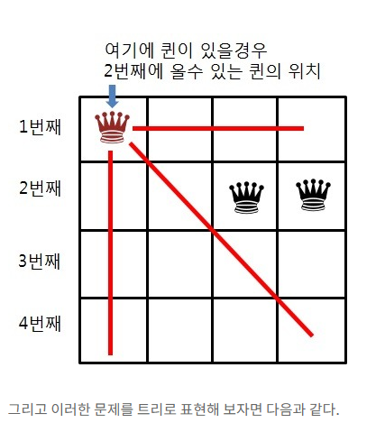

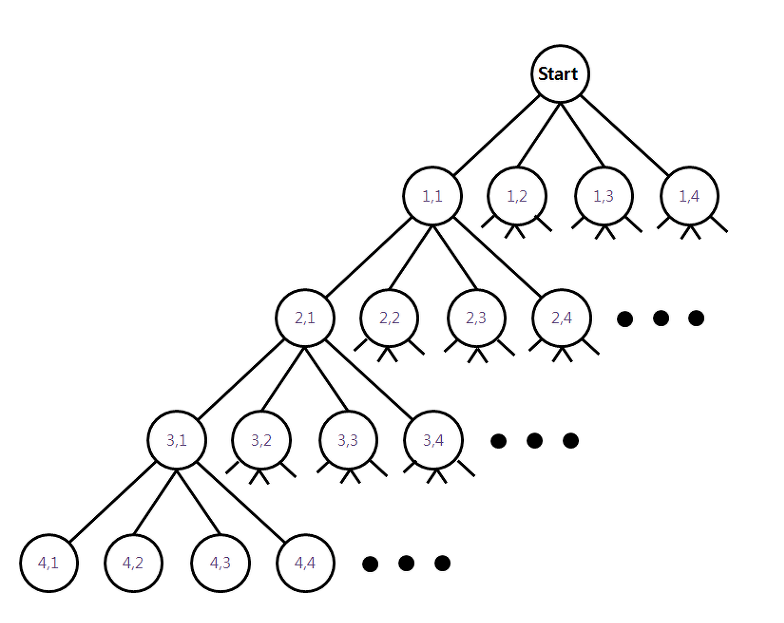


#### 문제 해결 과정.


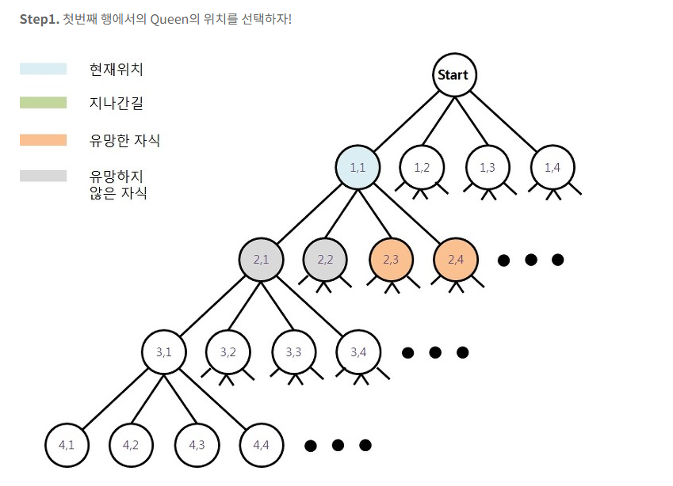


만약 이 상황에서 깊이우선탐색은 (1,1)노드에서 (2,1),(2,2),(2,3)(2,4)를 스택에 넣을 것이다.

하지만 되추적은 (2,1),(2,2)를 스택에 넣지 않는다.

왜 그런 것일까?

바로 유망하지 않기 때문이다. 이말은 즉 (2,1) (2,2)는 **해답이 될 가능성이 전혀 없다**는 것이다.

즉 되추적은 스택에 자식노드를 넣기전에 유망힌지 즉 해답이 될 가능성이 있는지 확인하고 스택에 넣는다.

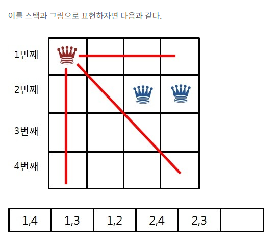

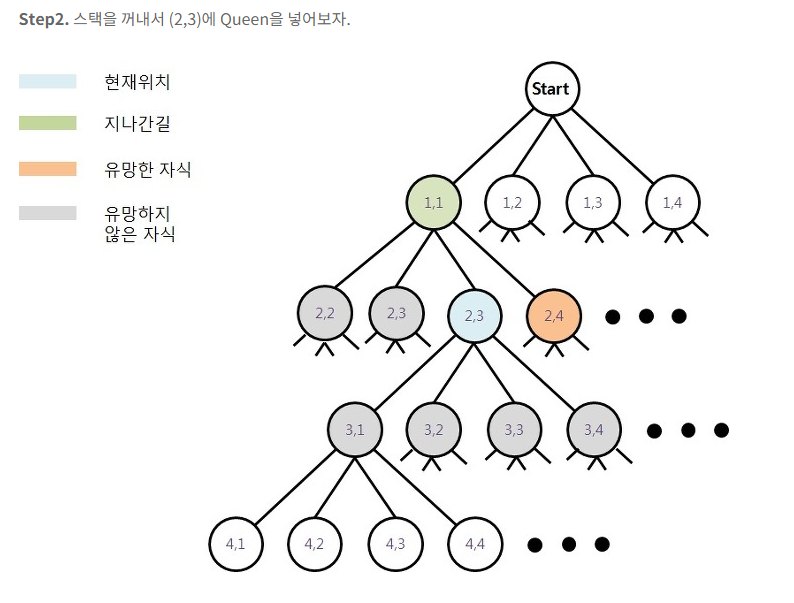

스택에서 꺼낸 (2,3)에서 Queen을 넣은 후 유망한 노드를 검사해보자.

검사해 봤을 때 유망한 노드가 없는 것을 확인 할 수 있다.

이를 스택과 그림으로 표현하면 다음과 같다.

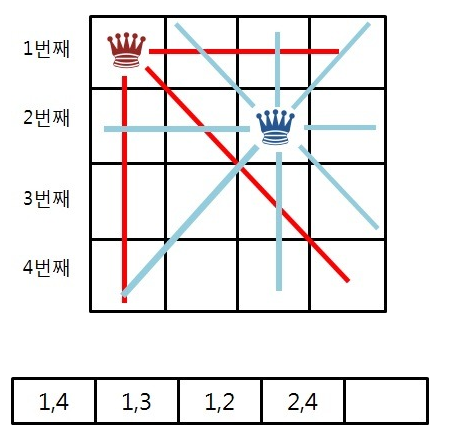

​                  

​          

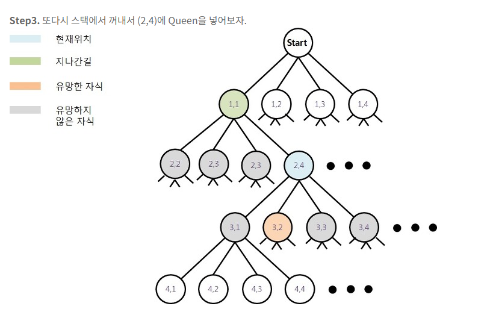

​             

​             


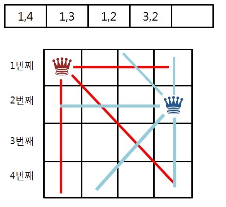

​         

​                

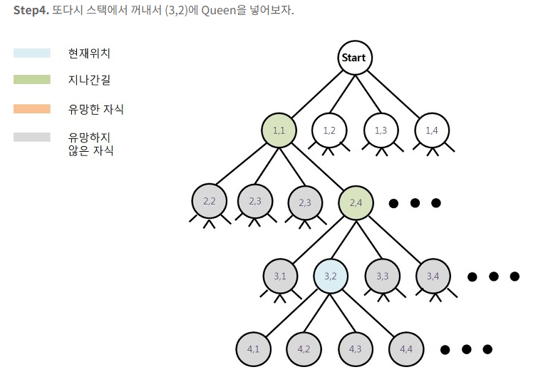

​       

​              

다음 유망한 자식이 없다.

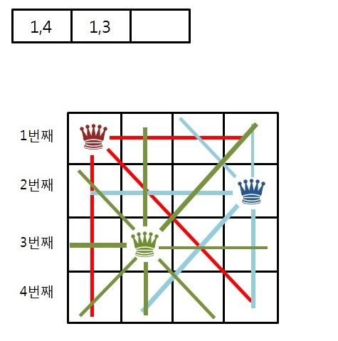

더이상 밑으로 갈 길이 없다. 그렇다면 Step3.에서와 마찬가지로 부모로 돌아가서 다음 유망한 자식한테 간다.

그리고 (1,1)에 Queen을 놧을 때 해답이 없기 때문에 **(1,1)은 유망하지 않다고 결론**이 난다.

​              

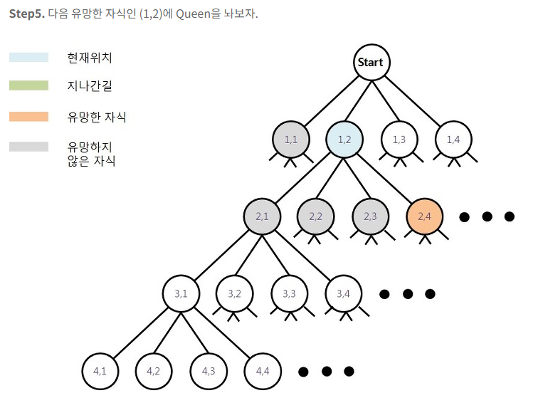

​            

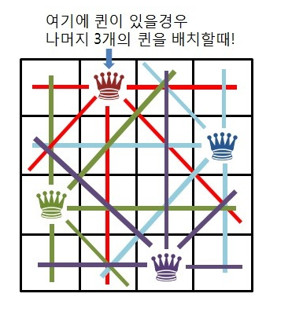

​           

반복하다보면 해답을 찾을 수 있게 된다. 즉 해답이 될 가능성이 있는지를 확인하고 유망히자 않다면 더 이상 깊게 들어가지 않고 부모 노드로 돌아오는 방식을 취한다.

유망한 노드를 잘 찾을 수 있다면 배제를 통해 되추적 알고리즘을 이용하면 풀이 시간을 단축할 수 있다.

​         

​       

## III. 순열

>순열을 코드로 구현해보는 과정에서 백트래킹 알고리즘을 적용할 수 있다.


#### Code

```python
def permutation(arr, r):
    # 1.
    arr = sorted(arr)
    used = [0 for _ in range(len(arr))]

    def generate(chosen, used):
        # 2.
        if len(chosen) == r:
            print(chosen)
            return
	
	# 3.
        for i in range(len(arr)):
            if not used[i]:
                chosen.append(arr[i])
                used[i] = 1
                generate(chosen, used)
                used[i] = 0
                chosen.pop()
    generate([], used)

permutation('ABCD', 2)
```

#### 출력

```
['A', 'B']
['A', 'C']
['A', 'D']
['B', 'A']
['B', 'C']
['B', 'D']
['C', 'A']
['C', 'B']
['C', 'D']
['D', 'A']
['D', 'B']
['D', 'C']
```

