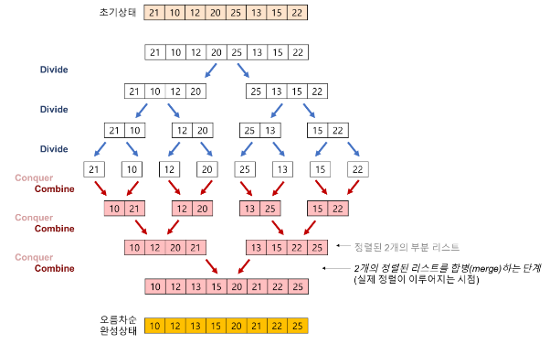
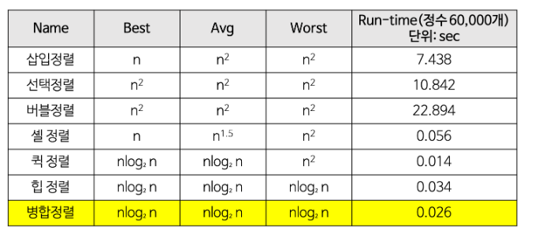

# Merge Sort

> 병합 정복 알고리즘
>
> 대표적인 O(log N) 알고리즘

​          

### Goal

> - [x] 병합 정렬(Merge Sort) 알고리즘을 이해한다.
> - [x] 병합 정렬(Merge Sort) 알고리즘을 구현해 본다.
> - [x] 병합 정렬(Merge Sort) 알고리즘의 특징
> - [x] 병합 정렬(Merge Sort) 알고리즘의 시간 복잡도
> - [x] 병합 정렬(Merge Sort) 장, 단점 분석

​                  

​         

## I. Merge Sort 알고리즘

​             

- 일반적으로 병합 정렬은 **안정 정렬**에 속하며, **분할 정복 알고리즘**의 하나 이다.
  - 분할 정복(Divide and Conquer) 방법
    - 문제를 작은 2개의 문제로 분리하고 각각을 해결한 다음, 결과를 모아서 원래의 문제를 해결하는 전략
    - 분할 정복 방법은 대개 순한 호출을 이용하여 구현한다.

​         

​                 

## II. Merge Sort 과정

> 리스트를 분할하고 각 리스트를 재귀적으로 합병 정렬하는 알고리즘

​                       

1) 리스트의 길이가 0또는 1이면 이미 정렬된 것으로 본다.

2) 정렬되지 않은 리스트를 절반으로 잘라 비슷한 크기의 두 부분 리스트로 나눈다.

3) 각 부분 리스트를 재귀적으로 합병 정렬을 이용해 정렬한다.

4) 두 부분 리스트를 다시 하나의 정렬된 리스트로 합병한다.


## III. Merge Sort 알고리즘의 구체화

> 합병 정렬은 **분할(Divide)**, **정복(Conquer)**, **결합(Combline)**의 3단계로 이루어진다.

​           

- 합병 정렬의 단계

  - 분할(Divide) : 입력 배열을 같은 크기의 2개의 부분 배열로 분할한다.
  - 정복(Conquer) : 부분 배열을 정렬한다. 부분 배열의 크기가 충분히 작지 않으면 **순환 호출**을 이용하여 다시 분할 정복 방법을 적용한다.
  - 결합(Combine): 정렬된 부분 배열들을 하나의 배열에 합병한다.

  ​             

- 합병 정렬의 과정

  - 추가적인 리스트가 필요
  - 각 부분 배열을 정렬할 때도 합병 정렬을 순환적으로 호출하여 적용한다.
  - 합병 정렬에서 실제로 정렬이 이루어지는 시점은 2개의 리스트를 합병 하는 단계이다.

​            

​            



​                     

#### Python Code

```python
def merge_sort(list):
    if len(list) <= 1:
        return list
    mid = len(list) // 2
    leftList = list[:mid]
    rightList = list[mid:]
    leftList = merge_sort(leftList)
    rightList = merge_sort(rightList)
    return merge(leftList, rightList)

def merge(left, right):
    result = []
    while len(left) > 0 or len(right) > 0:
        if len(left) > 0 and len(right) > 0:
            if left[0] <= right[0]:
                result.append(left[0])
                left = left[1:]
            else:
                result.append(right[0])
                right = right[1:]
        elif len(left) > 0:
            result.append(left[0])
            left = left[1:]
        elif len(right) > 0:
            result.append(right[0])
            right = right[1:]
    return result
```

​                 

​                  

## IV. Merge Sort의 시간 복잡도

​          



​                    

​                  

## V. Merge Sort 알고리즘 특징

​              

#### 장점

- 안정적인 정렬 방법
  - 데이터의 분포에 영향을 덜 받는다. 즉, 입력 데이터가 무엇이든 간에 정렬되는 시간은 동일하다.
  - 만약 연결 리스트(Linked List)로 구성하면, 링크 인덱스만 변경되므로 데이터의 이동은 무시할 수 있을 정도로 작아진다.
    - 제자리 정렬(in-place sorting)로 구현할 수 있다.
  - 크기가 큰 레코드를 정렬할 경우에 연결 리스트를 사용한다면, 합병 정렬은 퀵 정렬을 포함한 다른 어떤 정렬 방법보다 효율적이다.

​                    

#### 단점

- 만약 배열(Array)로 구성한다면, 임시 배열이 필요하다.

  - 제자리 정렬(in-place sorting)이 아니다.

- 레코드들의 크기가 큰 경우에는 이동 횟수가 많으므로 매우 큰 시간적 낭비를 초래한다.

    

​      