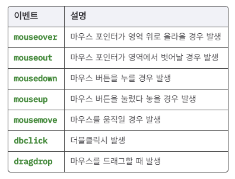
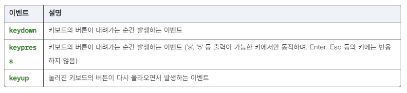
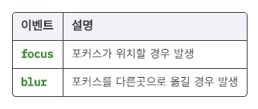
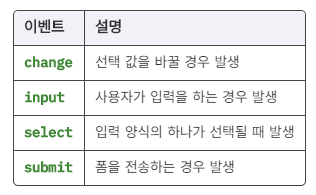
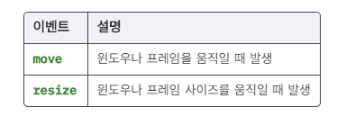
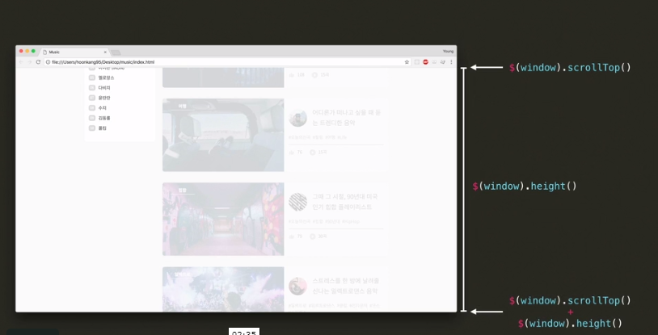

# DOM

> Document Object Model(DOM) : 문서 객체 모델


# jQuery = '선택' + '동작'


모든 jQuery 코드는 크게 두 부분으로 나눌 수 있습니다.


앞의 강의에서 나왔던 3개의 jQuery 예시 코드를 봅시다.


```js
$('#hello').on('click', sayHello);
$('#hello').text();
$('#hello').css('background', '#7f8ff4');
```


이 코드들은 모두 `.`을 기준으로 두 부분으로 나눌 수 있습니다.


```js
// 선택 //     .   // 동작 //
$('#hello')   .   on('click', sayHello);
$('#hello')   .   text();
$('#hello')   .   css('background', '#7f8ff4');
```


jQuery를 쓰기 위해서는, **'선택'**과 **'동작'**만 알면 됩니다.


이번 챕터에서는 어떻게 하면 잘 **'선택'**할 수 있는지, 그리고 잘 **'동작'**시킬 수 있는지에 대해 배워봅시다.


# CSS 써먹기


지난 강의 예시 코드를 봅시다.


```js
// 선택 //     .   // 동작 //
$('#hello')   .   on('click', sayHello);
$('#hello')   .   text();
$('#hello')   .   css('background', '#7f8ff4');
```


`$('#hello')`는 `id`가 `hello`인 요소를 선택합니다.


여기서 `id`를 `#`으로 표현하는 것은 CSS의 문법입니다.


**"jQuery는 고맙게도 CSS 문법을 그대로 사용합니다."**


마찬가지로 `class`를 `.`으로 표현할 수 있습니다.


즉, `class` 이름이 `small`인 요소를 선택하려면 `$('.small')`이라고 쓰면 됩니다.


다양한 CSS의 선택자를 활용하면 손쉽게 요소를 선택할 수 있습니다.


# CSS 선택자 복습하기


### 1) 태그 이름

#### HTML

```html
<h1>Heading 1</h1>
<h2>Heading 2</h2>
```

#### CSS

```css
/* 모든 <h1> 태그 */
h1 {
  color: orange;
}
```

### 2) 클래스/아이디

#### HTML

```html
<p class="important">Paragraph 1</p>
<p>Paragraph 2</p>
<p class="important">Paragraph 3</p>
<p class="important">Paragraph 4</p>
<p id="favorite">Paragraph 5</p>
<p>Paragraph 6</p>
```

#### CSS

```css
/* 'important'라는 클래스를 갖고 있는 모든 태그 */
.important {
  color: orange;
}

/* 'favorite'라는 아이디를 갖고 있는 모든 태그 */
#favorite {
  color: blue;
}
```

### 3) 자식 (children)

#### HTML

```html
<i>Outside</i>
<div class="div1">
  <i>Inside 1</i>
  <p>Bla bla <i>Inside 2</i></p>
  <i>Inside 3</i>
</div>
```

#### CSS

```css
/* 'div1' 클래스를 갖고 있는 요소의 자식 중 모든 <i> 태그 */
.div1 i {
  color: orange;
}
```

### 4) 직속 자식 (direct children)

#### HTML

```html
<i>Outside</i>
<div class="div1">
  <i>Inside 1</i>
  <p>Bla bla <i>Inside 2</i></p>
  <i>Inside 3</i>
</div>
```

#### CSS

```css
/* 'div1' 클래스를 갖고 있는 요소의 직속 자식 중 모든 <i> 태그 */
.div1 > i {
  color: orange;
}
```

### 5) 복수 선택

#### HTML

```html
<p class="one">Outside 1</p>
<p class="two">Outside 2</p>
<div>
  <p class="one">Inside 1</p>
  <p class="two">Inside 2</p>
  <p class="three">Inside 3</p>
  <p class="four">Inside 4</p>
  <p class="five">Inside 5</p>
</div>
```

#### CSS

```css
/* 'two' 클래스를 가지고 있는 태그 모두와 'four' 클래스를 가지고 있는 태그 모두 선택 */
.two, .four {
  color: orange;
}
```

### 6) 여러 조건

#### HTML

```html
<p class="outside one">Outside 1</p>
<p class="outside two">Outside 2</p>
<div>
  <p class="inside one">Inside 1</p>
  <p class="inside two">Inside 2</p>
  <p class="inside three">Inside 3</p>
  <p class="inside four">Inside 4</p>
  <p class="inside five">Inside 5</p>
</div>
```

#### CSS

```css
/* 'outside' 클래스를 갖고 있으면서 'one' 클래스도 갖고 있는 태그 */
.outside.one {
  color: blue;
}

/* 'inside' 클래스를 갖고 있으면서 'two' 클래스도 갖고 있는 태그 */
.inside.two {
  color: orange;
}
```

### 7) Pseudo-class (가상 클래스)


콜론(`:`)을 사용하면 몇 가지 '가상 클래스'를 선택할 수 있습니다.

### 7-1) n번째 자식

#### HTML

```html
<div class="div1">
  <p>Paragraph 1</p>
  <p>Paragraph 2</p>
  <p>Paragraph 3</p>
  <p>Paragraph 4</p>
  <p>Paragraph 5</p>
  <p>Paragraph 6</p>
</div>
```

#### CSS

```css
/* .div1의 자식인 <p> 태그 중 3번째 */
.div1 p:nth-child(3) {
  color: blue;
}

/* .div1의 자식인 <p> 태그 중 첫 번째 */
.div1 p:first-child {
  color: red;
}

/* .div1의 자식인 <p> 태그 중 마지막 */
.div1 p:last-child {
  color: green;
}

/* .div1의 자식 중 마지막 자식이 아닌 <p> 태그 */
.div1 p:not(:last-child) {
  font-size: 150%;
}

/* .div1의 자식 중 첫 번째 자식이 아닌 <p> 태그 */
.div1 p:not(:first-child) {
  text-decoration: line-through;
}
```

### 7-2) 마우스 오버 (hover)

#### HTML

```html
<h1>Hello World!</h1>
```

#### CSS

```css
h1 {
  color: orange;
}

/* 마우스가 <h1> 태그에 올라갔을 때 */
h1:hover {
  color: green;
}
```

### 

# jQuery


프로그래밍 언어가 아니다!

jQuery는 자바스크립트 라이브러리입니다.

즉, jQuery는 여러가지 함수와 변수가 정의되어 있는 자바스크립트 파일입니다!

```js
함수 이름(parameter) 
```


jQuery함수 $가 리턴하는 값은 무엇일까?

jQuery에서 정의한 좀 특별한 DOM 관련 함수를 사용할 수 있는 배열과 비슷한  jQuery 객체를 리턴한다.


jQuery는 **'선택' + '동작'** 으로 이루어진다고 했었죠? 이 **'동작'**부분에 해당하는 다양한 메서드가 있습니다. 이 메서드를 활용하면 우리가 원하는 요소에 클래스를 추가/제거하거나, 속성을 읽고 쓰거나, 스타일을 입히는 것도 가능합니다.


### 클래스 관련


```js
// item에 header이라는 클래스 추가
$('#item').addClass('header');

// item에 header이라는 클래스 제거
$('#item').removeClass('header');

// item에 header이라는 클래스가 없으면 추가, 있으면 제거
$('#item').toggleClass('header');

// item에 header라는 클래스가 있으면 true, 없으면 false 리턴
$("#item").hasClass('header');
```


### 속성 관련


```js
// 이미지 태그의 src 속성 받아오기
$('img').attr('src');

// 이미지 태그의 src 속성 지정하기
$('img').attr('src', 'images/logo.png');

// h1 태그의 텍스트 받아오기
$('h1').text();

// h1 태그에 텍스트 지정하기
$('h1').text('Hello World!');

// h1 태그에 HTML 텍스트 지정하기
$('h1').html('<b>Hello World!</b>');
```


### 스타일 관련


```js
// item의 font-weight를 bold로 지정하기
$("#item").css('font-weight','bold');

// item의 background-color 가져오기
$("#item").css('background-color');
```


# 요소 추가하기

앞선 강의에서 보았듯, jQuery를 사용하면 쉽게 새로운 요소를 추가할 수 있습니다:


```js
$('ul li:first-child').before('<li class="item">어떤 요소</li>');
```


`before` 함수에 넘겨주는 파라미터를 자세히 보세요.


문자열이기 때문에 따옴표(`'...'`)로 둘러싸여 있는데, 그 안에도 따옴표(`"item"`)가 있죠? 이 코드에서 바깥쪽 따옴표는 작은따옴표이고 안쪽 따옴표는 큰따옴표이기 때문에 오류 없이 작동합니다.


그리고 반대로 바깥쪽에 큰따옴표를 쓰고 안쪽에 작은따옴표를 써도 아무 문제가 없습니다.


```js
// 문제 없이 작동
$('ul li:first-child').before("<li class='item'>어떤 요소</li>");
```


# 작은 따옴표 안에 작은 따옴표?


하지만 작은 따옴표 안에 작은 따옴표를 쓰면 문제가 생깁니다.


```js
// 오류!
$('ul li:first-child').before('<li class='item'>어떤 요소</li>');
```


이제 `'어떤 요소'`에서 `'까지가 문자열로 인식되기 때문이죠.


꼭 작은 따옴표 안에 작은 따옴표를 쓰고 싶다면, 문자열 안에 있는 따옴표 앞에 백슬래시(`\`)를 써주시면 됩니다!


```js
// 문제 해결!
$('ul li:first-child').before('<li class=\'item\'>어떤 요소</li>');
```


마찬가지로 큰 따옴표 안에 큰 따옴표를 쓰고 싶으셔도 백슬래시로 해결할 수 있습니다.


```js
// 문제 해결!
$('ul li:first-child').before("<li class=\"item\">어떤 요소</li>");
```


자식 요소 추가하는법

```js
// ul 자식 요소들 중 가장 뒤에 요소 추가
$('ul').append("<li class=\"item\">어떤 요소</li>");
// ul 자식 요소들 중 가장 앞에 요소 추가
$('ul').prepend("<li class=\"item\">어떤 요소</li>");
```


원래 있던 요소를 이동하는 법

```js
// id1 앞에 id2를 이동
$('#id1').before($('#id2'));
// id1 뒤에 id2를 이동
$('#id').after($('#id'));

// ul의 자식중 #id에 해당하는 자식을 맨 뒤로 이동
$('ul').append($('#id'));
```


원래 있던 요소를 삭제하는 법

```js
// id1 요소 삭제
$('#id1').remove()
```


# 더 선택하기

jQuery에는 '선택'과 '동작'이 있고, '선택'을 위한 방법으로 **CSS 선택자**를 알아보았습니다. 하지만 이 외에도 **jQuery에서 제공하는 '선택' 방법**이 있습니다. 이 부분을 한번 알아봅시다.


### filter


```
$('button').filter('.color-3').text('SELECTED!');
```


`filter()`는 `()`안의 조건으로 선택된 요소를 한번 더 **걸러줍니다.** 위 코드의 경우, 모든 `button` 태그들 중에 `color-3`라는 클래스를 가지고 있는 요소만 추려내서 `text`를 바꿔주라는 의미입니다.


아래 `script` 코드에 유의해서 결과를 살펴보세요. `box-1`에서는 `filter`없이 모든 요소에 `text`가 적용되었고, `box-2`에서는 `filter`를 한 번 거친 후 `text`가 적용되었습니다.

#### HTML

```html
<html>
<head>
  <meta charset="utf-8">
  <link rel="stylesheet" href="css/styles.css">
</head>
<body>
  <div class="box" id="box-1">
    <button class="color-1">-</button>
    <button class="color-2">-</button>
    <button class="color-3">-</button>
    <button class="color-4">-</button>
  </div>

  <div class="box" id="box-2">
    <button class="color-1">-</button>
    <button class="color-2">-</button>
    <button class="color-3">-</button>
    <button class="color-4">-</button>
  </div>

  <script
    src="https://code.jquery.com/jquery-3.2.1.min.js"
    integrity="sha256-hwg4gsxgFZhOsEEamdOYGBf13FyQuiTwlAQgxVSNgt4="
    crossorigin="anonymous"></script>
  <script>
    $('#box-1 button').text('SELECTED!');
    $('#box-2 button').filter('.color-3').text('SELECTED!');
  </script>
</body>
</html>
```

#### CSS

```css
.box {
  display: flex;
  flex-wrap: wrap;
  margin: 20px auto;
  max-width: 23rem;
  border: 2px solid #f6774f;
}
button {
  border: none;
  color: white;
  margin: 1rem;
  width: 150px;
  height: 40px;
}
.color-1 {
  background-color: #426fc5;
}
.color-2 {
  background-color: #00897b;
}
.color-3 {
  background-color: #f6774f;
}
.color-4 {
  background-color: #e94043;
}
```


### not


```
$('button').not('.color-3').text('SELECTED!');
```


`not()`은 `filter()`의 반대입니다. 선택된 요소 중에서 조건에 해당되는 것들을 **제외**시킵니다. 위 코드의 경우, 모든 `button` 태그들 중에 `color-3`라는 클래스를 가지고 있는 요소만 제외하고 `text`를 바꿔주라는 의미입니다.


아래 `script` 코드에 유의해서 결과를 살펴보세요. `box-1`에서는 `not`없이 모든 요소에 `text`가 적용되었고, `box-2`에서는 `not`을 한 번 거친 후 `text`가 적용되었습니다.

#### HTML

```html
<html>
<head>
  <meta charset="utf-8">
  <link rel="stylesheet" href="css/styles.css">
</head>
<body>
  <div class="box" id="box-1">
    <button class="color-1">-</button>
    <button class="color-2">-</button>
    <button class="color-3">-</button>
    <button class="color-4">-</button>
  </div>

  <div class="box" id="box-2">
    <button class="color-1">-</button>
    <button class="color-2">-</button>
    <button class="color-3">-</button>
    <button class="color-4">-</button>
  </div>

  <script
    src="https://code.jquery.com/jquery-3.2.1.min.js"
    integrity="sha256-hwg4gsxgFZhOsEEamdOYGBf13FyQuiTwlAQgxVSNgt4="
    crossorigin="anonymous"></script>
  <script>
    $('#box-1 button').text('SELECTED!');
    $('#box-2 button').not('.color-3').text('SELECTED!');
  </script>
</body>
</html>
```

#### CSS

```css
.box {
  display: flex;
  flex-wrap: wrap;
  margin: 20px auto;
  max-width: 23rem;
  border: 2px solid #f6774f;
}
button {
  border: none;
  color: white;
  margin: 1rem;
  width: 150px;
  height: 40px;
}
.color-1 {
  background-color: #426fc5;
}
.color-2 {
  background-color: #00897b;
}
.color-3 {
  background-color: #f6774f;
}
.color-4 {
  background-color: #e94043;
}
```


### eq


```
$('button').eq(1).text('SELECTED!');
```


`eq()`는 선택된 요소들 중에서 **n번째 요소** 하나만 골라냅니다. 위 코드는 모든 `button` 태그들 중에 두 번째 요소만 골라서 `text`를 바꿔주라는 의미입니다. `eq()`안에 들어가는 숫자는 `0`부터 시작하기 때문에, `1`일 경우 두 번째 요소라는 점에 유의하세요!


아래 `script` 코드에 유의해서 결과를 살펴보세요. `box-1`에서는 선택된 모든 요소에 `text`가 적용되었고, `box-2`에서는 선택된 요소 중 두 번째 요소에만 `text`가 적용되었습니다.

#### HTML

```html
<html>
<head>
  <meta charset="utf-8">
  <link rel="stylesheet" href="css/styles.css">
</head>
<body>
  <div class="box" id="box-1">
    <button class="color-1">-</button>
    <button class="color-2">-</button>
    <button class="color-3">-</button>
    <button class="color-4">-</button>
  </div>

  <div class="box" id="box-2">
    <button class="color-1">-</button>
    <button class="color-2">-</button>
    <button class="color-3">-</button>
    <button class="color-4">-</button>
  </div>

  <script
    src="https://code.jquery.com/jquery-3.2.1.min.js"
    integrity="sha256-hwg4gsxgFZhOsEEamdOYGBf13FyQuiTwlAQgxVSNgt4="
    crossorigin="anonymous"></script>
  <script>
    $('#box-1 button').text('SELECTED!');
    $('#box-2 button').eq(1).text('SELECTED!');
  </script>
</body>
</html>
```

#### CSS

```css
.box {
  display: flex;
  flex-wrap: wrap;
  margin: 20px auto;
  max-width: 23rem;
  border: 2px solid #f6774f;
}
button {
  border: none;
  color: white;
  margin: 1rem;
  width: 150px;
  height: 40px;
}
.color-1 {
  background-color: #426fc5;
}
.color-2 {
  background-color: #00897b;
}
.color-3 {
  background-color: #f6774f;
}
.color-4 {
  background-color: #e94043;
}
```


### parent


```
$('#btn-1').parent().css('background-color', 'black');
```


`parent()`는 **부모 요소**를 찾아줍니다. 위 코드의 경우, `btn-1`의 부모 요소에 `css`를 적용해줍니다.


아래 `script` 코드에 유의해서 결과를 살펴보세요. `box-1`에서는 `.color-1` 자기 자신에 `css`가 적용되었고, `box-2`에서는 `.color-1`의 부모 요소에 `css`가 적용되었습니다.

#### HTML

```html
<html>
<head>
  <meta charset="utf-8">
  <link rel="stylesheet" href="css/styles.css">
</head>
<body>
  <div class="box" id="box-1">
    <button class="color-1">-</button>
    <button class="color-2">-</button>
    <button class="color-3">-</button>
    <button class="color-4">-</button>
  </div>

  <div class="box" id="box-2">
    <button class="color-1">-</button>
    <button class="color-2">-</button>
    <button class="color-3">-</button>
    <button class="color-4">-</button>
  </div>

  <script
    src="https://code.jquery.com/jquery-3.2.1.min.js"
    integrity="sha256-hwg4gsxgFZhOsEEamdOYGBf13FyQuiTwlAQgxVSNgt4="
    crossorigin="anonymous"></script>
  <script>
    $('#box-1 .color-1').css('background-color', 'black');
    $('#box-2 .color-1').parent().css('background-color', 'black');
  </script>
</body>
</html>
```

#### CSS

```css
.box {
  display: flex;
  flex-wrap: wrap;
  margin: 20px auto;
  max-width: 23rem;
  border: 2px solid #f6774f;
}
button {
  border: none;
  color: white;
  margin: 1rem;
  width: 150px;
  height: 40px;
}
.color-1 {
  background-color: #426fc5;
}
.color-2 {
  background-color: #00897b;
}
.color-3 {
  background-color: #f6774f;
}
.color-4 {
  background-color: #e94043;
}
```


### children


```
$('#box-1').children().css('background-color', 'black');
```


`children()`은 `parent()`의 반대입니다. 선택된 요소의 **자녀 요소**를 모두 골라줍니다.  위 코드의 경우, `box-1`의 모든 자녀 요소에 css를 적용해줍니다. `()` 안에 조건을 넣을 경우, `filter`역할도 함께 해줍니다.


아래 `script` 코드에 유의해서 결과를 살펴보세요. `box-1`에서는 box 자체에 `css`가 적용되었고, `box-2`에서는 box의 자식 요소들에 `css`가 적용되었습니다. `box-3`에서는 특정 조건에 맞는 자식 요소에만 `css`가 적용됩니다.

#### HTML

```html
<html>
<head>
  <meta charset="utf-8">
  <link rel="stylesheet" href="css/styles.css">
</head>
<body>
  <div class="box" id="box-1">
    <button class="color-1">-</button>
    <button class="color-2">-</button>
    <button class="color-3">-</button>
    <button class="color-4">-</button>
  </div>

  <div class="box" id="box-2">
    <button class="color-1">-</button>
    <button class="color-2">-</button>
    <button class="color-3">-</button>
    <button class="color-4">-</button>
  </div>

  <div class="box" id="box-3">
    <button class="color-1">-</button>
    <button class="color-2">-</button>
    <button class="color-3">-</button>
    <button class="color-4">-</button>
  </div>

  <script
    src="https://code.jquery.com/jquery-3.2.1.min.js"
    integrity="sha256-hwg4gsxgFZhOsEEamdOYGBf13FyQuiTwlAQgxVSNgt4="
    crossorigin="anonymous"></script>
  <script>
    $('#box-1').css('background-color', 'black');
    $('#box-2').children().css('background-color', 'black');
    $('#box-3').children('.color-2').css('background-color', 'black');
  </script>
</body>
</html>
```

#### CSS

```css
.box {
  display: flex;
  flex-wrap: wrap;
  margin: 20px auto;
  max-width: 23rem;
  border: 2px solid #f6774f;
}
button {
  border: none;
  color: white;
  margin: 1rem;
  width: 150px;
  height: 40px;
}
.color-1 {
  background-color: #426fc5;
}
.color-2 {
  background-color: #00897b;
}
.color-3 {
  background-color: #f6774f;
}
.color-4 {
  background-color: #e94043;
}
```


### find


```
$('#box-1').find('.color-2').css('background-color', 'black');
```


`find()`는 선택된 요소의 자녀, 자녀의 자녀, ... 를 골라주되, 조건에 맞는 요소만 골라서 찾아줍니다. 위 코드는 `box-1`의 자녀 요소 중 `color-2` 클래스가 있는 요소의 css를 적용해줍니다.


`children()`은 한 단계 아래의 자녀(직속 자녀)만 찾아주는 반면, `find()`자녀의 자녀의 자녀들까지 그 이하는 모두 찾아낸다는 차이점이 있습니다.


아래 `script` 코드에 유의해서 결과를 살펴보세요. `box-1`에서는 box 자체에 `css`가 적용되었고, `box-2`에서는 특정 조건에 맞는 자식 요소에만 `css`가 적용됩니다.

#### HTML

```html
<html>
<head>
  <meta charset="utf-8">
  <link rel="stylesheet" href="css/styles.css">
</head>
<body>
  <div class="box" id="box-1">
    <button class="color-1">-</button>
    <button class="color-2">-</button>
    <button class="color-3">-</button>
    <button class="color-4">-</button>
  </div>

  <div class="box" id="box-2">
    <button class="color-1">-</button>
    <button class="color-2">-</button>
    <button class="color-3">-</button>
    <button class="color-4">-</button>
  </div>

  <script
    src="https://code.jquery.com/jquery-3.2.1.min.js"
    integrity="sha256-hwg4gsxgFZhOsEEamdOYGBf13FyQuiTwlAQgxVSNgt4="
    crossorigin="anonymous"></script>
  <script>
    $('#box-1').css('background-color', 'black');
    $('#box-2').find('.color-2').css('background-color', 'black');
  </script>
</body>
</html>
```

#### CSS

```css
.box {
  display: flex;
  flex-wrap: wrap;
  margin: 20px auto;
  max-width: 23rem;
  border: 2px solid #f6774f;
}
button {
  border: none;
  color: white;
  margin: 1rem;
  width: 150px;
  height: 40px;
}
.color-1 {
  background-color: #426fc5;
}
.color-2 {
  background-color: #00897b;
}
.color-3 {
  background-color: #f6774f;
}
.color-4 {
  background-color: #e94043;
}
```


### siblings


```
$('#btn-1').siblings().text('SELECTED!');
```


`siblings()`는 선택된 요소의 **이웃 요소**들을 골라줍니다. 위 코드에서는 `btn-1`의 모든 이웃 요소에 text를 변경해줍니다. `()` 안에 조건을 넣을 경우, `filter`역할도 함께 해줍니다.


아래 `script` 코드에 유의해서 결과를 살펴보세요. `box-1`에서는 `.color-2` 자기 자신에 `css`가 적용되었고, `box-2`에서는 `.color-2`의 모든 이웃 요소에 `css`가 적용되었습니다. `box-3`에서는 `.color-2`의 모든 이웃 요소에 중 조건에 맞는 요소에만 `css`가 적용됩니다.

#### HTML

```html
<html>
<head>
  <meta charset="utf-8">
  <link rel="stylesheet" href="css/styles.css">
</head>
<body>
  <div class="box" id="box-1">
    <button class="color-1">-</button>
    <button class="color-2">-</button>
    <button class="color-3">-</button>
    <button class="color-4">-</button>
  </div>

  <div class="box" id="box-2">
    <button class="color-1">-</button>
    <button class="color-2">-</button>
    <button class="color-3">-</button>
    <button class="color-4">-</button>
  </div>

  <div class="box" id="box-3">
    <button class="color-1">-</button>
    <button class="color-2">-</button>
    <button class="color-3">-</button>
    <button class="color-4">-</button>
  </div>

  <script
    src="https://code.jquery.com/jquery-3.2.1.min.js"
    integrity="sha256-hwg4gsxgFZhOsEEamdOYGBf13FyQuiTwlAQgxVSNgt4="
    crossorigin="anonymous"></script>
  <script>
    $('#box-1 .color-2').text('SELECTED!');
    $('#box-2 .color-2').siblings().text('SELECTED!');
    $('#box-3 .color-2').siblings('.color-4').text('SELECTED!');
  </script>
</body>
</html>
```

#### CSS

```css
.box {
  display: flex;
  flex-wrap: wrap;
  margin: 20px auto;
  max-width: 23rem;
  border: 2px solid #f6774f;
}
button {
  border: none;
  color: white;
  margin: 1rem;
  width: 150px;
  height: 40px;
}
.color-1 {
  background-color: #426fc5;
}
.color-2 {
  background-color: #00897b;
}
.color-3 {
  background-color: #f6774f;
}
.color-4 {
  background-color: #e94043;
}
```


# 이벤트 객체 파라미터

함수는 이런 구조입니다.


```js
// 함수 선언
function makeLog(str) {
  console.log(str);
}

// 함수 호출
makeLog('안녕하세요');
```


`makeLog` 함수는 파라미터 하나(`str`)를 받도록 정의되었기 때문에, 함수를 호출할 때 파라미터로 값을 하나 넘겨줄 수 있습니다.


# 이벤트 핸들러


```js
$(document).on('keydown', keyboardInput);
```


위와 같이 이벤트를 등록하면, 이벤트 핸들러 함수(`keyboardInput`)를 호출하는 코드가 자바스크립트 내부에 이미 구현되어 있습니다. 그래서 이벤트 객체를 사용하고자 할 경우, 함수 선언 부분에 파라미터를 넣는 것만으로 이벤트 객체의 전달이 가능해집니다.


```js
// 이벤트 객체를 사용할 경우
function keyboardInput(e) {
  console.log(e.key);
}
```


만약 이벤트 객체를 사용할 필요가 없으면 그냥 파라미터는 비워두면 됩니다.


```js
// 이벤트 객체를 사용하지 않을 경우
function keyboardInput() {
  ...
}
```


# 다양한 이벤트

지금까지 `input`, `click`, `keydown` 등 기본적인 이벤트는 사용해봤는데요. 이 외에도 사용자의 동작에 따라 반응하게 해주는 다양한 이벤트들이 있습니다.


이 이벤트들을 사용하면 더 디테일한 반응이 가능하겠죠? 어떤 종류의 이벤트들이 있는지 미리 알아두면 필요할 때 쓸 수 있습니다.


### 마우스 이벤트



### 키보드 이벤트



### 포커스 이벤트



### 입력 이벤트



### 윈도우 창 이벤트




# Scroll

scroll에 따라서 HTML 내용을 스타일링 할 수 있다.


```js
// 현재 스크롤 바의 위치가 나옴
$(window).scrollTop();
```


## Scroll Event

```js
// scroll event 추가
$(window).on('scroll', function() {
    // opacity 는 1이면 불투명 0이면 투명상태이다. 즉, 0에 가까워 질수록 투명한 상태
    // 즉, scrollTop()값이 .top class의 height와 같아지면 투명상태가 된다.
    $('.top').css('opacity', 1-$(window).scrollTop() / $('.top').height());
})
```


### Scroll을 이용해 브라우저 최상단 이동

```js
$('go-to-top').on('click', function() {
    // scrollTop(value) scrollTop 값이 value인 위치로 화면 이동
    // 0은 화면 최상단
    $(window).scrollTop(0)
})
```

#### 만약 바로 이동하지않고 이동하는 과정을 보여주면서 천천히 이동하고 싶다면?

```js
$('go-to-top').on('click', function() {
    // animate({scrollTop: 가고싶은 위치}, 걸리는 시간)
    $('html, body').animate({scrollTop: 0}, 500);
})
```


### 한 화면 scroll 최 하단 위치 구하는 방법




### 한 화면 각 리스트의 중단 위치 구하는 방법


```js
var playlistHalf = playlist.position().top + playlist.outerHeight()/2;
```


# Each


```js
// card 클래스가 붙어있는 요소의 수만큼 ''hello'를 출력한다.
// 즉 card 클래스가 붙어있는 요소를 한개씩 배열 확인하는 반복문처럼 돌면서 확인한다.
$('.card').each(function() {
    console.log('hello')
})
```


# jQuery Animation


제이쿼리를 사용하면 애니메이션도 보다 쉽게 만들 수 있습니다.


### CSS 적용하기


```js
$("div").animate({left: '250px'});
```


와 같이 작성하면 `div`태그가 `left: 250px`만큼 이동합니다.

#### HTML

```html
<!DOCTYPE html>
<html>
<head>
  <title>jQuery Animation</title>
  <meta charset="utf-8" />
  <link href="css/styles.css" rel="stylesheet" />
</head>
<body>

<button>Start Animation</button>

<div></div>

<script
  src="https://code.jquery.com/jquery-3.2.1.min.js"
  integrity="sha256-hwg4gsxgFZhOsEEamdOYGBf13FyQuiTwlAQgxVSNgt4="
  crossorigin="anonymous"></script>

<script> 
$(document).ready(function() {
  $("button").on('click', function() {
    $("div").animate({left: '250px'});
  });
});
</script> 

</body>
</html>
```

#### CSS

```css
button {
  margin-bottom: 20px;
}

div {
  position: absolute;
  background: gray;
  height: 100px;
  width: 100px;
}
```


### 여러 CSS 동시에 적용하기


```
$("div").animate({left: '250px', opacity: '0.5'});
```


와 같이 작성하면 `div`태그가 `left: 250px`만큼 이동하면서 동시에 `opacity: 0.5`가 적용됩니다.

#### HTML

```html
<!DOCTYPE html>
<html>
<head>
  <title>jQuery Animation</title>
  <meta charset="utf-8" />
  <link href="css/styles.css" rel="stylesheet" />
</head>
<body>

<button>Start Animation</button>

<div></div>

<script
  src="https://code.jquery.com/jquery-3.2.1.min.js"
  integrity="sha256-hwg4gsxgFZhOsEEamdOYGBf13FyQuiTwlAQgxVSNgt4="
  crossorigin="anonymous"></script>

<script> 
$(document).ready(function() {
  $("button").on('click', function() {
    $("div").animate({left: '250px', opacity: '0.5'});
  });
});
</script> 

</body>
</html>
```

#### CSS

```css
button {
  margin-bottom: 20px;
}

div {
  position: absolute;
  background: gray;
  height: 100px;
  width: 100px;
}
```


### 여러 CSS 순서대로 적용하기


```
$("div").animate({left: '250px', opacity: '0.5'});
```


와 달리,


```
$("div").animate({left: '250px'});
$("div").animate({opacity: '0.5'});
```


라고 작성하면 `div`태그가 `left: 250px`만큼 이동한 후, `opacity: 0.5`가 적용됩니다.


#### HTML

```html
<!DOCTYPE html>
<html>
<head>
  <title>jQuery Animation</title>
  <meta charset="utf-8" />
  <link href="css/styles.css" rel="stylesheet" />
</head>
<body>

<button>Start Animation</button>

<div></div>

<script
  src="https://code.jquery.com/jquery-3.2.1.min.js"
  integrity="sha256-hwg4gsxgFZhOsEEamdOYGBf13FyQuiTwlAQgxVSNgt4="
  crossorigin="anonymous"></script>

<script> 
$(document).ready(function() {
  $("button").on('click', function() {
    $("div").animate({left: '250px'});
    $("div").animate({opacity: '0.5'});
  });
});
</script> 

</body>
</html>
```

#### CSS

```css
button {
  margin-bottom: 20px;
}

div {
  position: absolute;
  background: gray;
  height: 100px;
  width: 100px;
}
```


### CSS 반복 적용하기


```
$("div").animate({left: '+=250px'});
```


와 같이 작성하면 `div`태그가 `left: 250px`만큼, 버튼을 누를 때 마다 계속해서 이동합니다.

#### HTML

```html
<!DOCTYPE html>
<html>
<head>
  <title>jQuery Animation</title>
  <meta charset="utf-8" />
  <link href="css/styles.css" rel="stylesheet" />
</head>
<body>

<button>Start Animation</button>

<div></div>

<script
  src="https://code.jquery.com/jquery-3.2.1.min.js"
  integrity="sha256-hwg4gsxgFZhOsEEamdOYGBf13FyQuiTwlAQgxVSNgt4="
  crossorigin="anonymous"></script>

<script> 
$(document).ready(function() {
  $("button").on('click', function() {
    $("div").animate({left: '+=250px'});
  });
});
</script> 

</body>
</html>
```

#### CSS

```css
button {
  margin-bottom: 20px;
}

div {
  position: absolute;
  background: gray;
  height: 100px;
  width: 100px;
}
```


### CSS 적용 속도 조절하기


```
$("div").animate({left: '250px'}, 1000);
```


와 같이 작성하면 `div`태그가 `left: 250px`만큼 1000ms, 즉 1초 동안 이동합니다. 이 값으로는 숫자 뿐 아니라, `slow`, `fast`로도 사용이 가능합니다.

#### HTML

```html
<!DOCTYPE html>
<html>
<head>
  <title>jQuery Animation</title>
  <meta charset="utf-8" />
  <link href="css/styles.css" rel="stylesheet" />
</head>
<body>

<button>Start Animation</button>

<div></div>

<script
  src="https://code.jquery.com/jquery-3.2.1.min.js"
  integrity="sha256-hwg4gsxgFZhOsEEamdOYGBf13FyQuiTwlAQgxVSNgt4="
  crossorigin="anonymous"></script>

<script> 
$(document).ready(function() {
  $("button").on('click', function() {
    $("div").animate({left: '250px'}, 1000);
  });
});
</script> 

</body>
</html>
```

#### CSS

```css
button {
  margin-bottom: 20px;
}

div {
  position: absolute;
  background: gray;
  height: 100px;
  width: 100px;
}
```


### 애니메이션 이펙트 적용하기


```
$("div").animate({left: '250px'}, 1000, 'easeOutElastic');
```


와 같이 작성하면 `div`태그가 `left: 250px`만큼 1초 동안 이동하되, `easeOutElastic` 효과가 적용됩니다.


이런 애니메이션 이펙트를 'Easing'이라고 부르는데, 'Easing' 효과에는 `linear`, `swing`, `easeInBounce`, `easeOutBounce`, `easeInOutBounce` 등 다양한 종류가 있습니다.


다양한 종류의 Easing은 [여기](https://easings.net/)에서 확인할 수 있습니다.


'Easing'을 사용하기 위해서는 jQueryUI 코드도 추가해주어야 합니다.

```js
<script
  src="https://code.jquery.com/ui/1.12.1/jquery-ui.js"
  integrity="sha256-T0Vest3yCU7pafRw9r+settMBX6JkKN06dqBnpQ8d30="
  crossorigin="anonymous"></script>
```

jQuery UI CDN은 [여기](https://code.jquery.com/ui/)에서 가져올 수 있습니다.


#### HTML

```html
<!DOCTYPE html>
<html>
<head>
  <title>jQuery Animation</title>
  <meta charset="utf-8" />
  <link href="css/styles.css" rel="stylesheet" />
</head>
<body>

<button>Start Animation</button>

<div></div>

<script
  src="https://code.jquery.com/jquery-3.2.1.min.js"
  integrity="sha256-hwg4gsxgFZhOsEEamdOYGBf13FyQuiTwlAQgxVSNgt4="
  crossorigin="anonymous"></script>
<script
  src="https://code.jquery.com/ui/1.12.1/jquery-ui.js"
  integrity="sha256-T0Vest3yCU7pafRw9r+settMBX6JkKN06dqBnpQ8d30="
  crossorigin="anonymous"></script>
<script> 
$(document).ready(function() {
  $("button").on('click', function() {
    $("div").animate({left: '250px'}, 1000, 'easeOutElastic');
  });
});
</script> 

</body>
</html>
```

#### CSS

```css
button {
  margin-bottom: 20px;
}

div {
  position: absolute;
  background: gray;
  height: 100px;
  width: 100px;
}
```

