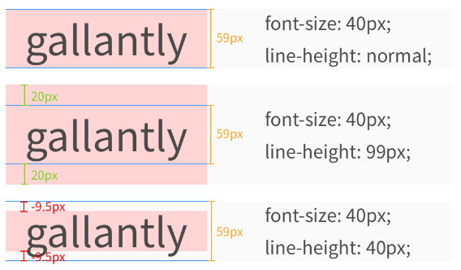
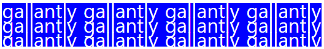

#  CSS 텍스트

​        

### 사전 지식

> CSS 색을 배우기 전에 다음과 같은 기초 지식이 필요합니다.

- [x] **CSS 스타일 적용법**

​        

### Goal

- [x] **CSS Color속성 이해하기.**
- [x] **CSS Direction속성 이해하기.**
- [x] **CSS Letter-spacing 속성 이해하기.**
- [x] **CSS Word-spacing 속성 이해하기.**
- [x] **CSS Text-indent 속성 이해하기.**
- [x] **CSS Text-align 속성 이해하기.**
- [x] **CSS Text-decoration 속성 이해하기.**
- [x] **CSS Text-transform 속성 이해하기.**
- [x] **CSS Line-height 속성 이해하기.**
- [x] **CSS Text-shadow속성 이해하기.**

​       

​       

## I. CSS 텍스트

> CSS는 여러 기능을 가진 다양한 Text 속성을 제공합니다.

​       

CSS에서 사용할 수 있는 대표적인 text 속성은 다음과 같습니다.   

​       

1. color

2. direction

3. letter-spacing

4. word-spacing

5. text-indent

6. text-align

7. text-decoration

8. text-transform

9. line-height

10. text-shadow

​      

### 1. color 속성

> color 속성은 텍스트의 색상을 설정합니다.

​          

웹 페이지에서 텍스트의 기본 색상은 검정색입니다.

`<body>`태그에 명시된 color 속성값은 웹 페이지 내의 모든 텍스트 요소에 적용됩니다.

하지만 각 요소별로 따로 명시된 color 속성값이 있다면, 해당 속성값이 `<body>`태그에 명시된 속성값보다 우선 적용됩니다.

#### HTML

```html
<style>
    body { color: red; }
    p { color: maroon; }
</style>
```

​      

### 2. direction 속성

> direction 속성은 텍스트가 써지는 방향을 설정합니다.

​         

웹 페이지에서 텍스트는 기본적으로 왼쪽에서 오른쪽 방향으로 써집니다.

direction 속성이 left-to-right(ltr)일 때는 기본 설정처럼 텍스트가 왼쪽에서 오른쪽 방향으로 써집니다.

하지만, direction 속성이 right-to-left(rtl)일 때는 텍스트가 반대 방향인 오른쪽에서 왼쪽 방향으로 써집니다.

​       

다음 예제는 "객체 지향 프로그래밍"이라는 문자열을 한글과 아랍어로 각각 나타낸 예제입니다.

#### HTML

```html
<style>
    .rightToLeft { direction: rtl; }
</style>
```

아랍어는 한글이나 영어와는 달리 오른쪽에서 왼쪽 방향으로 텍스트를 읽고 쓰는 언어입니다.

따라서 아랍어와 같이 텍스트를 반대 방향으로 쓰는 언어를 나타낼 때는 텍스트가 써지는 방향을 direction 속성을 사용하여 변경해 줘야 합니다.

​       

### 3. letter-spacing 속성

> letter-spacing 속성은 텍스트 내에서 글자 사이의 간격을 설정합니다.

​           

#### HTML

```html
<style>
    .decLetterSpacing { letter-spacing: -3px; }
    .incLetterSpacing { letter-spacing: 10px; }
</style>
```

​        

### 4. word-spacing 속성

> word-spacing 속성은 텍스트 내에서 단어 사이의 간격을 설정합니다.

​      

letter-spacing 속성과는 달리 문자 간의 간격이 아닌 단어 간의 간격을 기준으로 설정합니다.

#### HTML

```html
<style>
    .decWordSpacing { word-spacing: -3px; }
    .incWordSpacing { word-spacing: 10px; }
</style>
```

​      

### 5. text-indent 속성

> text-indent 속성은 단락의 첫 줄에 들여쓰기할지 안 할지를 설정합니다.
>
> 웹 페이지에서 단락은 기본적으로 들여쓰기가 설정되어 있지 않습니다.

​      

#### HTML

```html
<style>
    .paraIndent { text-indent: 30px; }
</style>
```

  

### 6. text-align 속성

> text-align 속성은 텍스트의 수평 방향 정렬을 설정합니다.
>
> text-align 속성으로 설정된 정렬 방향은 text-direction 속성과는 상관없이 우선적으로 적용됩니다.
>
> `<p>` 태그나 헤더 태그들 뿐만 아니라 `<div>` 태그의 내용물도 정렬을 할 수 있습니다!

​     

#### HTML

```html
<style>
    h2 { text-align: left; }
    h3 { text-align: right; }
    h4 { text-align: center; }
</style>
```

​      

### 7. text-decoration 속성

> text-decoration 속성은 텍스트에 여러 가지 효과를 설정하거나 제거하는데 사용합니다.

​    

#### HTML

```html
<style>
    h2 { text-decoration: overline; }
    h3 { text-decoration: line-through; }
    h4 { text-decoration: underline; }
    a { text-decoration: none; }
</style>
```

text-decoration 속성값을 none으로 설정하여 **링크(link)가 설정된 텍스트의 밑줄을 제거하는데 자주 사용**합니다.

​     

### 8. text-transform 속성

> text-transform 속성은 텍스트에 포함된 영문자에 대한 대소문자를 설정합니다.
>
> 이 속성은 텍스트에 포함된 모든 영문자를 대문자나 소문자로 변경시켜 줍니다.
>
> 또한, 단어의 첫 문자만을 대문자로 변경시킬 수도 있습니다.

​       

#### HTML

```html
<style>
    h2 { text-transform: uppercase; }
    h3 { text-transform: lowercase; }
    h4 { text-transform: capitalize; }
</style>
```

text-transform 속성은 한글에는 영향을 주지 않으며, 오직 영문자에만 적용됩니다.

​           

### 9. line-height 속성

> line-height 속성은 텍스트의 줄 간격을 설정합니다.

​      

`line-height`를 사용하면 줄간격을 조절할 수 있습니다. 사실 `line-height` 속성을 '완벽하게' 이해하려면 타이포그래피 지식이 조금 필요한데요. 우선은 아주 간단하게만 설명드리겠습니다.



위 사진 파란 줄 사이가 실제 내용이 들어가 있는 'content area'(콘텐츠 영역)입니다. 

`font-family`와 `font-size`에 따라서 'content area'가 정해지고, `line-height`는 'content area'에 

영향을 주지 않습니다.

`line-height`를 통해서는 각 줄이 실질적으로 차지하는 공간을 정해줄 수 있습니다. 예를 들어서 `99px`로 설정하면 'content area'보다 `40px`이 많기 때문에 위 아래로 `20px`의 공간이 추가로 생깁니다.

반대로 `40px`로 설정하면 'content area'보다 `19px`이 적기 때문에 위 아래로 `-9.5px`의 공간이 줄어듭니다.

​      

#### HTML

```html
<p class="p1">gallantly</p>
<p class="p2">gallantly</p>
<p class="p3">gallantly</p>

<p class="p1">gallantly gallantly gallantly gallantly gallantly gallantly gallantly gallantly gallantly gallantly gallantly gallantly</p>
<p class="p2">gallantly gallantly gallantly gallantly gallantly gallantly gallantly gallantly gallantly gallantly gallantly gallantly</p>
<p class="p3">gallantly gallantly gallantly gallantly gallantly gallantly gallantly gallantly gallantly gallantly gallantly gallantly</p>
```

#### CSS

```css
p {
  font-size: 40px;
  color: white;
}

.p1 {
  background-color: red;
  line-height: normal;
}

.p2 {
  background-color: green;
  line-height: 80px;
}

.p3 {
  background-color: blue;
  line-height: 30px;
}
```




​         

### 10. text-shadow 속성

> text-shadow 속성은 텍스트에 간단한 그림자 효과를 설정합니다.

​      

#### HTML

```html
<style>
    h2 { text-shadow: 2px 1px #3399CC; }
</style>
```

​     

#### CSS Text 속성

