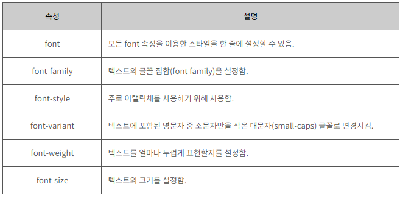

#  CSS 글꼴

​        

### 사전 지식

> CSS 색을 배우기 전에 다음과 같은 기초 지식이 필요합니다.

- [x] **CSS 스타일 적용법**

​        

### Goal

- [x] **CSS font-family 속성 이해하기.**
- [x] **CSS font-style 속성 이해하기.**
- [x] **CSS font-variant 속성 이해하기.**
- [x] **CSS font-weight 속성 이해하기.**
- [x] **CSS font-size 속성 이해하기.**

​          

​         

## I. CSS 글꼴

> **CSS**를 사용하면 웹 페이지에 나타나는 글꼴(Font)을 다양하게 설정할 수 있습니다.

​     

CSS에서 사용할 수 있는 font 속성은 다음과 같습니다.

​       

1. font-family

2. font-style

3. font-variant

4. font-weight

5. font-size

​     

#### CSS 글꼴 집합(font-family)

CSS에는 두 가지의 글꼴 집합(font family)이 존재합니다.

 

\- generic family : 비슷한 모양을 가지는 글꼴 집합 ("Serif", "Monospace" 등)

\- font family : 특정 글꼴 집합 ("Times", "Courier" 등)


- Serif : Times New Roman, 궁서체 끝처리가 약간 휘어져 있는것이 특징
- Sans-Serif : Arial, 굴림체 깔끔한 디자인에 좋은 폰트
- Monospace: Courier, Courier New 모든 글자가 같은 너비를 차지한다. 프로그래밍용으로 좋다.
- Cursive : Comic Sans MS, Monotype Corsiva  필기체
- Fantasy : Impact, Haettenschweiler 특이한 나머지 폰트를 포함


### 1. font-family 속성

> 텍스트를 특정 글꼴을 font-family 속성을 통해 정해줄 수 있습니다.

​     

font-family 속성은 하나의 글꼴만을 설정할 수도 있고, 여러 개의 글꼴을 같이 설정할 수도 있습니다.

font-family 속성값이 여러 개의 글꼴로 설정되어 있으면, 웹 브라우저는 위에서부터 순서대로 글꼴을 읽어 들입니다.

만약 사용자의 컴퓨터에 첫 번째로 읽어 들인 글꼴이 없으면 다음 글꼴을 확인하게 됩니다.

이런 방식으로 계속해서 읽어 들인 글꼴이 존재하는지를 확인하여, 읽어 들인 글꼴이 사용자의 컴퓨터에 존재하면 해당 글꼴로 표시하게 됩니다.

​     

글꼴의 이름이 한 단어 이상으로 이루어지면 반드시 따옴표를 사용하여 둘러 쌓아야 합니다.

또한, 여러 개의 글꼴을 나열할 때에는 쉼표(,)로 구분 짓습니다.

​      

#### HTML

```html
<style>
    .serif { font-family: "Times New Roman", Times, serif; }
    .sansserif { font-family: Arial, Helvetica, sans-serif; }
</style>
```

​             

#### 설치되지 않은 폰트 사용하는 방법

​          

#### 1) 웹 폰트 사용하기

> Google font: https://fonts.google.com

​       

#### HTML

```html
<link href = "<link href="https://fonts.googleapis.com/css?family=Nanum+Gothic|Roboto&display=swap" rel="stylesheet">"
```

#### CSS

```css
.div2 {
    font-size: 200%;
    font-family: 'Roboto', sans-serif;
}
.div3 {
    font-size: 200%;
    font-family: 'Nanum Gothic', cursive;
}
```

#### 만약 한글 폰트 사용하고 싶다면?

Google font: https://fonts.google.com/earlyaccess에서 korean 검색해서 사용하면 됩니다.

​               

#### 2) 폰트 파일 사용하기

다운로드한 폰트 파일을 폴더안에 넣고 경로를 써준다.

#### CSS

```css
@font-face{
    src: url("../fonts/BMJUA_ttf.ttf");
    /* 사용할 폰트 이름을 써준다. */
    font-family: "BmJua";
}
```

```css
.div3 {
    font-size: 200%;
    font-family: "BmJua", cursive;
}
```

​        

### 2. font-style 속성

> font-style 속성은 주로 이탤릭체를 사용하기 위해 사용하며, 다음과 같이 3가지의 속성값을 가집니다.

   

- normal : 텍스트에 어떠한 스타일도 적용하지 않습니다.

- italic : 텍스트를 이탤릭체로 나타냅니다.

- oblique : 텍스트를 기울입니다. 이 속성값은 italic과 매우 유사하지만 지원하는 웹 브라우저가 거의 없습니다.

​     

#### HTML

```html
<style>
    .normal { font-style: normal; }
    .italic { font-style: italic; }
    .oblique { font-style: oblique; }
</style>
```

   

### 3. font-variant 속성

> font-variant는 소문자를 작은 대문자, 즉 소문자 크기의 대문자로 바꾸는 속성입니다. 따라서 한글에서는 의미 없는 속성입니다.

​     

font-variant 속성은 속성값이 small-caps로 설정되면, 텍스트에 포함된 영문자 중 모든 소문자를 작은 대문자(small-caps) 글꼴로 변경시킵니다.

이때 영문자 중 대문자는 기존 크기 그대로 출력합니다.

작은 대문자(small-caps) 글꼴이란 텍스트의 기존 대문자보다는 약간 작은 크기의 대문자를 의미합니다.

​    

#### HTML

```html
<style>
    .normal { font-variant: normal; }
    .smallCaps { font-variant: small-caps; }
</style>
```

   

### 4. font-weight 속성

> font-weight 속성은 텍스트를 얼마나 두껍게 표현할지를 설정합니다.

   

사용할 수 있는 속성값에는 lighter, normal, bold, bolder 등이 있습니다.

또한, 100, 200, 300, ... , 900 등과 같이 숫자로 텍스트의 두께를 설정할 수도 있습니다.

   

#### HTML

```html
<style>
    /*참고로 font-weight: normal;은 font-weight: 400과 똑같고, 
	font-weight: bold;는 font-weight: 700과 똑같습니다!*/
    .normal { font-weight: normal; }
    .bold { font-weight: 700; }
    .bolder { font-weight: bolder; }
</style>
```

​    

### 5. font-size 속성

> font-size 속성은 텍스트의 크기를 설정합니다.
>
> - Absolute(절대적 방법) : px, pt
> - Relative(상대적 방법) : em(100% = 1em), %

   


웹 디자인에서 텍스트의 크기는 매우 중요한 표현 요소입니다. 

하지만 제목을 표현하기 위해서 텍스트의 크기만을 크게 해서는 안 됩니다.

이때에는 제목을 위한 HTML 요소인 `<h1>`태그부터` <h6>`태그를 사용해야 합니다.

   

#### font-size의 크기 단위

font-size 속성값에 자주 사용되는 대표적인 크기 단위는 다음과 같습니다.

 

백분율 단위(%)는 기본 크기를 100%로 놓고, 그에 대한 상대적인 크기를 설정합니다.

배수 단위(em)는 해당 글꼴(font)의 기본 크기를 1em으로 놓고, 그에 대한 상대적인 크기를 설정합니다.

픽셀 단위(px)는 스크린의 픽셀(pixel)을 기준으로 하는 절대적인 크기를 설정합니다.


#### HTML

다음 예제는 font-size를 픽셀로 설정한 경우입니다.

```html
<style>
    body { font-size: 100%; }
    #fixed { font-size: 20px; }
</style>
```


#### 픽셀

> HTML에서 무언가의 크기를 설정할 때는 기본적으로 '픽셀(`px`)' 단위를 사용합니다.
>
> 픽셀은 화면을 구성하는 기본 단위입니다. 아래 이미지를 보세요.

   


별 이미지의 일부를 확대해서 보니까 작은 정사각형 단위로 되어 있죠? 각 정사각형을 픽셀이라고 부릅니다. 만약 어떤 이미지의 가로 길이가 `100px`로 설정되었다면, 가로로 저 작은 정사각형 100개가 있다는 표현입니다.


다음 예제는 퍼센트 단위로 font-size를 설정한 경우입니다.

```html
<style>
    body { font-size: 100%; }
    #fixed { font-size: 50%; }
</style>
```

또한, 배수 단위(em)로 설정된 텍스트는 사용자가 웹 브라우저를 통해 크기를 재조정할 수 있습니다.

1em = 100%와 같은 표현입니다.

​     

#### CSS Font 속성



