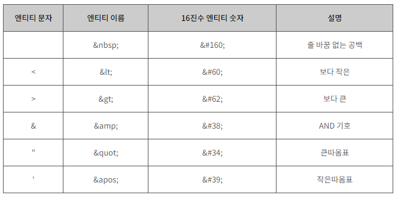
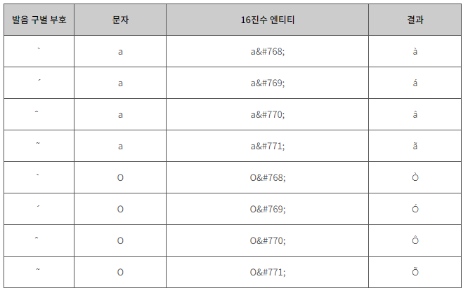
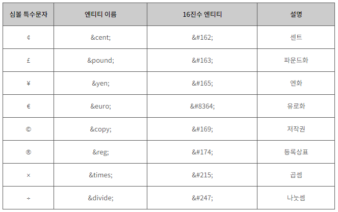

# HTML 텍스트 요소

​       

### Goal

- [x] **HTML 제목 이해하기.**
- [x] **HTML 단락 이해하기.**
- [x] **HTML 서식 이해하기.**
- [x] **HTML 인용구 이해하기.**
- [x] **HTML 주석 이해하기.**
- [x] **HTML 엔티티 이해하기.**
- [x] **HTML 문자셋 이해하기.**

## I. HTML 제목

> 제목(Heading)에 관한 태그들을 알아보자.

  

#### 제목(Heading)

HTML은 제목을 표현할 수 있는 다양한 크기의 `<h>`태그를 제공합니다.

가장 큰 `<h1> `태그부터 가장 작은 `<h6>`태그까지 다양한 크기로 제목을 표현할 수 있습니다.

  

#### 예제

```html
<h1>제목1의 크기입니다!</h1>

<h2>제목2의 크기입니다!</h2>

<h3>제목3의 크기입니다!</h3>

<h4>제목4의 크기입니다!</h4>

<h5>제목5의 크기입니다!</h5>

<h6>제목6의 크기입니다!</h6>
```

`<h>`태그의 위아래로는 약간의 **여백이 자동으로 삽입**됩니다.

​    

이런 `<h>`태그는 제목의 표현이라는 기능 외에도 또 다른 중요한 역할을 하고 있습니다.

여러 검색엔진은 각 웹 사이트의 내용을 바로 이 `<h>`태그를 이용하여 키워드를 수집하고, 그 내용을 파악합니다.

따라서 HTML 문서에 포함되는 제목은 `<h>`태그로 작성해야만 검색엔진에 의해 제대로 검색될 확률을 높일 수 있습니다.

  

HTML 문서의 제목에 해당하는 부분을 `<big>`태그나 `<bold>`태그를 사용하여 표현하지 않도록 합니다.


#### 종료 태그를 잊지 맙시다!

대부분의 웹 브라우저는 종료 태그를 사용하지 않더라도 다음 예제와 같이 HTML 문서를 제대로 표현해 줍니다.

  

#### 예제

```html
<h2>종료 태그가 없어도 표현이 잘 될까요?
```

하지만 종료 태그가 없으면 예상치 못한 오류나 결과가 발생할 수도 있습니다.

또한, XHTML이나 XML과 같은 문법이 엄격한 언어에서는 종료 태그의 유무를 엄격하게 검사합니다.

따라서 가급적 종료 태그를 빠트리지 말고 코드를 작성하는 것이 좋습니다.

  

  

## II. HTML 단락

> 단락(Paragraph)에 관한 태그들을 알아보자. 

​    

#### 단락(Paragraph)

단락이란 내용상 끊어서 구분할 수 있는 하나하나의 부분을 의미하며, 문단이라고도 부릅니다.

HTML에서는 `<p>`태그를 이용하여 이러한 단락을 표현합니다.  

  

#### 예제

```html
<h1>제목1의 크기입니다!</h1>

<h2>제목2의 크기입니다!</h2>

<h3>제목3의 크기입니다!</h3>

<p>여기서부터 단락입니다.</p>
```

`<p>`태그의 위아래로는 약간의 여백(margin)이 자동으로 삽입됩니다.

   

### 1. 띄어쓰기와 줄 나누기

HTML 코드에서 띄어쓰기나 줄 나누기를 여러 번 하더라도 웹 브라우저를 통해 나타나는 화면에는 전혀 영향을 주지 못합니다.

웹 브라우저는 여러 번의 띄어쓰기나 줄 나누기를 오직 하나의 띄어쓰기나 줄로만 인식하기 때문입니다.

 

다음 예제는 웹 페이지에 여러 번의 띄어쓰기와 줄 나누기를 표현하기 위해 작성한 예제입니다.

#### 예제

```html
<p>

줄을 나누고 싶어서

이렇게 줄을 나눠봤습니다.

 

과연     그대로     출력이     될까요?

</p>
```

위의 예제는 여러 번의 띄어쓰기와 줄 나누기를 표현하고자 `<p>`태그를 이용합니다.

하지만 `<p>`태그 내에서 작성된 여러 번의 띄어쓰기와 줄 나누기는 오직 하나의 띄어쓰기로만 표현됩니다.

 

`<br>`태그(break line)를 사용하면 새로운 단락을 만들지 않고도 줄을 나눌 수 있습니다.

이러한 `<br>`태그는 종료 태그가 없는 빈 태그(empty tag)입니다.

#### 예제

```html
<p>

줄을 나누고 싶어서<br>

이렇게 줄을 나눠봤습니다.<br>

<br>

과연     그대로     출력이     될까요?

</p>
```

   

### 2. 텍스트(text) 서식 미리 정의하기

HTML 코드에서 작성한 텍스트 서식을 그대로 표현하려면 `<pre>`태그를 사용해야 합니다.

`<pre>`태그(preformatted text) 내에 작성된 텍스트의 모든 띄어쓰기와 줄 나누기는 웹 브라우저에 그대로 표현됩니다.

#### 예제

```html
<pre>

줄을 나누고 싶어서

이렇게 줄을 나눠봤습니다.

 

과연     그대로     출력이     될까요?

</pre>
```

`<pre`>태그 내에 작성된 텍스트의 글꼴(font)은 고정폭 글꼴(fixed-width font)로 자동변환됩니다.

   

### 3. 수평 가로 구분선

단락을 나눌 때나 내용상의 구분을 표현하고자 할 때 수평 가로 구분선을 사용합니다.

이렇게 사용되는 수평 가로 구분선을 HTML 코드에서는 <hr>태그(horizontal rule)로 간단하게 만들 수 있습니다.

#### 예제

```html
<p>저는 하나의 단락입니다.</p>

<hr>

<p>저는 하나의 단락입니다.</p>

<hr>

<p>저는 하나의 단락입니다.</p>
```

  

  

## III. HTML 서식

  

#### 서식(Formatting)

HTML은 텍스트(text)에 다양한 효과를 주는 여러 태그(tag)를 제공합니다.

------


### 1. 강조 효과

HTML 문서에서 텍스트를 굵게 표현하고 싶을 때에는 `<b>`태그(bold text)나 `<strong>`태그를 사용하면 됩니다.

#### 예제

```html
<p><b>"이 부분"</b>은 단순히 글씨가 굵은 부분이에요!</p>

<p><strong>"이 부분"</strong>은 중요한 부분이라서 굵게 표현됐어요!</p>
```

  

`<b>`태그는 단순히 화면의 텍스트를 굵게 표현해 줍니다.

하지만 `<strong>`태그는 텍스트를 굵게 표현해줄 뿐만 아니라 그 내용이 중요하다는 의미도 함께 포함해 줍니다.

 

HTML 문서에서 이탤릭체를 표현하고 싶을 때에는 `<i>`태그(italic text)나 `<em>`태그(emphasized text)를 사용합니다.

#### 예제

```html
<p><i>"이 부분"</i>은 단순히 글씨가 이탤릭체인 부분이에요!</p>

<p><em>"이 부분"</em>은 중요한 부분이라서 이탤릭체로 표현됐어요!</p>
```

`<i>`태그는 단순히 화면의 텍스트를 이탤릭체로 표현해 줍니다.

하지만 `<em>`태그는 텍스트를 이탤릭체로 변환해줄 뿐만 아니라 그 내용이 중요하다는 의미도 함께 포함해 줍니다.

 

검색엔진은 `<strong>`태그나 `<em>`태그를 사용하여 강조된 텍스트를 더 중요하게 인식합니다.

  

### 2. 하이라이팅 효과

`<mark>`태그는 텍스트에 하이라이팅(highlighting) 효과를 적용시켜 줍니다.

#### 예제

```html
<p><mark>"이 부분"</mark>만 하이라이팅하고 싶어요.</p>
```

   

### 3. 삭제 효과

`<del>`태그(delete)는 텍스트 중앙에 가로줄을 만들어 마치 텍스트를 지운 것과 같은 효과를 내줍니다.

#### 예제

```html
<p><del>"이 부분"</del>을 지운 것처럼 하고 싶어요.</p>
```

  

### 4. 삽입 효과

`<ins>`태그(insert)는 텍스트 밑에 가로줄을 만들어 마치 빈칸에 텍스트를 삽입한 것과 같은 효과를 내줍니다.

#### 예제

```html
<p><ins>"밑줄 친 부분"</ins>에 들어갈 알맞은 말을 고르세요.</p>
```

   

### 5. 위첨자와 아래첨자 효과

위첨자는 `<sup>`태그(superscript)를 사용하여, 아래첨자는 `<sub>`태그(subscript)를 사용하여 각각 표현할 수 있습니다.

#### 예제

```html
<p>X<sup>2</sup> + Y<sup>3</sup> = Z</p>

<p>물을 나타내는 화학식은 H<sub>2</sub>O 입니다.</p>
```

​    

  

## IV. HTML 인용구

  

#### 인용구(Quotation)

HTML에서 인용구를 표현하는 방법은 다음과 같이 두 가지로 나뉩니다.

 

1. 짧은 인용구

2. 블록 인용구

  

### 1. 짧은 인용구

짧은 인용구는 `<q>`태그(quotation)를 사용하여 표현할 수 있으며, 자동으로 앞뒤에 큰따옴표가 붙습니다.

#### 예제

```html
<p>HTML의 정의는

<q>웹 페이지를 만들기 위한 하이퍼텍스트 마크업 언어</q>

입니다.</p>
```

  

### 2. 블록 인용구

길이가 긴 인용문은 `<blockquote>`태그(block quatation)를 사용하여 표현할 수 있습니다.

`<blockquote>`태그는 이러한 인용 부분을 별도의 단락으로 구분하여 나타냅니다.

#### 예제

```html
<p>HTML의 정의</p>

<blockquote>

인터넷 서비스의 하나인 월드 와이드 웹을 통해 볼 수 있는 문서를 만들 때 사용하는 프로그래밍 언어의 한 종류이다.

</blockquote>
```

   

### 3. 축약형 표현

HTML에서 용어의 축약형을 표현하기 위해서는 `<abbr>`태그(abbreviation)를 사용합니다.

`<abbr>`태그 위에 마우스를 위치시키면 title 속성에 명시한 용어의 원형이 나타납니다.

#### 예제

```html
<p><strong><abbr title="HyperText Markup Language 5">HTML5</abbr></strong>

란 웹 문서를 제작하는 데 쓰이는 프로그래밍 언어인 HTML의 최신규격입니다.</p>
```

   

### 4. 주소 표현

`<address>`태그를 사용하면 HTML에서 주소를 표현할 수 있습니다.

이러한 주소는 이탤릭체로 표현되며, 위아래로 약간의 공백이 자동으로 삽입됩니다.

#### 예제

```html
<address>

    서울특별시<br>

    강남구 테헤란로

</address>
```

   

## V. HTML 주석

  

#### 주석(Comment)

주석(comment)이란 개발자가 작성한 해당 코드에 대한 이해를 돕는 설명이나 디버깅을 위해 작성한 구문을 의미합니다.

이러한 주석은 다른 HTML 코드와는 달리 웹 브라우저에 의해 표현되지 않습니다.

 

HTML에서 주석을 표현하는 방법은 다음과 같습니다.

#### 문법

```html
<!-- 주석내용 -->
```

HTML 주석의 시작 태그(<!--)에는 느낌표(!)가 있지만 종료 태그(-->)에는 느낌표가 없습니다.

이러한 주석은 HTML 코드의 어느 부분에서라도 사용할 수 있습니다.

또한, 여러 줄에 걸쳐 주석을 작성해도 정확히 인식할 것입니다.

#### 예제

```html
<!-- 작성자 : 홍길동 -->

<p>이 부분은 조금 어려운 코드입니다.</p>

<!--

    위와 같이 어려운 코드의 이해를 돕기 위해서 개발자가 적어놓은 설명입니다.

-->
```

위의 예제처럼 HTML 주석은 절대 웹 페이지에 나타나지 않습니다.

HTML 코드에 삽입된 주석을 읽고 싶다면, 웹 브라우저의 페이지 소스 보기 등을 통해서 확인할 수 있습니다.

  

익스플로러는 마우스 오른쪽을 누른 후 소스 보기를 통해서, 크롬과 파이어폭스에서는 F12 버튼으로 HTML 코드를 확인할 수 있습니다.

  

### 1. 중첩 주석

HTML 주석은 HTML 코드의 어느 부분에서라도 사용할 수 있습니다.

하지만 HTML 주석 안에 또 다른 주석을 작성할 수는 없습니다.

 

다음 예제는 HTML 주석 안에 또 다른 주석을 삽입하는 예제입니다

```html
<p>이 부분은 조금 어려운 코드입니다.</p>

<!--

    <!-- 주석 안에 또 다른 주석을 삽입했습니다. -->

    위와 같이 어려운 코드의 이해를 돕기 위해서 개발자가 적어놓은 설명입니다.

-->
```

 위의 예제처럼 HTML 주석 안에 또 다른 주석을 삽입하면, 삽입한 주석의 종료 태그(-->)를 첫 번째 주석이 자신의 종료 태그로 인식하게 됩니다.

따라서 삽입한 주석의 종료 태그 다음부터 첫 번째 주석의 종료 태그까지의 모든 내용이 그대로 웹 페이지에 노출됩니다.

 

그러므로 HTML 주석은 절대로 중첩해서 사용해서는 안 됩니다.

   

## VI. HTML 엔티티

 

#### 엔티티(Entity)

HTML에는 미리 예약된 몇몇 문자가 있으며, 이러한 문자를 HTML 예약어(reserved characters)라고 부릅니다.

이러한 HTML 예약어를 HTML 코드에서 사용하면, 웹 브라우저는 그것을 평소와는 다른 의미로 해석합니다.

따라서 HTML 예약어를 기존에 사용하던 의미 그대로 사용하기 위해 별도로 만든 문자셋을 엔티티(entity)라고 합니다.


엔티티의 형태는 다음과 같습니다.

#### 문법

```html
&엔티티이름;
또는
&#엔티티숫자;
```

다음 예제는 HTML 코드 내에서 꺾쇠괄호(<>)를 사용하면 웹 브라우저가 그것을 어떻게 해석하는지 보여줍니다.

#### 예제

```html
<p><p> 태그는 두 번째로 큰 제목을 나타내는 태그입니다.</p>

<p>&lt;p&gt;태그는 단락을 나타내는 태그입니다.</p>
```

위의 예제처럼 HTML 코드에서 사용된 꺾쇠괄호(<>)는 HTML 태그의 시작과 끝의 의미로 해석됩니다.


엔티티(entity)의 이름은 대소문자를 구분합니다.

HTML에서 제공하는 대표적인 엔티티(entity)는 다음과 같습니다.



HTML에서 사용할 수 있는 모든 엔티티에 대한 더 자세한 정보를 원한다면, W3C 공식 사이트를 방문하여 확인할 수 있습니다.  

  

### 1. 발음 구별 부호(diacritical marks)

발음을 나타내는 부호를 악센트(accent)라고 합니다.

이러한 악센트는 단독으로는 사용하지 않으며, 보통 다른 문자와 함께 사용됩니다.

이것을 정확하게 표현하기 위하여 HTML에서는 다음과 같은 발음 구별 부호를 별도로 제공하고 있습니다.

 

HTML에서 제공하는 대표적인 발음 구별 부호(diacritical marks)는 다음과 같습니다.



#### 예제

```html
<p>j에 악센트가 있다는 발음 기호는 [j&#769;]입니다.</p>
```

   

### 2. 심볼(Symbol) 특수문자

HTML 예약어 이외에도 키보드에 입력할 수 없는 문자를 표현하기 위한 심볼 특수문자를 사용할 수 있습니다.

이러한 심볼 특수문자에는 수학 용어, 그리스 문자, 국제 통화 등이 있습니다.

 

HTML에서 제공하는 대표적인 심볼(Symbol) 특수문자는 다음과 같습니다.



  

## VII. 문자셋

  

#### 문자셋(Character set)

웹 브라우저가 HTML 문서를 정확하게 나타내기 위해서는 해당 문서가 어떠한 문자셋으로 저장되었는지를 알아야 합니다.

따라서 HTML 문서가 저장될 때 사용된 문자셋에 대한 정보를 <head>태그 내의 <meta>태그에 명시합니다.

HTML4에서 UTF-8의 경우 : `<meta http-equiv="Content-Type" content="text/html;charset=UTF-8">`

HTML5에서 UTF-8의 경우 : `<meta charset="UTF-8">`

위의 두 예제는 해당 HTML 문서가 UTF-8 문자셋을 사용하여 저장되었음을 웹 브라우저에 알려줍니다.


#### 문자셋의 종류

현재 사용되는 대표적인 문자셋(character set)은 다음과 같습니다.

 

1. ASCII : 가장 처음 만들어진 문자셋으로, 인터넷에서 사용할 수 있는 127개의 영문자와 숫자로 이루어져 있습니다.

2. ANSI : 윈도우즈에서 만든 문자셋으로, 총 256개의 문자 코드를 지원합니다.

3. ISO-8859-1 : 256개의 문자 코드를 지원하는 HTML4의 기본 문자셋입니다.

4. UTF-8 : 세상에 있는 거의 모든 문자를 표현할 수 있는 유니코드 문자를 지원하는 HTML5의 기본 문자셋입니다.