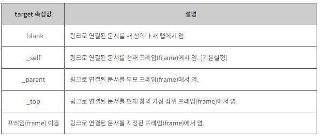
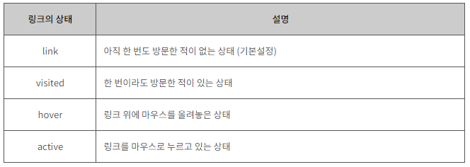
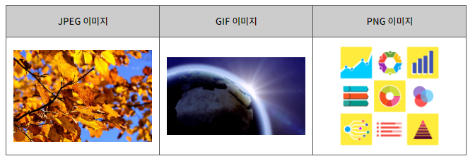

# HTML 기본 요소

​       

### Goal

- [x] **HTML 스타일 이해하기.**

- [x] **HTML 색 이해하기.**

- [x] **HTML 배경 이해하기.**

- [x] **HTML 링크 이해하기.**

- [x] **HTML 이미지 이해하기.**

- [x] **HTML 리스트 이해하기.**

- [x] **HTML 테이블 이해하기.**

   

​     

## I. HTML 스타일

> HTML 요소의 style 속성을 알아보자.

​    

#### HTML 스타일(Style)

HTML 요소의 style 속성(attribute)을 이용하면 CSS 스타일을 HTML 요소에 직접 설정할 수 있습니다.

하지만 이러한 style 속성을 이용한 방법은 오직 단 하나의 HTML 요소에만 스타일을 적용할 수 있습니다.

#### 문법

```html
<태그이름 style="속성이름:속성값">
```

#### 예제

```html
<h1 style="background-color:white">

    style 속성을 이용한 배경색 변경

</h1>
```

  

### 1. 배경색 변경

다음 예제는 style 속성을 이용하여 배경색을 변경하는 예제입니다.

#### 예제

```html
<h1 style="background-color:white">

    style 속성을 이용한 배경색 변경

</h1>
```


### 2. 글자색 변경

다음 예제는 style 속성을 이용하여 글자색을 변경하는 예제입니다.

#### 예제

```html
<h1 style="color:maroon">
    style 속성을 이용한 글자색 변경

</h1>
```

   

### 3. 글자 크기 변경

다음 예제는 style 속성을 이용하여 글자 크기를 변경하는 예제입니다.

#### 예제

```html
<h1 style="font-size:250%">
    style 속성을 이용한 글자 크기 변경

</h1>
```

   

### 4. 문단 정렬 변경

다음 예제는 style 속성을 이용하여 문단 정렬을 변경하는 예제입니다.

#### 예제

```html
<h1 style="text-align:center">

    style 속성을 이용한 문단 정렬 변경

</h1>
```

   

### 5. 여러 스타일의 설정

style 속성을 이용하여 여러 CSS 스타일을 한 번에 적용할 수 있습니다.

#### 예제

```html
<h1 style="background-color:white; color:maroon; font-size:150%; text-align:center">

    style 속성을 이용하여 한 번에 스타일링 하기!

</h1>
```

style 속성값에 사용되는 CSS 속성(property)과 속성값들은 세미콜론(;)을 이용하여 구분합니다.

CSS 속성을 하나만 사용할 때나, 여러 개의 CSS 속성 중 맨 마지막 CSS 속성은 세미콜론(;)을 생략할 수 있습니다.

  

## II. HTML 색

> HTML 색 표현에 대해 알아보자.

 

#### HTML 색(Color) 표현

HTML에서 색을 표현하는 방법은 다음과 같이 세 가지 방법이 있습니다. 

 

1. 색상 이름으로 표현

2. RGB 색상값으로 표현

3. 16진수 색상값으로 표현

   

### 1. 색상 이름으로 표현

W3C에서 정의한 16개의 HTML4 표준 색상 이름은 다음과 같습니다.


HTML에서 색상 이름은 대소문자를 구분하지 않습니다.

#### 예제

```html
<h1 style="color:blue">색상 이름으로 표현된 파란색</h1>

<h1 style="color:green">색상 이름으로 표현된 녹색</h1>

<h1 style="color:silver">색상 이름으로 표현된 은색</h1>

<h1 style="color:teal">색상 이름으로 표현된 청록색</h1>

<h1 style="color:red">색상 이름으로 표현된 빨간색</h1>
```

현재는 주요 브라우저가 140개의 색상 이름을 모두 지원하고 있습니다.

   

### 2. RGB 색상값으로 표현

모니터나 스크린은 빨간색(Red), 녹색(Green), 파란색(Blue)을 혼합하여 색을 표현합니다.

HTML에서도 위와 같이 세 가지 색을 가지고 색을 표현하는 RGB 색상을 사용합니다.

RGB 색상의 기본색(Red, Green, Blue)은 각각 0부터 255까지의 범위를 가집니다.

#### 예제

```html
<h1 style="color:rgb(0,0,255)">RGB 색상값으로 표현된 파란색</h1>

<h1 style="color:rgb(0,128,0)">RGB 색상값으로 표현된 녹색</h1>

<h1 style="color:rgb(192,192,192)">RGB 색상값으로 표현된 은색</h1>

<h1 style="color:rgb(0,128,128)">RGB 색상값으로 표현된 청록색</h1>

<h1 style="color:rgb(255,0,0)">RGB 색상값으로 표현된 빨간색</h1>
```

   

### 3. 16진수 색상값으로 표현

16진수 색상값은 RGB 색상값을 각각 16진수로 변환한 것입니다.

따라서 각각의 기본색(Red, Green, Blue)은 각각 00부터 FF까지의 범위를 가집니다.

 

예를 들면, 빨간색을 나타내는 RGB 색상값인 rgb(255,0,0)은 16진수 색상값으로는 #FF0000이 되는 것입니다.

#### 예제

```html
<h1 style="color:#0000FF">16진수 색상값으로 표현된 파란색</h1>

<h1 style="color:#008000">16진수 색상값으로 표현된 녹색</h1>

<h1 style="color:#C0C0C0">16진수 색상값으로 표현된 은색</h1>

<h1 style="color:#008080">16진수 색상값으로 표현된 청록색</h1>

<h1 style="color:#FF0000">16진수 색상값으로 표현된 빨간색</h1>
```

   

## III. HTML 배경

> HTML 내에서 배경을 설정하는 방법을 알아보자.

  

#### HTML 배경(Background)

HTML 문서의 기본 배경(background)은 흰색입니다.

또한, HTML 요소들도 각자 자신만의 배경을 가지고 있습니다.

 

HTML에서는 이러한 배경을 다음과 같이 변경할 수 있습니다.

 

1. 배경을 다른 색으로 변경

2. 배경을 다른 이미지로 변경

  

### 1. 배경색을 다른 색으로 변경

HTML5 이전까지는 bgcolor 속성을 이용하여 HTML 요소의 배경색을 다른 색으로 변경할 수 있었습니다.

하지만 HTML5부터는 bgcolor 속성을 더 이상 지원하지 않으며, CSS를 이용하여 배경색을 변경하도록 하고 있습니다.

   

다음 예제는 CSS 스타일을 이용하여 배경색을 다른 색으로 변경하는 예제입니다.

#### 예제

```html
<style>

    body { background-color: lightblue; }

    h1 { background-color: rgb(255,128,0); }

    p { background-color: #FFFFCC; }

</style>123
```

CSS의 background 속성을 이용하면, 더욱 다양한 방법으로 배경색을 설정할 수 있습니다.

  

### 2. 배경을 다른 이미지로 변경

background 속성을 이용하면 HTML 요소의 배경을 이미지(image)로 설정할 수 있습니다.

#### 문법

```html
<태그이름 background="이미지주소">
```

#### 예제

```html
<body background="/examples/images/img_background_good.png">

...

</body>
```


배경으로 이미지를 사용하면 웹 페이지의 로딩시간이 증가하게 됩니다.

따라서 보통은 작은 사이즈의 이미지를 패턴(pattern)으로 만들어 배경 이미지로 반복 설정합니다.

   

   

## IV. HTML 링크

> HTML 내에서 링크를 설정하는 방법을 알아보자.

   

#### HTML 링크(Link)

오늘날 웹 페이지에는 다른 페이지나 다른 사이트로 연결되는 수많은 하이퍼 링크(hyperlink)가 존재합니다.

이러한 하이퍼 링크를 간단히 링크(link)라고도 부르며, HTML에서는` <a>`태그로 표현합니다.

#### 문법

```html
<a href="링크주소">HTML 링크</a>
```

`<a>`태그의 href 속성은 링크를 클릭하면 연결할 페이지나 사이트의 URL 주소를 명시합니다.

`<a>`태그는 텍스트나 단락, 이미지 등 다양한 HTML 요소에 사용할 수 있습니다.

#### 예제

```html
<a href="/html/intro">

    <h2>이 링크를 클릭해 보세요!</h2>

</a>
```

   

### 1. target 속성

`<a>`태그의 target 속성은 링크로 연결된 문서를 어디에서 열지를 명시합니다.



​      

#### 예제

```html
<h2><a href="/html/intro" target="_blank">blank</a></h2>

<h2><a href="/html/intro" target="_self">self</a></h2>

<h2><a href="/html/intro" target="_parent">parent</a></h2>

<h2><a href="/html/intro" target="_top">top</a></h2>

<h2><a href="/html/intro" target="myframe">myframe</a></h2>

 
<iframe name="myframe" style="width:50%; height: 330px"></iframe>
```

   

### 2. 링크의 상태(state)

HTML 링크의 상태는 다음과 같이 네 가지로 구분할 수 있습니다.

   



  

웹 브라우저에서 링크가 연결되어 있는 텍스트의 색상은 다음과 같습니다.

 

- 기본적으로 링크가 걸린 텍스트는 밑줄에, 텍스트 색상이 파란색으로 변경됩니다.

- visited 상태의 링크는 밑줄에, 텍스트 색상이 보라색으로 변경됩니다.

- active 상태의 링크는 밑줄에, 텍스트 색상이 빨간색으로 변경됩니다.

   

#### 예제

```html
<style>

    a:link    { color: teal; }

    a:visited { color: maroon; text-decoration: none }

    a:hover   { color: yellow; text-decoration: none }

    a:active  { color: red; text-decoration: none }

</style>
```

  

### 3. 페이지 책갈피

`<a>`태그의 name 속성을 이용하면 간단한 책갈피를 만들 수 있습니다.

우선 책갈피를 통해 가고 싶은 위치에 `<a>`태그를 만들고 name 속성을 작성합니다.

그다음에 작성한 name 속성값을 이용하여 다른 `<a>`태그에서 링크를 걸면 됩니다.

#### 예제

```html
<a href="#bookmark"><p>제목 3으로 갑시다!!!</p></a>

...

<h2><a name="bookmark"></a>제목 3</h2>
```

   

## V. HTML 이미지

> HTML 내에서 이미지를 삽입 하는 방법을 알아보자.

  

#### HTML 이미지(Image)

이미지(image)란 2차원 평면 위에 그려진 시각적 요소를 의미합니다.

오늘날 웹 페이지에는 이러한 이미지가 매우 중요한 요소의 하나로 자리 잡고 있습니다.

 

웹 페이지에서 주로 사용되는 이미지의 종류는 다음과 같습니다.



  

### 1. 이미지의 삽입

HTML 문서에 이미지를 삽입할 때는 ``태그를 사용합니다.

 

``태그는 종료 태그가 없는 빈 태그(empty tag)이며, 다음과 같은 문법으로 사용됩니다.

#### 문법

```html

```

src 속성은 이미지가 저장된 주소의 URL 주소를 명시합니다.

alt 속성으로 이미지가 로딩될 수 없는 상황에서 이미지 대신 나타날 문자열을 설정할 수 있습니다.

#### 예제

```html

```

  

### 2. 이미지의 크기(width, height) 설정

HTML에서는 style 속성을 사용하여 이미지의 크기를 설정할 수 있습니다.

또한, width 속성과 height 속성을 이용하면, 이미지의 너비와 높이를 각각 픽셀(pixel) 단위로 설정할 수도 있습니다.

 

위의 두 가지 방법 모두 HTML5 표준에는 적합한 방법이지만, 나중에 배우게 될 CSS를 이용한 내부 스타일 시트나 외부 스타일 시트와 상관없이 이미지의 원래 크기를 유지하려면 style 속성을 사용하는 것이 좋습니다.

#### 예제

```html
<style>

    img {

        width:100%;

        border: 1px solid black;

    }

</style>

...


```

   

### 3. 이미지의 테두리(border) 설정

border 속성을 사용하여 이미지의 테두리 사용 여부와 굵기를 설정할 수 있습니다.

```html

```

   

### 4. 이미지에 링크(link) 설정

이미지에 `<a>`태그를 이용하여 링크를 설정할 수 있습니다.

#### 예제

```html
<a href="/html/intro" target="_blank">

    

</a>
```

  

### 5. 이미지 맵 만들기

HTML에서는 `<map>`태그를 이용하여 이미지 맵(image map)을 제작할 수 있습니다.

이미지 맵(image map)이란 이미지의 일부를 클릭할 수 있도록 만들어서 버튼처럼 사용하는 기능을 의미합니다.

 

``태그의 usemap 속성을 `<map>`태그의 name 속성과 연결하면 이미지와 맵사이의 관계가 설정됩니다.

`<map>`태그는 하나 이상의 `<area>`태그를 가지며, 이 `<area>`태그가 바로 버튼과 같은 역할을 합니다.

#### 예제

```html


<map name="vending">

    <area shape="rect" coords="90,60,180,130" alt="거짓"

        href="https://ko.wikipedia.org/wiki/%EA%B1%B0%EC%A7%93%EB%A7%90">

    <area shape="rect" coords="210,200,70,130" alt="진실"

        href="https://ko.wikipedia.org/wiki/%EC%A7%84%EC%8B%A4">

</map>
```

  

  

## VI. HTML 리스트

> HTML 목록이나 명단을 만드는 방법을 알아보자.

   

#### HTML 리스트(List)

리스트(list)란 여러 요소들을 일렬로 나열한 목록이나 명단을 의미합니다.

HTML에서는 이러한 리스트를 표현하기 위해 다음과 같은 리스트를 제공하고 있습니다.

   

1. 순서가 없는 리스트(unordered list)

2. 순서가 있는 리스트(ordered list)

3. 정의 리스트(definition list)

  

### 1. 순서가 없는 리스트

순서가 없는 리스트는 `<ul>`태그로 시작하며, 여기에 포함되는 각각의 리스트 요소는 `<li>`태그로 시작합니다.

각각의 리스트 요소 앞에는 기본 마커(marker)로 검정색의 작은 원(bullet)이 위치합니다.

#### 예제

```html
<ul>

    <li>사과</li>

    <li>멜론</li>

    <li>바나나</li>

</ul>
```

CSS의 list-style-type 속성을 사용하면 리스트 요소 앞에 위치하는 마커(marker)를 다른 모양으로 변경할 수 있습니다.

​     

- disc : 검정색 작은 원 모양 (기본설정)

- circle : 흰색 작은 원 모양

- square : 사각형 모양

  

#### 예제

```html
<ul style="list-style-type: circle">

    <li>수박</li>

    <li>참외</li>

    <li>옥수수</li>

</ul>

<ul style="list-style-type: square">

    ...

</ul>
```

  

### 2. 순서가 있는 리스트

순서가 있는 리스트는 `<ol>`태그로 시작하며, 여기에 포함되는 각각의 리스트 요소는 `<li>`태그로 시작합니다.

각각의 리스트 요소 앞에는 기본 마커로 아라비아 숫자가 위치합니다.

#### 예제

```html
<ol>

    <li>사과</li>

    <li>멜론</li>

    <li>바나나</li>

</ol>
```

CSS의 list-style-type 속성을 사용하면 리스트 요소 앞에 위치하는 마커(marker)를 다른 모양으로 변경할 수 있습니다.

 

- decimal : 숫자 (기본설정)

- upper-alpha : 영문 대문자

- lower-alpha : 영문 소문자

- upper-roman : 로마 숫자 대문자

- lower-roman : 로마 숫자 소문자

  

#### 예제

```html
<ol style="list-style-type: upper-alpha">

    <li>수박</li>

    <li>참외</li>

    <li>옥수수</li>

</ol>

<ol style="list-style-type: lower-alpha">

    ...

</ol>

<ol style="list-style-type: upper-roman">

    ...

</ol>

<ol style="list-style-type: lower-roman">

    ...

</ol>
```

   

### 3. 정의 리스트(description list)

정의 리스트(description list)는 용어와 그에 대한 정의를 모아놓은 리스트로 `<dl>`태그로 시작합니다.

`<dt>`태그에는 용어의 이름이 들어가고, `<dd>`태그에는 해당 용어에 대한 정의가 들어갑니다.

#### 예제

```html
<dl>

    <dt>호박</dt>

    <dd>- 박과의 한해살이 덩굴성 채소</dd>

    <dt>상추</dt>

    <dd>- 국화과의 한해살이 또는 두해살이풀</dd>

</dl>
```

  

 

## VII. HTML 테이블

  

#### HTML 테이블(Table)

테이블(Table)이란 여러 종류의 데이터(data)를 보기 좋게 정리하여 보여주는 표를 의미합니다.

HTML에서는 `<table>`태그를 사용하여 이러한 테이블을 작성할 수 있습니다.

   

<table>태그는 다음과 같은 태그들로 구성됩니다.

   

1. `<tr>`태그는 테이블에서 열을 구분해 줍니다.

2. `<th>`태그는각 열의 제목을 나타내며, 모든 내용은 자동으로 굵은 글씨에 가운데 정렬이 됩니다.

3. `<td>`태그는 테이블의 열을 각각의 셀(cell)로 나누어 줍니다.

  

#### 예제

```html
<table style="width:100%">

    <tr style="background-color:lightgrey">

        <th>참치</th>

        <th>고래</th>      

    </tr>

    <tr>

        <td>상어</td>

        <td>문어</td>

    </tr>

    <tr>

        <td>오징어</td>

        <td>고등어</td>

    </tr>

</table>
```

CSS의 border 속성을 이용하여 테이블에 테두리를 표현할 수 있습니다.

border 속성값을 따로 명시하지 않으면, 해당 테이블은 언제나 빈 테두리를 가지게 됩니다.  

#### 예제

```html
<style>

    table, th, td { border: 1px solid black }

</style>
```

위의 예제에서 테이블의 테두리(border)가 두 줄씩 나타나는 이유는 `<table>`태그와` <th>`태그, `<td>`태그가 모두 자신만의 테두리를 가지고 있기 때문입니다.

 

위와 같이 두 줄로 표현되는 테두리를 한 줄로 설정하려면 border-collapse 속성을 사용해야 합니다.

border-collapse 속성값을 collapse로 설정하면, 테이블의 테두리를 한 줄로 표현할 수 있습니다.

#### 예제

```html
<style>

    table, th, td { border: 1px solid black; border-collapse: collapse }

</style>
```

   

### 1. 테이블의 열 합치기

colspan 속성을 사용하면 테이블의 열(column)을 합칠 수 있습니다.

#### 예제

```html
<table style="width:100%">

    <tr>

        <td>참치</td>

        <td colspan="2">고래</td>        

    </tr>

    <tr>

        <td>상어</td>

        <td>문어</td>        

        <td>꽁치</td>

    </tr>

</table>
```

   

### 2. 테이블의 행 합치기

rowspan 속성을 사용하면 테이블의 행(row)을 합칠 수 있습니다.

```html
<table style="width:100%">

    <tr>

        <td rowspan="2">상어</td>

        <td>문어</td>        

        <td>꽁치</td>

    </tr>

    <tr>

        <td>고등어</td>        

        <td>돌고래</td>

    </tr>

</table>
```


### 3. 테이블의 열과 행 합치기

colspan 속성과 rowspan 속성을 함께 사용하면, 더욱 복잡한 테이블도 표현할 수 있습니다.

#### 예제

```html
<table style="width:100%">

    <tr>

        <td colspan="6">1</td>

    </tr>

    <tr>

        <td colspan="6">2</td>

    </tr>

    <tr>

        <td rowspan="3">3</td>

        <td rowspan="3">4</td>

        <td colspan="2">5</td>

        <td>6</td>

        <td>7</td>

    </tr>

    <tr>

        <td colspan="3">8</td>

        <td>9</td>

    </tr>

    <tr>

        <td colspan="4">10</td>

    </tr>

</table>
```

  

### 4. 테이블의 캡션(caption) 설정

`<caption>`태그를 사용하면 테이블 상단에 제목이나 짧은 설명을 붙일 수 있습니다.

#### 예제

```html
<table style="width:100%">

    <caption>해양 생물</caption>

    <tr>

        <td>참치</td>

        <td>고래</td>

        <td>날치</td>    

    </tr>

</table>
```

