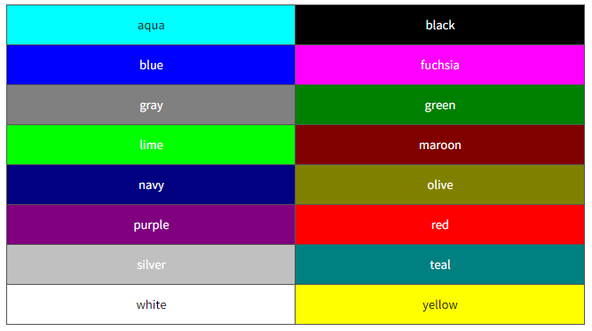

#  CSS 색

​      

### 사전 지식

> CSS 색을 배우기 전에 다음과 같은 기초 지식이 필요합니다.

- [x] **CSS 스타일 적용법**

​      

### Goal

- [x] **CSS 색 이름으로 표현하기.**
- [x] **CSS 색 RGB 색상값으로 표현하기.**
- [x] **CSS 색 16진수 색상값으로 표현하기.**

​      

​    

## I. CSS 색 표현하기

> CSS에서 색을 표현하는 방법에는 다음과 같이 세 가지 방법이 있습니다. 

​     

1. 색상 이름으로 표현

2. RGB 색상값으로 표현

3. 16진수 색상값으로 표현

   

​     

### 1. 색상 이름으로 표현

>  W3C에서 정의한 16개의 HTML4 표준 색상 이름은 다음과 같습니다.

​    



​    

HTML에서 색상 이름은 대소문자를 구분하지 않습니다.

#### HTML

```html
<style>
    .blue { color: blue; }
    .green { color: green; }
    .silver { color: silver; }
</style>
```

현재는 대부분의 브라우저가 140개의 색상 이름을 지원하고 있습니다.

   

### 2. RGB 색상값으로 표현

> 모니터나 스크린은 빨간색(Red), 녹색(Green), 파란색(Blue)을 혼합하여 색을 표현합니다.
>
> 따라서 HTML에서도 이 세 가지 색을 가지고 색을 표현하는 RGB 색상을 사용합니다.

   

RGB 색상의 기본색(Red, Green, Blue)은 각각 0부터 255까지의 범위를 가집니다.

#### HTML

```css
<style>
    .blue { color: rgb(0,0,255); }
    .green { color: rgb(0,128,0); }
    .silver { color: rgb(192,192,192); }
</style>
```

   

### 3. 16진수 색상값으로 표현

> 16진수 색상값은 RGB 색상값을 각각 16진수로 변환한 것입니다.
>
> 따라서 RGB 색상의 기본색(Red, Green, Blue)은 각각 00부터 FF까지의 범위를 가집니다.

​    

예를 들면, 녹색을 나타내는 RGB 색상값 rgb(0,255,0)은 16진수 색상값으로는 #00FF00이 됩니다.

#### HTMl

```html
<style>
    .blue { color: #0000FF; }
    .green { color: #008000; }
    .silver { color: #C0C0C0; }
</style>
```

