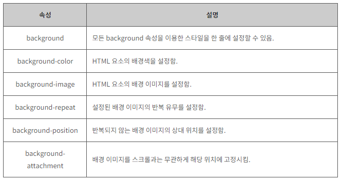

#  CSS 배경

​      

### 사전 지식

> CSS 색을 배우기 전에 다음과 같은 기초 지식이 필요합니다.

- [x] **CSS 스타일 적용법**

​      

### Goal

- [x] **CSS background-color 속성 이해하기.**
- [x] **CSS background-image 속성 이해하기**
- [x] **CSS background-repeat 속성 이해하기.**
- [x] **CSS background-position 속성 이해하기.**
- [x] **CSS background-attachment 속성 이해하기.**
- [x] **CSS background-size 속성 이해하기.**
- [x] **CSS background 속성 한 번에 적용하기.**

​        

​        

## I. CSS background 속성

> 웹 페이지뿐만 아니라 HTML 요소는 모두 각자의 배경을 가지고 있습니다.
>
> CSS의 background 속성은 이러한 각 요소의 배경에 다양한 효과를 줄 수 있게 해줍니다.

​        

CSS에서 사용할 수 있는 background 속성은 다음과 같습니다.

​          

1. background-color

2. background-image

3. background-repeat

4. background-position

5. background-attachment

​    

### 1. background-color 속성

>  background-color 속성은 해당 HTML 요소의 배경색(background color)을 설정합니다.

​       

#### HTMl

```html
<style>
    body { background-color: lightblue; }
    h1 { background-color: rgb(255,128,0); }
    p { background-color: #FFFFCC; }
</style>
```

​     

### 2. background-image 속성

> background-image 속성은 해당 HTML 요소의 배경으로 나타날 배경 이미지(image)를 설정합니다.
>
> 설정된 배경 이미지는 기본 설정으로 HTML 요소 전체에 걸쳐 반복되어 나타납니다.

​         

#### HTML

```html
<style>
    body { background-image: url("/examples/images/img_background_good.png"); }
</style>
```

배경 이미지를 사용할 때에는 이미지가 본문의 텍스트를 방해하지 않도록 주의를 기울여야 합니다.

​    

### 3. background-repeat 속성

> 배경 이미지는 기본 설정으로 수평과 수직 방향으로 모두 반복되어 나타납니다.
>
> background-repeat 속성을 이용하면 이러한 배경 이미지를 수평이나 수직 방향으로만 반복되도록 설정할 수 있습니다.

  

#### HTML

다음 예제는 배경 이미지의 수평 반복을 보여줍니다.

```html
<style>
    body { background-image: url("/examples/images/img_man.png"); background-repeat: repeat-x; }
</style>
```

​     

다음 예제는 배경 이미지의 수직 반복을 보여줍니다.

```html
<style>
    body { background-image: url("/examples/images/img_man.png"); background-repeat: repeat-y; }
</style>
```

​        

다음 예제에는 배경 이미지를 반복 할 수 있는 만큼 반복한 뒤, 남는 공간은 이미지 간의 여백으로 배분합니다.

```html
<style>
    body { background-image: url("/examples/images/img_man.png"); background-repeat: space; }
</style>
```

​         

다음 예제에는 배경 이미지를 반복 할 수 있는 만큼 반복한 뒤, 남는 공간은 확대를 통해 배분합니다.

```html
<style>
    body { background-image: url("/examples/images/img_man.png"); background-repeat: round; }
</style>
```

​        

배경 이미지가 반복되지 않고 한 번만 나타나게 할 수도 있습니다.

```html
<style>
    body { background-image: url("/examples/images/img_man.png"); background-repeat: no-repeat; }
</style>
```

​        

### 4. background-position 속성

> background-position 속성은 반복되지 않는 배경 이미지의 상대 위치(relative position)를 설정합니다.

​    

#### HTML

```html
<style>
    body {
        background-image: url("/examples/images/img_man.png");
        background-repeat: no-repeat;
        background-position: top right;
    }
</style>
```

​     

이 속성에서 사용할 수 있는 키워드의 조합은 다음과 같습니다.

​    

1. left top

2. left center

3. left bottom

4. right top

5. right center

6. right bottom

7. center top

8. center center

9. center bottom

   


또한, 퍼센트(%)나 픽셀(px)을 사용하여 상대 위치를 직접 명시할 수도 있습니다.

이때 상대 위치를 결정하는 기준은 해당 요소의 왼쪽 상단(left top)이 됩니다.

​    

#### HTML

다음 예제는 배경 이미지의 상대 위치를 픽셀 단위로 직접 명시한 예제입니다.

```html
<style>
    body {
        background-image: url("/examples/images/img_man.png");
        background-repeat: no-repeat;
        /* 가로: 가장 왼쪽 가장자리에서부터 오른쪽으로 100px 이동한 지점, 세로: 가장 상단 가장자리에서 			아래로 200px 이동한 지점 */
        background-position: 100px 200px;
    }
</style>
```

​      

다음 예제는 배경 이미지를 퍼센트로 직접 명시한 예제입니다.

```html
<style>
    body {
        background-image: url("/examples/images/img_man.png");
        background-repeat: no-repeat;
        /* 가로: 전체 width의 25% 지점, 세로: 전체 height의 75% 지점 */
        background-position: 25% 75%;
    }
</style>
```

​        

### 5. background-attachment 속성

> background-attachment 속성을 사용하여 위치가 설정된 배경 이미지를 해당 위치에 고정시킬 수도 있습니다.
>
> 이렇게 고정된 배경 이미지는 스크롤과는 무관하게 화면의 위치에서 이동하지 않습니다.

​         

#### HTML

```html
<style>
    body {
        background-image: url("/examples/images/img_man.png");
        background-repeat: no-repeat;
        background-position: left bottom;
        background-attachment: fixed;
    }
</style>
```

​       

### 6. background-size 속성

> background-size 속성은 배경 이미지의 사이즈를 정해주는 속성입니다.

​     

#### HTML

다음 예제는 원래 이미지 사이즈대로 출력합니다.

```html
<style>
    body {
        background-image: url("/examples/images/img_man.png");
        background-repeat: no-repeat;
        background-position: left bottom;
        background-size: auto;
    }
</style>
```

​         

다음 예제는 화면을 꽉 채우면서, 사진 비율을 유지합니다.

```html
<style>
    body {
        background-image: url("/examples/images/img_man.png");
        background-repeat: no-repeat;
        background-position: left bottom;
        background-size: cover;
    }
</style>
```


다음 예제는 가로, 세로 중 먼저 채워지는 쪽에 맞춰서 출력합니다.

```html
<style>
    body {
        background-image: url("/examples/images/img_man.png");
        background-repeat: no-repeat;
        background-position: left bottom;
        background-size: contain;
    }
</style>
```

​    

다음 예제는 픽셀값을 지정해 배경 이미지 크기를 설정합니다.

```html
<style>
    body {
        background-image: url("/examples/images/img_man.png");
        background-repeat: no-repeat;
        background-position: left bottom;
        background-size: 30px 50px;
    }
</style>
```

   

마지막으로, 퍼센트 값을 지정해 배경 이미지 크기를 설정합니다.

```html
<style>
    body {
        background-image: url("/examples/images/img_man.png");
        background-repeat: no-repeat;
        background-position: left bottom;
        /* 부모 요소 width의 60%, 부모 요소 height의 70%로 설정  */
        background-size: 60% 70%;
    }
</style>
```

​             

#### background 속성 한 번에 적용하기

위에서 언급한 모든 background 속성을 이용한 스타일을 한 줄에 설정할 수 있습니다.

#### HTML

``` html
<style>
    body { background: #FFCCCC url("/examples/images/img_man.png") no-repeat left bottom fixed; }
</style>
```

​        

#### CSS background 속성

