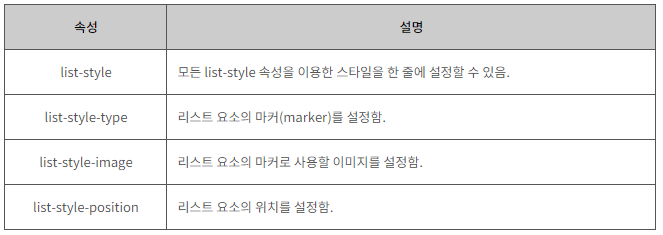

#  CSS 리스트

​        

### 사전 지식

> CSS 색을 배우기 전에 다음과 같은 기초 지식이 필요합니다.

- [x] **CSS 스타일 적용법**

​          

### Goal

- [x] **CSS list-style-type 속성 이해하기.**
- [x] **CSS list-style-image속성 이해하기.**
- [x] **CSS list-style-position속성 이해하기.**

​             

​       

## I. CSS 리스트

> CSS를 이용하면 리스트에 다양한 효과를 적용할 수 있습니다.
>
> 1. 순서가 없는 리스트(unordered list)
> 2. 순서가 있는 리스트(ordered list)
> 3. 정의 리스트(definition list)

​     

CSS에서 사용할 수 있는 list-style 속성은 다음과 같습니다.

​      

1. list-style-type

2. list-style-image

3. list-style-position

​    

### 1. list-style-type 속성

> 리스트 요소의 앞에 위치하는 숫자나 기호를 마커(marker)라고 합니다.
>
> list-style-type 속성을 이용하면 리스트에 다양한 마커(marker)를 적용할 수 있습니다.

​     

#### HTML

```html
<style>
    .circle { list-style-type: circle; }
    .square { list-style-type: square; }
    .upperAlpha { list-style-type: upper-alpha; }
    .lowerRoman { list-style-type: lower-roman; }
    
    /* list-style-type: none; 으로 list 모양 삭제도 가능하다.*/
    
</style>
```

사용할 수 있는 마커(marker)에 대한 더 자세한 사항은 HTML 리스트 수업에서 확인할 수 있습니다.

​    

### 2. list-style-image 속성

> list-style-image 속성을 이용하면 마커(marker)로 자신만의 이미지를 사용할 수 있습니다.

   

#### HTML

```html
<style>
    .imageMarker { list-style-image: url("/examples/images/img_list_marker.png"); }
</style>
```

​        

### 3. list-style-position 속성

> list-style-position 속성을 이용하면 리스트 요소의 위치를 설정할 수 있습니다.
>
> list-style-position 속성의 기본 속성값은 outside로 설정되어 있습니다.

​    

#### HTMl

```html
<style>
    .outside { list-style-position: outside; }
    .inside { list-style-position: inside; }
</style>
```

   

#### list-style 속성 한 번에 적용하기

위에서 언급한 모든 list-style 속성을 이용한 스타일을 한 줄에 설정할 수 있습니다.

​     

#### HTML

```html
<style>
    ul { list-style: square inside url("/examples/images/img_list_marker.png"); }
</style>
```

​     

#### 리스트에 배경색 적용

CSS를 사용하면 리스트 전체뿐만 아니라 리스트 요소별로도 각각의 배경색을 설정할 수 있습니다.

​     

#### HTML

```html
<style>
    ul { background: #D2691E; padding: 15px; }
    ol { background: #6495ED; padding: 15px; }
    ul li { background: #DEB887; margin: 5px; }
    ol li { background: #00FFFF; margin-left: 15px; }
</style>
```

   

#### CSS list-style 속성

