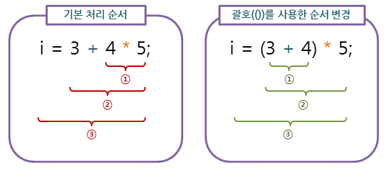
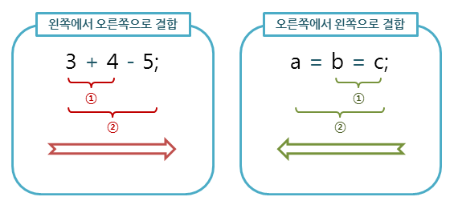
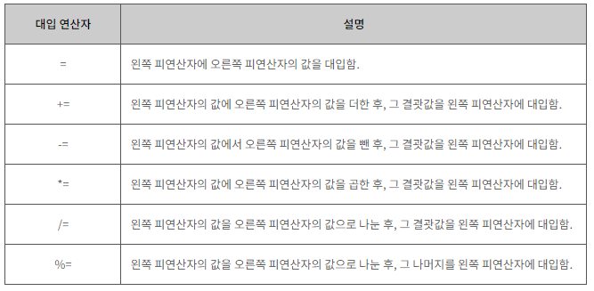
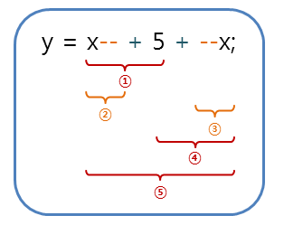
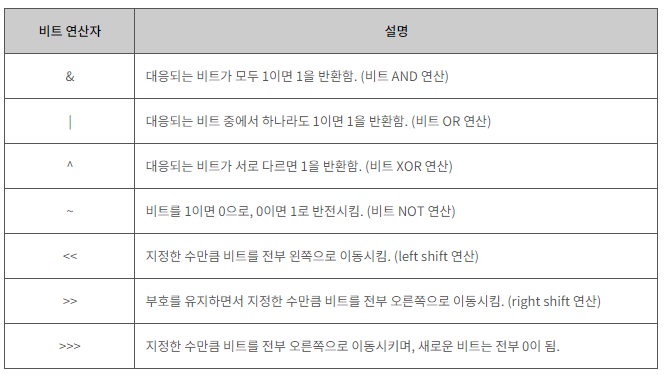
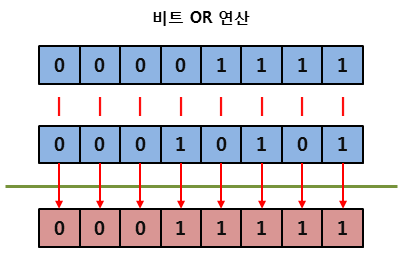
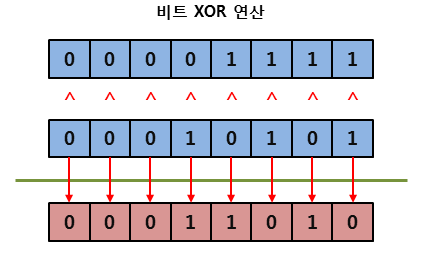
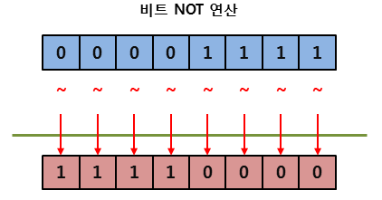

# 자바스크립트 연산자

​    

### 사전 지식

> 자바스크립트를 배우기 전에 다음과 같은 기초 지식이 필요합니다.

- [x] **JavaScript 문법**

​        

### Goal

- [x] **자바스크립트(JavaScript)란 산술 연산자 이해하기.**

- [x] **자바스크립트(JavaScript)란 대입 연산자 이해하기.**

- [x] **자바스크립트(JavaScript)란 증감 연산자 이해하기.**

- [x] **자바스크립트(JavaScript)란 비교 연산자 이해하기.**

- [x] **자바스크립트(JavaScript)란 논리 연산자 이해하기.**

- [x] **자바스크립트(JavaScript)란 비트 연산자 이해하기.**

- [x] **자바스크립트(JavaScript)란 기타 연산자 이해하기.**

    

​      

## I. 자바스크립트 연산자

  

#### 연산자(operator)

자바스크립트는 여러 종류의 연산을 위한 다양한 연산자(operator)를 제공하고 있습니다.

​    

### 1. 산술 연산자(arithmetic operator)

산술 연산자는 사칙연산을 다루는 가장 기본적이면서도 많이 사용하는 연산자입니다.

산술 연산자는 모두 두 개의 피연산자를 가지는 이항 연산자이며, 피연산자들의 결합 방향은 왼쪽에서 오른쪽입니다.


#### 참고

항이란 해당 연산의 실행이 가능하기 위해 필요한 값이나 변수를 의미합니다.
따라서 이항 연산자란 해당 연산의 실행을 위해서 두 개의 값이나 변수가 필요한 연산자를 의미합니다.

  

   

```js
var x = 10, y = 4;

document.write(x + y + "<br>"); // 14

document.write(x - y + "<br>"); // 6

document.write(x * y + "<br>"); // 40

document.write(x / y + "<br>"); // 2.5

document.write(x % y);          // 2
```

  

#### (1) 연산자의 우선순위(operator precedence)와 결합 방향(associativity)

연산자의 우선순위는 수식 내에 여러 연산자가 함께 등장할 때, 어느 연산자가 먼저 처리될 것인가를 결정합니다.

 

다음 그림은 가장 높은 우선순위를 가지고 있는 괄호(()) 연산자를 사용하여 연산자의 처리 순서를 변경하는 것을 보여줍니다.

   



 

연산자의 결합 방향은 수식 내에 우선순위가 같은 연산자가 둘 이상 있을 때, 먼저 어느 연산을 수행할 것인가를 결정합니다.




  

#### (2) 자바스크립트 연산자의 우선순위표

자바스크립트에서 연산자의 우선순위와 결합 방향은 다음과 같습니다

| 우선순위 |   연산자   |                             설명                             |      결합 방향      |
| :------: | :--------: | :----------------------------------------------------------: | :-----------------: |
|  **1**   |     ()     |                          묶음(괄호)                          |          -          |
|  **2**   |     .      |                          멤버 접근                           | 왼쪽에서 오른쪽으로 |
|          |    new     |                     인수 있는 객체 생성                      |          -          |
|  **3**   |     ()     |                          함수 호출                           | 왼쪽에서 오른쪽으로 |
|          |    new     |                     인수 없는 객체 생성                      | 오른쪽에서 왼쪽으로 |
|  **4**   |     ++     |                       후위 증가 연산자                       |          -          |
|          |     --     |                       후위 감소 연산자                       |          -          |
|  **5**   |     !      |                       논리 NOT 연산자                        | 오른쪽에서 왼쪽으로 |
|          |     ~      |                       비트 NOT 연산자                        | 오른쪽에서 왼쪽으로 |
|          |     +      |                   양의 부호 (단항 연산자)                    | 오른쪽에서 왼쪽으로 |
|          |     -      |                   음의 부호 (단항 연산자)                    | 오른쪽에서 왼쪽으로 |
|          |     ++     |                       전위 증가 연산자                       | 오른쪽에서 왼쪽으로 |
|          |     --     |                       전위 감소 연산자                       | 오른쪽에서 왼쪽으로 |
|          |   typeof   |                          타입 반환                           | 오른쪽에서 왼쪽으로 |
|          |    void    |                        undefined 반환                        | 오른쪽에서 왼쪽으로 |
|          |   delete   |                       프로퍼티의 제거                        | 오른쪽에서 왼쪽으로 |
|  **6**   |     **     |                       거듭제곱 연산자                        | 오른쪽에서 왼쪽으로 |
|          |     *      |                         곱셈 연산자                          | 왼쪽에서 오른쪽으로 |
|          |     /      |                        나눗셈 연산자                         | 왼쪽에서 오른쪽으로 |
|          |     %      |                        나머지 연산자                         | 왼쪽에서 오른쪽으로 |
|  **7**   |     +      |                  덧셈 연산자 (이항 연산자)                   | 왼쪽에서 오른쪽으로 |
|          |     -      |                  뺄셈 연산자 (이항 연산자)                   | 왼쪽에서 오른쪽으로 |
|  **8**   |     <<     |                   비트 왼쪽 시프트 연산자                    | 왼쪽에서 오른쪽으로 |
|          |     >>     |          부호 비트를 확장하면서 비트 오른쪽 시프트           | 왼쪽에서 오른쪽으로 |
|          |    >>>     |         부호 비트를 확장하지 않고 비트 오른쪽 시프트         | 왼쪽에서 오른쪽으로 |
|  **9**   |     <      |                    관계 연산자(보다 작은)                    | 왼쪽에서 오른쪽으로 |
|          |     <=     |                관계 연산자(보다 작거나 같은)                 | 왼쪽에서 오른쪽으로 |
|          |     >      |                     관계 연산자(보다 큰)                     | 왼쪽에서 오른쪽으로 |
|          |     >=     |                관계 연산자(보다 크거나 같은)                 | 왼쪽에서 오른쪽으로 |
|          | instanceof |                      인스턴스 여부 판단                      | 왼쪽에서 오른쪽으로 |
|  **10**  |     ==     |                         동등 연산자                          | 왼쪽에서 오른쪽으로 |
|          |    ===     |                         일치 연산자                          | 왼쪽에서 오른쪽으로 |
|          |     !=     |                         부등 연산자                          | 왼쪽에서 오른쪽으로 |
|          |    !==     |                        불일치 연산자                         | 왼쪽에서 오른쪽으로 |
|  **11**  |     &      |                       비트 AND 연산자                        | 왼쪽에서 오른쪽으로 |
|  **12**  |     ^      |                       비트 XOR 연산자                        | 왼쪽에서 오른쪽으로 |
|  **13**  |     \|     |                        비트 OR 연산자                        | 왼쪽에서 오른쪽으로 |
|  **14**  |     &&     |                       논리 AND 연산자                        | 왼쪽에서 오른쪽으로 |
|  **15**  |    \|\|    |                        논리 OR 연산자                        | 왼쪽에서 오른쪽으로 |
|  **16**  |    ? :     |                         삼항 연산자                          | 오른쪽에서 왼쪽으로 |
|  **17**  |     =      | 대입 연산자 (=, +=, -=, *=, /=, %=, <<=, >>=, >>>=, &=, ^=, \|=) | 오른쪽에서 왼쪽으로 |
|  **18**  |    ...     |                             전개                             |          -          |
|  **19**  |     ,      |                         쉼표 연산자                          | 왼쪽에서 오른쪽으로 |

위의 표에서 나온 순서대로 우선순위가 빠른 연산자가 가장 먼저 실행됩니다.

또한, 같은 우선순위를 가지는 연산자가 둘 이상 있을 때에는 결합 순서에 따라 실행 순서가 결정됩니다.

  

  

## 2. 대입 연산자(assignment operator)

대입 연산자는 변수에 값을 대입할 때 사용하는 이항 연산자이며, 피연산자들의 결합 방향은 오른쪽에서 왼쪽입니다.

또한, 앞서 살펴본 산술 연산자와 결합한 다양한 복합 대입 연산자가 존재합니다.

   



  

```js
var x = 10, y = 10, z = 10;

x = x - 5;

y -= 5; // y = y - 5 와 같은 표현임.

z =- 5; // z = -5 와 같은 표현임.
```

위의 예제에서 z =- 5 연산은 단순히 -5를 변수 z에 대입하는 연산이 되었습니다.
이처럼 복합 대입 연산자에서 연산자의 순서는 매우 중요하므로 주의를 기울여야 합니다.


### 3. 증감 연산자(increment and decrement operator)

증감 연산자는 피연산자를 1씩 증가 혹은 감소시킬 때 사용하는 연산자입니다.

이 연산자는 피연산자가 단 하나뿐인 단항 연산자입니다.

 

증감 연산자는 해당 연산자가 피연산자의 어느 쪽에 위치하는가에 따라 연산의 순서 및 결과가 달라집니다.


   

​    

```js
var x = 10, y = 10;

document.write((++x - 3) + "<br>"); // x의 값을 우선 1 증가시킨 후에 3을 뺌.

document.write(x + "<br>");         // 11

document.write((y++ - 3) + "<br>"); // 먼저 y에서 3을 뺀 후에 y의 값을 1 증가시킴.

document.write(y);                  // 11
```

   

#### (1) 증감 연산자의 연산 순서

증감 연산자는 피연산자의 어느 쪽에 위치하는가에 따라 연산의 순서가 달라집니다.

 

다음 예제는 증감 연산자의 연산 순서를 살펴보기 위한 예제입니다. 

```js
var x = 10;            // 8

var y = x-- + 5 + --x; // 23
```

   

다음 그림은 위의 예제에서 수행되는 연산의 순서를 보여줍니다.



① : 첫 번째 감소 연산자(decrement operator)는 피연산자의 뒤쪽에 위치하므로, 덧셈 연산이 먼저 수행됩니다.

② : 덧셈 연산이 수행된 후에 감소 연산이 수행됩니다. (x의 값 : 9)

③ : 두 번째 감소 연산자는 피연산자의 앞쪽에 위치하므로, 덧셈 연산보다 먼저 수행됩니다. (x의 값 : 8)

④ : 감소 연산이 수행된 후에 덧셈 연산이 수행됩니다.

⑤ : 마지막으로 변수 y에 결괏값의 대입 연산이 수행됩니다. (y의 값 : 23)

​     

### 4. 비교 연산자(comparison operator)

비교 연산자는 피연산자 사이의 상대적인 크기를 판단하여, 참(true)과 거짓(false)을 반환합니다.

비교 연산자는 모두 두 개의 피연산자를 가지는 이항 연산자이며, 피연산자들의 결합 방향은 왼쪽에서 오른쪽입니다.

  


  

자바스크립트에서 비교 연산자는 피연산자의 타입에 따라 두 가지 기준으로 비교를 진행합니다.

 

1. 피연산자가 둘 다 숫자면, 해당 숫자를 서로 비교합니다.

2. 피연산자가 둘 다 문자열이면, 문자열의 첫 번째 문자부터 알파벳 순서대로 비교합니다.

  

```js
var x = 3, y = 5;

var a = "abc", b = "bcd";

document.write((x > y) + "<br>");  // y의 값이 x의 값보다 크므로 false

document.write((a <= b) + "<br>"); // 알파벳 순서상 'a'가 'b'보다 먼저 나오므로 'a'가 'b'보다 작음.

document.write(x < a);             // x의 값은 숫자이고 a의 값은 문자열이므로 비교할 수 없음.
```

위의 세 번째 연산에서 변수 x의 값은 숫자이고, 변수 a의 값은 문자열입니다.

비교 연산자 < 는 x의 값이 a의 값보다 작을 때만 참을 반환하고, 나머지 경우에는 전부 거짓을 반환하는 연산자입니다.

따라서 타입이 서로 달라 비교할 수 없는 경우에는 참의 조건을 만족하게 하지 못하므로, 언제나 거짓(false)만을 반환하게 됩니다.

  

#### (1) 동등 연산자와 일치 연산자

동등 연산자(==, equal)와 일치 연산자(===, strict equal)는 모두 두 개의 피연산자가 서로 같은지를 비교해 줍니다.

두 연산자 모두 피연산자의 타입을 가리지는 않지만, 그 같음을 정의하는 기준이 조금 다릅니다.

 

동등 연산자(==)는 두 피연산자의 **값이 서로 같으면 참(true)을 반환**합니다.

이때 두 피연산자의 **타입이 서로 다르면, 비교를 위해 강제로 타입을 같게 변환**합니다.

하지만 **일치 연산자(===)는 타입의 변환 없이 두 피연산자의 값이 같고, 타입도 같아야만 참(true)을 반환**

```js
var x = 3, y = '3', z = 3;

document.write((x == y) + "<br>");  // x와 y의 타입이 서로 다르므로 타입을 서로 같게 한 후 비교를 하므로 true

document.write((x === y) + "<br>"); // x와 y의 타입이 서로 다르므로 false

document.write(x === z);            // x와 z은 값과 타입이 모두 같으므로 true
```

부등 연산자(!=)와 불일치 연산자(!==)는 각각 동등 연산자와 일치 연산자의 비교와 정확히 반대로 동작합니다.

  

### 5. 논리 연산자(logical operator)

논리 연산자는 주어진 논리식을 판단하여, 참(true)과 거짓(false)을 반환합니다.

&& 연산자과 || 연산은 두 개의 피연산자를 가지는 이항 연산자이며, 피연산자들의 결합 방향은 왼쪽에서 오른쪽입니다.

! 연산자는 피연산자가 단 하나뿐인 단항 연산자이며, 피연산자의 결합 방향은 오른쪽에서 왼쪽입니다.


   

다음은 논리 연산자의 모든 동작의 결과를 보여주는 진리표(truth table)입니다.


```js
var x = true, y = false;

document.write((x && y) + "<br>"); // false (논리 AND 연산)

document.write((x || y) + "<br>"); // true  (논리 OR  연산)

document.write(!x);                // false (논리 NOT 연산)
```

  

### 6. 비트 연산자(bitwise operator)

비트 연산자는 논리 연산자와 비슷하지만, 비트(bit) 단위로 논리 연산을 수행합니다.

또한, 비트 단위로 전체 비트를 왼쪽이나 오른쪽으로 이동시킬 때도 사용합니다.



   

다음 그림은 비트 AND 연산자(&)의 동작을 나타냅니다.

이처럼 비트 AND 연산자는 대응되는 두 비트가 모두 1일 때만 1을 반환하며, 다른 경우는 모두 0을 반환합니다.


다음 그림은 비트 OR 연산자(|)의 동작을 나타냅니다.

이처럼 비트 OR 연산자는 대응되는 두 비트 중 하나라도 1이면 1을 반환하며, 두 비트가 모두 0일 때만 0을 반환합니다.



다음 그림은 비트 XOR 연산자(^)의 동작을 나타냅니다.

이처럼 비트 XOR 연산자는 대응되는 두 비트가 서로 다르면 1을 반환하고, 서로 같으면 0을 반환합니다.



다음 그림은 비트 NOT 연산자(~)의 동작을 나타냅니다.

이처럼 비트 NOT 연산자는 해당 비트가 1이면 0을 반환하고, 0이면 1을 반환합니다.



다음 예제는 시프트 연산자(<<, >>)와 비트 NOT 연산자(~)의 예제입니다.

```js
var x = 15, y = 8, z = 15;

document.write((x << 1) + "<br>"); // 곱하기 2와 같으므로 15 * 2 = 30

document.write((y >> 1) + "<br>"); // 나누기 2와 같으므로 8 / 2 = 4

document.write(~z);                // 1의 보수와 같으므로 -(15+1) = -16
```


위의 예제에서 첫 번째 연산은 비트를 전부 왼쪽으로 1비트씩 이동시키는 연산입니다.

따라서 그 결괏값은 처음 값에 2를 곱한 것과 같게 됩니다.

반대로 두 번째 연산은 비트를 전부 오른쪽으로 1비트씩 이동시키는 연산입니다.

따라서 그 결괏값은 처음 값에 2를 나눈 것과 같게 됩니다.

  

### 7. 기타 연산자

   

#### (1) 문자열 결합 연산자

자바스크립트에서 덧셈(+) 연산자는 피연산자의 타입에 따라 두 가지 다른 연산을 수행합니다.

 

1. 피연산자가 둘 다 숫자이면, 산술 연산인 덧셈을 수행합니다.

2. 피연산자가 하나라도 문자열이면, 문자열 결합을 수행합니다.

 

```js
var x = 3 + 4;                   // 피연산자가 둘 다 숫자이면 덧셈 연산을 수행함.

var y = "좋은 " + "하루 되세요!" // 피연산자가 둘 다 문자열이면 문자열 결합 연산을 수행함.

var z = 12 + "월"                // 피연산자가 하나라도 문자열이면 문자열 결합 연산을 수행함.
```

피연산자가 하나는 문자열이고 다른 하나는 문자열이 아닐 때, 자바스크립트는 문자열이 아닌 피연산자를 자동으로 문자열로 변환한 후 문자열 결합을 수행합니다.


#### (2) 삼항 연산자(ternary operator)

삼항 연산자는 유일하게 피연산자를 세 개나 가지는 조건 연산자입니다.

 

삼항 연산자의 문법은 다음과 같습니다.

```
표현식 ? 반환값1 : 반환값2
```

물음표(?) 앞의 표현식에 따라 결괏값이 참이면 반환값1을 반환하고, 결괏값이 거짓이면 반환값2를 반환합니다.

```js
var x = 3, y = 5;

var result = (x > y) ? x : y   // x가 더 크면 x를, 그렇지 않으면 y를 반환함.

document.write("둘 중에 더 큰 수는 " + result + "입니다.");
```

삼항 연산자는 짧은 if / else 문 대신 사용할 수 있으며, 코드를 간결하게 만들어 줍니다.

```js
// 루프마다 i의 값은 1씩 증가하고, 동시에 j의 값은 1씩 감소함.

for (var i = 0, j = 9; i <= j; i++, j--) {

    document.write("i의 값은 " + i + "이고, j의 값은 " + j + "입니다.<br>");

}
```

   

#### (3) delete 연산자

delete 연산자는 피연산자인 객체, 객체의 프로퍼티(property) 또는 배열의 요소(element) 등을 삭제해 줍니다.

 

피연산자가 성공적으로 삭제되었을 경우에는 참(true)을 반환하고, 삭제하지 못했을 경우에는 거짓(false)을 반환합니다.

이 연산자는 피연산자가 단 하나뿐인 단항 연산자이며, 피연산자의 결합 방향은 오른쪽에서 왼쪽입니다.

```js
var arr = [1, 2, 3];          // 배열 생성

delete arr[2];                // 배열의 원소 중 인덱스가 2인 요소를 삭제함.

document.write(arr + "<br>"); // [1, 2, ]

// 배열에 빈자리가 생긴 것으로 undefined 값으로 직접 설정된 것은 아님.

document.write(arr[2] + "<br>");

// 배열의 요소를 삭제하는 것이지 배열의 길이까지 줄이는 것은 아님.

document.write(arr.length);
```

  

#### (4) typeof 연산자

typeof 연산자는 피연산자의 타입을 반환합니다.

이 연산자는 피연산자가 단 하나뿐인 단항 연산자이며, 피연산자의 결합 방향은 오른쪽에서 왼쪽입니다.

  

자바스크립트에서 많이 사용하는 값과 그 값에 대한 typeof 연산자의 결괏값은 다음과 같습니다.


```js
typeof "문자열"   // string

typeof 10         // number

typeof NaN        // number

typeof false      // boolean

typeof undefined  // undefined

typeof new Date() // object

typeof null       // object
```

  

#### (5) instanceof 연산자

instanceof 연산자는 피연산자인 객체가 특정 객체의 인스턴스인지 아닌지를 확인해 줍니다.

 

피연산자가 특정 객체의 인스턴스이면 참(true)을 반환하고, 특정 객체의 인스턴스가 아니면 거짓(false)을 반환합니다.

이 연산자는 두 개의 피연산자를 가지는 이항 연산자이며, 피연산자들의 결합 방향은 왼쪽에서 오른쪽입니다.

```js
var str = new String("이것은 문자열입니다.");

 

str instanceof Object;  // true

str instanceof String;  // true

str instanceof Array;   // false

str instanceof Number;  // false

str instanceof Boolean; // false
```

   

#### (6) void 연산자

void 연산자는 피연산자로 어떤 타입의 값이 오던지 상관없이 언제나 undefined 값만을 반환합니다.

이 연산자는 피연산자가 단 하나뿐인 단항 연산자이며, 피연산자의 결합 방향은 오른쪽에서 왼쪽입니다.

   

```js
<a href="javascript:void(0)">이 링크는 동작하지 않습니다.</a>

<a href="javascript:void(document.body.style.backgroundColor='yellow')">

    이 링크도 동작하지 않지만, HTML 문서의 배경색을 바꿔줍니다.

</a>
```

위의 예제처럼 void 연산자는 정의되지 않은 원시 타입의 값을 얻기 위해 void(0)과 같은 형태로 종종 사용됩니다.