# CSS

> HTML에 담은 내용을 스타일 해준다.


## I. CSS 작성

> HTML 코드 안에 `<style>` `</style>` 태그 안에 써준다. 


```html
<!-- 여기에 html 코드 -->

<style>
/* 여기에 CSS 코드 */
</style>
```


## II. CSS의 기본 문법


### 1. 폰트 크기

> CSS에서 폰트 크기를 표현할 수 있는 단위 몇 가지가 있는데, 그 중 픽셀(`px`)이 가장 많이 사용됩니다.


#### Code

```html
<h1>Heading 1</h1>
<h2>Heading 2</h2>

<style>
h2 {
  font-size: 72px;
}
</style>
```


#### 출력


#### 픽셀

> HTML에서 무언가의 크기를 설정할 때는 기본적으로 '픽셀(`px`)' 단위를 사용합니다.
>
> 픽셀은 화면을 구성하는 기본 단위입니다. 아래 이미지를 보세요.


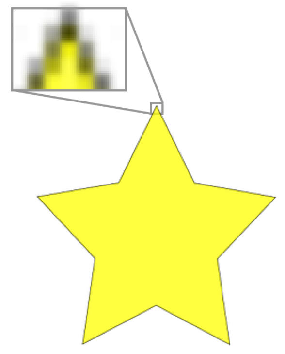

별 이미지의 일부를 확대해서 보니까 작은 정사각형 단위로 되어 있죠? 각 정사각형을 픽셀이라고 부릅니다. 만약 어떤 이미지의 가로 길이가 `100px`로 설정되었다면, 가로로 저 작은 정사각형 100개가 있다는 거죠.


### 폰트 크기

폰트 크기도 픽셀로 설정하는 경우가 많은데요. 폰트 크기가 `24px`로 설정되어 있으면 폰트의 세로 길이가 `24px`이라는 뜻입니다.


# 퍼센트

길이를 픽셀 말고 퍼센트(`%`)로 설정할 수도 있습니다.

```html


```

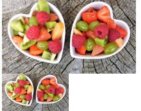

### 2. 텍스트 색

> 글에 색을 입히고 싶으면 `color` 속성을 사용하면 됩니다. CSS에서 색을 표현하는 방식 몇 가지가 있는데, 나중에 살펴보도록 합시다.


#### Code

```html
<h1>Heading 1</h1>
<h2>Heading 2</h2>
<h3>Heading 3</h3>

<style>
h1 {
  color: lime;
}

h2 {
  color: hotpink;
}

h3 {
  color: blue;
}
</style>
```


#### 출력

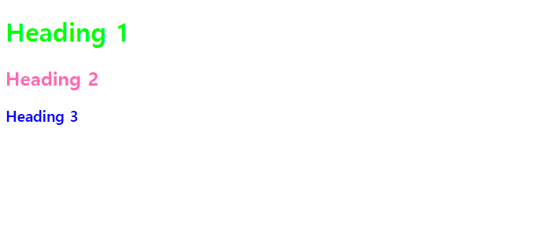

### 3. 여백

> `margin` 속성을 사용하면 요소 사이의 여백을 설정할 수 있습니다. 여백의 크기도 픽셀(`px`) 단위로 설정해주시면 됩니다.


#### Code

```html
<h1>Heading 1</h1>
<h2>Heading 2</h2>
<h3>Heading 3</h3>

<style>
h1 {
  margin-bottom: 80px;
}

h3 {
  margin-left: 50px;
}
</style>
```


#### 출력

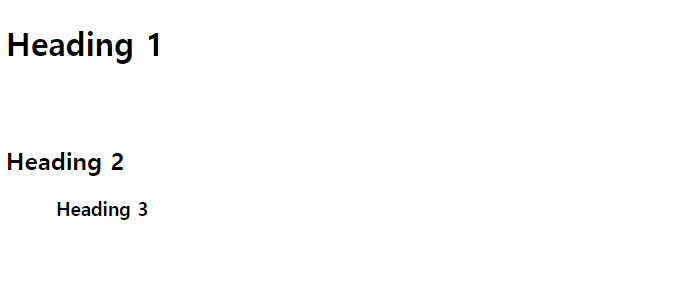

### 4.이미지 정렬

```html
<style>
    img {
        display: block;
        margin-left: auto;
        margin-right: auto
    }
</style>
```


### 5. HTML 요소에 이름 붙이기

> - 클래스(Class)
> - 아이디(id)


#### 클래스(Class)

```Html
<p class="big-blue-text">First</p>
<p>Second</p>
<p class="big-blue-text">Third</p>
```

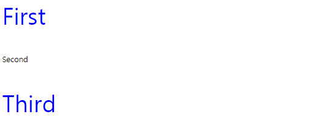

위의 코드에서 첫 번째 `p` 요소와 세 번째 `p` 요소는 `"big-blue-text"`라는 클래스 이름을 갖고 있습니다. 그러면 css에서 `.big-blue-text`에 스타일을 입혀주면 됩니다. 클래스 이름이라는 걸 나타내는 '`.`(마침표)'를 잊지 맙시다!


#### 아이디(id)

```html
<p id="favorite-text">First</p>
<p>Second</p>
<p>Third</p>
```

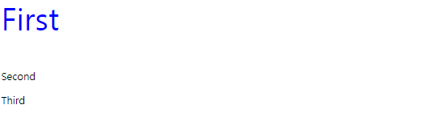

위의 코드에서 첫 번째 `p` 요소는 `"favorite-text"`라는 아이디를 갖고 있습니다. 그러면 css에서 `#favorite-text`에 스타일을 입혀주면 됩니다. 클래스 이름을 나타내기 위해 '`.`(마침표)'를 붙인 것처럼 아이디를 나타내기 위해서는 '`#`(샾 표시)'를 써줘야 합니다.


# 클래스 vs 아이디

클래스와 아이디. 얼핏 보기에는 똑같아 보이는데요. 핵심적인 차이점 몇 가지가 있습니다:

1. 같은 클래스 이름을 여러 요소가 가질 수 있지만, 같은 아이디를 여러 요소가 공유할 수는 없습니다.
2. 한 요소가 여러 클래스를 가질 수 있지만, 한 요소는 하나의 아이디만 가질 수 있습니다. (단, 한 요소가 클래스도 여러 개 갖고 아이디도 하나 가질 수 있습니다!)


## CSS 파일 따로 쓰기

> 동일한 내용으로 html을 style한 코드를 같이 쓰는 것은 피하자!
>
> 같은 내용의 style을 묶어서 html이 있는 폴더안에 폴더를 만들고 그안에 css 파일을 만든다.


```css
h1 {
    /* 요소에 대한 속성 */
    font-size: 64px;
}
    /* h3 위에 100px의 여백을 줌 */
h3 {
    margin-top: 100px;
}
        /* i tag의 글씨를 48px로 키워줌 */
        /* 모든 i tag의 글씨가 다 커짐 */
        /* 특정 태그 속 i tag의 글씨를 키우고 싶으면 i 앞에 태그를 써준다. */
p i {
    font-size: 48px;
}
.big-blue-text {
    font-size: 64px;
    color: blue;
}
.centered-text {
    text-align: center;
}
#best-text {
    color: orange;
}
.page {
    background-color: #eee;
    border-radius: 20px;
    margin-bottom: 50px;
    padding: 50px;
    width: 500px;
    margin-left: auto;
    margin-right: auto;
    text-align: center;
}
.page .page1 {
    color: blue;
}
.page .page2 {
    color: red;
}
.page .page3 {
    color: orange;
}
.image {
    display: block;
    margin-left: auto;
    margin-right: auto;
    margin-top: 40px;
    margin-bottom: 40px;
}
```

```html
<head> 
        <title>My First Website</title>
        <meta charset = "utf-8">
    	/* style 코드가 들어있는 css파일의 경로를 링크해주면 된다. */
        <link href = "css/styles.css" rel = "stylesheet">
    </head>
```


#### link 태그 rel  = "속성값"

____

> rel 속성은 <link> 요소에 반드시 명시되어야 하는 필수 속성입니다.

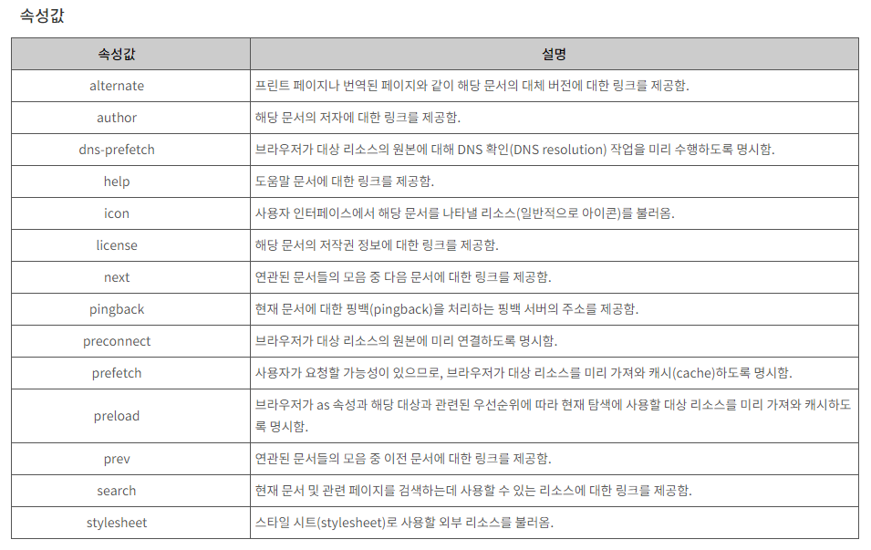

# 스타일을 적용하는 방법

>HTML 코드에 스타일을 입히는 방법에는 세 가지가 있습니다.


- ### `<style>` 태그

  ```html
  <style>
    h1 {
      color: green;
      text-align: center;
    }
  
    p {
      font-size: 18px;
    }
  </style>
  
  <h1>Hello World!</h1>
  <p>Lorem ipsum dolor sit amet, consectetur adipiscing elit. Quisque sit amet lorem sit amet nunc ornare convallis. Pellentesque ac posuere lectus. In eu ipsum et quam finibus fermentum vitae sit amet magna.</p>
  ```

  

- ### style 속성

  ```html
  <h1 style="color: green; text-align: center;">Hello World!</h1>
  <p style="font-size: 18px;">Lorem ipsum dolor sit amet, consectetur adipiscing elit. Quisque sit amet lorem sit amet nunc ornare convallis. Pellentesque ac posuere lectus. In eu ipsum et quam finibus fermentum vitae sit amet magna.</p>
  ```

  ​    

- ### 3. 외부 CSS 파일 + <link> 태그

  #### CSS 파일

  ```css
  h1 {
    color: green;
    text-align: center;
  }
  
  p {
    font-size: 18px;
  }
  ```

  #### html 파일

  ```html
  <link href="css/styles.css" rel="stylesheet">
  
  <h1>Hello World!</h1>
  <p>Lorem ipsum dolor sit amet, consectetur adipiscing elit. Quisque sit amet lorem sit amet nunc ornare convallis. Pellentesque ac posuere lectus. In eu ipsum et quam finibus fermentum vitae sit amet magna.</p>
  ```


# 어떤 방법을 써야 할까?

일반적으로는 외부 CSS 파일에 스타일을 쓰고 HTML 코드에서 `<link>` 태그로 연결해주는 것이 가장 좋은 방식입니다. 하지만 조금씩 새로운 스타일을 시도해볼 때에는 간편함을 위해서 `<style>`태그를 쓰는 방법 또는 `style` 속성에서 테스트를 하고, 나중에 외부 CSS 파일로 옮기는 방법도 있습니다!

  

#### 외부 CSS 파일을 작성하고 link 태그로 연결하는 것

**추천이유?**

- 정리 정돈
  - html 파일에는 html 파일만 있고 css 파일에는 딱 css 코드만 있다.
- 외부 파일 이용시
  - 링크 태그만으로 깔끔하게 정리 가능


# CSS 코멘트

> `/* 내용 */`의 형태로 되어 있는 부분이 CSS의 '코멘트(comment)'입니다.


```css
/* 영화 제목 */
.movie h2 {
  color: #4d9fff;
  text-align: center;
  font-size: 48px;
}

/* 영화 줄거리 */
.movie p {
  font-size: 24px;
}
```


# 정리

코멘트는 사실 브라우저가 무시하기 때문에 실제 결과물인 사이트에 반영이 되지 않습니다. 하지만 복잡한 부분들을 설명함으로써 지저분해 보일 수 있는 코드를 정리해주는 중요한 역할을 합니다.

몇 년 뒤에 자신이 쓴 코드를 확인했을 때, 또는 동료 개발자에게 코드를 보여줬을 때 코멘트로 설명이 잘 되어 있어야 이해하기 쉽겠죠?


## 도움이 되는 사이트

> 구글에 text decoration  검색
>
> - W3Schools : CSS 스타일 정보
> - stackoverflow.com : 세계에서 가장 큰 프로그래밍 포럼
> - jsfiddle.net : 간단하게 코드를 작성할 수 있는 사이트, 저장을 하면 내용이 링크로 저장되기 때문에 질문코드 질문할때 유용


## 텍스트 색

> 텍스트의 색을 지정해주기 위해서는 `color` 속성을 사용, CSS에서 색을 표현하는 방식이 세 가지가 있다.
>
> - 색 이름
> - RGB 값
> - HEX 값(16 진법) 
>
> 위 RGB값과 HEX 값은 www.htmlcolorcodes.com 참고


# 색 이름

[CSS에서 정해준 색 이름](https://www.w3schools.com/cssref/css_colors.asp) 중 하나를 쓰는 방법이 있습니다. 모든 색이 있지는 않지만, 무려 140개의 색이 대부분 브라우저에서 지원된다고 하네요!

```css
h1 {
  color: blue;
}
```


# RGB 값

모든 색은 빨강(Red), 초록(Green), 파랑(Blue)의 조화로 표현할 수 있습니다. 이 표현 방식이 바로 'RGB'입니다. [이런 사이트](https://htmlcolorcodes.com/color-picker/)에서 원하는 색을 찾아보세요.

```css
h1 {
  color: rgb(83, 237, 65);
}
```


# HEX 값 (16진법)

HEX 값은 단순히 RGB 값을 16진법으로 표현한 방식입니다. `83`는 16진법으로 `53`이고, `237`는 16진법으로 `ED`이고, `65`는 16진법으로 `41`입니다. 따라서 `rgb(83, 237, 65)`는 `#53ED41`과 같은 거죠.


```css
h1 {
  color: #53ED41;
}
```


# 폰트 굵기 설정

> 폰트 굵기를 설정하기 위해서는 `font-weight` 속성을 사용하면 됩니다.


## 사용법

사용 가능한 값은 얇은 순서로 `100`, `200`, `300`, `400`, `500`, `600`, `700`, `800`, `900`입니다. `100`이 가장 얇고, `900`이 가장 굵다는 뜻이죠.


```css
/*참고로 font-weight: normal;은 font-weight: 400과 똑같고, 
font-weight: bold;는 font-weight: 700과 똑같습니다!*/

#p1 {
  font-weight: 400;
}

#p2 {
  font-weight: 700;
}

#p3 {
  font-weight: normal;
}

#p4 {
  font-weight: bold;
}
```


# 주의 사항

`150`, `230`과 같은 값은 사용할 수 없습니다. 만약 사용한다면 그냥 기본값으로 설정됩니다.

또 주의할 점이 있습니다. 폰트나 브라우저에 따라서 지원하는 폰트 굵기 값이 다릅니다. 어떤 폰트는 `100`, `400`, `700`만 지원될 수도 있다는 뜻이죠. 잘 확인하고 사용하시길 바랍니다!


# 텍스트 정렬

> `text-align` 속성을 사용하면 텍스트를 왼쪽, 오른쪽, 또는 가운데로 정렬할 수 있습니다.


```css
#p1 {
  color: red;
  text-align: left;
}

#p2 {
  color: green;
  text-align: right;
}

#p3 {
  color: blue;
  text-align: center;
}

```


# 태그 정렬

> `<p>` 태그나 헤더 태그들 뿐만 아니라 `<div>` 태그의 내용물도 정렬을 할 수 있습니다!

```html
<div class="navigation">
  <a href="#">Menu 1</a> <a href="#">Menu 2</a> <a href="#">Menu 3</a>
</div>
```

```css
.navigation {
  text-align: center;
}
```


# 텍스트 꾸미기

> `text-decoration`을 사용하면 텍스트를 몇 가지 방법으로 꾸밀 수 있습니다. 사실 옵션도 몇 가지 없고 딱히 예쁘지도 않지만 한 번 살펴봅시다.


# Underline

`underline` 값을 사용하면 밑줄이 그어집니다.

```css
h1 {
  text-decoration: underline;
}
```


# Overline

`overline` 값을 사용하면 글 위에 줄이 그어집니다.

```css
h1 {
  text-decoration: overline;
}
```


# Line-through

`line-through` 값을 사용하면 줄이 글을 관통합니다.

```css
h1 {
  text-decoration: line-through;
}
```


# None

`none` 값을 사용하면 아무 줄도 없습니다. **이게 기본 값입니다!**

```css
h1 {
  text-decoration: none;
}
```


### `<a>` 태그와 사용

사실 제가 `text-decoration`을 가장 많이 사용하는 경우는 텍스트를 꾸미기 위해서가 아니라 꾸밈을 없애기 위해서입니다. `` 태그는 기본적으로 밑줄이 그어져 있는데, 이걸 없애기 위해서 `text-decoration: none;`을 사용합니다.

#### HTML

```html
<a href="https://www.codeit.kr">구글로 가는 링크</a>
<a class="no-decoration" href="https://www.google.com" target="_blank">구글로 가는 링크</a>
```

#### CSS

```css
.no-decoration {
  text-decoration: none;
}
```


### 참고 a 태그 정렬하는 법

> a태그는 태그 텍스트 자체가 차지하는 공간이 텍스트 크기만큼이라 정렬이 안된다.
>
> `<div>`태그안에 a태그 내용을 넣고 정렬하면 된다.


```html
<div class = "site">
    <a href = "https://www.naver.com" target = "_blank">구글로 가는 링크</a>
</div>
```

```css
.site {
    text-align: center;
}
```


# 텍스트의 크기 설정 방법

> - Absolute(절대적 방법) : px, pt
> - Relative(상대적 방법) : em(100% = 1em), %


절대적 방법은 정해준 부모 요소와 무관하게 정해준 px, pt의 크기만큼 보여진다.

상대작 방법은 200%라고 설정해 주게 되면 부모 요소의 크기의 2배의 크기로 보여지게 된다.


# Line-height

> `line-height`를 사용하면 줄간격을 조절할 수 있습니다. 사실 `line-height` 속성을 '완벽하게' 이해하려면 타이포그래피 지식이 조금 필요한데요. 우선은 아주 간단하게만 설명드리겠습니다.


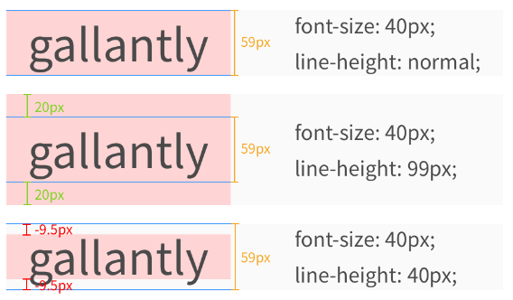


위 사진에 파란 줄 보이시죠? 이 파란 줄 사이가 실제 내용이 들어가 있는 'content area'(콘텐츠 영역)입니다. `font-family`와 `font-size`에 따라서 'content area'가 정해지고, `line-height`는 'content area'에 영향을 주지 않습니다.

`line-height`를 통해서는 각 줄이 실질적으로 차지하는 공간을 정해줄 수 있습니다. 예를 들어서 `99px`로 설정하면 'content area'보다 `40px`이 많기 때문에 위 아래로 `20px`의 공간이 추가로 생깁니다.

반대로 `40px`로 설정하면 'content area'보다 `19px`이 적기 때문에 위 아래로 `-9.5px`의 공간이 줄어듭니다.

#### HTML

```html
<p class="p1">gallantly</p>
<p class="p2">gallantly</p>
<p class="p3">gallantly</p>

<p class="p1">gallantly gallantly gallantly gallantly gallantly gallantly gallantly gallantly gallantly gallantly gallantly gallantly</p>
<p class="p2">gallantly gallantly gallantly gallantly gallantly gallantly gallantly gallantly gallantly gallantly gallantly gallantly</p>
<p class="p3">gallantly gallantly gallantly gallantly gallantly gallantly gallantly gallantly gallantly gallantly gallantly gallantly</p>
```

#### CSS

```css
p {
  font-size: 40px;
  color: white;
}

.p1 {
  background-color: red;
  line-height: normal;
}

.p2 {
  background-color: green;
  line-height: 80px;
}

.p3 {
  background-color: blue;
  line-height: 30px;
}
```

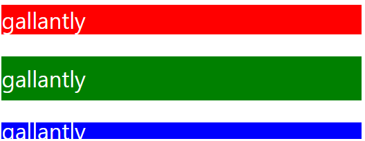

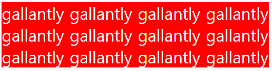

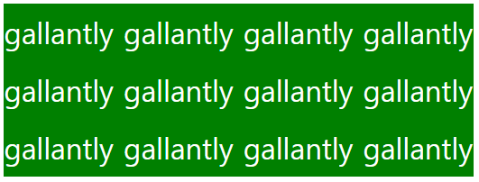

