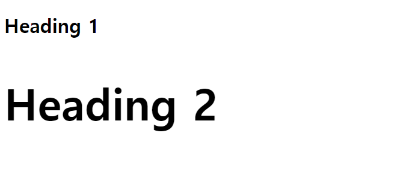
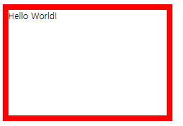

# CSS

> HTML에 담은 내용을 스타일 해준다.


## I. CSS 작성

> HTML 코드 안에 `<style>` `</style>` 태그 안에 써준다. 


```html
<!-- 여기에 html 코드 -->

<style>
/* 여기에 CSS 코드 */
</style>
```


## II. CSS의 기본 문법


### 1. 폰트 크기

> CSS에서 폰트 크기를 표현할 수 있는 단위 몇 가지가 있는데, 그 중 픽셀(`px`)이 가장 많이 사용됩니다.


#### Code

```html
<h1>Heading 1</h1>
<h2>Heading 2</h2>

<style>
h2 {
  font-size: 72px;
}
</style>
```


#### 출력



#### 픽셀

> HTML에서 무언가의 크기를 설정할 때는 기본적으로 '픽셀(`px`)' 단위를 사용합니다.
>
> 픽셀은 화면을 구성하는 기본 단위입니다. 아래 이미지를 보세요.


별 이미지의 일부를 확대해서 보니까 작은 정사각형 단위로 되어 있죠? 각 정사각형을 픽셀이라고 부릅니다. 만약 어떤 이미지의 가로 길이가 `100px`로 설정되었다면, 가로로 저 작은 정사각형 100개가 있다는 거죠.


### 폰트 크기

폰트 크기도 픽셀로 설정하는 경우가 많은데요. 폰트 크기가 `24px`로 설정되어 있으면 폰트의 세로 길이가 `24px`이라는 뜻입니다.


# 퍼센트

길이를 픽셀 말고 퍼센트(`%`)로 설정할 수도 있습니다.

```html


```


### 2. 텍스트 색

> 글에 색을 입히고 싶으면 `color` 속성을 사용하면 됩니다. CSS에서 색을 표현하는 방식 몇 가지가 있는데, 나중에 살펴보도록 합시다.


#### Code

```html
<h1>Heading 1</h1>
<h2>Heading 2</h2>
<h3>Heading 3</h3>

<style>
h1 {
  color: lime;
}

h2 {
  color: hotpink;
}

h3 {
  color: blue;
}
</style>
```


#### 출력


### 3. 여백

> `margin` 속성을 사용하면 요소 사이의 여백을 설정할 수 있습니다. 여백의 크기도 픽셀(`px`) 단위로 설정해주시면 됩니다.


#### Code

```html
<h1>Heading 1</h1>
<h2>Heading 2</h2>
<h3>Heading 3</h3>

<style>
h1 {
  margin-bottom: 80px;
}

h3 {
  margin-left: 50px;
}
</style>
```


#### 출력


### 4.이미지 정렬

```html
<style>
    img {
        display: block;
        margin-left: auto;
        margin-right: auto
    }
</style>
```


### 5. HTML 요소에 이름 붙이기

> - 클래스(Class)
> - 아이디(id)


#### 클래스(Class)

```Html
<p class="big-blue-text">First</p>
<p>Second</p>
<p class="big-blue-text">Third</p>
```


위의 코드에서 첫 번째 `p` 요소와 세 번째 `p` 요소는 `"big-blue-text"`라는 클래스 이름을 갖고 있습니다. 그러면 css에서 `.big-blue-text`에 스타일을 입혀주면 됩니다. 클래스 이름이라는 걸 나타내는 '`.`(마침표)'를 잊지 맙시다!


#### 아이디(id)

```html
<p id="favorite-text">First</p>
<p>Second</p>
<p>Third</p>
```


위의 코드에서 첫 번째 `p` 요소는 `"favorite-text"`라는 아이디를 갖고 있습니다. 그러면 css에서 `#favorite-text`에 스타일을 입혀주면 됩니다. 클래스 이름을 나타내기 위해 '`.`(마침표)'를 붙인 것처럼 아이디를 나타내기 위해서는 '`#`(샾 표시)'를 써줘야 합니다.


# 클래스 vs 아이디

클래스와 아이디. 얼핏 보기에는 똑같아 보이는데요. 핵심적인 차이점 몇 가지가 있습니다:

1. 같은 클래스 이름을 여러 요소가 가질 수 있지만, 같은 아이디를 여러 요소가 공유할 수는 없습니다.
2. 한 요소가 여러 클래스를 가질 수 있지만, 한 요소는 하나의 아이디만 가질 수 있습니다. (단, 한 요소가 클래스도 여러 개 갖고 아이디도 하나 가질 수 있습니다!)


## CSS 파일 따로 쓰기

> 동일한 내용으로 html을 style한 코드를 같이 쓰는 것은 피하자!
>
> 같은 내용의 style을 묶어서 html이 있는 폴더안에 폴더를 만들고 그안에 css 파일을 만든다.


```css
h1 {
    /* 요소에 대한 속성 */
    font-size: 64px;
}
    /* h3 위에 100px의 여백을 줌 */
h3 {
    margin-top: 100px;
}
        /* i tag의 글씨를 48px로 키워줌 */
        /* 모든 i tag의 글씨가 다 커짐 */
        /* 특정 태그 속 i tag의 글씨를 키우고 싶으면 i 앞에 태그를 써준다. */
p i {
    font-size: 48px;
}
.big-blue-text {
    font-size: 64px;
    color: blue;
}
.centered-text {
    text-align: center;
}
#best-text {
    color: orange;
}
.page {
    background-color: #eee;
    border-radius: 20px;
    margin-bottom: 50px;
    padding: 50px;
    width: 500px;
    margin-left: auto;
    margin-right: auto;
    text-align: center;
}
.page .page1 {
    color: blue;
}
.page .page2 {
    color: red;
}
.page .page3 {
    color: orange;
}
.image {
    display: block;
    margin-left: auto;
    margin-right: auto;
    margin-top: 40px;
    margin-bottom: 40px;
}
```

```html
<head> 
        <title>My First Website</title>
        <meta charset = "utf-8">
    	/* style 코드가 들어있는 css파일의 경로를 링크해주면 된다. */
        <link href = "css/styles.css" rel = "stylesheet">
    </head>
```


#### link 태그 rel  = "속성값"

____

> rel 속성은 <link> 요소에 반드시 명시되어야 하는 필수 속성입니다.


# 스타일을 적용하는 방법

>HTML 코드에 스타일을 입히는 방법에는 세 가지가 있습니다.


- ### `<style>` 태그

  ```html
  <style>
    h1 {
      color: green;
      text-align: center;
    }
  
    p {
      font-size: 18px;
    }
  </style>
  
  <h1>Hello World!</h1>
  <p>Lorem ipsum dolor sit amet, consectetur adipiscing elit. Quisque sit amet lorem sit amet nunc ornare convallis. Pellentesque ac posuere lectus. In eu ipsum et quam finibus fermentum vitae sit amet magna.</p>
  ```

  

- ### style 속성

  ```html
  <h1 style="color: green; text-align: center;">Hello World!</h1>
  <p style="font-size: 18px;">Lorem ipsum dolor sit amet, consectetur adipiscing elit. Quisque sit amet lorem sit amet nunc ornare convallis. Pellentesque ac posuere lectus. In eu ipsum et quam finibus fermentum vitae sit amet magna.</p>
  ```

  ​    

- ### 3. 외부 CSS 파일 + <link> 태그

  #### CSS 파일

  ```css
  h1 {
    color: green;
    text-align: center;
  }
  
  p {
    font-size: 18px;
  }
  ```

  #### html 파일

  ```html
  <link href="css/styles.css" rel="stylesheet">
  
  <h1>Hello World!</h1>
  <p>Lorem ipsum dolor sit amet, consectetur adipiscing elit. Quisque sit amet lorem sit amet nunc ornare convallis. Pellentesque ac posuere lectus. In eu ipsum et quam finibus fermentum vitae sit amet magna.</p>
  ```


# 어떤 방법을 써야 할까?

일반적으로는 외부 CSS 파일에 스타일을 쓰고 HTML 코드에서 `<link>` 태그로 연결해주는 것이 가장 좋은 방식입니다. 하지만 조금씩 새로운 스타일을 시도해볼 때에는 간편함을 위해서 `<style>`태그를 쓰는 방법 또는 `style` 속성에서 테스트를 하고, 나중에 외부 CSS 파일로 옮기는 방법도 있습니다!

  

#### 외부 CSS 파일을 작성하고 link 태그로 연결하는 것

**추천이유?**

- 정리 정돈
  - html 파일에는 html 파일만 있고 css 파일에는 딱 css 코드만 있다.
- 외부 파일 이용시
  - 링크 태그만으로 깔끔하게 정리 가능


# CSS 코멘트

> `/* 내용 */`의 형태로 되어 있는 부분이 CSS의 '코멘트(comment)'입니다.


```css
/* 영화 제목 */
.movie h2 {
  color: #4d9fff;
  text-align: center;
  font-size: 48px;
}

/* 영화 줄거리 */
.movie p {
  font-size: 24px;
}
```


# 정리

코멘트는 사실 브라우저가 무시하기 때문에 실제 결과물인 사이트에 반영이 되지 않습니다. 하지만 복잡한 부분들을 설명함으로써 지저분해 보일 수 있는 코드를 정리해주는 중요한 역할을 합니다.

몇 년 뒤에 자신이 쓴 코드를 확인했을 때, 또는 동료 개발자에게 코드를 보여줬을 때 코멘트로 설명이 잘 되어 있어야 이해하기 쉽겠죠?


## 도움이 되는 사이트

> 구글에 text decoration  검색
>
> - W3Schools : CSS 스타일 정보
> - stackoverflow.com : 세계에서 가장 큰 프로그래밍 포럼
> - jsfiddle.net : 간단하게 코드를 작성할 수 있는 사이트, 저장을 하면 내용이 링크로 저장되기 때문에 질문코드 질문할때 유용


## 텍스트 색

> 텍스트의 색을 지정해주기 위해서는 `color` 속성을 사용, CSS에서 색을 표현하는 방식이 세 가지가 있다.
>
> - 색 이름
> - RGB 값
> - HEX 값(16 진법) 
>
> 위 RGB값과 HEX 값은 www.htmlcolorcodes.com 참고


# 색 이름

[CSS에서 정해준 색 이름](https://www.w3schools.com/cssref/css_colors.asp) 중 하나를 쓰는 방법이 있습니다. 모든 색이 있지는 않지만, 무려 140개의 색이 대부분 브라우저에서 지원된다고 하네요!

```css
h1 {
  color: blue;
}
```


# RGB 값

모든 색은 빨강(Red), 초록(Green), 파랑(Blue)의 조화로 표현할 수 있습니다. 이 표현 방식이 바로 'RGB'입니다. [이런 사이트](https://htmlcolorcodes.com/color-picker/)에서 원하는 색을 찾아보세요.

```css
h1 {
  color: rgb(83, 237, 65);
}
```


# HEX 값 (16진법)

HEX 값은 단순히 RGB 값을 16진법으로 표현한 방식입니다. `83`는 16진법으로 `53`이고, `237`는 16진법으로 `ED`이고, `65`는 16진법으로 `41`입니다. 따라서 `rgb(83, 237, 65)`는 `#53ED41`과 같은 거죠.


```css
h1 {
  color: #53ED41;
}
```


# 폰트 굵기 설정

> 폰트 굵기를 설정하기 위해서는 `font-weight` 속성을 사용하면 됩니다.


## 사용법

사용 가능한 값은 얇은 순서로 `100`, `200`, `300`, `400`, `500`, `600`, `700`, `800`, `900`입니다. `100`이 가장 얇고, `900`이 가장 굵다는 뜻이죠.


```css
/*참고로 font-weight: normal;은 font-weight: 400과 똑같고, 
font-weight: bold;는 font-weight: 700과 똑같습니다!*/

#p1 {
  font-weight: 400;
}

#p2 {
  font-weight: 700;
}

#p3 {
  font-weight: normal;
}

#p4 {
  font-weight: bold;
}
```


# 주의 사항

`150`, `230`과 같은 값은 사용할 수 없습니다. 만약 사용한다면 그냥 기본값으로 설정됩니다.

또 주의할 점이 있습니다. 폰트나 브라우저에 따라서 지원하는 폰트 굵기 값이 다릅니다. 어떤 폰트는 `100`, `400`, `700`만 지원될 수도 있다는 뜻이죠. 잘 확인하고 사용하시길 바랍니다!


# 텍스트 정렬

> `text-align` 속성을 사용하면 텍스트를 왼쪽, 오른쪽, 또는 가운데로 정렬할 수 있습니다.


```css
#p1 {
  color: red;
  text-align: left;
}

#p2 {
  color: green;
  text-align: right;
}

#p3 {
  color: blue;
  text-align: center;
}

```


# 태그 정렬

> `<p>` 태그나 헤더 태그들 뿐만 아니라 `<div>` 태그의 내용물도 정렬을 할 수 있습니다!

```html
<div class="navigation">
  <a href="#">Menu 1</a> <a href="#">Menu 2</a> <a href="#">Menu 3</a>
</div>
```

```css
.navigation {
  text-align: center;
}
```


# 텍스트 꾸미기

> `text-decoration`을 사용하면 텍스트를 몇 가지 방법으로 꾸밀 수 있습니다. 사실 옵션도 몇 가지 없고 딱히 예쁘지도 않지만 한 번 살펴봅시다.


# Underline

`underline` 값을 사용하면 밑줄이 그어집니다.

```css
h1 {
  text-decoration: underline;
}
```


# Overline

`overline` 값을 사용하면 글 위에 줄이 그어집니다.

```css
h1 {
  text-decoration: overline;
}
```


# Line-through

`line-through` 값을 사용하면 줄이 글을 관통합니다.

```css
h1 {
  text-decoration: line-through;
}
```


# None

`none` 값을 사용하면 아무 줄도 없습니다. **이게 기본 값입니다!**

```css
h1 {
  text-decoration: none;
}
```


### `<a>` 태그와 사용

사실 제가 `text-decoration`을 가장 많이 사용하는 경우는 텍스트를 꾸미기 위해서가 아니라 꾸밈을 없애기 위해서입니다. `` 태그는 기본적으로 밑줄이 그어져 있는데, 이걸 없애기 위해서 `text-decoration: none;`을 사용합니다.

#### HTML

```html
<a href="https://www.codeit.kr">구글로 가는 링크</a>
<a class="no-decoration" href="https://www.google.com" target="_blank">구글로 가는 링크</a>
```

#### CSS

```css
.no-decoration {
  text-decoration: none;
}
```


### 참고 a 태그 정렬하는 법

> a태그는 태그 텍스트 자체가 차지하는 공간이 텍스트 크기만큼이라 정렬이 안된다.
>
> `<div>`태그안에 a태그 내용을 넣고 정렬하면 된다.


```html
<div class = "site">
    <a href = "https://www.naver.com" target = "_blank">구글로 가는 링크</a>
</div>
```

```css
.site {
    text-align: center;
}
```


# 텍스트의 크기 설정 방법

> - Absolute(절대적 방법) : px, pt
> - Relative(상대적 방법) : em(100% = 1em), %


절대적 방법은 정해준 부모 요소와 무관하게 정해준 px, pt의 크기만큼 보여진다.

상대작 방법은 200%라고 설정해 주게 되면 부모 요소의 크기의 2배의 크기로 보여지게 된다.


# Line-height

> `line-height`를 사용하면 줄간격을 조절할 수 있습니다. 사실 `line-height` 속성을 '완벽하게' 이해하려면 타이포그래피 지식이 조금 필요한데요. 우선은 아주 간단하게만 설명드리겠습니다.


위 사진에 파란 줄 보이시죠? 이 파란 줄 사이가 실제 내용이 들어가 있는 'content area'(콘텐츠 영역)입니다. `font-family`와 `font-size`에 따라서 'content area'가 정해지고, `line-height`는 'content area'에 영향을 주지 않습니다.

`line-height`를 통해서는 각 줄이 실질적으로 차지하는 공간을 정해줄 수 있습니다. 예를 들어서 `99px`로 설정하면 'content area'보다 `40px`이 많기 때문에 위 아래로 `20px`의 공간이 추가로 생깁니다.

반대로 `40px`로 설정하면 'content area'보다 `19px`이 적기 때문에 위 아래로 `-9.5px`의 공간이 줄어듭니다.

#### HTML

```html
<p class="p1">gallantly</p>
<p class="p2">gallantly</p>
<p class="p3">gallantly</p>

<p class="p1">gallantly gallantly gallantly gallantly gallantly gallantly gallantly gallantly gallantly gallantly gallantly gallantly</p>
<p class="p2">gallantly gallantly gallantly gallantly gallantly gallantly gallantly gallantly gallantly gallantly gallantly gallantly</p>
<p class="p3">gallantly gallantly gallantly gallantly gallantly gallantly gallantly gallantly gallantly gallantly gallantly gallantly</p>
```

#### CSS

```css
p {
  font-size: 40px;
  color: white;
}

.p1 {
  background-color: red;
  line-height: normal;
}

.p2 {
  background-color: green;
  line-height: 80px;
}

.p3 {
  background-color: blue;
  line-height: 30px;
}
```


# 폰트 설정

> 다양한 폰트를 설정할 수 있다.


- Serif : Times New Roman, 궁서체 끝처리가 약간 휘어져 있는것이 특징
- Sans-Serif : Arial, 굴림체 깔끔한 디자인에 좋은 폰트
- Monospace: Courier, Courier New 모든 글자가 같은 너비를 차지한다. 프로그래밍용으로 좋다.
- Cursive : Comic Sans MS, Monotype Corsiva  필기체
- Fantasy : Impact, Haettenschweiler 특이한 나머지 폰트를 포함


### 1. 폰트 설정 방법

```css
.div1 {
    font-size: 24px;
    font-family: "Times New Roman";
}
```


### 주의! 폰트가 컴퓨터에 없을 수도 있다.

> 이를 대비해서 제2의 폰트를 설정해 줄 수 있다.

```css
.div1 {
    font-size: 24px;
    /* 브라우저는 Times New Roman을 먼저 찾고 없으면 Times를 찾는다. */
    /* 제1의 폰트, 제2의 폰트를 설정해주고 둘다 없을 경우를 대비해 마지막 폰트 종류를 써준다.*/
   	/* 폰트 둘다 없으면 serif 폰트 중 하나를 사용한다. */
    font-family: "Times New Roman", "Times", serif;
}
```


### 2. 설치되지 않은 폰트 사용법


#### 1) 웹 폰트 사용하기

> Google font: https://fonts.google.com

#### HTML

```html
<link href = "<link href="https://fonts.googleapis.com/css?family=Nanum+Gothic|Roboto&display=swap" rel="stylesheet">"
```

#### CSS

```css
.div2 {
    font-size: 200%;
    font-family: 'Roboto', sans-serif;
}
.div3 {
    font-size: 200%;
    font-family: 'Nanum Gothic', cursive;
}
```


### 만약 한글 폰트 사용하고 싶다면?

Google font: https://fonts.google.com/earlyaccess에서 korean 검색해서 사용!


#### 2) 폰트 파일 사용하기

다운로드한 폰트 파일을 폴더안에 넣고 경로를 써준다.

```css
@font-face{
    src: url("../fonts/BMJUA_ttf.ttf");
    /* 사용할 폰트 이름을 써준다. */
    font-family: "BmJua";
}
```

```css
.div3 {
    font-size: 200%;
    font-family: "BmJua", cursive;
}
```


# Box Model

> 모든 HTML 요소는 직사각형 Box 형태를 띄고 있다.


# Padding과 Margin의 차이

Padding과 Margin은 쉽게 헷갈릴 수 있는 개념입니다. 차이를 정확히 집고 넘어갑시다!

요소는 내용(content), 패딩(padding), 테두리(border)로 이루어져 있습니다. Padding은 내용과 테두리 사이의 '여유 공간'입니다. 반면에 Margin은 요소 주위의 여백입니다. 즉, 테두리 밖의 공간인 셈이죠.


# Padding

Padding을 주는 방법에는 몇 가지가 있습니다.

### 가장 직관적인 방법

우선 가장 직관적인 방법입니다:

```css
p {
  border: 1px solid blue;
  padding-top: 20px;
  padding-bottom: 40px;
  padding-left: 120px;
  padding-right: 60px;
}
```


### 한 줄에

한 줄에 쓰고 싶으면 `padding` 속성을 쓰면 되는데요. 순서는 위(`padding-top`)부터 시계 방향으로 하나씩 쓰면 됩니다.

```css
p {
  padding: 위 오른쪽 아래 왼쪽;
}
```

그러니까 위의 코드와 똑같이 쓰기 위해서는 이렇게 하면 되는 거죠:

```css
p {
  border: 1px solid blue;
  padding: 20px 60px 40px 120px;
}

```

### 위, 아래, 왼쪽, 오른쪽이 다 같은 경우

만약 위, 아래, 왼쪽, 오른쪽에 똑같은 padding을 주고 싶으면 더 간편합니다. 모두 `50px`의 padding을 주려면 이렇게 하면 됩니다:

```css
p {
  border: 1px solid blue;
  padding: 50px;
}
```

### 위, 아래가 같고, 왼쪽, 오른쪽이 같은 경우

위, 아래에 `50px`의 padding을 주고, 왼쪽, 오른쪽에 `100px`의 padding을 주려면 이렇게 하면 됩니다:

```css
p {
  border: 1px solid blue;
  padding: 50px 100px;
}
```

# Margin

요소에게 margin을 주는 방법은 padding을 주는 방법과 똑같습니다.

### 가장 직관적인 방법

```css
p {
  border: 1px solid blue;
  margin-top: 50px;
  margin-bottom: 40px;
  margin-left: 200px;
  margin-right: 60px;
}
```

### 한 줄에

```css
p {
  margin: 위 오른쪽 아래 왼쪽;
}
```

그러니까 위의 코드와 똑같이 쓰기 위해서는 이렇게 하면 되는 거죠:

```css
p {
  margin: 50px 60px 40px 200px;
}
```

### 위, 아래, 왼쪽, 오른쪽이 다 같은 경우

```css
p {
  margin: 50px;
}
```

### 위, 아래가 같고, 왼쪽, 오른쪽이 같은 경우

```css
p {
  margin: 50px 70px;
}
```

### 가운데 정렬

요소를 가운데 정렬하고 싶으면 왼쪽과 오른쪽 `margin` 값을 `auto`로 설정해줘야 합니다. `auto`는 말 그대로 '자동으로 계산'하라는 뜻인데요. 왼쪽과 오른쪽을 `auto`로 설정하면 자동으로 왼쪽과 오른쪽을 똑같이 함으로써 요소는 가운데 정렬이 됩니다.

```css
p {
  border: 1px solid blue;
  width: 500px;
  margin-left: auto;
  margin-right: auto;
}
```


# 가로 길이, 세로 길이

### 텍스트

요소의 가로 길이(width)와 세로 길이(height)를 설정해봅시다.

```css
p {
  border: 1px solid blue;
  width: 400px;
  height: 300px;
}
```

### 이미지

사진의 크기도 똑같이 css에서 설정할 수 있습니다.

```css
.bond-img {
  width: 400px;
  height: 300px;
}

```

# 최소, 최대 가로 길이

`min-width`, `max-width`로 요소의 최소, 최대 가로 길이를 설정할 수 있습니다.

```css
.p1 {
  border: 1px solid blue;
  max-width: 1000px;
}

.p2 {
  border: 1px solid red;
  max-width: 200px;
}

.p3 {
  border: 1px solid blue;
  min-width: 2000px;
}

.p4 {
  border: 1px solid red;
  min-width: 200px;
}

```

# 최소, 최대 세로 길이

`min-height`, `max-height`로 요소의 최소, 최대 세로 길이를 설정할 수 있습니다.

```css
.p1 {
  border: 1px solid blue;
  min-height: 400px;
}

.p2 {
  border: 1px solid red;
  min-height: 200px;
}

.p3 {
  border: 1px solid blue;
  max-height: 1000px;
}

.p4 {
  border: 1px solid red;
  max-height: 50px;
}
```


# Overflow

> `width`, `height`, `max-width`, `max-height` 등을 설정하다 보면 내용물이 들어갈 공간이 부족한 경우가 있습니다.

```css
p {
  border: 1px solid blue;
  width: 300px;
  height: 200px;
}
```

이렇게 넘쳐나는 내용물을 `overflow` 속성으로 처리해줄 수 있는데요. 몇 가지 옵션이 있습니다.

# 옵션 1: visible

`visible` 값을 사용하면 넘쳐나는 내용물이 그대로 보입니다. 따로 설정해주지 않으면 이게 기본값입니다!

```css
p {
  border: 1px solid blue;
  width: 300px;
  height: 200px;
  overflow: visible;
}

```


# 옵션 2: hidden

`hidden` 값을 사용하면 넘쳐나는 부분을 아예 숨겨줄 수도 있습니다.

```css
p {
  border: 1px solid blue;
  width: 300px;
  height: 200px;
  overflow: hidden;
}
```


# 옵션 3: scroll

내용물을 숨겼다가, 사용자가 스크롤을 하면 볼 수 있게 해주는 방법도 있습니다!

```css
p {
  border: 1px solid blue;
  width: 300px;
  height: 200px;
  overflow: scroll;
}
```


# 옵션 4: auto

`scroll`과 거의 똑같은데, 한 가지 차이점이 있습니다. `scroll`은 **항상** 스크롤바를 보여주고, `auto`는 **내용물이 넘쳐날 때만** 스크롤바를 보여줍니다.

참고로 Mac OS에서는 스크롤을 할 때만 스크롤바를 보여주는 경향이 있기 때문에 `scroll`과 `auto`의 차이를 보기 힘들 수도 있습니다.

```css
p {
  border: 1px solid blue;
  width: 300px;
  height: 200px;
  overflow: auto;
}
```


# Border

> 다른 속성들과 마찬가지로, 테두리를 설정해주는 방법도 다양합니다.


# 한 줄에 끝내기

가장 일반적인 방법은 `border` 속성으로 한 줄에 다 쓰는 것입니다. 이 방식을 사용하면 위, 아래, 왼쪽, 오른쪽 모두 같은 테두리가 생깁니다. 값을 쓰는 순서는 굵기, 스타일(실선, 점선 등), 색입니다.

```css
.p1 {
  border: 2px solid #4d9fff;
}

.p2 {
  border: 2px dotted #4d9fff;
}

.p3 {
  border: 2px dashed #4d9fff;
}

```


# 명확하게 나누기

다른 방법은 `border-style`, `border-color`, `border-width` 속성을 써서 테두리의 스타일을 하나씩 지정해주는 것입니다.

```css
.p1 {
  border-style: dotted;
  border-color: red;
  border-width: 5px;
}
```


# 다채로운 테두리

지금까지는 4면의 테두리가 모두 같았는데, 다 다르게 설정해주고 싶으면 이렇게 하면 됩니다:

```css
.p1 {
  border-top: 3px dotted #4d9fff;
  border-bottom: 2px dashed red;
  border-left: 5px solid green;
}
```


# 테두리 없애기

어떤 요소들(예: `<input>` 태그)은 기본적으로 테두리가 설정되어 있습니다. 이런 요소들의 테두리를 없애고 싶으면 직접 `border` 속성을 설정해주면 되는데요. 두 가지 방법이 있습니다:

1. `border: none;`
2. `border: 0;`


# 둥근 모서리

> `border-radius`라는 속성을 사용하면 요소의 모서리를 둥글게 만들 수 있습니다. 더 큰 값을 쓰면 더 둥글게 되는 거죠!

```css
.div1 {
  border: 1px solid green;
  border-radius: 5px;
  margin-bottom: 20px;
}

.div2 {
  border: 1px solid green;
  border-radius: 30px;
}
```

# 개별 설정

그냥 `border-radius` 속성을 사용하면 모서리 네 개 모두 똑같이 둥글게 되는데요. 각 모서리를 개별 설정할 수도 있습니다.

```css
h1 {
  border: 1px solid green;
  border-top-left-radius: 50px; /* 왼쪽 위 */
  border-top-right-radius: 5px; /* 오른쪽 위 */
  border-bottom-right-radius: 0px; /* 오른쪽 아래 */
  border-bottom-left-radius: 20px; /* 왼쪽 아래 */
}

```


# 배경색

> `background-color` 속성을 사용하면 배경색을 설정할 수 있습니다. 폰트 색을 설정할 때처럼 색 이름, RGB 코드, HEX 코드 중 하나를 입력하면 됩니다.


```css
h1 {
  background-color: #4d9fff;
}
```


### 페이지 배경색

페이지 전체의 배경색을 설정하고 싶으면 `body` 태그에 `background-color` 속성을 입혀주면 됩니다.

그리고 배경색을 투명하게 두고 싶으면 `transparent` 값으로 설정해주면 되는데, 따로 설정을 해주지 않으면 `transparent`가 기본값으로 설정됩니다!


```css
body {
  background-color: #4d9fff;
}

h1 {
  background-color: white;
}

h2 {
  background-color: transparent
}
```


# 그림자

> 요소에 그림자를 주기 위해서는 `box-shadow` 속성을 사용하면 되는데요. 기본값은 `none`입니다. 그림자가 없다는 뜻이죠.


```css
.div1 {
  background-color: #eeeeee;
  width: 400px;
  height: 300px;
  box-shadow: none;
}
```


# 그림자 추가

### 위치 설정

그림자의 위치만 설정해주면 그림자가 나타납니다. 가로 위치와 세로 위치를 설정해줍시다.


```css
.div1 {
  background-color: #eeeeee;
  width: 400px;
  height: 300px;
  box-shadow: 40px 10px;
}
```

### 그림자 색 설정

위의 예시를 보시면 그림자가 검정색이죠? 따로 설정해주지 않으면 그림자는 검정색입니다. 만약 다른 색으로 바꾸고 싶으면 `box-shadow`속성에 추가로 색을 써주면 됩니다.

```css
.div1 {
  background-color: #eeeeee;
  width: 400px;
  height: 300px;
  box-shadow: 40px 10px #4d9fff;
}
```

### 흐림 정도 (blur)

`box-shadow` 속성에서 그림자가 얼마나 흐리게 나올지 설정해줄 수 있습니다. 가로, 세로 위치 뒤에 추가해주면 되는데요. 기본값은 `0px`입니다.

```css
.div1 {
  background-color: #eeeeee;
  width: 400px;
  height: 300px;
  box-shadow: 40px 10px 10px #4d9fff;
}
```

### 그림자 크기 (spread)

그림자가 얼마나 퍼질지도 설정할 수 있습니다. 흐림 값 이후에 써주면 됩니다.

```css
.div1 {
  background-color: #eeeeee;
  width: 400px;
  height: 300px;
  box-shadow: 40px 10px 10px 20px #4d9fff;
}
```


# Box-sizing

#### HTML

```html
<div class="div1">Hello World!</div>
<div class="div2">Hello World!</div>
```

#### CSS

```css
<div class="div1">Hello World!</div>
<div class="div2">Hello World!</div>
```




`.div1`과 `.div2`의 `width`와 `height`를 똑같이 설정해줬는데, 결과물을 보면 크기가 서로 다르네요. 그 이유는 `width`와 `height`가 테두리(border)와 패딩(padding)을 뺀 내용물(content)의 크기만 나타내기 때문입니다.

따라서 `.div1`의 실제 가로 길이는 테두리까지 포함한 `320px`, 세로 길이는 테두리까지 포함한 `220px`인 거죠. 반면 `.div2`의 실제 가로 길이는 테두리와 패딩까지 포함한 `400px`, 세로 길이는 `300px`입니다.

실제 가로, 세로 크기가 `300px`, `200px`이기 위해서는 테두리와 패딩을 고려해서 계산을 해줘야 한다는 불편함이 있습니다.

# 해결책: box-sizing

다행히 CSS3부터는 `box-sizing` 속성을 사용하면 이 문제를 해결할 수 있습니다. 따로 설정해주지 않으면 `box-sizing`의 기본값은 `content-box`인데, 이걸 `border-box`로 바꿔봅시다.

```css
.div1 {
  box-sizing: border-box;
  border: 10px solid red;
  width: 300px;
  height: 200px;
  margin-bottom: 50px;
}

.div2 {
  box-sizing: border-box;
  border: 10px solid red;
  width: 300px;
  height: 200px;
  padding: 40px;
}
```

`box-sizing` 속성을 `border-box` 값으로 설정해주면 `width`와 `height`는 테두리와 패딩과 내용물을 모두 포함한 길이가 됩니다. 따라서 더 이상 귀찮은 계산을 할 필요가 없는 거죠!

### 더 간편하게!

`box-sizing` 속성을 사용하면 너무 편하다 보니, 요즘 많은 개발자들이 **모든** 요소에 `box-sizing: border-box;`를 써주는 추세입니다. 이걸 간편하게 한 번에 처리하기 위해서는 모든 요소를 나타내는 `*`에 속성을 써주면 되겠죠?

```css
* {
  box-sizing: border-box;
}

.div1 {
  border: 10px solid red;
  width: 300px;
  height: 200px;
  margin-bottom: 50px;
}

.div2 {
  border: 10px solid red;
  width: 300px;
  height: 200px;
  padding: 40px;
}
```

배경 이미지에는 여러가지 설정이 가능합니다. 아래의 세 가지 속성을 좀 더 자세히 살펴봅시다.


# background-repeat

`background-repeat`는 이미지를 반복시킬 것인지 아닐 것인지, 그리고 반복시킨다면 어떤 방식으로 반복시킬 것인지 정해주는 속성입니다. 여기에는 우리가 배운 `repeat`, `no-repeat` 외에도 다양한 옵션이 있습니다.

```css
/* 반복하지 않음 */
background-repeat: no-repeat;

/* 가로 방향으로만 반복 */
background-repeat: repeat-x;

/* 세로 방향으로만 반복 */
background-repeat: repeat-y;

/* 가로와 세로 모두 반복 */
background-repeat: repeat;

/* 반복할 수 있는 만큼 반복한 뒤, 남는 공간은 이미지 간의 여백으로 배분 */
background-repeat: space;

/* 반복할 수 있는 만큼 반복한 뒤, 남는 공간은 이미지 확대를 통해 배분 */
background-repeat: round;
```

- HTML

```html
<!DOCTYPE html>
<html>
<head>
  <title>background-repeat</title>
  <meta charset="utf-8">
  <link rel="stylesheet" href="css/styles.css">
</head>
<body>

    <div id="div1">
    </div>

    <div id="div2">
    </div>

    <div id="div3">
    </div>

    <div id="div4">
    </div>

    <div id="div5">
    </div>

    <div id="div6">
    </div>

</body>
</html>
```

- CSS

```css
ody {
  background-color: gray;
}

div {
  width: 300px;
  height: 230px;
  border: 2px solid white;
  background-image: url("https://i.imgur.com/WxH5bez.png");
  margin: 30px;
}

#div1 {
  /* 반복하지 않음 */
  background-repeat: no-repeat;
}

#div2 {
  /* 가로 방향으로만 반복 */
  background-repeat: repeat-x;
}

#div3 {
  /* 세로 방향으로만 반복 */
  background-repeat: repeat-y;
}

#div4 {
  /* 가로와 세로 모두 반복 */
  background-repeat: repeat;
}

#div5 {
  /* 반복할 수 있는 만큼 반복한 뒤, 남는 공간은 이미지 간의 여백으로 배분 */
  background-repeat: space;
}

#div6 {
  /* 반복할 수 있는 만큼 반복한 뒤, 남는 공간은 이미지 확대를 통해 배분 */
  background-repeat: round;
}
```


# background-size

`background-size`는 배경 이미지의 사이즈를 정해주는 속성입니다.

```css
/* 원래 이미지 사이즈대로 출력 */
background-size: auto;

/* 화면을 꽉 채우면서, 사진 비율을 유지 */
background-size: cover;

/* 가로, 세로 중 먼저 채워지는 쪽에 맞추어서 출력 */
background-size: contain;

/* 픽셀값 지정 (가로: 30px, 세로: 50px로 설정) */
background-size: 30px 50px;

/* 퍼센트값 지정 (가로: 부모 요소 width의 60%, 세로: 부모 요소 height의 70%로 설정) */
background-size: 60% 70%;
```

- HTML

```html
<!DOCTYPE html>
<html>
<head>
  <title>background-size</title>
  <meta charset="utf-8">
  <link rel="stylesheet" href="css/styles.css">
</head>
<body>

    <div id="div1">
    </div>

    <div id="div2">
    </div>

    <div id="div3">
    </div>

    <div id="div4">
    </div>

    <div id="div5">
    </div>

    <div id="div6">
    </div>

    <div id="div7">
    </div>

</body>
</html>
```

- CSS

```css
body {
  background-color: gray;
}

div {
  width: 300px;
  height: 230px;
  border: 2px solid white;
  background-image: url("https://i.imgur.com/WxH5bez.png");
  margin: 30px;
  background-repeat: no-repeat;
}

#div1 {
  /* 원래 이미지 사이즈대로 출력 */
  background-size: auto;
}

#div2 {
  /* 화면을 꽉 채우면서, 사진 비율을 유지 */
  background-size: cover;
}

#div3 {
  /* 가로, 세로 중 먼저 채워지는 쪽에 맞추어서 출력 */
  background-size: contain;
}

#div4 {
  /* 픽셀값 지정 (가로: 150px, 세로: 10px로 설정) */
  background-size: 150px 10px;
}

#div5 {
  /* 픽셀값 지정 (가로: 200px, 세로: 200px로 설정) */
  background-repeat: 200px 200px;
}

#div6 {
  /* 퍼센트값 지정 (가로: 부모 요소 width의 50%, 세로: 부모 요소 height의 50%로 설정) */
  background-size: 50% 50%;

}

#div7 {
  /* 퍼센트값 지정 (가로: 부모 요소 width의 30%, 세로: 부모 요소 height의 100%로 설정) */
  background-size: 30% 100%;
}
```


# background-position

`background-position`은 배경 이미지의 위치를 정해주는 속성입니다.

```css
/* 단어로 지정해주기 (가로: left, center, right, 세로: top, center, bottom) */
/* 아래와 같은 총 9개의 조합이 가능 */
background-position: left top;
background-position: left center;
background-position: left bottom;
background-position: right top;
background-position: right center;
background-position: right bottom;
background-position: center top;
background-position: center center;
background-position: center bottom;

/* 퍼센트로 지정해주기 (가로: 전체 width의 25% 지점, 세로: 전체 height의 75% 지점 ) */
background-position: 25% 75%;

/* 픽셀로 지정하기 (가로: 가장 왼쪽 가장자리에서부터 오른쪽으로 100px 이동한 지점, 세로: 가장 상단 가장자리에서 아래로 200px 이동한 지점) */
background-position: 100px 200px;
```


- HTML

```html
<!DOCTYPE html>
<html>
<head>
  <title>background-position</title>
  <meta charset="utf-8">
  <link rel="stylesheet" href="css/styles.css">
</head>
<body>

    <div id="div1">
    </div>

    <div id="div2">
    </div>

    <div id="div3">
    </div>

    <div id="div4">
    </div>

    <div id="div5">
    </div>

    <div id="div6">
    </div>

    <div id="div7">
    </div>

    <div id="div8">
    </div>

</body>
</html>
```

- CSS

```css
body {
  background-color: gray;
}

div {
  width: 300px;
  height: 230px;
  border: 2px solid white;
  background-image: url("https://i.imgur.com/WxH5bez.png");
  margin: 30px;
  background-repeat: no-repeat;
}

#div1 {
  /* 단어로 지정해주기 (가로: 왼쪽, 세로: 상단) */
  background-position: left top;
}

#div2 {
  /* 단어로 지정해주기 (가로: 왼쪽, 세로: 센터) */
  background-position: left center;
}

#div3 {
  /* 단어로 지정해주기 (가로: 센터, 세로: 상단) */
  background-position: center top;
}

#div4 {
  /* 단어로 지정해주기 (가로: 오른쪽, 세로: 하단) */
  background-position: right bottom;
}

#div5 {
  /* 퍼센트로 지정해주기 (가로: 전체 width의 25% 지점, 세로: 전체 height의 75% 지점 ) */
  background-position: 25% 75%;
}

#div6 {
  /* 퍼센트로 지정해주기 (가로: 전체 width의 50% 지점, 세로: 전체 height의 100% 지점 ) */
  background-position: 50% 100%;

}

#div7 {
  /* 픽셀로 지정하기 (가로: 가장 왼쪽 가장자리에서부터 오른쪽으로 10px 이동한 지점, 세로: 가장 상단 가장자리에서 아래로 200px 이동한 지점) */
  background-position: 10px 200px;
}

#div8 {
  /* 픽셀로 지정하기 (가로: 가장 왼쪽 가장자리에서부터 오른쪽으로 150px 이동한 지점, 세로: 가장 상단 가장자리에서 아래로 20px 이동한 지점) */
  background-position: 150px 20px;
}
```


# 선택자

> CSS에서 스타일링 해줄 요소는 '선택자'로 결정합니다.
>
> 우리가 이미 알고 있는 것들부터 시작해서, 또 어떤 선택자들이 있는지 살펴봅시다!


# 태그 이름

```css
/* 모든 <h1> 태그 */
h1 {
  color: orange;
}
```

# 클래스/아이디

```css
/* 'important'라는 클래스를 갖고 있는 모든 태그 */
.important {
  color: orange;
}

/* 'favorite'라는 아이디를 갖고 있는 태그 */
#favorite {
  color: blue;
}
```

# 자식 (children)

```css
/* 'div1' 클래스를 갖고 있는 요소의 자식 중 모든 <i> 태그 */
.div1 i {
  color: orange;
}
```

# 직속 자식 (direct children)

```css
/* 'div1' 클래스를 갖고 있는 요소의 직속 자식 중 모든 <i> 태그 */
.div1 > i {
  color: orange;
}
```

# 복수 선택

```css
/* 'two' 클래스를 가지고 있는 태그 모두와 'four' 클래스를 가지고 있는 태그 모두 선택 */
.two, .four {
  color: orange;
}
```

# 여러 조건

```css
/* 'outside' 클래스를 갖고 있으면서 'one' 클래스도 갖고 있는 태그 */
.outside.one {
  color: blue;
}

/* 'inside' 클래스를 갖고 있으면서 'two' 클래스도 갖고 있는 태그 */
.inside.two {
  color: orange;
}
```

# Pseudo-class (가상 클래스)

콜론(`:`)을 사용하면 몇 가지 '가상 클래스'를 선택할 수 있습니다.

### n번째 자식

```css
/* .div1의 자식인 <p> 태그 중 3번째 */
.div1 p:nth-child(3) {
  color: blue;
}

/* .div1의 자식인 <p> 태그 중 첫 번째 */
.div1 p:first-child {
  color: red;
}

/* .div1의 자식인 <p> 태그 중 마지막 */
.div1 p:last-child {
  color: green;
}

/* .div1의 자식 중 마지막 자식이 아닌 <p> 태그 */
.div1 p:not(:last-child) {
  font-size: 150%;
}

/* .div1의 자식 중 첫 번째 자식이 아닌 <p> 태그 */
.div1 p:not(:first-child) {
  text-decoration: line-through;
}
```

### 마우스 오버 (hover)

```css
h1 {
  color: orange;
}

/* 마우스가 <h1> 태그에 올라갔을 때 */
h1:hover {
  color: green;
}
```


# CSS 상속

> CSS에는 '상속'이라는 개념이 있습니다. 말 그대로 부모 요소의 속성들을 자식들한테 넘겨주는 것인데요. 예시를 한 번 봅시다.

#### HTML

```html
<div class="div1">
  <h1>Heading 1</h1>
  <p>Paragraph bla bla bla</p>
</div>
```

#### CSS

```css
.div1 {
  color: blue;
}
```

`.div1`의 폰트 색을 `blue`로 설정해주었고, `<h1>`과 `<p>`에 대해서는 별도의 설정이 없었습니다. 그런데도 `<h1>`과 `<p>` 태그의 폰트 색이 파란색으로 설정되었죠? 그 이유는 `.div1`의 스타일이 자식들에게 **상속되었기** 때문입니다.

### 상속되는 속성들

하지만 태그와 속성에 따라 상속이 되지 않는 경우도 많이 있습니다. 예를 들어서 부모 태그에 설정한 `margin`이 모든 자식들에게도 적용되면 총체적 난국이 되겠죠?

*웬만하면* 상속되는 몇 가지 속성들입니다:

1. `color`
2. `font-family`
3. `font-size`
4. `font-weight`
5. `line-height`
6. `list-style`
7. `text-align`
8. `visibility`

이외에도 많지만 일단 자주 사용하는 몇 가지만 적어두었습니다.

위에 있는 속성들도 항상 상속되는 건 아닙니다. 대표적인 예로 `<a>` 태그에는 `color` 속성이 상속되지 않습니다. `<a>` 태그가 억지로 상속을 받아오기 위해서는 해당 속성에 `inherit` 값을 쓰면 됩니다!

#### HTML

```html
<div class="div1">
  Let's go to <a href="https://google.com" target="_blank">google</a>!
</div>

<div class="div2">
  Let's go to <a href="https://google.com" target="_blank">google</a>!
</div>
```

#### CSS

```css
.div1 {
  color: green;
}

.div2 {
  color: orange;
}

.div2 a {
  color: inherit;
}
```


# CSS 우선 순위

> 다양한 선택자를 배워봤습니다. 그런데 여러 선택자가 같은 요소를 가리키면 우선 순위를 어떻게 평가할까요?


# 순서

우선 가장 간단한 겁니다. 완전 똑같은 선택자가 나중에 또 나오면, 이전에 나온 스타일을 덮어쓰게 됩니다.


#### HTML

```html
<h1>Heading 1</h1>
```

#### CSS

```css
h1 {
  color: blue;
  text-align: center;
}

h1 {
  color: green;
}
```

# 명시도 (Specificity)

같은 요소를 가리키지만 선택자가 다르다면, '명시도(specificity)'에 따라 우선 순위가 결정됩니다.

### 명시도 계산기

명시도 계산 방법을 알려드리겠습니다.

1. 인라인 스타일이 가장 우선 순위가 높습니다.
2. 선택자에 id가 많을 수록 우선 순위가 높습니다.
3. 선택자에 class, attribute, pseudo-class가 많을 수록 우선 순위가 높습니다.
4. 그 다음은 그냥 요소(또는 가상 요소)가 많은 순서입니다.

`<ul>` 태그 안에 `<li>` 태그 안에 `<a id = "link">`가 있다고 가정해봅시다. `<ul>`과 `<li>`는 나중에 배울 '리스트' 태그입니다.


첫 번째 경우에는 일반 요소가 세 개, 가상 클래스가 한 개 있어서 '명시도 점수'가 13입니다. 두 번째 경우에는 일반 요소가 두 개, 가상 클래스가 한 개, 그리고 id가 한 개 있어서 112점입니다.

따라서 두 선택자에서 겹치는 스타일이 있는 경우, 두 번째 경우인 `ul li:first-child #link` 선택자의 스타일이 적용되는 거죠!

#### HTML

```html
<ul>
  <li><a id="link" href="#">Link 1</a></li>
  <li><a id="link" href="#">Link 1</a></li>
  <li><a id="link" href="#">Link 1</a></li>
  <li><a id="link" href="#">Link 1</a></li>
</ul>
```

#### CSS

```css
ul li:first-child #link {
  color: green;
}

ul li:first-child a {
  color: orange;
}
```


# CSS의 다양한 단위들

> CSS에는 `px`, `rem`, `em`, `%` 등 여러 단위가 있습니다. 폰트 크기 뿐만 아니라 `padding`, `margin`, `width` 등 다양한 속성들에 이 단위들을 사용할 수 있습니다.
>
> 이 단위들의 차이에 대해 알아봅시다.

# px

> `px`는 절대적인 값입니다. 다른 요소의 값에 영향을 받지 않는다는 거죠.

#### HTML

```html
<div class="container">
  Codeit
</div>
```

#### CSS

```css
html {
  font-size: 20px;
}

.container {
  padding-top: 40px;
  background-color: lime;
}
```

# rem

> `rem` 은 상대적인 값입니다. 하지만 오직 `` 태그의 `font-size`에만 영향을 받습니다.`` 
>
>  ```2rem`은 `` 태그의 `font-size`의 2배 크기입니다.

#### HTML

```html
<div class="container">
  Codeit
</div>
```

#### CSS

```css
html {
  font-size: 20px;
}

.container {
  padding-top: 2rem; /* html의 font-size * 2 = 40px */
  background-color: lime;
}
```

# em

> `em`도 `rem`과 마찬가지로 상대적인 값입니다. `em`은 자기 자신의 `font-size`를 기준으로 합니다.
>
> `2em`은 자기 자신의 `font-size`의 2배 크기입니다. 자기 자신의 `font-size`를 따로 정해주지 않을 경우, 상위 요소에서 상속받은 값을 기준으로 합니다.

#### HTML

```html
<div class="container">
  Codeit
</div>
```

#### CSS

```css
html {
  font-size: 20px;
}

.container {
  /* 자동으로 html의 font-size 20px을 상속받음 */
  padding-top: 2em; /* 자신의 font-size * 2 = 40px */
  background-color: lime;
}
```

만약 자기 자신에게 정해진 `font-size`가 있다면 그 값을 기준으로 em이 결정됩니다.

#### HTML

```html
<div class="container">
  Codeit
</div>
```

#### CSS

```css
html {
  font-size: 20px;
}

.container {
  font-size: 40px;
  padding-top: 2em; /* 자신의 font-size * 2 = 80px */
  background-color: lime;
}
```

# 퍼센트 (%)

> `%` 역시 상대적인 값이겠죠? `%`는 어느 항목에서 쓰이냐에 따라 다른 기준이 적용됩니다.
>
> 예를 들어 `font-size`에서 `%`가 쓰일 경우, 상위 요소의 `font-size`에 곱해주는 방식으로 계산합니다.

#### HTML

```html
<div class="container">
  Codeit
  <p class="text">Codeit</p>
</div>
```

#### CSS

```css
.container {
  font-size: 20px;
  background-color: lime;
}

.text {
  font-size: 180%; /* 상위 요소인 container의 font-size * 1.8 = 36px */
  background-color: skyblue;
  margin: 0;
}
```

`%`가 `margin`이나 `padding`의 단위로 사용될 경우, 상위 요소의 `width`를 기준으로 계산됩니다.

```css
.container {
  width: 200px;
  background-color: lime;
}

.text {
  padding-left: 30%; /* 상위 요소의 width * 0.3 = 60px */
}
```

재미있는 점은 `margin-top`이나 `padding-bottom` 등 세로(상하) 속성를 조절할 때에도 상위 요소의 `height`가 아닌 `width`를 기준으로 계산된다는 것입니다.

#### HTML

```html
<div class="container">
  <p class="text">Codeit</p>
</div>
```

#### CSS

```css
.container {
  width: 200px;
  background-color: lime;
}

.text {
  padding-top: 30%; /* 상위 요소의 width * 0.3 = 60px */
}
```

참고: https://webdesign.tutsplus.com/ko/tutorials/comprehensive-guide-when-to-use-em-vs-rem--cms-23984


# Position

> - Static position : 원래 있어야 할 위치에 있는 것
> - Relative position : 원래 있어야 할 공간에서 지정한 값만큼 벗어나서 위치하게 된다.


- Relative position

```css
b {
    /* 위로 30px만큼 왼쪽으로 50px만큼 공간을 준만큼 이동함 */
    position: relative;
    top: 30px;
    left: 50px:
    /* margin-top: 30px, margin-left: 50px이랑 다른점은?*/
    /* margin은 옮겨간 자리에 원래 있던 내용을 가리지 않고 기존 내용이 밀려나지만 
    relative position은 덮어쓴다. */
}
```

