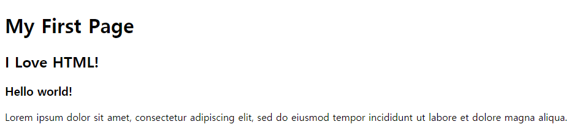

# HTML

> 사이트에 들어갈 내용을 담는다.


## I. 웹 페이지 만들기


#### Code

```html
<!DOCTYPE html> <!--웹 브라우저에게 HTML 버전을 알려주는 역할, 따로 버전 적지 않으면 최근 버전 사용-->

<title>My First Website</title>

<h1>My First Page</h1>
<h2>I Love HTML!</h2>
<h3>Hello world!</h3>

<p>Lorem ipsum dolor sit amet, consectetur adipiscing 
    elit, sed do eiusmod tempor incididunt ut labore 
    et dolore magna aliqua.
</p>
```


#### Image




## II. <!DOCTYPE> 선언

> HTML 파일을 쓸 때는 가장 먼저 `<!DOCTYPE>` 선언을 써야 합니다. 이전의 html 버전을 사용하려면 을 복잡하게 써야 하지만, 그냥 최신 버전인 HTML 5를 사용하기 위해서는 이렇게만 쓰면 됩니다


```html
<!DOCTYPE html>
```


## III. HTML 태그

> 웹 페이지는 기본적으로 HTML 태그(HTML 요소)로 이루어져 있다.


```html
시작태그        종료태그
 <태그>   내용  </태그>

<!--태그 작성의 예시 -->
<title>코드잇 - 온라인 프로그래밍 스쿨 </title>
```


### 1. TITLE 태그

> 페이지의 제목은 `<title>` 태그에 써주면 됩니다. 브라우저의 탭이나 방문 기록에 나와 있는 바로 그 제목이 이 곳에 들어갑니다.

```html
<title> 제목 </title>
```


### 2. `<h1>`~ `<h2>`  태그

> 한 페이지에 여러 개의 머리말이 있을 수 있는데요. 그 중 가장 중요한 머리말은`<h1>` (heading 1), 그 다음으로 중요한 머리말은 `<h2>`(heading 2). 이런 식으로 `<h6>` (heading 6)까지 작성할 수 있습니다.

```html
<h1>
    슬로건
</h1>
```

각 머리말의 크기는 나중에 마음대로 설정할 수 있지만, 따로 설정해주지 않으면 ``부터 순서대로 작아집니다.


### 3. p 태그

> 보통 문단은 `<p>`(paragraph) 태그 안에 넣습니다. 물론 직접 설정할 수도 있지만 `<p>`태그 위, 아래에는 기본적으로 여백이 조금씩 있습니다.


```html
<p>
    문단
</p>
```


### 3.  b 태그

>텍스트를 굵게 쓰고 싶으면 'bold'의 약자인 `<b>` 태그를 사용하면 됩니다.


### 4.  i 태그

>텍스트를 날려 쓰고 싶으면 'italics'의 약자인 `<i>` 태그를 사용하면 됩니다.


### 5. Phrase Tags

>`<b>` 태그는 그냥 텍스트를 '볼드체'로 만들어주고, 마찬가지로 `<i>` 태그는 그냥 텍스트를 '이탤릭체'로 만들어줍니다. 둘 다 '시각적인 특징'만 갖고 있는 태그인데요. HTML에서는 시각적인 특징 뿐만 아니라 의미도 담고 있는 phrase tag가 있습니다.

- `<strong>`태그

  `<b>` 태그는 텍스트를 굵게 만드는 것이 목적이지만, `<strong>` 태그는 감싸고 있는 텍스트가 중요하다고 표시하는 것이 목적입니다. 지금 겉보기에는 두 태그가 똑같지만, 스크린리더(컴퓨터의 화면 낭독 소프트웨어: 시각 장애인, 학습/인지 장애인, 노인, 다문화 가정의 웹 접근성을 지원해주는 목적)가 글을 읽어줄 때 `<strong>`은 강조해서 읽을 수 있다.

- `<em>`태그

  `<i>` 태그는 그냥 시각적으로 날려쓰는 것이 목적이라면, `<em>` 태그는 강조하는 것이 목적입니다. em은 'emphasized'의 줄임말입니다

  

#### 한글 깨짐 현상

> 한글을 인식하는 인코딩 방식을 사용해야 한다. 한글을 지원하지 않는 브라우저를 위해 인코딩 방식을 설정해서 브라우저에게 명령을 해 줘야 한다.

```html
<!DOCTYPE html>

<title>My First Website</title>
<meta charset = "utf-8"> <!--한글을 지원하는 대표적인 인코딩 방식-->

<h1>My First Page</h1>
<h2>I <i>Love</i> HTML!</h2>
<h3>안녕 세상!</h3>

```


### 6. 옵셔널 태그

> 이제 `<html>`, `<head>`, `<body>` 태그를 배워봤는데요. 이전에 이 태그들을 쓰지 않아도 별 문제 없었죠? 이 세 태그는 사실 필수가 아니라 **'옵셔널 태그'**입니다.


- 왜 써야 하는가?

  이 강의에서 저는 정리(organization)의 목적으로 세 태그를 모두 사용하겠습니다. 요소들을 ``와 ``에 묶어주면 html 파일의 구조가 눈에 더 잘 들어온다고 생각하기 때문이죠.

  하지만 세 옵셔널 태그의 사용을 권장하지 않는 의견들도 있습니다. 심지어 [구글 HTML/CSS 스타일 가이드](https://google.github.io/styleguide/htmlcssguide.html#Optional_Tags)에서도 옵셔널 태그를 생략하라고 나와 있습니다.

  개인적인 작업을 할 때는 직접 결정하시면 되고, 팀으로 작업을 할 때는 상의 후 정하시면 됩니다!


### 7. a 태그

> 다른 링크로 가는 태그(하이퍼링크)

```html
<a href = "가고 싶은 주소"> 내용 </a>

/* 새 페이지에서 링크를 열고 싶을 때 */
<a href = "https://www.google.com/" target = "_black">
```


### 8. Img 태그

> 이미지를 추가하는 태그


```html
/* 가로나 세로 길이 둘중 하나를 설정 안하면 설정한 값에 맞춰서 자동으로 나머지가 설정됨 */

        
```

