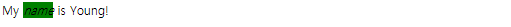

# HTML

> 사이트에 들어갈 내용을 담는다.
>
> Hyper Text Markup Language의 약자
>
> 웹페이지를 작성하기 위한, 구조를 잡기 위한 언어이다.


# HTML 이란?

웹용 콘텐츠의 구조를 지정하는 컴퓨터 언어

웹 서버에 저장되어 클라이언트 웹 브라우저의 요구에 따라 불려지는 문서

웹 브라우저에 불려진 HTML은 웹 브라우저에 의해 해석되어 내용이 화면에 보여짐


## I. 웹 페이지 만들기


#### Code

```html
<!DOCTYPE html> <!--웹 브라우저에게 HTML 버전을 알려주는 역할, 따로 버전 적지 않으면 최근 버전 사용-->

<title>My First Website</title>

<h1>My First Page</h1>
<h2>I Love HTML!</h2>
<h3>Hello world!</h3>

<p>Lorem ipsum dolor sit amet, consectetur adipiscing 
    elit, sed do eiusmod tempor incididunt ut labore 
    et dolore magna aliqua.
</p>
```


#### Image


## II. <!DOCTYPE> 선언

> HTML 파일을 쓸 때는 가장 먼저 `<!DOCTYPE>` 선언을 써야 합니다. 이전의 html 버전을 사용하려면 을 복잡하게 써야 하지만, 그냥 최신 버전인 HTML 5를 사용하기 위해서는 이렇게만 쓰면 됩니다


```html
<!DOCTYPE html>
```


## III. HTML 태그

> 웹 페이지는 기본적으로 HTML 태그(HTML 요소)로 이루어져 있다.


```html
시작태그        종료태그
 <태그>   내용  </태그>

<!--태그 작성의 예시 -->
<title>코드잇 - 온라인 프로그래밍 스쿨 </title>
```


### 1. TITLE 태그

> 페이지의 제목은 `<title>` 태그에 써주면 됩니다. 브라우저의 탭이나 방문 기록에 나와 있는 바로 그 제목이 이 곳에 들어갑니다.

```html
<title> 제목 </title>
```


### 2. `<h1>`~ `<h2>`  태그

> 한 페이지에 여러 개의 머리말이 있을 수 있는데요. 그 중 가장 중요한 머리말은`<h1>` (heading 1), 그 다음으로 중요한 머리말은 `<h2>`(heading 2). 이런 식으로 `<h6>` (heading 6)까지 작성할 수 있습니다.

```html
<h1>
    슬로건
</h1>
```

각 머리말의 크기는 나중에 마음대로 설정할 수 있지만, 따로 설정해주지 않으면 ``부터 순서대로 작아집니다.


### 3. p 태그

> 보통 문단은 `<p>`(paragraph) 태그 안에 넣습니다. 물론 직접 설정할 수도 있지만 `<p>`태그 위, 아래에는 기본적으로 여백이 조금씩 있습니다.


```html
<p>
    문단
</p>
```


### 3.  b 태그

>텍스트를 굵게 쓰고 싶으면 'bold'의 약자인 `<b>` 태그를 사용하면 됩니다.


### 4.  i 태그

>텍스트를 날려 쓰고 싶으면 'italics'의 약자인 `<i>` 태그를 사용하면 됩니다.


### 5. Phrase Tags

>`<b>` 태그는 그냥 텍스트를 '볼드체'로 만들어주고, 마찬가지로 `<i>` 태그는 그냥 텍스트를 '이탤릭체'로 만들어줍니다. 둘 다 '시각적인 특징'만 갖고 있는 태그인데요. HTML에서는 시각적인 특징 뿐만 아니라 의미도 담고 있는 phrase tag가 있습니다.

- `<strong>`태그

  `<b>` 태그는 텍스트를 굵게 만드는 것이 목적이지만, `<strong>` 태그는 감싸고 있는 텍스트가 중요하다고 표시하는 것이 목적입니다. 지금 겉보기에는 두 태그가 똑같지만, 스크린리더(컴퓨터의 화면 낭독 소프트웨어: 시각 장애인, 학습/인지 장애인, 노인, 다문화 가정의 웹 접근성을 지원해주는 목적)가 글을 읽어줄 때 `<strong>`은 강조해서 읽을 수 있다.

- `<em>`태그

  `<i>` 태그는 그냥 시각적으로 날려쓰는 것이 목적이라면, `<em>` 태그는 강조하는 것이 목적입니다. em은 'emphasized'의 줄임말입니다

  

#### 한글 깨짐 현상

> 한글을 인식하는 인코딩 방식을 사용해야 한다. 한글을 지원하지 않는 브라우저를 위해 인코딩 방식을 설정해서 브라우저에게 명령을 해 줘야 한다.

```html
<!DOCTYPE html>

<title>My First Website</title>
<meta charset = "utf-8"> <!--한글을 지원하는 대표적인 인코딩 방식-->

<h1>My First Page</h1>
<h2>I <i>Love</i> HTML!</h2>
<h3>안녕 세상!</h3>

```


### 6. 옵셔널 태그

> 이제 `<html>`, `<head>`, `<body>` 태그를 배워봤는데요. 이전에 이 태그들을 쓰지 않아도 별 문제 없었죠? 이 세 태그는 사실 필수가 아니라 **'옵셔널 태그'**입니다.


- 왜 써야 하는가?

  이 강의에서 저는 정리(organization)의 목적으로 세 태그를 모두 사용하겠습니다. 요소들을 ``와 ``에 묶어주면 html 파일의 구조가 눈에 더 잘 들어온다고 생각하기 때문이죠.

  하지만 세 옵셔널 태그의 사용을 권장하지 않는 의견들도 있습니다. 심지어 [구글 HTML/CSS 스타일 가이드](https://google.github.io/styleguide/htmlcssguide.html#Optional_Tags)에서도 옵셔널 태그를 생략하라고 나와 있습니다.

  개인적인 작업을 할 때는 직접 결정하시면 되고, 팀으로 작업을 할 때는 상의 후 정하시면 됩니다!


### 7. a 태그

> 다른 링크로 가는 태그(하이퍼링크)

```html
<a href = "가고 싶은 주소"> 내용 </a>

/* 새 페이지에서 링크를 열고 싶을 때 */
<a href = "https://www.google.com/" target = "_blank">

/* 내용에 이미지를 넣으면 이미지를 누르면 링크로 이동한다.*/
/* 
<a href = "가고 싶은 주소"> 내용</a>
<a href = "가고싶은 주소"></a>
```


### 8. Img 태그

> 이미지를 추가하는 태그


```html
/* 가로나 세로 길이 둘중 하나를 설정 안하면 설정한 값에 맞춰서 자동으로 나머지가 설정된다. */

 

/* 절대 경로로 이미지 업로드 */

```


### 9. div 태그

> 요소들을 묶어줄 수 있는 태그


```html
<div class = "page">
            <a href = "folder1/page1.html" class = "page1">page 1</a>
            <a href = "folder1/folder2/page2.html" class = "page2">page 2</a>
            <a href = "folder1/folder2/page3.html" class = "page3">page 3</a>
        </div>
```

```css
.page {
            background-color: #eee;
            border-radius: 20px;
            margin-bottom: 50px;
            padding: 50px;
            width: 500px;
            margin-left: auto;
            margin-right: auto;
            text-align: center;
        }
```


# HTML 코멘트

> `<!-- 내용 -->`의 형태로 되어 있는 부분이 HTML의 '코멘트(comment)'입니다.


```html
<!-- 첫 번째 영화: 굿 윌 헌팅 (Good Will Hunting) -->
<div class="movie">
  <h2>Good Will Hunting (굿 윌 헌팅)</h2>
  <p>수학, 법학, 역사학 등 모든 분야에 재능이 있는 ‘윌’(맷 데이먼)은 천재적인 두뇌를 가지고 있지만 어린 시절 받은 상처로 인해 세상에 마음을 열지 못하는 불우한 반항아.</p>
</div>

<!-- 두 번째 영화: 뷰티풀 마인드 (A Beautiful Mind) -->
<div class="movie">
  <h2>뷰티풀 마인드 (A Beautiful Mind)</h2>
  <p>40년대 최고의 엘리트들이 모이는 프린스턴 대학원. 시험도 보지 않고 장학생으로 입학한 웨스트버지니아 출신의 한 천재가 캠퍼스를 술렁이게 만든다. 너무도 내성적이라 무뚝뚝해 보이고, 오만이라 할 정도로 자기 확신에 차 있는 수학과 새내기 존 내쉬. 누구도 따라올 수 없는 뛰어난 두뇌와 수려한 용모를 지녔지만 괴짜 천재인 그는 기숙사 유리창을 노트 삼아 단 하나의 문제에 매달린다. 바로 자신만의 '오리지날 아이디어'를 찾아내는 것. 어느 날 짖궂은 친구들과 함께 들른 술집에서 금발 미녀를 둘러싸고 벌이는 친구들의 경쟁을 지켜보던 존 내쉬는 섬광같은 직관으로 '균형이론'의 단서를 발견한다. 1949년 27쪽 짜리 논문을 발표한 20살의 청년 존 내쉬는 하루 아침에 학계의 스타로, 제2의 아인슈타인으로 떠오른다.</p>
</div>
```


# Span 태그

> 문단의 내용을 `<div>` 태그안에 넣고 class로 폰트를 변경하면 문단 나누기가 된다.
>
> 이를 위해 `<span>` 태그 안에 넣어준다.


|        | `<div>` : Block display     | `<span>` : Inline display                 |
| ------ | --------------------------- | ----------------------------------------- |
| 공통점 | 요소를 묶어준다.            | 요소를 묶어준다.                          |
| 차이점 | 글을 새로운 줄에 넣어 준다. | 원래 있던 글의 위치에 영향을 주지 않는다. |


# Display

>HTML 요소의 레이아웃을 결정하는 가장 중요한 속성 중 하나는 `display`입니다.

# display의 종류

모든 요소는 딱 한 개의 display 값을 갖고 있습니다. 가질 수 있는 display의 종류는

1. `inline`
2. `block`
3. `inline-block`
4. `flex`
5. `list-item`
6. `none`

등 여러 가지가 있는데, 대부분의 요소들은 `inline`과 `block` 중 한 가지입니다.

### inline display

inline 요소들은 다른 요소들과 같은 줄에 머무르려고 하는 성향과, 필요한 만큼의 가로 길이만 차지하는 성향이 있습니다.

다음 요소들은 기본 `display` 값이 `inline`입니다.

1. `<span>`
2. `<a>`
3. `<b>`
4. `<i>`
5. ``
6. `<button>`

#### HTML

```html
My <i>name</i> is Young!
```

#### CSS

```css
i {
  background-color: green;
}
```



`<i>` 태그는 기본적으로 inline이기 때문에 앞, 뒤의 텍스트와 같은 줄에 머무르고 있고, 가로 길이는 필요한 만큼만 차지하고 있습니다.

### block display

block 요소들은 다른 요소들과 독단적인 줄에 가려고 하는 성향과, 최대한 많은 가로 길이를 차지하는 성향이 있습니다.

다음 요소들은 기본 `display` 값이 `block`입니다.

1. `<div>`
2. `<h1>`, `<h2>`, `<h3>`, `<h4>`, `<h5>`, `<h6>`
3. `<p>`
4. `<nav>`
5. `<ul>`
6. `<li>`

#### HTML

```html
My <div>name</div> is Young!
```

#### CSS

```css
div {
  background-color: green;
}
```

`<div>` 태그는 기본적으로 block이기 때문에 새로운 줄에 가버립니다. 그리고 가로 길이는 최대한 많이, 100%를 차지하고 있죠?

# display 바꾸기

모든 요소는 기본적으로 정해진 display 값이 있는데요. CSS를 통해서 이를 바꿀 수 있습니다!

### inline 요소를 block으로 바꾸기

#### HTML

```html
My <i>name</i> is Young!
```

#### CSS

```css
i {
  display: block; /* <i> 태그를 block으로 바꾸기 */
  background-color: green;
}
```

### block 요소를 inline으로 바꾸기

#### HTML

```html
<div class="div1">Hello World!</div>
<div class="div2">My name is Young!</div>
```

#### CSS

```css
div {
  display: inline; /* <div> 태그를 inline으로 바꾸기 */
}

.div1 {
  background-color: green;
}

.div2 {
  background-color: blue;
}
```


# Inline-Block

> Block 요소에게는 가로 길이와 세로 길이를 직접 설정해줄 수 있지만, inline 요소는 자동으로 설정이 됩니다. Inline 요소에게는 가로, 세로 길이의 개념이 딱히 없는 셈이죠.

만약 inline 요소처럼 다른 요소들과 같은 줄에 머무르면서 block 요소처럼 가로, 세로 길이도 설정해주고 싶으면 어떻게 해야 할까요? 바로 그 둘을 섞어놓은 `inline-block`을 사용하면 됩니다!

#### HTML

```html
My <i>name</i> is Young!
```

#### CSS

```css
i {
  display: inline-block;
  width: 200px;
  height: 200px;
  background-color: green;
}
```


### 1. `` 태그

> ``태그는 사실 대체 요소라고 하는 좀 특별한 인라인 요소이다.


`` 로 호출한 사진이 사실 엄청 큰 글자라 생각할 수 있다.

- text-align , vertical-align 이 다 글자처럼 적용이 된다.


# Baseline

> 각각의 text와 그림(img)는 보이지 않는 선 baseline에 맞춰져 있다.

#### TEXT


### IMG


#### 그렇다면 Inline-block의 경우는?

Inline-block의 경우 설정한 부분의 마지막 줄의 baseline이 요소의 baseline이다

만약 inline-block의 내용이 없고 box만 있는 경우 box의 제일 밑이 base라인이 된다.


# Vertical-align

> vertical-aling : 위치 를 설정하게 되면 부모태그에 맞춰서 정렬되게 된다.


#### 왜 이렇게 되는 것일까?

alex에 vertical-align: top을 주었기 때문에 alex를 제외한 요소중에 가장 높은 곳을 기준으로 alex가 정렬이 되기 때문이다.

언뜻 보기에는 chris가 올라간 것 처럼 보이지만, **실제로는 alex가 chris의 크기에 맞춰 vertical-align을 한것**!
chris의 top값과 alex의 top 값을 맞춰야 하는데, alex를 내려서 chris의 top값에 정렬을 하게 되면
부모태그의 높이에 영향을 주기 때문에 chris가 올라간 것 처럼 보이게 정렬이 된 것 뿐 이다.

`'baseline은 가만히 있지 않고 상황에 맞게 움직입니다.'` 즉! baseline이 부모태그의 height에 영향을 주지 않으면서 필요한 상황에 맞게 움직였기 때문에 그렇게 보이는거라고 이해하시면 좋다.


# 가로 가운데 정렬

세로 가운데 정렬을 알아보기 전에, 간단하게 가로 가운데 정렬을 알아봅시다.
어떤 요소를 가로로 가운데 정렬하려면 어떻게 해야 할까요? 간단합니다.

### inline 요소

`inline` 또는 `inline-block` 요소면 부모 태그에 `text-align: center;`를 써주면 됩니다.

#### HTML

```html
<div class="container">
  텍스트 
</div>
```

#### CSS

```css
.container {
  text-align: center;
  background-color: lime;
}
```

### block 요소

`block` 요소면 `margin-left: auto;`, `margin-right: auto;`를 써주면 되죠?

#### HTML

```html
<div class="block-element"></div>
```

#### CSS

```css
.block-element {
  width: 100px;
  height: 50px;
  margin-left: auto;
  margin-right: auto;
  background-color: lime;
}
```

# 세로 가운데 정렬

그렇다면 세로로 가운데 정렬하려면 어떻게 해야 할까요? 저도 이것 때문에 짜증난 적이 많은데요! 사실 CSS에서 모든 걸 한 번에 딱 가운데 정렬을 시키는 방법이 없기 때문에, 저희가 지금까지 배운 다양한 지식을 섞어서 해야 합니다.

몇 가지 방법을 봅시다.

### 가짜 요소 더하기

`vertical-align: middle;`을 하면 해결될까요? 우선 `vertical-align` 속성은 인라인 또는 인라인 블록 요소에 적용되기 때문에 `.info`를 인라인 블록으로 바꾸겠습니다. 그리고 `vertical-align: middle;`을 설정해주면...?

#### HTML

```html
<div class="container">
  <div class="info">
    <h1>Hello!</h1>
    <p>My name is young.</p>
  </div>
</div>
```

### CSS

```css
.container {
  width: 300px;
  height: 400px;
  background-color: gray;
  text-align: center;
}

.info {
  background-color: lime;
  display: inline-block;
  vertical-align: middle;
}
```


`vertical-align: middle;`은 요소의 가운데를 부모 요소의 소문자 'x'의 가운데와 맞춥니다. 확인해봅시다.

#### HTML

```html
<div class="container">
  x
  <div class="info">
    <h1>Hello!</h1>
    <p>My name is young.</p>
  </div>
</div>
```

#### CSS

```html
<div class="container">
  x
  <div class="info">
    <h1>Hello!</h1>
    <p>My name is young.</p>
  </div>
</div>
```


`.info` 요소를 완전 가운데로 오게 하려면 우선 소문자 'x'가 가운데로 와야 합니다. 방법이 하나 있습니다. 세로 길이가 `100%`인 요소를 만들고, 그 요소에도 `vertical-align: middle;`을 하는 거죠!

#### HTML

```html
<div class="container">
  x
  <div class="helper"></div>
  <div class="info">
    <h1>Hello!</h1>
    <p>My name is young.</p>
  </div>
</div>
```

#### CSS

```css
.container {
  width: 300px;
  height: 400px;
  background-color: gray;
  text-align: center;
}

.helper {
  display: inline-block;
  height: 100%;
  vertical-align: middle;
  
  /* 설명을 위해서 */
  width: 10px;
  background-color: red;
}

.info {
  background-color: lime;
  display: inline-block;
  vertical-align: middle;
}
```


이제 거의 다 되었습니다. 여기서 소문자 'x'를 지우고, `.helper` 요소의 가로 길이를 없애면 되겠죠?

#### HTML

```html
<div class="container">
  <div class="helper"></div>
  <div class="info">
    <h1>Hello!</h1>
    <p>My name is young.</p>
  </div>
</div>
```

#### CSS

```css
.container {
  width: 300px;
  height: 400px;
  background-color: gray;
  text-align: center;
}

.helper {
  display: inline-block;
  height: 100%;
  vertical-align: middle;
}

.info {
  background-color: lime;
  display: inline-block;
  vertical-align: middle;
}
```


근데 아직도 문제가 조금 있습니다. `.info`의 가로 길이가 `100%`라면 어떻게 되는지 봅시다.

#### HTML

```html
<div class="container">
  <div class="helper"></div>
  <div class="info">
    <h1>Hello!</h1>
    <p>My name is young.</p>
  </div>
</div>
```

#### CSS

```css
.container {
  width: 300px;
  height: 400px;
  background-color: gray;
  text-align: center;
}

.helper {
  display: inline-block;
  height: 100%;
  vertical-align: middle;
}

.info {
  background-color: lime;
  display: inline-block;
  vertical-align: middle;
  width: 100%;
}
```


갑자기 이상한 곳에 위치되네요. 사실 `.helper` 와 `.info` 요소 사이에 띄어쓰기가 한 칸 있어서, 가로 길이 `100%`인 `.info` 요소는 자리 부족으로 다음 줄로 가버립니다!

이 문제를 해결하기 위해서는 두 가지 방법이 있습니다.

우선 **띄어쓰기를 없애는 방법:**

#### HTML

```html
<div class="container">
  <!-- 스페이스 없애기 -->
  <div class="helper"></div><div class="info">
    <h1>Hello!</h1>
    <p>My name is young.</p>
  </div>
</div>
```

#### CSS

```css
.container {
  width: 300px;
  height: 400px;
  background-color: gray;
  text-align: center;
}

.helper {
  display: inline-block;
  height: 100%;
  vertical-align: middle;
}

.info {
  background-color: lime;
  display: inline-block;
  vertical-align: middle;
  width: 100%;
}
```

**띄어쓰기 공간 만큼의 마이너스 여백을 주는 방법:**

#### HTML

```html
<div class="container">
  <div class="helper"></div>
  <div class="info">
    <h1>Hello!</h1>
    <p>My name is young.</p>
  </div>
</div>
```

#### CSS

```css
.container {
  width: 300px;
  height: 400px;
  background-color: gray;
  text-align: center;
}

.helper {
  display: inline-block;
  height: 100%;
  vertical-align: middle;
}

.info {
  background-color: lime;
  display: inline-block;
  vertical-align: middle;
  width: 100%;

  /* 이 경우 띄어쓰기는 5~7px 정도였습니다! */
  margin-left: -7px;
}
```


**주의 사항:**

어떤 요소에 `height: 100%;`를 설정하기 위해서는 부모의 `height`가 설정되어 있어야 합니다. 위 경우에는 `.helper`의 부모인 `.container`에 `height`가 설정되어 있었기 때문에 가능했던 것이죠.

### `line-height`로 해결

`.info`를 인라인 블록으로 설정해주면, `line-height` 속성을 활용해볼 수도 있습니다. 부모인 `.container`에 `height`와 동일한 `line-height`를 줘보세요.

`line-height` 속성은 자식들에게 상속되기 때문에 `.info`에는 `line-height: normal;`을 꼭 써주셔야 합니다!

#### HTML

```html
<!DOCTYPE html>
<div class="container">
  x
  <div class="info">
    <h1>Hello!</h1>
    <p>My name is young.</p>
  </div>
</div>
```

#### CSS

```css
.container {
  width: 300px;
  height: 400px;
  background-color: gray;
  text-align: center;
  line-height: 400px;
}

.info {
  background-color: lime;
  display: inline-block;
  line-height: normal;
  vertical-align: middle;
}
```


### 다른 방식?

위의 방법들 말고도 세로 가운데 정렬을 하는 다양한 방식들이 있습니다. 포지셔닝을 이용할 수도 있고, 최근에 나온 [flexbox](https://www.w3schools.com/css/css3_flexbox.asp)를 이용할 수도 있습니다. 위의 방식으로는 해결되지 않는 상황들도 있을 수 있기 때문에, 다양한 방식들을 연구하는 걸 추천드립니다!


# `<ol>`태그

> Ordered List(`<ol>`): 순서가 있는 list이다.


#### HTML

```html
<body>
    <ol>
        <!-- <li></li>는 list item 이다. -->
        <li>집 청소</li>
        <li>영어 단어 외우기</li>
        <li>영화 보기</li>
    </ol>
</body>
```

```
1. 집 청소
2. 영어 단어 외우기
3. 영화 보기
```


#### HTML

```HTML
<!-- 순서를 매기는 다른 방법1 -->
<body>
    <ol type="a">
        <!-- <li></li>는 list item 이다. -->
        <li>집 청소</li>
        <li>영어 단어 외우기</li>
        <li>영화 보기</li>
    </ol>
</body>
```

```
a. 집 청소
b. 영어 단어 외우기
c. 영화 보기
```


#### HTML

```HTML
<!-- 순서를 매기는 다른 방법2 -->
<body>
    <ol type="A">
        <!-- <li></li>는 list item 이다. -->
        <li>집 청소</li>
        <li>영어 단어 외우기</li>
        <li>영화 보기</li>
    </ol>
</body>
```

```
A. 집 청소
B. 영어 단어 외우기
C. 영화 보기
```


#### HTML

```HTML
<!-- 순서를 매기는 다른 방법3 -->
<body>
    <ol type="i">
        <!-- <li></li>는 list item 이다. -->
        <li>집 청소</li>
        <li>영어 단어 외우기</li>
        <li>영화 보기</li>
    </ol>
</body>
```

```
i. 집 청소
ii. 영어 단어 외우기
iii. 영화 보기
```


#### HTML

```HTML
<!-- 순서를 매기는 다른 방법4 -->
<body>
    <ol type="I">
        <!-- <li></li>는 list item 이다. -->
        <li>집 청소</li>
        <li>영어 단어 외우기</li>
        <li>영화 보기</li>
    </ol>
</body>
```

```
I. 집 청소
II. 영어 단어 외우기
III. 영화 보기
```


# `<ul>`

> Unordered List(`<ul>`): 순서가 없는 list이다.


#### HTML

```html
<body>
    <ul>
        <!-- <li></li>는 list item 이다. -->
        <li>집 청소</li>
        <li>영어 단어 외우기</li>
        <li>영화 보기</li>
    </ul>
</body>
```


#### 출력

- 집 청소
- 영어 단어 외우기
- 영화 보기

