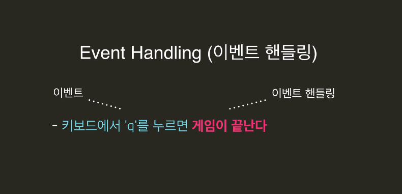

# jQuery

jQuery를 설치하는 방법으로는 크게 두 가지가 있습니다.


# 1. 링크를 사용하는 방법


우선 강의에서 본 방법입니다.


우리가 작성한 `<script>...</script>` 태그 바로 윗 줄에 [jQuery CDN](https://code.jquery.com/)의 코드를 붙여 넣어주는 방법이 있습니다.


```html
<script
  src="https://code.jquery.com/jquery-3.2.1.min.js"
  integrity="sha256-hwg4gsxgFZhOsEEamdOYGBf13FyQuiTwlAQgxVSNgt4="
  crossorigin="anonymous"></script>
<script>
  // 우리 자바스크립트 코드...
</script>
```


이렇게 작성해주면, 인터넷에 있는 원격 jQuery 코드를 내 프로젝트로 가져오게 됩니다.


# 2. 직접 jQuery 코드를 다운받아서 쓰는 방법


[jQuery 사이트](https://jquery.com/)에 들어가면 jQuery 코드를 직접 다운로드 받을 수 있습니다. (JavaScript이니까 `.js` 파일로 되어있겠죠?)


이 코드를 다운로드 받아서 프로젝트 안의 어딘가에 두시고, `<script>` 태그에 `jquery.js` 파일에 대한 경로를 써주시면 됩니다.


위와 같은 구조면, 이렇게 하면 되겠죠?


```html
<script src="js/jquery-3.2.1.min.js"></script>
<script>
  // 우리 자바스크립트 코드...
</script>
```


# Event

> Event(이벤트)란 HTML 요소들에게 일어날 수 있는 일들이다.


- 사용자가 요소를 클릭한다.
- 마우스가 요소 위로 올라온다.
- 마우스가 요소 밖으로 나간다.
- 페이지 로딩이 끝난다.
- 사용자가 키보드를 누른다.


이와 같은 html 요소들에게 일어날 수 있는 모든 일들을 이벤트라 한다.

이와 같은 이벤트 들이 생겼을 때 어떤 동작이 일어나도록 코드를 쓸 수 있다.

이런 어떠한 동작이 일어나도록 하는 일들을 이벤트 핸들링(Event Handling)이라 한다.


예를 들어

- 키보드에서 'q'를 누르면 게임이 끝난다

이때 키보드에서 q를 누르는게 이벤트이고 게임이 끝나는게 이벤트 핸들링이다.





이때 만약 이벤트 핸들링을 함수로 처리해주면 이 때의 함수를 이벤트 핸들러라고 한다.


# 이벤트 등록하는 jQuery 코드


```js
$('#home').on('click', clickHome);
$('#seoul').on('click', clickSeoul);
$('#tokyo').on('click', clickTokyo);
$('#paris').on('click', clickParis);
```


이렇게 이벤트를 등록하면, HTML 태그에 직접 명시해두지 않고 더 깔끔하게 쓸 수 있습니다.


# 순수 자바스크립트 (Vanilla JavaScript)


jQuery 너무 편하고 좋습니다. 그래도 혹시 나중에 jQuery를 쓰지 않을 경우를 대비해서, '순수 자바스크립트'만을 사용했을 때에는 어떻게 써야할지 알아두는 것도 나쁘지 않겠죠?


```js
document.getElementById('home').addEventListener('click', clickHome);
document.getElementById('seoul').addEventListener('click', clickSeoul);
document.getElementById('tokyo').addEventListener('click', clickTokyo);
document.getElementById('paris').addEventListener('click', clickParis);
```


순수 자바스크립트만 쓰니까 조금 복잡해졌습니다. 하지만 위에 있는 jQuery 코드와 의미는 동일합니다.


# 자바스크립트 개발에 도움이 되는 사이트 

 

### JSFiddle 영상에서도 보여드린 [JSFiddle](https://jsfiddle.net/)입니다. 

한 페이지 내에서 HTML, CSS, JavaScript를 모두 작성하고 바로 결과를 보여주는 사이트입니다. 

 ### W3Schools 

[W3Schools](https://www.w3schools.com/)는 HTML, CSS, JavaScript뿐 아니라 jQuery, PHP, AngularJS, Bootstrap등 다양한 웹 기술들에 대한 설명과 예제가 나와있는 사이트입니다. 

### MDN JavaScript Document 

[Mozilla Developer Network(MDN)](https://developer.mozilla.org/bm/docs/Web/JavaScript)에서 JavaScript에 대한 문서를 제공해줍니다. 튜토리얼부터 스타일 가이드, 각 기능들에 대한 설명 등이 정리되어 있습니다.

