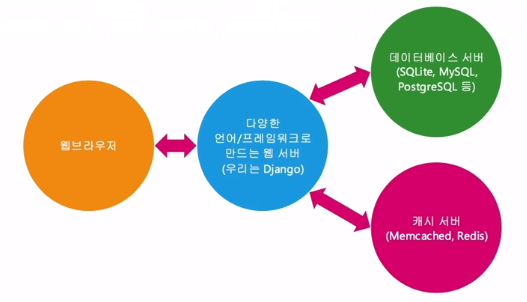
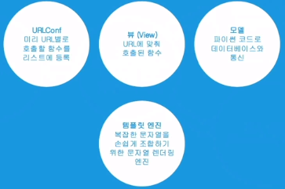

# Django

​        

### 사전 지식

> Django를 배우기 전에 다음과 같은 기초 지식이 필요합니다.

- [x] **Python**
- [x] **jQuery**
- [x] **HTML / CSS / Javascript **

​     

### Goal

- [x] **Django란 무엇인지 이해하기.**

- [x] **Django 프로젝트 생성해보기.**

- [x] **Django의 주요 기능들에 대해 이해하기.**

- [x] **Django App의 필요성 이해하기.**

   

  ​    

## I. Django란?

> MTV (Model, Template, View) 패턴을 따르는 프레임워크이다.

   

이름만 다를 뿐, MVC(Model, View, Controller) 입니다.

MVC(모델-뷰-컨트롤러)는 소프트웨어 공학에서 사용되는 소프트웨어 디자인 패턴이다.


- Model : 장고의 Model
  
  - 데이터베이스 SQL 쿼리를 생성/수행
  - 데이터 관리
- View : 장고의 Template
  
  - 복잡한 문자열 조합을 도와줍니다.
  - 인터페이스(화면)
- Controller : 장고의 View
  - HTTP 클라이언트로부터의 요청을 처리하는 함수
- 중관 관리, 상호 동작
  
  

## II. 장고 프로젝트 생성

> Django 프로젝트 생성

​     

### 1. 장고 프로젝트 생성

#### cmd

```shell
mkdir [폴더명]

cd [폴더명]

django-admin startproject [프로젝트 폴더명]

cd [프로젝트 폴더명]
```

   

### 2. 기본 생성된 파일/디렉토리 목록

​    

[프로젝트 폴더명] : 프로젝트명으로 생성된 디렉토리. 다른 이름으로 변경해도 상관없다.

- manage.py : 명령행을 통해 각종 장고 명령을 수행

- [프로젝트명으로 생성된 디렉토리] : 이 이름을 참조하고 있는 코드가 몇 개 있기에 함부로 수정하면 안된다.

  - `__init__.py` : 모든 파이썬 패키지에는  `__init__.py`을 둔다. 패키지 임포트할 때의 임포트 대상
  - `setting.py` : 현재 프로젝트에서 장고 기본설정 (django/conf/global_settings.py) 을 덮어쓰고 새롭게 지정할 설정들
  - `urls.py` : 최상위 URL 설정
  - `wsgi.py `: 실서비스에서의 웹서비스 진입점
  - `asgi.py` : 비동기적 지원이 추가된 프로토콜

    

### 3. 프로젝트 초기화 작업 및 개발서버 구동

​    

```shell
django-admin startproject [프로젝트 폴더명]
cd [프로젝트 폴더명]

----------프로젝트 초기화 작업-------------
python manage.py migrate
python manage.py createsuperuser
python manage.py runserver
```

  

#### 참고

```
python manage.py createsuperuser
```

로컬내의 새로운 데이터 베이스 내 슈퍼계정 Username과 비밀번호를 설정해준다.

암호 검사 기능이있으니 주의

또한, 이메일은 생략 가능하다.


구동한 서버/admin을 통해 생성한 슈퍼계정 id와 password 입력을 통해 로그인이 가능하다.

이때 서버/admin은 Django에서 기본으로 제공해주는 기능이다.

 

## III. Django의 주요 기능


### 1. 장고의 주요 기능들 (1)

- Function Based Views : 함수의 HTTP 요청 처리
  - HTTP 요청이 올때마다 특정 함수가 실행되는데 이때의 함수를 View라고 한다.
- Models : 데이터베이스와의 인터페이스
- Templates : 복잡한 문자열 조합을 보다 용이하게. 주로 HTML 문자열 조합 목적으로 사용 또한 푸쉬 메세지나 이메일 내용을 만들 때에도 쓰면 편리
- Admin 기초 : 심플한 데이터베이스 레코드 관리 UI
  - 데이터베이스 관리자 즉, 시스템을 관리하는 사람을 위한 관리자
- Logging : 다양한 경로로 메세지 로깅
- Static files :  개발 목적으로의 정적인 파일 관리
- Messages framework : 유저에게 1회성 메세지 노출 목적


### 2. 장고의 주요 기능들 (2)

- Class Based Views : 클래스로 함수 기반 뷰 만들기
- Forms : 입력폼 생성, 입력값 유효성 검사 및 DB로의 저장
- 테스팅
- 국제화 & 지역화
- 캐싱
- Geographic : DB의 Geo 기능 활용 (PostgreSQL 중심)
- Sending Emails
- Syndication Feeds (Rss/Atom)
- Sitemaps


### 3. 장고 기본 앱

- **admin** : 관리자
- admindocs
- **auth** : 인증
- contenttypes
- flatpages
- gis
- humanize
- **messages **: 메시지 프레임 워크
- postgres
- redirects
- **sessions**
- sitemaps
- sites
- **staticfiles**
- sydication


### 4. 웹 어플리케이션 기본 구조




다양한 언어/프레임워크로 만드는 웹 서버




  

  

## IV. 장고앱을 이용한 블로그 제작

  

### 1. 장고 앱의 필요성

현재 프로젝에서 블로그 기능을 다른 프로젝트에서도 사용하려면?

- 블로그를 장고앱 형태로 격리해서 만들어 둔다면, 다른 프로젝트에도 적용하기 편리


폴더를 복사하고 아래 명령으로 기본 앱 템플릿으로부터 생성할 수 있다.

```shell
python manage.py startapp <앱이름>
```


단 manage.py가 있는 경로에서 만들어야 한다.


#### 장고 앱의 필요성

- **재사용성을 목적**으로 한 파이썬 패키지

  - 재사용성을 목적으로 둔 것이 아니라면, 하나의 장고 앱에서 현재 프로젝트의 거의 모든 기능을 구현해도 무방합니다.
  - 앱을 하나의 작은 서비스로 봐도 무방

- 하나의 앱이름은 현재 프로젝트 상에서 **유일**해야합니다.

- 새롭게 생성한 장고앱이나 외부 라이브러리 형태의 장고앱은 **필히 settings.INSTALLED_APPS에 등록**을 시켜줘야만 장고앱으로서 대접을 받습니다.

  - ```python
    #App폴더의 상위 폴더에 있는 settings.py
    
    INSTALLED_APPS = [
        'django.contrib.admin',
        'django.contrib.auth',
        'django.contrib.contenttypes',
        'django.contrib.sessions',
        'django.contrib.messages',
        'django.contrib.staticfiles',
        # 아래 부분을 추가해준다.
        'blog1',
    ]
    ```

  - 앱의 URLConf를 제외한 많은 부분 (모델, 템플릿, static 등) 들이 자동으로 등록됩니다.

