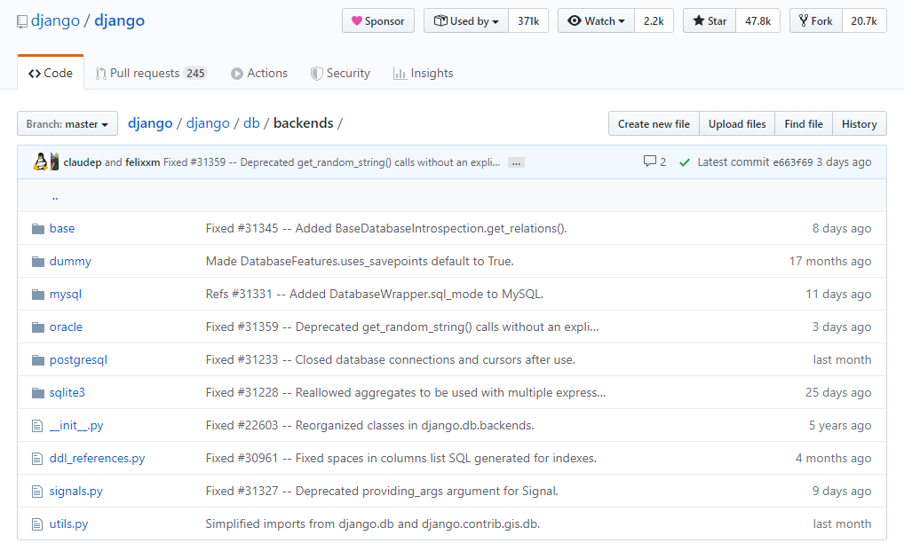
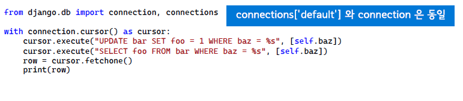
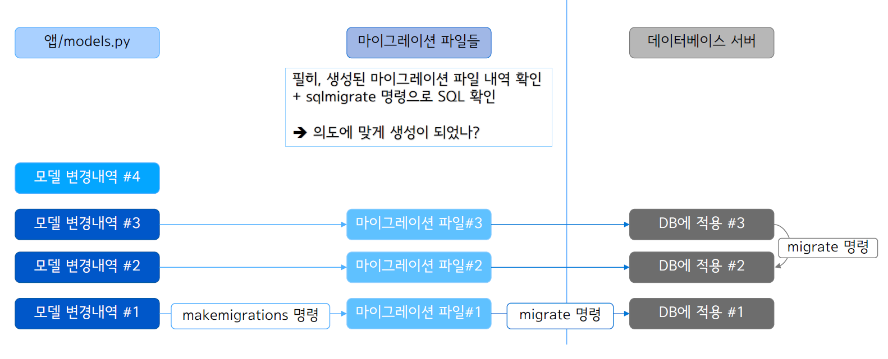

# Django

​        

### 사전 지식

> Django를 배우기 전에 다음과 같은 기초 지식이 필요합니다.

- [x] **Python**
- [x] **jQuery**
- [x] **HTML / CSS / Javascript **

​     

### Goal

- [x] **Django 데이터 저장 방법 이해하기.**
- [x] **Django Model 이해하기.**
- [x] **Django의 Model Field 알아보기.**
- [x] **Django Model Manager 알아보기.**
- [x] **Django 검색 구현해보기.**
- [x] **django-debug-toolbar를 통한 SQL 디버깅해보기**
- [x] **Django 관계를 표현하는 모델 필드 알아보기.**
- [x] **Django Migration을 통한 데이터베이스 스키마 관리**


# I. 데이터 저장 방법


- 데이터베이스 : RDBMS, NoSQL 등
- 파일 : 로컬, 외부 정적 스토리지
- 캐시버서 : memcached, redis 등


### 1. 데이터베이스와 SQL

 

#### (1) 데이터베이스의 종류

- RDBMS(관계형 데이터베이스 관리 시스템)
  - 종류 : PostgreSQL, MySQL, SQLite, MS-SQL, Oracle 등
- NoSQL : 해당 엔진만의 SQL만 지원 가능
  - 종류 : MongoDB, Cassandra, CouchDB, Google BigTable 등

#### (2) 데이터베이스에 쿼리하기 위한 언어 : SQL

같은 작업을 하더라도, 보다 적은 수의 SQL, 보다 높은 성능의 SQL 사용

직접 SQL을 만들어내기도 하지만, ORM(Object-relational mapping)을 통해 SQL을 생성/실행하기도 합니다.

이를 활용하면 보다 생산성 있게 SQL을 생성해서 서비를 만들어 제공할 수 있다.

#### 중요

ORM을 쓰더라도, 내가 작성된 ORM 코드를 통해 어떤 SQL이 실행되고 있는 지, 파악을 하고 이를 최적화할 수 있어야 합니다.  파악을 위해서는 django-debug-toolbar를 적극 활용해서 어떤 SQL이 수행되는지 확인할 수 있다.


### 3. 장고 ORM인 모델은 RDB만을 지원한다.


장고가 제공하는 backends




#### Microsoft SQL Server는 Django-py-dbc-azure 라이브러리가 필요

참고)SQL Server에서 Django를 추구하면 안 되는 걸까?

(https://www.slideshare.net/TaehwanKim27/sql-server-django-118G38328)


#### ORM 이란?

- 데이터를 가지고 무언가를 한다 = CRUD
  - READ
  - CREATE
  - UPDATE
  - DELETE


- 모든 데이터 행들을 객체로 취급하고 조작하겠다 : ORM


- 장점 
  - DB가 무엇이 들어오든 상관이 없다.
    - 중간자인 ORM을 끼고 가기 때문에
    - 연결된 DB에 따라 ORM이 최적화된 쿼리를 제공한다.


### 4. 다양한 파이썬 ORM(awesome-python#orm)


#### (1) Relational Databases

- Django Models

- SQLAlchemy

- Orator

- Peewee

- PonyOrm

  ...

  ...

#### (2) NoSQL Databases

- Django-mongodb-engine

- hot-redis

- MongoEngine

- PynamoDB

  ...

  ...


### 5. 장고의 강점

> 장고의 강점은 Model과 Form이다.


강력한 Model / Form

SQL을 직접 실행하실 수도 있지만, 가능하면 ORM을 쓰세요

직접 SQL 문자열로 조합하지 마시고, 인자로 처리하세요 : **SQL Injection 방지**



## II. Django Model

> 장고 내장 ORM


### 1. Django Model

  

#### <데이터베이스 테이블>과 <파이썬 클래스>를 1:1로 매핑

- 모델 클래스명은 단수형으로 지정 - 예 : Posts (X), Post(O)
  - 클래스이기에 필히 첫글자가 대문자인 PacalCase 네이밍을 한다.
- 매핑되는 모델 클래스는 DB 테이블 필드 내역이 일치해야 합니다.
- 모델을 만들기 전에, 서비스에 맞게 데**이터베이스 설계가 필수.**
- 이는 데이터베이스의 영역이므로 **관계형 데이터베이스 학습도 필요**합니다.


```python
from django.db import models

class Post(models.Model): #파이썬의 상속 models.Model을 상속
    #원하는 필드명을 필드 타입 설정 (CharField로 설정)
    title = models.CharField(max_length=100)
    content = models.TextField()
    created_at = models.DateTimeField(auto_now_add=True)
    updated_at = models.DateTimeField(auto_now=True)
```


### 2. Model 활용 순서


- 장고 모델을 통해, 데이터베이스 형상을 관리할 경우
  1. 모델 클래스 작성
  2. 모델 클래스로부터 마이그레이션 파일 생성 : makemigrations 명령
  3. 마이그레이션 파일을 데이터베이스에 적용 : migrate 명령
  4. 모델 활용

  

- 장고 외부에서, 데이터베이스 형상을 관리할 경우
  1. 데이터베이스로부터 모델 클래스 소스 생성 : inspectdb 명령
  2. 모델 활용

 

### 3. 모델명과 DB 테이블 명


DB 테이블 명: 디폴트 "앱이름_ 모델명"

예시) 

- blog 앱
  - Post 모델 : "blog_post"
  - Comment 모델 : "blog_comment"
- Shopt 앱
  - Item 모델 : "shop_item"
  - Review 모델 : "shop_review"

커스텀 지정

- 모델 Meta 클래스의 db_table 속성


https://docs.djangoproject.com/ko/3.0/ref/models/options/#db-table


#### 새로운 모델 만들어보기

#### (1) 앱 만들기

```shell
python manage.py startapp instagram
```

  

#### (2) settings.py의 INSTALLED_APPS List에 '만든 앱 이름' 저장

```python
INSTALLED_APPS = [
    'django.contrib.admin',
    'django.contrib.auth',
    'django.contrib.contenttypes',
    'django.contrib.sessions',
    'django.contrib.messages',
    'django.contrib.staticfiles',
    # instagram 저장
    'instagram',
]
```

  

#### (3) instagram에 urls.py 저장

```shell
# urls.py
# urlpatterns에 list 저장
urlpatterns = [
]
```

  

#### (4) Project폴더의 urls,py에 경로 저장

```python
# Project urls.py

from django.contrib import admin
from django.urls import path, inclue

urlpatterns = [
    path('admin/', admin.site.urls),
    path('instagram/', include('instagram.urls')),
]
```

  

#### (5) Model 생성

```python
# instagram 앱의 models.py

class Post(models.Model):
    message = models.TextField()
    created_at = models.DateTimeField(auto_now_add=True)
    updated_at = models.DateTimeField(auto_now=True)
```

  

#### (6) Migration

```shell
python manage.py makemigrations instagram

#실제로 database에 instagram_post란 이름의 table이 생성이 된다.
python manage.py migrate instagram
```

  

#### (7) sqlmigrate

```shell
# 실제로 데이터베이스에 들어가는 쿼리를 확인할 수 있다.
python manage.py sqlmigrate instagram 0001_initial
```

```
BEGIN;
--
-- Create model Post
--
CREATE TABLE "instagram_post" ("id" integer NOT NULL PRIMARY KEY AUTOINCREMENT, "message" text NOT NULL, "created_at" datetime NOT NULL, "updated_at" datetime NOT NULL);
COMMIT;
```


## III. Django Model Field


### 1. 기본 지원되는 모델필드 타입 (1)

- Primary Key : AutoField, BigAutoField
- 문자열 : CharField, TextField, SlugField
- 날짜/시간 : DateField, TimeField, DateTimeField, DurationField
- 참/거짓 : BooleanField, NullBooleanField
- 숫자 : IntegerField, SmallIntegerField, PositiveIntegerField, PositiveSmallIntegerfield, BigIntegerField, DecimalField,  FloatField
- 파일 : BinaryField, FileField, ImageField, FilePathField

 기타 다양한 Field https://docs.djangoproject.com/en/3.0/ref/models/fields/#field-types

   

### 2. 기본 지원되는 모델필드 타입 (2)

- 이메일 : EmailField
- URL : URLField
- UUID : UUIDField
- 아이피 : GenericlPAddressField
- Relationship Types
  - ForeignKey
  - ManyToManyField
  - OneToOneField
- 그리고 다양한 커스텀 필드들
  - django-model-utils : https://django-model-utils.readthedocs.io/en/latest/


### 3. 모델필드는 DB 필드타입을 반영한다.

- DB에서 지원하는 필드들을 반영
  - Varchar 필드타입 : CharField, SlugField, URLField, EmailField, 등
- 파이썬 데이터타입과 데이터베이스 데이터타입을 매핑
  - AutoField : int
  - BinaryField : bytes
  - BooleanField : bool
  - CharField/SlugField/URLField/EmailField : str (디폴트 적용된 유효성 검사 등의 차이)
- 같은 모델필드라 할지라도, DB에 따라 다른 타입이 될 수도 있습니다.
  - DB에 따라 지원하는 기능이 모두 다르다.


### 4. 자주 사용하는 필드 공통 옵션

- **blank** : 장고 단에서 validation시에 empty 허용 여부 (디폴트 : False)
- null (DB 옵션) : null 허용 여부 (디폴트: False)
- db_index (DB옵션) : 인덱스 필드 여부 (디폴트 : False) Migration할때만 사용한다.
- default : 디폴트 값 지정, 혹은 값을 리턴해줄 함수 지정
  - 사용자에게 디폴트 값을 제공코자 할 때
- unique (DB 옵션) : 현재 테이블 내에서 유일성 여부 (디폴트 : False) Migration할때와 유효성 검사 로직을 사용할 때도 사용
- choices : select 박스 소스로 사용
- **validators** : validators 를 수행할 함수를 다수 지정
  - 모델 필드에 따라 고유한 validators들이 등록(ex-이메일만 받기)
- verbose_name : 필드 레이블, 미지정시 필드명이 사용
- help_text : 필드 입력 도움말


### 주의!

강력히 권합니다

설계한 데이터베이스 구조에 따라, **최대한 필드타입을 타이트하게 지정해주는 것이 입력값 오류를 막을 수 있습니다.**

모델 설계가 장고 개발의 절반이다!

blank/null 지정은 최소화해주세요. : manage.py inspect 명령을 통해 생성된 모델 코드는 초안입니다.

validators 들이 다양하게/타이트하게 지정됩니다.

필요하다면, validators들을 추가로 타이트하게 지정해주세요.

프론트엔드에서의 유효성 검사는 사용자 편의를 위해서 수행하며, 백엔드에서의 유효성 검사는 필수입니다.

직접 유효성 로직을 만들지 마세요. 이미 잘 구성된 Features들을 가져다 쓰세요. 장고의 Form/Model을 통해 지원되며, django-rest-framework의 Serializer를 통해서도 지원됩니다.


#### ORM은 SQL 쿼리를 만들어주는 역할일 뿐, 보다 성능높은 애플리케이션을 위해서는 사용하려는 데이터베이스에 대한 깊은 이해가 필요합니다.


## IV. Model Manager


- 데이터베이스 질의 인터페이스를 제공
- 디폴트 Manager로서 ModelCls.objects가 제공


```python
# 생성되는 대강의 SQL 윤곽 : SELECT * FROM app_model;
ModelCls.objects.all()

# 생성되는 대강의 SQL 윤곽 : SELECT * FROM app_model ORDER BY id DESC LIMIT 10;
ModelCls.objects.all().order_by('-id')[:10]

#생성되는 대강의 SQL 윤곽 : INSERT INTO app_model (title) VALUES ("NEW Title")
ModelCls.objects.all().create(title="New Title")
```


```python
# id 에 대한 내림차순
qs = Post.objects.all().order_by('-id')
print(qs.query)
qs
```

```
<QuerySet [<Post: 세번째 메세지>, <Post: 두번째 메세지>, <Post: 첫번째 메세지>]>
```

```python
# id에 대한 오름차순
qs = Post.objects.all().order_by('id')
print(qs.query)
qs
```

```
<QuerySet [<Post: 첫번째 메세지>, <Post: 두번째 메세지>, <Post: 세번째 메세지>]>
```

```python
qs = Post.objects.all().order_by('-id')[:2]
print(qs.query)
qs
```

```
<QuerySet [<Post: 세번째 메세지>, <Post: 두번째 메세지>]>
```


### 1. QuerySet

SQL을 생성해주는 인터페이스

순회가능한 객체

Model Manager를 통해, 해당 Model에 대한 QuerySet을 획득

- Post.objects.all() 코드는 "SELECT * FROM post...;"
- Post.objects.create(...) 코드는 "INSERT INTO ......;"

```python
# 순회가능한 객체이기 때문에 반복문 사용 가능
for post in qs:
#     print(post.message, post.created_at)
    print("{id} {message} {created_at}".format(**post.__dict__))
```


### 2. QuerySet은 Chaining을 지원

- Post.objects.all().filter(...).exclude(...).filter(...) : QuerySet
- QuerySet은 Lazy한 특성
  - QuerySet을 만드는 동안에는 DB접근을 하지 않습니다.
  - 실제로 데이터가 필요한 시점에 접근을 합니다.
- 데이터가 필요한 시점은 언제인가?
  1. queryset
  2. print(queryset)
  3. list(queryset)
  4. for instance in queryset: print(instance)

```python
query = '첫번째' # 검색어
qs = Post.objects.all().filter(message__icontains=query)
print(qs)
```

```
<QuerySet [<Post: 첫번째 메세지>]>
```


### 3. 다양한 조회 요청

> SELECT SQL 생성

 

- 조건을 추가한 Queryset, 획들할 준비
  - queryset.filter(...) : queryset
  - queryset.exclude(...) : queryset
- 특정 모델객체 1개 획득을 시도
  - queryset[숫자 인덱스]
    - 모델객체 혹은 예외 발생(IndexError)
  - queryset.get(...)
    - 모델객체 혹은 예외 발생(DoesNotExist, MultipleObjectsReturned)
  - queryset.first() : 모델객체 혹은 None
  - queryset.last() : 모델객체 혹은 None


### 4. filter, exclude

> SELECT 쿼리에 WHERE 조건 추가

 

- 인자로 "필드명 = 조건값" 지정

- ```python
  # New item & price=1000 (and로 묶임)
  Item.objects.filter(name='New Item', price=1000)
  ```

- 1개 이상의 인자 지정 : 모두 AND 조건으로 묶임

- Or 조건으로 묶으려면, django.db.models.Q 활용


### 5. 필드 타입별 다양한 조건 매칭

> 주의) 데이터베이스에 따라 생성되는 SQL이 다릅니다.

 

- 숫자/날짜/시간 필드
  - 필드명__lt = 조건값 : 필드명 < 조건값 (less than)
  - 필드명__lte = 조건값 : 필드명 <= 조건값(less than equal)
  - 필드명__gt = 조건값 : 필드명 > 조건값 (greater than)
  - 필드명__gte = 조건값 : 필드명 >= 조건값 (greater than equal)
- 문자열 필드
  - 필드명__startswith = 조건값 : 필드명 LIKE "조건값%"
  - 필드명__istartswith = 조건값 : 필드명 ILIKE "조건값%"
  - 필드명__endswith = 조건값 : 필드명 LIKE  "%조건값"
  - 필드명__iendswith = 조건값 : 필드명 ILIKE "%조건값"
  - 필드명__contains = 조건값 : 필드명 LIKE "%조건값%"
  - 필드명__icontains = 조건값 : 필드명 ILIKE "%조건값%"
- ETC


## V. 간단 검색 구현

> Queryset을 이용해 간단한 검색구현해보기.

  

```python
# instagram/view.py

from django.shortcuts import render
from .models import Post

def post_list(request):

    qs = Post.objects.all()
    # 검색어 : q get('검색어', 'default값')
    q = request.GET.get('q', '')
    if q:
        qs = qs.filter(message__icontains=q)

    # render('view함수의 request', 'app 이름/원하는 템플릿명', 'template내에서 qs를 참조할 이름')
    # 템플릿을 만들 장소
    # instagram/templates/instagram/post_list.html
    return render(request, 'instagram/post_list.html', {
        'post_list': qs,
        'q' : q,
    })
```

```python
# instagram/urls.py

from . import views
from django.urls import path

urlpatterns = [
    path('', views.post_list),
]
```

```python
# instagram/templates/instagra/post_list

<!DOCTYPE html>
<html lang="ko">
<head>
    <meta charset="UTF-8">
    <meta name="viewport" content="width=device-width, initial-scale=1.0">
    <title>Instagram / Post List</title>
    <link rel="stylesheet" href="https://stackpath.bootstrapcdn.com/bootstrap/4.4.1/css/bootstrap.min.css" integrity="sha384-Vkoo8x4CGsO3+Hhxv8T/Q5PaXtkKtu6ug5TOeNV6gBiFeWPGFN9MuhOf23Q9Ifjh" crossorigin="anonymous">
</head>
<body>
    <form action="" method="get">
        <input type="text" name="q" value="{{ q }}" />
        <input type="submit" value="검색" />
    </form>
    <table class="table table-bordered table-hover">
        <tbody>
            
                <tr>
                    <td>
                        
                            
                        
                            No Photo
                        
                    </td>
                    <td>
                        {{ post.message }}
                    </td>
                </tr>
            
        </td>
</body>
</html>
```


## VI. Queryset에 정렬 조건 추가

> SELECT query에 "ORDER BY" 추가

  

- 정렬 조건을 추가하지 않으면 일관된 순서를 보장받을 수 없음.
- DB에서 다수 필드에 대한 정렬을 지원
  - 하지만, 가급적 단일 필드로 하는 것이 성능에 이익
  - 시간순/역순 정렬이 필요한 경우, id 필드를 활용해볼 수 있음
- 정렬 조건을 지정하는 2가지 방법
  - (추천) 모델 클래스의 Meta 속성으로 ordering 설정 : list로 지정
  - 모든 queryset에 order_by(...)에 지정


### 1. 정렬 지정하기 #1

 

```python
class Item(models.Model):
    name = models.CharField(max=length=100)
    desc = models.TextField(blank=True)
    price = models.PositveIntegerField()
    created_at = models.DateTimeField(auto_now_add=True)
    updated_at = models.DateTimeField(auto_now=True)
    
    # Meta 속성으로 ordering 설정
    class Meta:
        ordering = ['id']
```


#### 참고

```python
# shell_plus를 사용하기 위해 django-extensions 라이브러리 설치

pip install django-extensions
```

```shell
# 기능 보기
python manage.py shell_plus --help

python manage.py shell_plus --print-sql
```

#### shell_plus는 필요한 라이브러리들이 다 import된 채로 실행

#### 단! 겹쳐지는 부분은 overwrite되니 다시 import해줘야 한다.


### 2.  정렬 지정하기 #2

 

```python
class Item(models.Model):
    """
    ...
    ...
    ...
    """
    class Meta:
        ordering = ['id']
    # 직접 정렬을 적용하면 defalut 정렬이 무시됨
    # ex) Post.objects.all().order_by('created_at') => 기존 id순 정렬 무시
```


### 3. 슬라이싱을 통한 범위조건 추가

> SELECT 쿼리에 "OFFSET/LIMIT" 추가

 

- str/list/tuple 에서의 슬라이싱과 거의 유사하나, 음수 인덱스 접근은 지원하지 않음.
  - 데이터베이스에서 지원하지 않기 때문
- 객체 [start:stop:step]
  - OFFSET : start
  - LIMIT : stop - start
  - (주의) step은 쿼리에 대응되지 않습니다. 사용을 비추천

```python
Item.objects.all()[10:30:2]
```

#### 주의 음수 인덱스 슬라이싱은 지원하지 않음

```python
Post.objects.all()[-2:]
```

```
AssertionError        Traceback (most recent call last)
<ipython-input-4-8825c23ce5d5> in <module>
----> 1 Post.objects.all()[-2:]

~\AppData\Local\Programs\Python\Python37\lib\site-packages\django\db\models\query.py in __getitem__(self, k)  
    291                 (isinstance(k, slice) and (k.start is None or k.start >= 0) and
    292                  (k.stop is None or k.stop >= 0))), \
--> 293             "Negative indexing is not supported."
    294
    295         if self._result_cache is not None:     

AssertionError: Negative indexing is not supported.   
```

### 마지막 두개를 쓰고 싶다면?

```python
Post.objects.all().order_by('역순으로 정렬하는 기준')[:2]
```


#### Step을 사용하게 된다면?

```python
Post.objects.all()[1:3]
```

```
Execution time: 0.001085s [Database: default]
<QuerySet [<Post: 두번째 메세지>, <Post: 첫번째 메세지>]>
```

#### 결과가 QuerySet type으로 반환이 된다. 하지만! Step을 적용하면?

```python
Post.objects.all()[1:3:1]
```

```
Execution time: 0.000998s [Database: default]
Out[7]: [<Post: 두번째 메세지>, <Post: 첫번째 메세지>] 
```

#### 결과과 list 자료형으로 반환이 된다.

#### Step은 장고의 Queryset이 처리한다. 즉, start와 end의 범위를 가져 온 다음에 step을 넘겨가며 새로운 list를 만들어준다.


## VII. django-debug-toolbar를 통한 SQL 디버깅

> 현재 request/response에 대한 다양한 디버깅 정보를 보여줌


- 다양한 Panel 지원
  - SQL Panel을 통해, 각 요청 처리 시에 발생한 SQL 내역 확인 가능
  - Ajax 요청에 대한 지원은 불가합니다.


### 1. django-debug-toolbar 설치

- 설치 공식 문서
  - https://django-debug-toolbar.readthedocs.io/en/latest/installation.html
- 주의사항
- 웹페이지의 템플릿에 필히 `<body>` 태그가 있어야만, django-debug-toolbar가 동작합니다.
  - 이유: dbt의 html/script 디폴트 주입 타겟이 `</body>` 태그 (INSERT_BEFORE 설정 디폴트 : `</body>`)

### 2. 코드를 통한 SQL 내역 확인

- QuerySet의 query 속성 참조

  - ex) print(Post.objects.all().query) : 실제 문자열 참조 시에 SQL 생성

- **settings.DEBUG = True 시에만 쿼리 실행내역을 메모리에 누적**

  - ```python
    from django.db import connection, connections
    
    for row_dict in connection.queries:
        print('{time} {sql}'.format(**row_dict))
    connections['default'].queries
    ```

- 쿼리 초기화

  - 메모리에 누적되기에, 프로세스가 재시작되면 초기화
  - django.db.reset_queries() 통해서 수동 초기화도 가능

### 3. 그 외 :django-querycount

- SQL 실행내역을 개발서버 콘솔 표준출력
- Ajax 내역도 출력 가능


## VIII. 관계를 표현하는 모델 필드


### 1. RDBMS에서의 관계 예시

- 1 : N 관계 : models.ForeignKey로 표현(1:n일때 n측에 외례키를 심습니다.)
  - 1명의 유저(User)가 쓰는 다수의 포스팅(Post)
  - 1명의 유저(User)가 쓰는 다수의 댓글(Comment)
  - 1개의 포스팅(Post)에 다수의 댓글(Comment)
- 1 : 1 관계 : models.OneToOneField로 표현
  - 1명의 유저(User)는 1개의 프로필(Profile)
- M : N 관계 : models.ManyToManyField로 표현
  - 1개의 포스팅(Post)에는 다수의 태그(Tag)
    - 1개의 태그(Tag)에는 다수의 포스팅(Post)


### 2. ForeignKey

> 1 : N 관계에서 N측에 명시
>
> Post : Comment, User : Post, User : Comment

 

- ForeignKey(to, on_delete)

  - to : 대상모델

    - 클래스를 직접 지정하거나, 클래스명을 문자열로 지정. 자기 참조는 "self" 지정

  - on_delete : Record 삭제 시 Rule

    - https://docs.djangoproject.com/en/2.1/ref/models/fields/
      #django.db.models.ForeignKey.on_delete

    - CASCADE : FK로 참조하는 다른 모델의 Record도 삭제 (장고 1.X에서의 디폴트 값)

      즉, 1 : N 관계에서 1측에 있는 Record가 삭제가 될 때 N측에 있는 1에 속한 해당 Record에 대한 Rule을 지정하는 것. CASCADE로 지정하면 1측에 해당하는 N측에 있는 것들이 다 삭제가 됨.

    - PROTECT : ProtectedError (IntegrityError 상속)를 발생시키며. 삭제 방지

    - SET_NULL : null로 대체. 필드에 null=True 옵션 필수

    - SET_DEFAULT : 디폴트 값으로 대체. 필드에 디폴트값 지정 필수

    - SET : 대체할 값이나 함수 지정. 함수의 경우 호출하여 리턴값을 사용.

    - DO_NOTHING : 어떠한 액션 X. DB에 따라 오류가 발생할 수도 있습니다.

- https://docs.djangoproject.com/en/2.1/ref/models/fields/#django.db.models.ForeignKey

 

#### (1) 올바른 User 모델 지정


```python
# django/contrib/auth/models.py

class User(AbstractBaseUser):
    """
    ...
    
    """
```

```python
# blog/models.py
from django.conf import settings

class Post(models.Model):
    author = models.ForeignKey(settings.AUTH_USER_MODEL, on_delete=models.CASCADE)
    title = models.CharField(max_length=100)
```


#### (2) FK에서의 reverse_name

> reverse 접근 시의 속성명 : 디폴트로 "모델명소문자_set"가 생긴다.

 

```python
from django.db import models

class Post(models.Model):
    title = models.CharField(max_length=100)
    content = models.TextField()
class Comment(models.Model):
    post = models.ForeignKey(Post, on_delete=models.CASCADE)
    message = models.TextField()
```


#### 만약 reverse_name 이름 충돌이 발생한다면?

- reverse_name 디폴트 명은 앱이름 고려 X, 모델명만 고려
- 다음의 경우, user.post_set 이름에 대한 충돌
  - blog앱 Post모델, author = FK(User)
  - shop앱 Post모델, author = FK(User)
- 이름이 충돌이 날 때, makemigrations 명령이 실패
- 이름 충돌 피하기
  1. 어느 한 쪽의 FK에 대해, reverse_name을 포기 : related_name='+' 이쪽에서는 reverse_name을 쓰지 않겠다! 라는 의미
  2. 어느 한 쪽의 (혹은 모두) FK의 reverse_name을 변경
     1. ex) FK(User, ... , related_name="blog_post_set")
     2. ex) FK(User, ..., related_name="shopt_post_set")


#### (5) ForeignKey.limit_choices_to 옵션

- Form을 통한 choice 위젯에서 선택항목 제한 기능
  - dict / Q 객체를 통한 지정 : 일괄 지정
  - dict/ Q 객체를 리턴하는 함수 지정 : 매번 다른 조건 지정 가능

- ManyToManyField에서도 지원

  ```python
  class Comment(models.Model):
      # 실제 db에서는 post_id 필드가 생성이 된다.
      
      # post가 is_public이 True인 포스트에 대해서만 Comment를 추가할 수 있다.
      post = models.ForeignKey('instagram.Post', on_delete=models.CASCADE,
                              limit_choices_to={'is_public': True})
      message = models.TextField()
      created_at = models.DateTimeField(auto_now_add=True)
      updated_at = models.DateTimeField(auto_now=True)
  ```

  

### 3. OneToOneField


- 1:1 관계에서 어느 쪽이라도 가능
  - User : Profile
- ForeignKey(unique=True)와 유사하지만, reverse 차이
  - User:Profile를 FK로 지정한다면 profile.user_set.first() = user
  - User: Profile를 O2O로 지정한다면 profile.user = user
- OneToOneField(to, on_delete)

```python
# django/contrib/auth/models.py
class User(AbstractBaseUser):
    ...
    
```

```python
# accounts/models.py
class Profile(models.Model()):
    author = models.OnetoOneField(settings.AUTH_USER_MODEL, on_delete=models.CASCADE)
```


#### (1) O2O에서의 related_name

> reverse 접근 시의 속성명 : 디폴트 값은 모델명 소문자

 

```python
# accounts/models.py

class Profile(models.Model):
    author = models.OnetoOneField(settings.AUTH_USER_MODEL, on_delete=models.CASCADE)
    phone = models.CharField(max_length=11, blank=True)
    birth = models.DateField(null=True)

>>> profile.author
>>> user.profile
```


### 4. ManyToManyField

 

- M : N 관계에서 어느 쪽이라도 필드 지정 가능
- ManyToManyField(to, blank=False)

#### 방법1

```python
class Post(models.Model):
    tag_set = models.ManyToManyField('Tag', blank=True)
class Article(models.Model):
    tag_set = models.ManyToManyField('Tag', blank=True)
class Tag(models.Model):
    name = models.CharField(max_length=100, unique=True)
```

#### 방법2

```python
class Post(models.Model):
    #...
class Article(models.Model):
    #...
class Tag(models.Model):
    name = models.CharField(max_length=100, unique=True)
    post_set = models.ManytoManyField('Post',blank=True)
    article_set = models.ManyToManyField('Article', blank=True)
```

#### 방법 1을 더 추천한다 why?

#### tag를 활용하는 쪽에 tag_set을 ManyToMany관계를 지정하는것이 좀더 유의미하기 때문이다.

#### tag를 활용하는 쪽이 Post와 Article이기 때문


#### (1) RDBMS지만, DB따라 NoSQL기능도 지원

> 하나의 Post 안에 다수의 댓글 저장 가능
>
> NoSQL은 문서를 저장하는 개념

  

- djkoch/jsonfield
  - 대개의 DB엔진에서 사용 가능
  - TextField/CharField를 래핑
  - dict 등의 타입에 대한 저장을 직렬화하여 문자열로 저장
    - **내부 필드에 대해 쿼리 불가**
- django.contrib.postgres.fields.JSONField
  - 내부적으로 PostgreSQL의 jsonb 타입
  - 내부 필드에 대해 쿼리 지원
- adamchainz/django-mysql
  - MySQL 5.7 이상에서 json 필드 지원


### IX. Migration을 통한 데이터베이스 스키마 관리


### 1. Migrations

>  모델의 변경내역을 "데이터베이스 스키마"로 반영시키는 효율적인 방법을 제공


### 관련 명령

- 마이그레이션 파일 생성
  - python manage.py makemigrations <앱이름>
- 지정 데이터베이스 마이그레이션 적용
  - python manage.py migrate <앱이름>
- 마이그레이션 적용 현황 출력
  - python manage.py showmigrations <앱이름>
- 지정 마이그레이션 SQL 내역 출력
  - python manage.py sqlmigrate <앱이름> <마이그레이션-이름>

 

### 2. Migration 파일

- 데이터베이스에 어떤 변화를 가하는 Operation들을 나열
  - 테이블 생성/삭제, 필드 추가/삭제 등
  - 커스텀 파이썬/SQL Operation
    - 데이터 마이그레이션 등
- 대개 모델로부터 자동 생성 > makemigrations 명령
  - 모델 참조없이 빈 마이그레이션 파일 만들어서 직접 채워넣기도 한다.
- 주의) 같은 Migration 파일이라 할지라도, DB 종류에 따라 다른 SQL이 생성됩니다.
  - 모든 데이터베이스 엔진들이 같은 기능을 제공하지 않는다.
  - 예) SQLite DB에서는 기존 테이블에 컬럼 추가가 지원되지 않습니다.


### 3. Migration 파일 생성 및 적용




### 4. 언제 makemigrations를 하는 가?

- 모델 필드 관련된 어떠한 변경이라도 발생 시에 마이그레이션 파일 생성
  - 실제로 DB Scheme에 가해지는 변화가 없더라도 수행
- 마이그레이션 파일은 **모델의 변경내역을 누적**하는 역할
  - **적용된 마이그레이션 파일은 절대 삭제하시면 안됩니다.**
    - 마지막에 적용된 마이그레이션 파일이 있다고 그 전 마이그레이션 파일을 삭제하면 안된다.
    - 마이그레이션은 Scheme의 변화만 기록하고 있기 때문에 롤백할 때 필요한 파일들이다.
  - 마이그레이션 파일이 너무 많아질 경우, squashmigraitons 명령으로 다수의 마이그레이션 파일을 통합할 수 있습니다.

### 5. 마이그레이션 Migrate (정/역 방향)

- python manage.py migrate <앱이름>
  - 미적용 <마이그레이션-파일>부터 <최근-마이그레이션-파일>까지 정방향으로 순차적으로 수행
- python manage.py migrate <앱이름> <지정 마이그레이션-이름>
  - 지정된 <마이그레이션-이름>이 현재 적용된 마이그레이션보다
    - 이후라면, 정방향으로 순차적으로 지정 마이그레이션까지 forward 수행
    - 이전이라면, 역방향으로 순차적으로 지정 마이그레션 이전까지 backward 수행

### 6. 마이그레이션 이름 지정

> 전체 이름(파일명)을 지정하지 않더라도, 1개를 판별할 수 있는 일부만 지정해도 OK

 

shop/migrations/0001_initial.py

shop/migrations/0002_create_field.py

shop/migrations/0003_update_field.py


```shell
python manage.py migrate blog 000 # Fail (3개의 파일에 매칭)
python manage.py migrate blog 100 # Fail (매칭되는 파일이 없음)
python manage.py migrate blog 0001 # OK
python manage.py migrate blog 0002 # Fail (2개의 파일에 매칭)
python manage.py migrate blog 0002_c # OK
python manage.py migrate blog 0002_create # OK
python manage.py migrate blog 0002_update # OK
python manage.py migrate blog zero # shop앱의 모든 마이그레이션을 rollback
```


### 7. 마이그레이션 순서는 파일명으로 정렬순인가?

```python
from django.db import migrations, models

class Migration(mirations.Migratons):
    # 정확하게 의존관계는 depenencies에 따라 정의가 된다.
    dependencies = [
        ('shop', '0001_initial'),
    ]
```


### 8. id필드는 왜 생기나요?

- 모든 DB 테이블에는 각 Row의 식별기준인 "기본키 (Primary Key)"가 필요
  - 장고에서는 기본키로서 id (AutoField) 필드를 디폴트 생성
  - 다른 필드를 기본키로 지정하고 싶다면 primary_key=True 옵션 적용
  - 장고에서는 id를 primary_key로 쓰고 주소(address)개념으로 사용하고 있다.


### 9. 새로운 필드가 필수필드라면?

- 필수필드 여부 : blank/null 옵션이 모두 False 일때 (디폴트)

- makemigraitons 명령을 수행할 때, 기존 Record들에 어떤 값을 채워넣을 지 묻습니다.

  즉, field를 추가헀을 때 기존에 내용들에게 추가된 field에 대해 어떤 내용을 채워넣을지에 대한 질문이다.

  - 선택1) 지금 그 값을 입력하겠다.
  - 선택2) 명령 수행을 중단.


### 10. 협업 Tip

- 절대 하지 말아야할 일
  - 팀원 각자가 마이그레이션 파일을 생성 > 충돌 발생
- 추천) 마이그레이션 파일 생성은 1명이 전담해서 생성
  - 생성한 마이그레이션 파일을 버전관리에 넣고, 다른 팀원들은 이를 받아서 migrate만 수행
- Tip
  - 개발 시에 "서버에 아직 반영하지 않은" 마이그레이션을 다수 수행했었다면?
    - 이를 그대로 서버에 반영(migrate)하시지 마시고.
    - **하나의 Feature에 대해 하나의 마이그레이션으로 합쳐서 적용**하기를 권장
      - 방법1) 서버로의 미적용 마이그레이션들을 모두 롤백하고 >> 롤백된 마이그레이션들을 모두 제거하고 >> 새로이 마이그레이션 파일 생성 : 권장하는 방법!
      - 방법2) 미적용 마이그레이션들을 하나로 합치기 >> squashmigrations 명령

