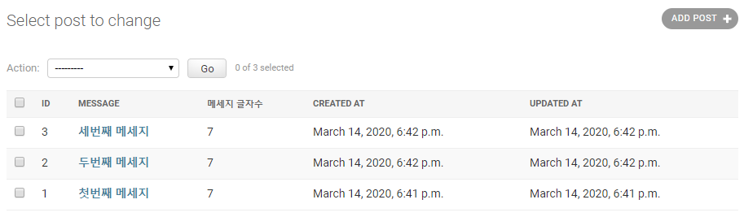
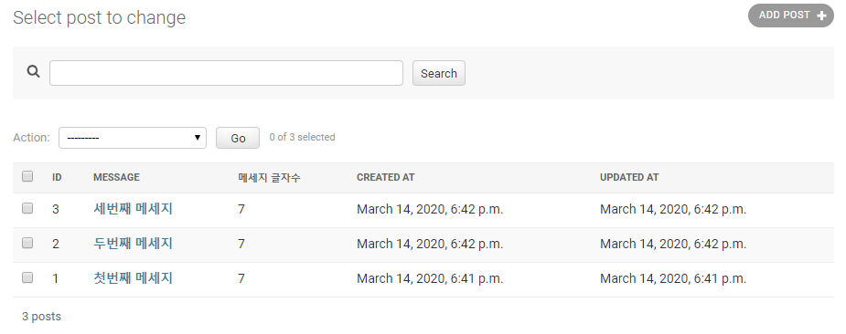
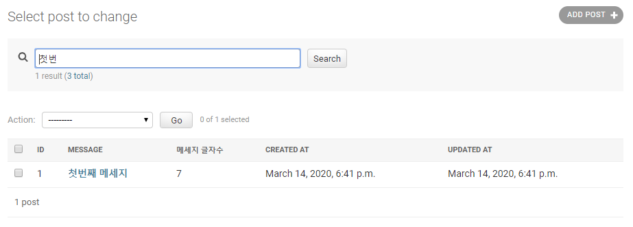

# Django

​        

### 사전 지식

> Django를 배우기 전에 다음과 같은 기초 지식이 필요합니다.

- [x] **Python**
- [x] **jQuery**
- [x] **HTML / CSS / Javascript **

​     

### Goal

- [x] **Django Admin 이해하기.**
- [x] **Django Model 클래스 admin 등록하기.**
- [x] **Django Model 클래스에 `__str__` 구현하기.**
- [x] **Django  list_display 속성 정의하기.**
- [x] **Django  list_filter 속성 정의하기.**


# I. Django admin


- Django.contrib.admin 앱을 통해 제공
  - Defalt 경로 : /admin/ 실제 서비스에서는 다른 주소로 변경 권장
  - django-admin-honeypot 앱을 통해 가짜 admin 페이지 노출
- 모델 클래스 등록을 통해, 조회/추가/수정/삭제 웹 UI를 제공
  - 서비스 초기에, 관리도구로서 사용하기에 제격
  - 관리도구 만들 시간을 줄이고, End-User 서비스에 집중!
- 내부적으로 Django Form을 적극적으로 사용


## II. Model 클래스 admin 등록하기


```python
#앱/admin.py

from django.contrib import admin
from .models import Item

# 등록법 #1
admin.site.register(Item) # 기본 ModelAdmin으로 동작

# 등록법 #2
class ItemAdmin(admin.ModelAdmin):
    pass
admin.siteregister(Item, ItemAdmin) # 지정한 ModelAdmin으로 동작

# 등록법 3
@admin.register(Item)
class ItemAdmin(admin.ModelAdmin):
    pass
```


## III. Model 클래스에 `__str__` 구현

> admin 모델 리스트에서 "모델명 object"를 원하는 대로 변경하기 위해

  

객체를 출력할 때, `객체.__str__()`의 리턴값을 활용


```python
from django.db import models

class Item(models.Model):
    name = models.CharField(max_length=100)
    desc = models.TextField(blank=True)
    price = models.PositiveIntegerField()
    is_publish = models.BooleanField(default=False)
    
    def __str__(self):
        return f'<{self.pk}> {self.name}'
```


## IV. list_display 속성 정의

> 모델 리스트에 출력할 컬럼 지정


#### models.py

```python
from django.db import models

class Post(models.Model):
    message = models.TextField()
    created_at = models.DateTimeField(auto_now_add=True)
    updated_at = models.DateTimeField(auto_now=True)

    def __str__(self):
        return self.message

    def message_length(self):
        return len(self.message)
    message_length.short_description = '메세지 글자수'
```


```python
from django.contrib import admin
from .models import Post

@admin.register(Post) # Wrapping
class PostAdmin(admin.ModelAdmin):
    # model에 있는 속성명을 직접 써도 되고 function도 가능(단, 해당 function은 인자가 없어야됨)
    list_display = ['id', 'message', 'message_length', 'created_at', 'updated_at']
    # link를 설정하고 싶으면?
    list_display_links = ['message'] #message에 link 설정이 된다. 여러개도 설정 가능
    # message 내용 중 찾을 내용을 검색하고 싶으면?
    search_fields = ['message']

```

#### 메세지 글자수 + link 추가



  

#### db의 데이터를 필터해서 찾고 싶으면?

```shell
# manage.py가 있는 경로에서 실행
python manage.py shell

from instagram.models import Post

# 전체 포스트를 데이타베이스를 통해 가져옴
Post.objects.all()

# 첫번째 메세지가 나옴
Post.objects.all().filter(message__icontains='첫번째')

# 쿼리가 db로 전달되는 것을 확인 할 수 있다.
qs = Post.objects.all().filter(message__icontains='첫번째')
print(qs.query)
```


#### 이 부분을 search_fields 추가해서 구현해보기.







## V. list_filter 속성 정의

> 지정 필드값으로 필터링 옵션 제공

 

#### models.py

```python
from django.db import models

# Create your models here.
class Post(models.Model):
    message = models.TextField()
    #새로 추가한 부분 is_public
    is_public = models.BooleanField(default=False, verbose_name='공개여부')
    created_at = models.DateTimeField(auto_now_add=True)
    updated_at = models.DateTimeField(auto_now=True)

    def __str__(self):
        # return f'Custom Post object ({self.id})'
        # return 'Custom Post object ({})'.format(self.id)
        return self.message

    def message_length(self):
        return len(self.message)
    message_length.short_description = '메세지 글자수'
```


```python
from django.contrib import admin
from .models import Post

@admin.register(Post) # Wrapping
class PostAdmin(admin.ModelAdmin):
    list_display = ['id', 'message', 'message_length', 'created_at', 'updated_at']
    list_display_links = ['message']
    search_fields = ['message']
    list_filter = ['is_publish']
```


is_public 을 추가했기때문에 db 에 적용시켜주기 위해 migration을 해준다.

```shell
# migration 파일 0002_post_is_public.py를 만들어줌
python manage.py makemigrations instagram
# 실제 db에 적용시켜주기위해 migrate를 해줌
python manage.py migrate instagram
# migration적용 내역을 볼려면? 앱 이름을 빼면 전체 migration적용 내역을 확인 가능
python manage.py showmigrations instagram
```

