# Django

​        

### 사전 지식

> Django를 배우기 전에 다음과 같은 기초 지식이 필요합니다.

- [x] **Python**
- [x] **jQuery**
- [x] **HTML / CSS / Javascript **

​     

### Goal

- [x] **Django View란 무엇인가?**
- [x] **Django의 다양한 타입의 HttpResponse 알아보기**
- [x] **Django의 URL Dispatcher와 정규 표현실 알아보기.**
- [x] **Django의 Class Based View 시작하기.**
- [x] **Django 기본 CBV API (B**ase views).**
- [x] **Django HTTP 상태코드로 응답하기.**
- [x] **Django URL Reverse.**


# I. View란?


- 1개의 HTTP 요청에 대해 1개의 뷰가 호출
- urls.py/urlpatterns 리스트에 매핑된 **호출 가능한 객체**
  - 함수도 "호출 가능한 객체" 중의 하나
- 웹 클라이언트로부터의 HTTP 요청을 처리
- 크게 2가지 형태의 뷰
  - 함수 기반 뷰 (Function Based View) : 장고 뷰의 **기본**
    - 호출 가능한 객체. 그 자체
  - 클래스 기반 뷰 (Class Based View)
    - 클래스.as_view()를 통해 호출가능한 객체를 생성/리턴


### 1. View 호출 시, 인자

> HttpRequest 객체 및 URL Captured Values

 

- 1번째 인자 : HttpRequest 객체
  - 현재 요청에 대한 모든 내역을 담고 있습니다.
- 2번째 ~ 인자 : 현재 요청의 URL로부터 Capture된 문자열들
  - url/re_path 를 통한 처리에서는 > 모든 인자는 str타입으로 전달
  - path 를 통한 처리에서는 > 매핑된 Converter의 to_python에 맞게 변환된 값이 인자로 전달
    - 지난 에피소드의 4자리 년도를 위한 FourDigitYearConverter에서는 int 변환 > 뷰의 인자로 int타입의 년도가 전달

```python
# instagram/urls.py
from . import views
from django.urls import path, re_path

urlpatterns = [
    path('', views.post_list),
    path('<int:pk>/', views.post_detail),
    # <int:pk> = 매핑된 Converter
    # re_path(r'(?P<pk>|d+)/$', views.post_detail),
]
```

```python
# instagram/views.py

# pk가 URL Captured Values 이다.
def post_detail(request, pk):
    pass
```


### 2. View 호출에 대한 리턴값

> HttpResponse 객체

 

- 필히 HttpResponse 객체를 리턴해야 합니다.
  - 장고 Middleware에서는 뷰에서 HttpResponse 객체를 리턴하기를 기대합니다.
    - 다른 타입을 리턴하면 Middleware에서 처리 오류
  - django.shortcuts.render 함수는 템플릿 응답을 위한 shortcut 함수
- 파일 like객체 혹은 str/bytes 타입의 응답 지원
  - str 문자열을 직접 utf8로 인코딩할 필요가 없습니다.
    - 장고 디폴트 설정에서 str 문자열을 utf8로 인코딩해줍니다.
  - response = HttpResponse(파일 like객체 또는 str객체 또는 bytes객체)
- 파일 like 객체
  - response.write(str객체 또는 bytes객체)

   

### 3. HttpRequest와 HttpResponse 예시

```python
from django.http import HttpRequest, HttpResponse

# type Hint 기능이 있다. python 3.6 이상
def index(request: HttpRequest) -> HttpResponse: # View 함수
    # 주요 request 속성
    request.method # 'GET', 'POST', etc.
    request.META
    request.GET, request.POST, request.FILES, request.body
    
    content = '''
    	<html></html>
    ''' # 문자열 혹은 이미지, 각종 파일 등
    
    response = HttpResponse(content)
    response.write(content) # response -> file-like object
    response['Custom-Header'] = 'Custom Header Value'
    return response
```


### 4. FBV의 예

> 함수 기반 뷰 (Function Based View) 예로서 Item 목록 보기

 

```python
# myapp/views.py

from django.shortcuts import render
from shop.models import Item

def item_list(request):
    qs = Item.objects.all()
    return render(request, 'shopt/item_list.html', {
        'item_list': qs,
    })
```

```python
# myapp/urls.py

from django.urls import path

urlspatterns = [
    path('items/', item_list, name='item_list')
]
```


### 5. CBV 예

> 클래스 기반 뷰 (Class Based View) 예로서 Item 목록 보기

 

```python
from django.views.generic import ListView
from shop.models import Item

item_list = ListView.as_view(model=Item)


from django.urls import path

urlpatterns = [
    path('items/', item_list, name='item_list')
]
```

```python
from django.views.generic import ListView
from shop.models import Item

class ItemListView(ListView):
    model = Item
    
item_list = ItemListView.as_view()


from django.urls import path

urlpatterns = [
    path('items/', item_list, name='item_list')
]
```


#### 실제 구현

```python
from django.views.generic import ListView
from .models import Post

post_list = ListView.as_view(model=Post)
```

위 코드와

```python
from django.views.generic import ListView
from django.shortcuts import render
from .models import Post

def post_list(request):

    qs = Post.objects.all()
    # 검색어 : q get('검색어', 'default값')
    q = request.GET.get('q', '')
    if q:
        qs = qs.filter(message__icontains=q)

    # render('view함수의 request', 'app 이름/원하는 템플릿명', 'template내에서 qs를 참조할 이름')
    # 템플릿을 만들 장소
    # instagram/templates/instagram/post_list.html
    return render(request, 'instagram/post_list.html', {
        'post_list': qs,
        'q' : q,
    })
```

위 코드는 동일한 코드이다 단! 검색기능은 제외하고 item을 뽑아 보는 것만 봤을 때!

함수 기반 뷰를 연습해서 익숙해지면 클래스 기반 뷰를 이용하는 것이 좋다!


## 다양한 타입의 HttpResponse

 

### 1. Excel 파일 다운로드 응답

  

```python
from django.http import HttpResponse
from urllib.parse import quote

def response_excel(request):
    filepath = '/other/path/excel.xls'
    filename = os.path.basename(filepath)
    
    with open(filepath, 'rb') as f:
        # 파일 like 객체를 지정하면, 내부적을 ㅗ읽기를 시도하기 때문에 구지 f.read() 호출 필요 X
        reponse = HttpResponse(f, content_type='application/vnd.ms-excel')
        
        # 브라우저에 따라 다른 처리가 필요합니다.
        encoded_filename = quote(filename)
        response['Content-Disposition'] = "attachment; filename*=utf-8'{}".format(encoded_filename)
        return response
```


### 2. Pandas를 통한 CSV 응답 생성

> 필요한 라이브러리 : pandas

 

```shell
pip install pandas
```


```python
import pandas as pd
from io import StringIO
from django.http import HttpResponse

def response_csv(request):
    df = pd.DataFrame([
        [100, 110, 120],
        [200, 210, 220],
        [300, 310, 320],
    ])
    
    io = StringIO()
    df.to_csv(io)
    io.seek(0) # 끝에 있는 file cursor를 처음으로 이동
    
    response = HttpResponse(io, content_type ='text/csv')
    response['Content-Disposition'] = "attachment; filename*=utf-8'{}".format(encoded_filename)
    return response
```


### 3. Pandas를 통한 엑셀 응답 생성

> 필요한 라이브러리 : pandas, xlwt

 

```python
import pandas as pd
from io import BytesIO
from urllib.parse import quote
from django.http import HttpResponse

def response_excel(request):
    df = pd.DataFrame([
        [100, 110, 120],
        [200, 210, 220],
    ])
    
    io = BytesIO()
    df.to_excel(io)
    io.seek(0)
    
    encoded_filename = quote('pandas.xlsx')
    response = HttpResponse(io, content_type ='application/vnd.ms-excel')
    response['Content-Disposition'] = "attachment; filename*=utf-8'{}".format(encoded_filename)
    return response
```


### 4. Pillow를 통한 이미지 응답 생성 - 기본

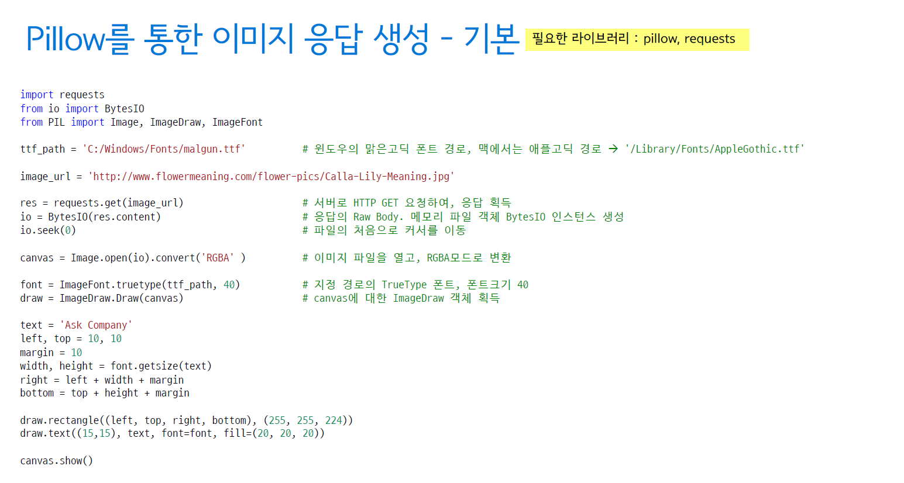


### 5. Pillow를 통한 이미지 응답 생성 -View

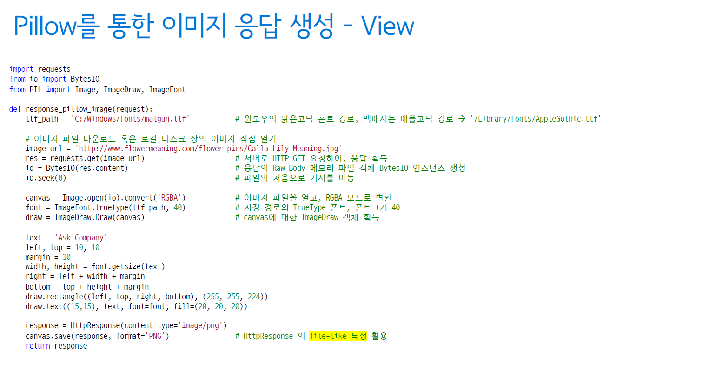


## III. URL Dispatcher와 정규 표현식

> 서버로 요청이 갈때는 기본적으로 주소 base에서 서버로 전달이 된다.

  

### 1. URL Dispatcher

- "특정 URL 패턴" > View의 List
- 프로젝트/settings.py에서 최상위 URLConf 모듈을 지정
  - 최초의 urlpatterns로부터 include를 통해, TREE구조로 확장
- HTTP 요청이 들어올 때마다, 등록된 urlpatterns 상의 매핑 리스트를 처음부터 **순차적으로** 훝으며 URL 매칭을 시도
  - 매칭이 되는 URL Rule이 다수 존재하더라도. **처음 Rule만을 사용**
  - 매칭되는 URL Rule이 없을 경우, 404 Page Not Found 응답을 발생

 

### 2. urlpatterns 예시

> shop/urls.py

 

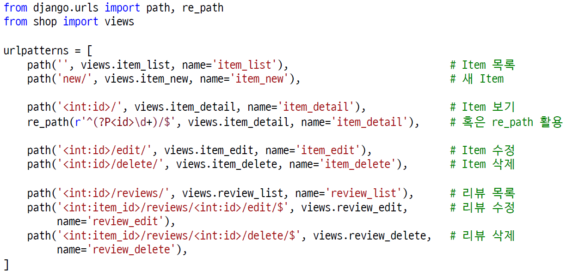


### 3. path()와 re_path()의 등장

> 장고 1.x에서의 Django.conf.urls.url() 사용이 2가지로 분리

 

- django.urls.re_path()
  - django.conf.urls.url()과 동일
- django.urls.path()
  - 기본 지원되는 Path converters를 통해 정규표현식 기입이 간소화 > 만능이 아닙니다.
  - 자주 사용하는 패턴을 Converter로 등록하면 재활용면에서 편리

```python
from django.conf.urls import url # django 1.x 스타일
from django.urls import path, re_path #django 2.x~ 스타일

urlpatterns = [
    # 장고 1.x에서의 다음 코드를
    url(r'^articles/(?P<year)[0-9]{4})/$',views.year_archive),
    
    # 다음과 같이 간소화 가능
    path('articles/<int:year>/', views.year_archive),
    
    # 물론 다음과 같이 동일하게 쓸 수 있습니다.
    re_path(r'^articles/(?P<year)[0-9]{4})/$',views.year_archive),
]
```


### 4. 기본 제공되는 Path Converters

 

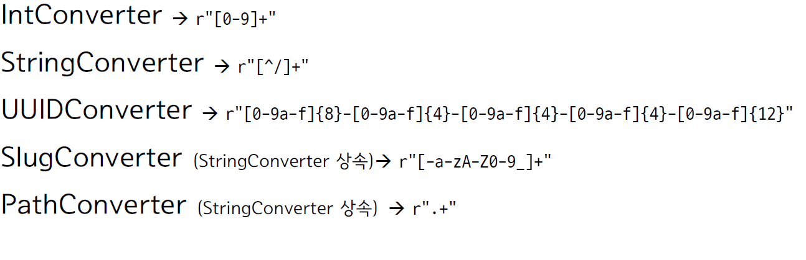

### 5. 정규 표현식

> Regular Expression


- 거의 모든 프로그래밍 언어에서 지원
- 문자열의 패턴, 규칙, Rule을 정의하는 방법
- 문자열 검색이나 치환작업을 간편하게 처리
- 장고 URL Dispatcher에서는 정규표현식을 통한 URL 매칭
- 문법
  - 1글자에 대한 패턴 + 연속된 출연 횟수 지정
  - 대괄호 내에 1글자에 대한 후보 글자들을 나열


### 6. 다양한 정규 표현식 패턴 예시

  

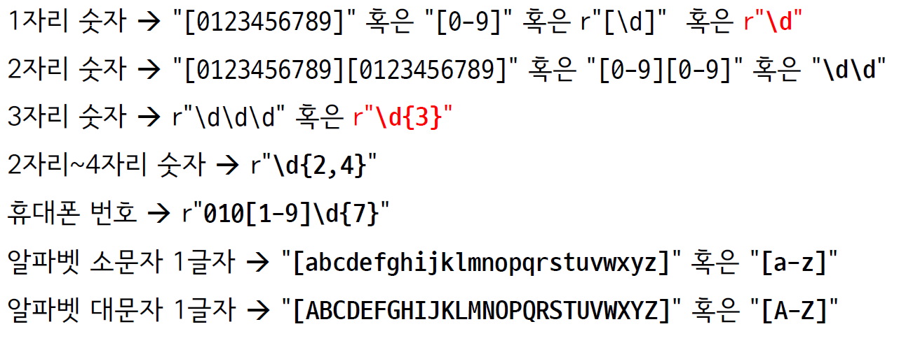


### 7. 반복횟수 지정 문법

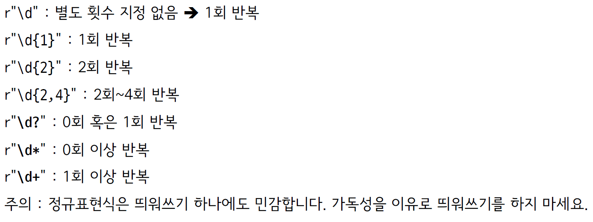


### 8. 커스텀 Path Converter

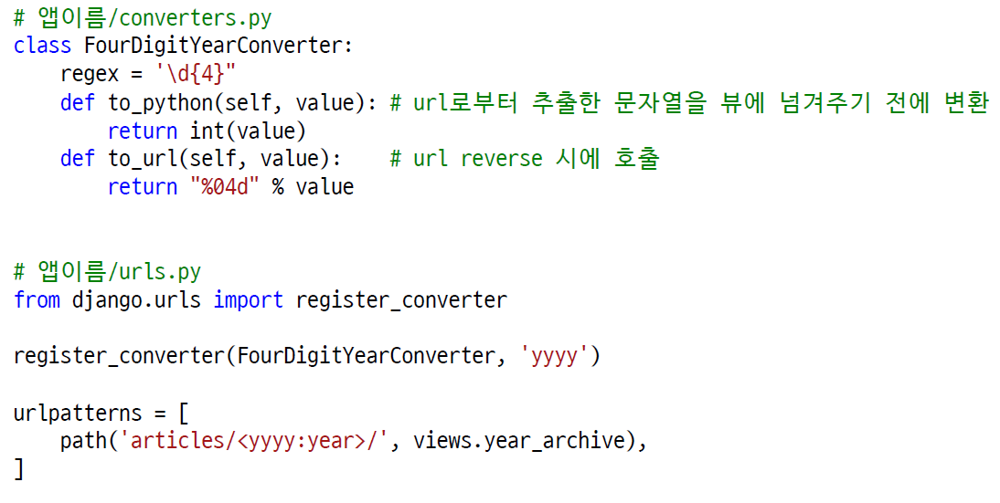


### 9. 커스텀 Converter 예시 : Slug Unicode

- 정규 표현식

  - slug_unicode_re = [-\w]+

- Converter

  ```python
  from django.urls.converters import StringConverter
  
  class SlugUnicodeConverter(StringConverter):
      regex = r"[-\w]+"
  ```

  

### 10. 새로운 장고 앱을 생성할 때, 추천 작업

> 앱 내 urls.py를 생성하고 등록해주세요

 

1. 앱 생성
2. 앱 이름/urls.py 파일 생성
3. 프로젝트/urls.py에 include 적용
4. 프로젝트/settings.py의 INSTALLED_APPS에 앱 이름 등록

 

 

## IV. Class Based View

- View 함수를 만들어주는 클래스
  - as_view() 클래스 함수를 통해, View 함수를 생성
  - 상속을 통해, 여러 기능들을 믹스인.
- 장고 기본 CBV 팩키지
  - django.views.generic
  - http://github.com/django/django/tree/3.0.2/django/views/generic
- 써드파티 CBV
  - django-braces
  - http://django-braces.readthedocs.io


### #1. FBV

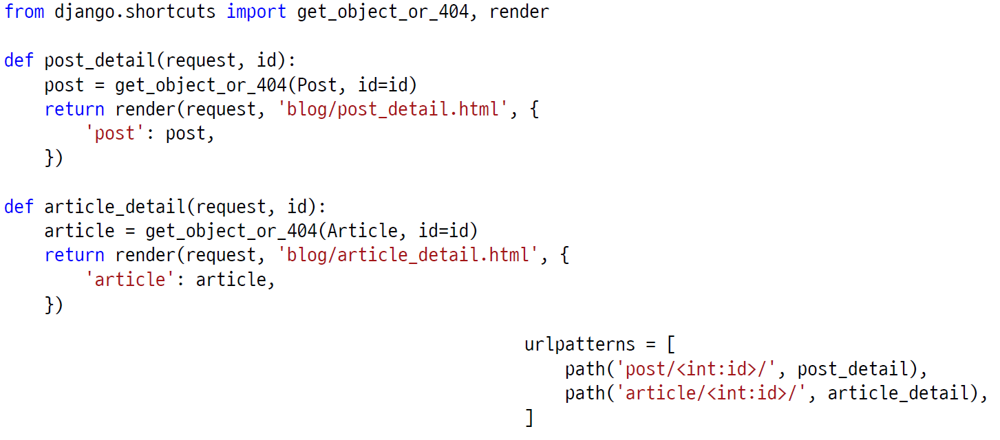


### #2.  함수를 통해, 동일한 View 함수 생성


예시) 실제로 사용할만하지는 않음

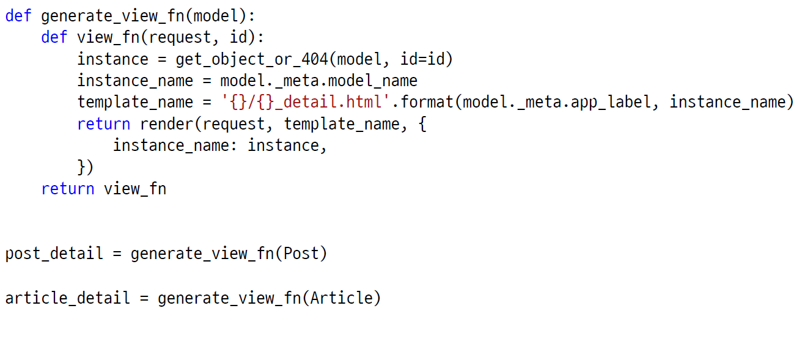

### #3. Class로 동일한 View 함수 구현


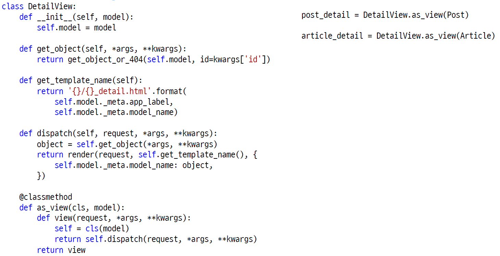


### #4. 장고 기본 제공 CBV 활용

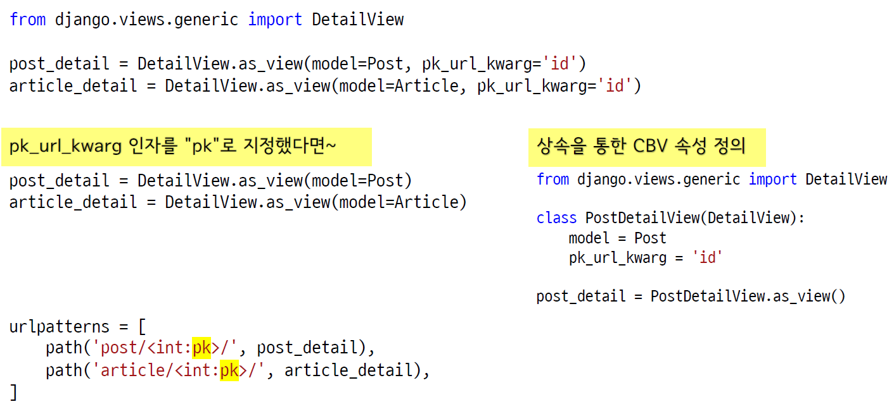


### CBV는~

- CBV가 정한 관례대로 개발할 경우, 아주 적은 양의 코드로 구현
  - 그 관례에 대한 이해가 필요 >  FBV를 통한 개발경험이 큰 도움
    - 필요한 설정값을 제공하거나, 특정 함수를 재정의하는 방식으로 커스텀 가능
    - 하지만, 그 관례를 잘 이해하지 못하고 사용하거나, 그 관례에서 벗어난 구현을 하고자 할 때에는 복잡해지는 경향이 있습니다.
- CBV를 제대로 이해할려면 ~
  - 코드를 통한 이해가 지름길
    - 파이썬 클래스에 대한 이해가 필요 (특히 상속, 인자 packing/unpacking)
  - http://github.com/django/django/tree/2.1/django/views/generic
- CBV 코드를 동일하게 동작하는 FBV로 구현해보는 연습을 추천

 

 

## V. 장고 기본 CBV API (Base views)


### Built-in CBV API

- Base views
  - View, TemplateView, RedirectView
- Generic display views
  - DetailView, ListView
- Generic date views
  - ArchiveIndexView, YearArchiveView, MonthArchiveView, WeekArchiveView, DayArchiveView, TodayArchiveView, DateDetailView
- Generic editin views
  - FormView, CreateView, UpdateView, DeleteView


### 1. Base Views

> django/views/generic/base.py

 

- View
- TemplateView
  - TemplateResponseMixin
  - ContentMixin
  - View
- RedirectView
  - View


#### (1) View

- 모든 CBV의 모체

  - 이 CBV를 직접 쓸 일은 거의 X

- http method별로 지정 이름의 멤버함수를 호출토록 구현

  - ex) Get요청이 오면 get 함수를 호출해서 처리

- CBV.as_view(**initkwargs)

  - initkwargs인자는 그대로 CBV 생성자로 전달

    ```python
    def __init__(self, **kwargs):
        for key, value in kwargs.items():
            setattr(self, key, value)
    ```

    

#### (2) TemplateView

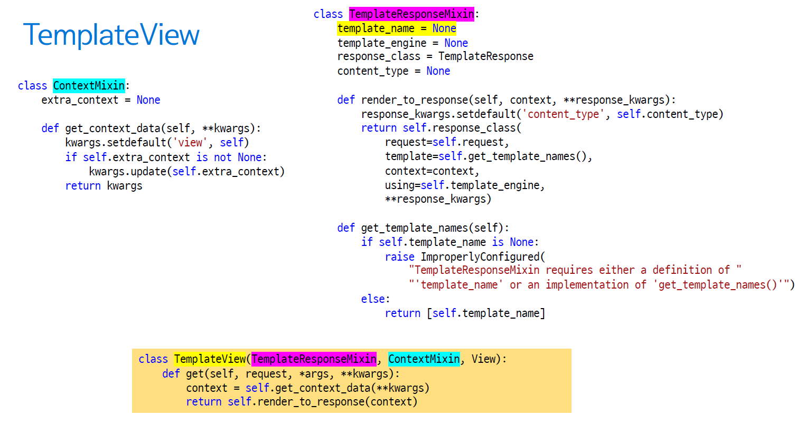


예시)

```python
#askcompany/urls.py

from django.conf.urls.static import static
from django.contrib import admin
from django.urls import path, include
from django.views.generic import TemplateView
from django.conf import settings

urlpatterns = [
    # 최상위 webpage에 path를 추가해보자.
    path('', TemplateView.as_view(template_name='root.html'), name='root'),
    
    path('admin/', admin.site.urls),
    path('instagram/', include('instagram.urls')),
    path('accounts/', include('accounts.urls')),
    path('blog1/', include('blog1.urls')),
]
```

```python
# askcompany/settings.py

TEMPLATES = [
    {
        'BACKEND': 'django.template.backends.django.DjangoTemplates',
        'DIRS': [
            # File System Template Loader
            # app과 관련되지 않은 template들은 여기에 경로를 저장해준다.
            # askcompany/templates/ 템플릿파일들
            os.path.join(BASE_DIR, 'askcompany', 'templates'),
        ],
        'APP_DIRS': True,
        'OPTIONS': {
            'context_processors': [
                'django.template.context_processors.debug',
                'django.template.context_processors.request',
                'django.contrib.auth.context_processors.auth',
                'django.contrib.messages.context_processors.messages',
            ],
        },
    },
]

```


#### (3) RedirectView

> 웹에서 페이지를 이동하는 방식
>
> - 서버단에서 서버응답에서 Redirect상태 코드를 주는 것
> - 자바스크립트 단에서 js code로 이동하는 방식

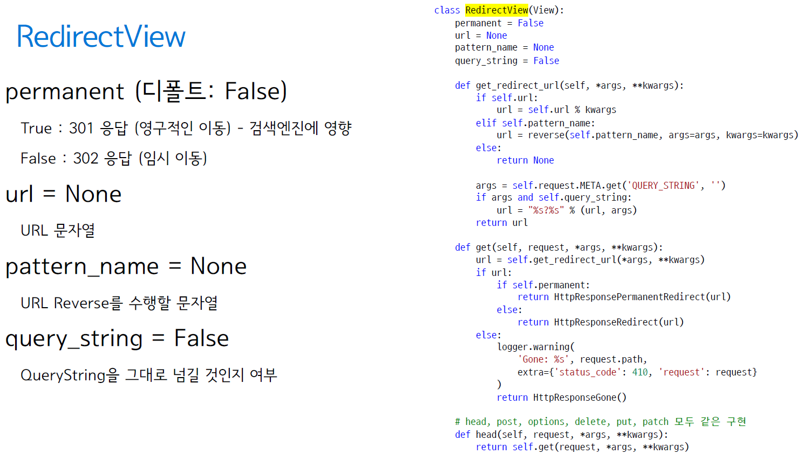

### 2. Generic display views


- DetailView
  - SingleObjectTemplateResponseMixin
    - TemplateResponseMixin
  - BaseDetailView
    - SingleObjectMixin
    - View
- ListView
  - MultipleObjectTemplateResponseMixin
    - TemplateResponseMixin
  - BaseListView
    - MultipleObjectMixin << ContextMixin
    - View


#### (1) DetailView

1개의 모델의 1개 Object에 대한 템플릿 처리

- 모델의 소문자 이름의 Model Instance를 템플릿에 전달
  - 지정 pk 혹은 slug에 대응하는 Model Instance


```python
from django.views.generic import DetailView
from .models import Post

post_detail1 = DetailView.as_view(model=Post)

class PostDetailView(DetailView):
    model = Post
post_detail2 = PostDetailView.as_view()
```


#### (2) DetailView(상속 관계)

> django.views.generic.detail.DetailView

 

- SingleObjectTemplateResponseMixin
  - template_name이 짖어되지 않았따면, 모델명으로 템플릿 경로 유추
    - TemplateResponseMixin
- BaseDetailView
  - SingleObjectMixin : url_kwarg로 지정된 Model Instance 획득
    - ContextView
  - View


#### (3) ListView

- 1개 모델에 대한 List 템플릿 처리
  - 모델명소문자_list 이름의 QuerySet을 템플릿에 전달
- **페이징 처리 지원**

```python
from django.views.generic import ListView
from .models import Post

post_list1 = ListView.as_view(model=Post)
post_list2 = ListVIew.as_view(model=Post, paginate_by=10)
```

```python
from django.views.generic import ListView
from .models import Post

class PostListView(ListView):
    model = Post
    paginate_by = 10
    
post_list3 = PostListView.as_view()
```

```python
from django.views.generic import ListView
from .models import Post

class PostListView(ListView):
    model = Post
    paginate_by = 10
    
	def get_queryset(self):
        qs = super().get_queryset()
        qs = qs.filter(...)
        return qs
post_list4 = PostListView.as_view()
```


#### 4. ListView 상속관계

> django.views.generic.list.ListView

 

- MultipleObjectTemplateResponseMixin
  - template_name이 지정되지 않았다면, 모델명으로 템플릿 경로 유추
    - TemplateResponseMixin
- BaseListView
  - MultipleObjectMixin : Paginator가 적용된 QuerySet 획득
    - ContextMixin
  - View

#### ListView로 페이징 처리하기

> django-bootstarp4를 이용하여 간단한 page UI 구현

  

#### django-bootstrap4 설치하기

```shell
pip install django-bootstrap4
```

```python
# requirements.txt

django~=3.0.0
pillow
django-debug-toolbar
django-extensions
django-bootstrap4
```

```python
INSTALLED_APPS = [
    #django apps
    'django.contrib.admin',
    'django.contrib.auth',
    'django.contrib.contenttypes',
    'django.contrib.sessions',
    'django.contrib.messages',
    'django.contrib.staticfiles',
    # third apps
    
    # bootstrap4 추가
    'bootstrap4',
    
    
    'django_extensions',
    'debug_toolbar',
    # locals apps
    'blog1',
    'instagram',
    'accounts',
]
```


```python
# 1. 
from django.views.generic import ListView

post_list = ListView.as_view(model=Post, paginate_by=10)
```

```html


<!DOCTYPE html>
<html lang="ko">
<head>
    <meta charset="UTF-8">
    <meta name="viewport" content="width=device-width, initial-scale=1.0">
    <title>Instagram / Post List</title>
    <link rel="stylesheet" href="https://stackpath.bootstrapcdn.com/bootstrap/4.4.1/css/bootstrap.min.css" integrity="sha384-Vkoo8x4CGsO3+Hhxv8T/Q5PaXtkKtu6ug5TOeNV6gBiFeWPGFN9MuhOf23Q9Ifjh" crossorigin="anonymous">
</head>
<body>
    <form action="" method="get">
        <input type="text" name="q" value="{{ q }}" />
        <input type="submit" value="검색" />
    </form>
    <table class="table table-bordered table-hover">
        <tbody>
            
                <tr>
                    <td>
                        {{ post.pk }}
                    </td>
                    <td>
                        
                            
                        
                            No Photo
                        
                    </td>
                    <td>
                        {{ post.message }}
                    </td>
                </tr>
            
        </tbody>
        </td>
    </table>
    

        
    
</body>
</html>
```


### 5. View 장식자(Decorators)


#### 어떤 함수를 감싸는 (Wrapping) 함수

```python
from django.contrib.auth.decorators import login_required
from django.shrtcuts import render

@login_required
def protected_view1(request):
    return render(request, 'myapp/secret.html')
```

```python
from django.contrib.auth.decorators import login_required
from django.shrtcuts import render

def protected_view1(request):
    return render(request, 'myapp/secret.html')

protected_view1 = login_required(protected_view1)
```

#### 위 두 코드는 동일한 코드


#### (1) 몇가지 장고 기본 Decorators

- django.views.decorator.http
  - require_http_methods, require_GET, require_Post, require_safe
    - 지정 method가 아닐 경우, HttpResponseNotAllowed 응답 (상태코드 405) 반환
- django.contrib.auth.decorators
  - user_passes_test : 지정 함수가 False를 반환하면 login_url로 redirect
    - 어떤 유저가 조건이 맞지 않을 때 login_url로 이동을 시킴
  - login_required : 로그아웃 상황에서 login_url로 redirect
  - permission_required : 지정 퍼미션이 없을 때 login_url로 redirect
    - 장고 기본 내 permission system 에 따라서 permission을 문자열로 지정할 수 있다.
    - 해당 view에 접근하기 위해서는 permission이 필요하다. 
    - permission이 없다면 login_url로 이동
- django.contrib.admin.views.decorators
  - staff_member_required : staff member가 아닐 경우 login_url로 이동


#### 예시

```python
# instaram/views.py

from django.shortcuts import render
from django.http import HttpResponse
from .models import Post
from django.views.generic import DetailView, ListView
from django.contrib.auth.decorators import login_required


# admin logout을 하게 되면 주소/instagram/ 에서 post들을 볼 수 없다.
@login_required
def post_list(request):

    qs = Post.objects.all()
    # 검색어 : q get('검색어', 'default값')
    q = request.GET.get('q', '')
    if q:
        qs = qs.filter(message__icontains=q)

    # render('view함수의 request', 'app 이름/원하는 템플릿명', 'template내에서 qs를 참조할 이름')
    # 템플릿을 만들 장소
    # instagram/templates/instagram/post_list.html
    return render(request, 'instagram/post_list.html', {
        'post_list': qs,
        'q' : q,
    })

```


#### (2) CBV에 장식자 입히기 #1

> 가독성이 좋지 않다.

 

- 요청을 처리하는 함수를 Wrapping 하기

```python
from django.contrib.auth.decorators import login_required
from django.views.generic import TemplateView

class SecretView(TemplateView):
    template_name = 'myapp/secret.html'

view_fn = SecretView.as_view()
secret_view = login_required(view_fn) #이미 생성된 함수에 장식자를 입힐 수도 있다.
```


#### (3) CBV에 장식자 입히기 #2

> dispatch 재정의

 

```python
from django.contrib.auth.decorators import login_required
from django.utils.decorators import method_decorator
from django.views.generic import TemplateView

class SecretView(TemplateView):
    template_name = 'myapp/secret.html'
    
    # 클래스 멤버함수에는 method_decorator를 활용
    @method_decorator(login_required)
    def dispatch(self, *args, **kwargs):
        return super().dipatch(*args, **kwagrs)

secret_view = SecretView.as_view()
```


#### (4) CBV에 장식자 입히기 #3

```python
from django.contrib.auth.decorators import login_required
from django.utils.decorators import method_decorator
from django.views.generic import TemplateView

@method_decorator(login_required, name='dispatch')
class SecretView(TemplateView):
    template_name = 'myapp/secret.html'

secret_view = SecretView.as_view()
```

  

## 6. Generic date Views

> 날짜 관련된 filtering을 하는 class view

  

- ArchiveIndexView : 지정 날짜필드 역순으로 정렬된 목록
- YearArchiveView : 지정 year년도의 목록
- MonthArchiveView : 지정 year/month 월의 목록
- WeekArchiveView: 지정 year/week 주의 목록
- DayArchiveView : 지정 year/month/day 일의 목록
- TodayArchiveView : 오늘 날짜의 목록
- DateDetailView : 지정 year/month/day 목록 중에서 특정 pk의 detail
  - DetailView와 비교 : URL에 yaere/month/day를 쓰고자 할 경우에 유용


#### (1)allow _future (디폴트 : False)

- False : 현재시간 이후의 Record는 제외


#### (2) ArchiveIndexView

> 지정 날짜필드 역순으로 정렬된 목록 : 최신 목록을 보고자 할 때

 

- 필요한 URL 인자 : 없음
- 옵션
  - model
  - date_field : 정렬 기준 필드
  - date_list_period (디폴트: "year")
- 디폴트 template_name_suffix : "_archive.html"
- Context
  - latest : QuerySet
  - date_list : 등록된 Record의 년도 목록

```python
from django.views.generic import ArchiveIndexView
from .models import Post

post_archive = ArchiveIndexView.as_view(mode=Post, date_field='created_at')
```


#### (3) YearArchiveView

> 지정 year년도의 목록

 

- 필요한 URL 인자 : "year"
- 옵션
  - model, date_field
  - date_list_period (디폴트: "month")
    - 지정 년도에서 month 단위로 Record가 있는 날짜 리스트
  - make_object_list (디폴트: False)
    - 거짓일 경우, object_list를 비움
- 디폴트 template_name_suffic : "_archive_year.html"
- Context
  - year, pervious_year, next_year
  - date_list : 전체 Record의 월 목록
  - object_list

```python
urlpatterns = [
    re_path(r'^archive/(?P<year>\d{4})/$', ...)
]
```

```python
from django.views.generic.dates import YearArchiveView
from .models import Post

class PostYearArchiveView(YearArchiveView):
    model = Post
    date_field = 'created_at'
    # make_object_list = False
```


#### (4) MonthArchiveView

> 지정 year/month 월의 목록


- 필요한 URL 인자
  - "year", "month"
- 옵션
  - month_format (디폴트: "%b")
    - 숫자 포맷은 "%m"
- 디폴트 template_name_suffix : "_archive_month.html"
- Context
  - month, previous_month, next_month
  - date_list: 전체 Record의 날짜 목록
  - object_list

```python
urlpatterns = [
    re_path(r'^archive/(?P<year>\d{4})/(?P<month>\d{1,2})\$', ...)
]
```


```python
from django.veiws.generic.dates import MonthArchiveView
from .models import Post

class PostMonthArchiveView(MonthArchiveView):
    model = Post
    date_field = 'created_at'
    month_format = '%m'
```


#### (5) WeekArchiveView

> 지정 year/week 주의 목록

 

- 필요한 URL 인자
  - "year", "week"
- 옵션
  - week_format
    - "%U" (디폴트) : 한 주의 시작을 일요일로 지정
    - "%W" : 한 주의 시작을 월요일로 지정
- 디폴트 template_name_suffix : "_archive_week.html"
- Context
  - week, previous_week, next_week
  - date_list : 전체 Record의 날짜 목록
  - object_list

```python
urlpatterns = [
    re_path(r'^archive/(?P<year>\d{4})/week/(?P<week>\d{1,2})/$', ...),
]
```

```python
from django.views.generic.dates import WeekArchiveView
from .models import Post

class PostWeekArchiveView(WeekArchiveView):
    model = Post
    date_field = 'created_at'
    week_format = '%U'
```


#### (6) DayArchiveView

> 지정 year/month/day

  

- 필요한 URL 인자
  - "year", "week", "day"
- 옵션
  - month_format (디폴트: "%b")
    - 숫자 포맷은 ("%m")
- 디폴트 template_name_suffix : "_archive_day.html"
- Context
  - day, previous_day, next_day
  - date_list : 전체 Record의 날짜 목록
  - object_list


```python
urlpatterns = [
    re_path(r'^archive/(?P<year>\d{4})/'
            r'(?P<month>\d{1,2})/(?P<day>\d{1,2})/$', ...),
]
```

```python
from django.views.generic.dates import DayArchiveView
from .models import Post

class PostDayArchiveView(DayArchiveView):
    model = Post
    date_field = 'created_at'
    month_format = '%m'
```


#### (7) TodayArchiveView

> 오늘 날짜의 목록

 

- DayArchiveView와 유사하게 동작하지만,
  - year/month/day 인자를 받지 않습니다.
  - previous_day, next_day 미제공

```python
from django.views.generic.dates import TodayArchiveView
from .models import Post

post_today_archive = TodayArchiveView.as_view(model=Post, date_field='created_at')
```


#### (8) DateDetailView

> 지정 year/month/day 목록 중에서 특정 pk의 detail

 

- 필요한 URL 인자
  - "year", "month", "day", "pk"(or "slug")

```python
urlpatterns = [
    re_path(r'^archive/(?P<year>\d{4})/(?P<month>\d{1,2})/(?P<day>\d{1,2})/?P<pk>\+/$',...)
]
```

```python
from django.views.generic.dates import TodayArchiveView
from .models import Post

class PostDateDetailView(DateDetailView):
    model = Post
    date_field = 'created_at'
    month_format = '%m'
```


## VII.  적절한 HTTP 상태코드로 응답하기


-  웹 서버는 적절한 상태코드로서 응답해야 합니다.
- 각 HttpResponse 클래스마다 고유한 status_code가 할당
- REST API를 만들 때, 특히 유용


```python
class HttpResponseRedirect(HttpResponseRedirectBase):
    status_cod = 302
```

```python
from django.http import HttpResponse

def test_view(request):
    # Return a "created" (201) response code.
    return HttpResponse(status=201)
```


#### (1) 대표적인 상태 코드


- 200번대 : 성공
  - 200 : 서버가 요청이 잘 처리했다.  >>> OK
  - 201: 작성됨, 서버가 요청을 접수하고, 새 리소스를 작성했다.
- 300번대 : 요청을 마치기 위해, 추가 조치가 필요하다.
  - 301: 영구 이동, 요청한 페이지가 새 위치로 영구적으로 이동했다.
  - 302: 임시 이동, 페이지가 현재 다른 위치에서 요청에 응답하고 있지만, 요청자는 향후 원래 위치를 계속 사용해야 한다.
- 400 번대: 클라이언트측 오류
  - 400 : 잘못된 요청
  - 401 : 권한이 없음
  - 403 (Forbidden) : 필요한 권한을 가지고 있지 않아서, 요청을 거부
  - 404: 서버에서 요청한 리소스를 찾을 수 없다.
  - 405 : 허용되지 않는 방법. POST 방식만을 지원하는 뷰에 GET 요청을 할 경우
- 500 번대 : 서버측 오류
  - 500: 서버 내부 오류 발생


#### (2) 200 응답하는 몇가지 예

```python
from django.http import HttpResponse, JsonResponse
from django.shortcuts import render

def view1(request):
    return HttpResponse('hello, Ask Company')
def view2(request):
    return render(request, 'template.html')
def veiw3(requset):
    return JsonResponse({'hello' : 'Ask Company'})
```


#### (3) 302 응답하는 몇 가지 예


```python
from django.http import HttpResponseRedirect
from django.shortcuts import redirect, resolve_url

def view1(request):
    return HttpResponseRedirect('/shop/')
def view2(request):
    url = resolve_url('shop:item_list') # 후에 배울 URL Reverse 적용
    return HttpResponseRedirect(url)
def view3(request):
    # 내부적으로 resolve_url 사용
    # 인자로 지정된 문자열이 url reverse에 실패할 경우,
    # 그 문자열을 그대로 URL로 사용하여, redirect 시도
    return redirect('shop:item_list')
```


#### (4) 404 응답하는 몇가지 예

```python
from django.http import http 404, HttpResponseNotFound
from django.shortcuts import get_object_or404
from shop.models import Item

def view1(request):
    try:
        item = Item.objects.get(pk=100)
    except Item.DoesNotExist:
        raise Http404
def view2(request):
    item = get_object_or404(Item, pk=100) # 내부에서  raise Http404
    
def view3(request):
    try:
        item = Item.object.get(pk=100)
    except Item.DoesNotExist:
        return HttpResponseNotFound()
```


#### (5) 500 응답하는 몇 가지 예

- 뷰에서 요청 처리 중에, 뷰에서 미처 잡지 못한 오류가 발생했을 경우
  - IndexError, KeyError, django.db.models.ObjectDoesNotExist 등

```python
from shop.models import Item

def view1(request):
    # IndexError
    name = ['Tom', 'Steve'][100]
    
    # 지정 조건의 Item 레코드가 없을 때, Item.DoesNotExist 예외
    # 지정 조건의 Item 레코드가 2개 이상 있을 때, Item.MultipleObjectsReturn 예외
    item = Item.objects.get(pk=100)
```


#### (6) 다양한 HttpResponse 서브 클래스

> 지정 상태코드의 응답이 필요할 때

 

- HttpResponseRedirect : 상태코드 302
- HttpResponsePermanentRedirect : 상태코드 301 (영구 이동)
- HttpResponseNotModified : 상태코드 304
- HttpResponseBadRequest : 상태코드 400
- HttpResponseNotFound : 상태코드 404
- HttpResponseForbidden : 상태코드 403
- HttpResponseNotAllowed : 상태코드 405
- HttpResponseGone : 상태코드 410
- HttpResponseServerError : 상태코드 500


## VII. URL Reverse


### 1. URL Dispatcher

> urls.py 변경만으로 "각 뷰에 대한 URL"이 변경되는 유연한 URL 시스템


```python
# "/blog/", "/blog/1/" 주소로 서비스하다가
urlpatterns = [
    path('blog/', blog_views.post_list, name='post_list'),
    path('blog/<int:pk>/', blog_views.post_detail, name='post_detail'),
]
```

```python
# 다음과 같이 변경을 하면
# 이제 "/weblog/", "/weblog/1/" 주소로 서비스하게 됩니다.

urlpatterns = [
    path('weblog/', blog_views.post_list, name='post_list'),
    path('weblog/<int:pk>/', blog_views.post_detail, name='post_detail'),
]
```


### 2. URL Reverse의 혜택


- 개발자가 일일이 URL을 계산하지 않아도 됩니다.
- URL이 변경되더라도, URL Reverse가 변경된 URL을 추적


### 3. 직접 URL을 계산한다면?

1. blog앱 Post목록을 볼려면, post_list 뷰를 호출해야하니깐,
2. urls.py를 뒤적거리며, URL 계산계산
3. 계산 완료!  >>> /blog/주소를 쓴다

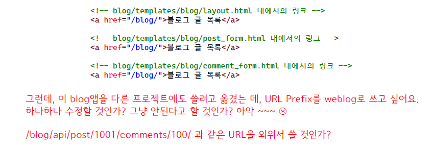

### 4. URL 계산은 장고에게 양보하세요

1. blog앱 Post목록을 볼려면, post_list 뷰를 호출해야하니깐,
2. ~~urls.py를 뒤적거리며, URL 계산계산~~
3. ~~계산 완료!  >>> /blog/주소를 쓴다~~

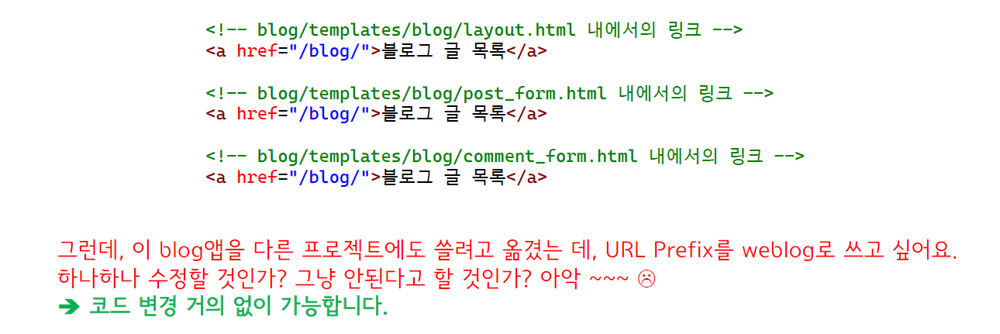


### 5. URL Reverse를 수행하는 4가지 함수 (1)

- url 템플릿태그
  - 내부적으로 reverse 함수를 사용
- reverse 함수
  - 매칭 URL이 없으면 NoReverseMatch 예외 발생
- resolve_url 함수
  - 매핑 URL이 없으면 "인자 문자열"을 그대로 리턴
  - 내부적으로 reverse 함수를 사용
- redirect 함수
  - 매칭 URL이 없으면 "인자 문자열"을 그대로 URL로 사용
  - 내부적으로 resolve_url 함수를 사용


### 6. URL Reverse를 수행하는 4가지 함수 (2)

```python

 #문자열 URL
```

```python
reverse('blog:post_detail', args=[100])
reverse('blog:post_detail', kwargs={'pk':100}) #문자열 URL
```

```python
resolve_url('blog:post_detail', 100)
resolve_url('blog:post_detail', pk=100)
resolve_url('/blog/100') #문자열 URL
```

```python
redirect('blog:post_detail', 100)
redirect('blog:post_detail', pk=100)
redirect('/blog/100/') # HttpResponse 응답 (301 or 302)
```


### 7. 모델 객체에 대한 detail 주소 계산

- 매번 다음과 같은 코드로 하실 수도 있겠지만,
  - resolve_url('blog:post_detail', pk=post.pk)
  - redirect('blog:post_detail', pk=post.pk)
  - 
- 다음과 같이 사용하실 수도 있습니다.
  - resolve_url(post)
  - redirect(post)
  - {{ post.get_absolute_url }}

 

### 8. 모델 클래스에 get_absolute_url() 구현

- resolve_url 함수는 가장 먼저 get_absolute_url() 함수의 존재여부를 체크하고, 존재할 경우 reverse를 수행하지 않고 그 리턴값을 즉시 리턴

```python
# django/shortcuts.py

def resolve_url(to, *args, **kwargs):
    if hasattr(to, 'get_absolute_url'):
        return to.get_absolute_url()
   	# 중략
    try:
        return reverse(to, args=args, kwargs=kwargs)
    except NoReverseMatch:
        # 나머지 코드 생략
```


### 9. resolve_url/redirect를 위한 모델 클래스 추가 구현

```python
from django.urls import reverse

class Post(models.Model):
    # 중략
    def get_absolute_url(self):
        return reverse('blog:post_detail', args=[self.pk])
```


#### 활용 예시

```python
# instagram/models.py
from django.db import models
from django.conf import settings
from django.urls import reverse

class Post(models.Model):
    author = models.ForeignKey(settings.AUTH_USER_MODEL, on_delete=models.CASCADE)
    message = models.TextField()
    photo = models.ImageField(blank=True, upload_to='instagram/post/%Y/%m/%d')
    tag_set = models.ManyToManyField('Tag', blank=True)
    is_public = models.BooleanField(default=False, verbose_name='공개여부')
    created_at = models.DateTimeField(auto_now_add=True)
    updated_at = models.DateTimeField(auto_now=True)

    def __str__(self):
        # return f'Custom Post object ({self.id})'
        # return 'Custom Post object ({})'.format(self.id)
        return self.message
    
    # get_absolute_url 함수
    def get_absolute_url(self):
        return reverse('instagram:post_detail', kwargs={"pk": self.pk})
```

```html
<td>
    <a href="{{ post.get_absolute_url }}">
        {{ post.message }}
    </a>
</td>
```

#### 참고

```python
from django.shortcuts import resolve_url
from instagram.models import Post

resolve_url(Post.objects.first())
```

#### 출력

```
'/instagram/105/'
```


#### 그 외 활용

- CreateView / UpdateView

  - success_url을 제공하지 않을 경우, 해당 model instance 의 get_absolute_url 주소로 이동이 가능한지 체크하고, 이동이 가능할 경우 이동

  - 생성/수정하고나서 Detail화면으로 이동하는 것은 자연스러운 시나리오

    

- 특정 모델에 대한 Detail뷰를 작성할 경우

  - Detail뷰에 대한 URLConf설정을 하자마자, 필히 get_absolute_url 설정을 해주세요. 코드가 보다 간결해집니다.