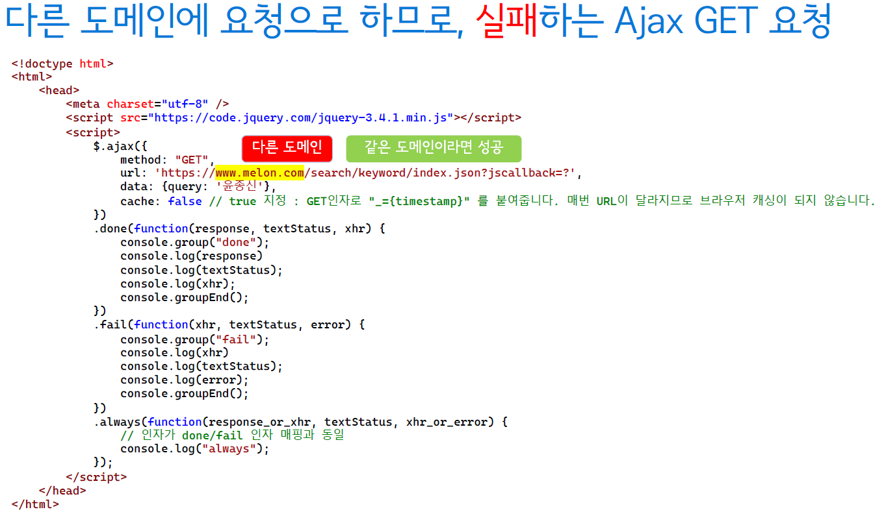
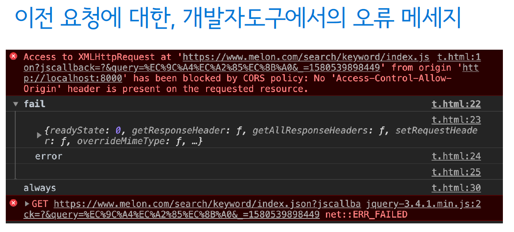
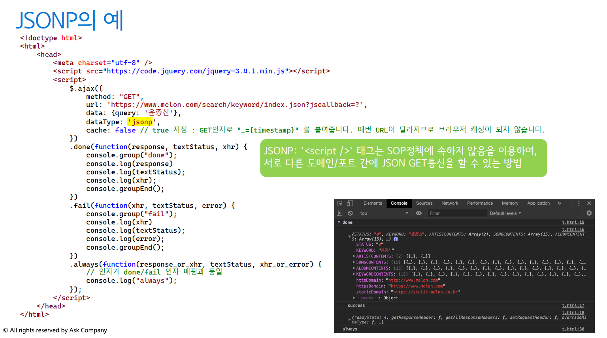
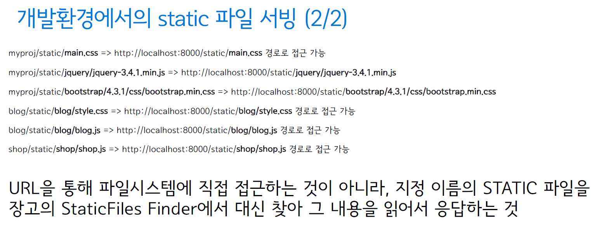
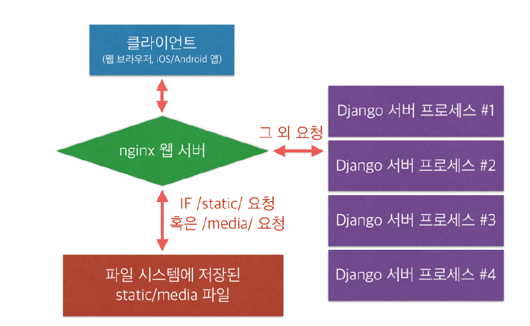
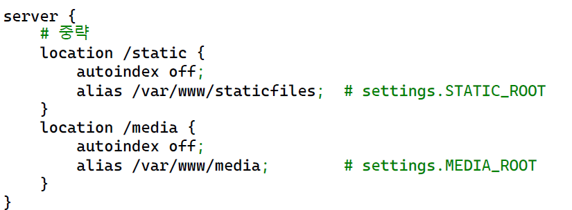

# Django

​        

### 사전 지식

> Django를 배우기 전에 다음과 같은 기초 지식이 필요합니다.

- [x] **Python**
- [x] **jQuery**
- [x] **HTML / CSS / Javascript **

​     

### Goal

- [x] **Web Front End Basic**
- [x] **CSS Layout**
- [x] **JavaScript와 jQuery**
- [x] **JavaScript와 jQuery**
- [x] **휴대폰 망을 통해 웹에 접속하는 방법**
- [x] **Django가 static 파일을 다루는 방법**


## I. Web Front End Basic


- 웹 프론트엔드를 위한 3가지 언어
  - HTML(Hyper Text Markup Language) : 웹페이지 내용 및 구조
  - CSS (Cascading Style Sheet) : 웹 페이지의 스타일
  - JavaScript : 웹 페이지의 로직


#### 위 세 언어는 모든 웹브라우저에서 거의 유사하게 동작합니다.

여러 버전의 HTML/CSS/JavaScript가 있으며, 브라우저마다 지원하는/ 구현된 Features가 다를 수도 있습니다.


### 1. CSS / JavaScript 파일을 별도 파일로 분리하는 이유

- HTML 응답 body 크기를 줄일 수 있습니다.
- 여러 번 새로고침하더라도, 브라우저 캐싱기능을 통해 같은 파일을 서버러부터 다시 읽어들이지 않습니다.
- 웹페이지 응답성을 높여줄 수 있습니다.


### 2. CSS / JavaScript의 슈퍼셋 언어

- CSS 소스코드
  - 처음에는 직접 CSS 날코딩을 하시고,
  - 추후에는 성향에 따라 Sass, Less를 검토해보세요
    - sass, less 문법으로 작성된 코드를 빌드하여, css파일을 만들어냅니다.
- JavaScript
  - 청므에는 직접 JavaScript 날코딩을 하시고,
  - 추후에는 성향에 따라 TypeScript를 검토해보세요.
    - TypeScript 문법으로 작성되는 코드를 빌드하여, javascript파일을 만들어냅니다.


### 3. Web Front-End and Back-End

> 웹 프론트엔드와 백엔드

 

- 웹 개발은 크게 백엔드와 프론트엔드 개발로 나눠집니다. 장고는 백엔드에 초점이 맞춰진 웹프레임워크입니다.
- 장고를 공부하실 때에는 백엔드에 포커스를 맞춰서 공부하시고, 웹프론트엔드는 최소화하세요.
  - 2가지를 모두 한번에 잘할 수는 없습니다. 우선순위를 백엔드에 먼저 두세요. Android/iOS 앱도 일단 미뤄두세요.
  - 단 번에 완전한 웹서비스를 만들 순 없습니다. 점진적으로 개선해가세요.


### 4. 개발 언어

- 프론트엔드 개발언어(여러 클라이언트 단 중 하나)
  - 브라우저 단에서 실행이 됩니다.
  - HTML/CSS/JavaScript의 조합
- 백엔드 개발언어 (서버 단)
  - 클라이언트 단의 요청을 처리/응답만 할 수 있으면 됩니다.
  - 다양한 언어가 가능하며, 여러 언어/프레임워크를 섞어쓰실 수도 있습니다. (Python, NodeJS, Ruby, Java 등)


#### 5. 웹 요청 및 응답

- 웹은 HTTP(S) 프로토콜로 동작합니다.
- 하나의 요청은 클라이언트가 웹 서버로 요청하며, 웹서버는 요청에 맞게 응답을 해야합니다.
  - 응답은 HTML 코드 문자열, CSS 코드 문자열, JavaScript 코드 문자열, Zip, MP4 등 어떠한 포맷이라도 가능합니다.
- 웹 서버에서 응답을 만들 때, 요청의 종류를 구분하느 ㄴ기준
  - URL (일반적), 요청헤더. 세션, 쿠키 등
- 웹서버의 구성에 따라
  - /static/flower.jpg : JPG 파일 내용을 응답으로 내어주도록 설정했습니다.
  - /blog/image/flower.jpg : 장고 View를 통해 , JPG 파일 내용을 응답으로 내어주도록 설정했습니다.
  - /blog/image/flower/: 장고 View를 통해. JPG 파일 내용을 응답으로 내어주도록 설정했습니다.
- 웹 서버 구성에 따라, 특히 요청에 대한 응답을 Apache/Nginx 웹 서버에도 할 수도 있고 Django View에서 응답을 할 수도 있습니다.


#### 단지 하나의 HTTP 요청에 대해, 하나의 응답을 받습니다.

1. 브라우저에서 서버로 HTTP 요청
2. 서버에서는 해당 HTTP요청에 대한 처리 : 장고에서는 관련 뷰 함수가 호출
3. 뷰 함수에서 리턴해야만 비로소 HTTP 응답이 시작되며, 그 HTPP 응답을 받기전까지는 하얀 화면만 보여집니다. 따라서 뷰 처리시간이 길어질수록 긴 화면이 보여지는 시간이 길어집니다.
4. 브라우저는 서버로부터 HTTP 문자열 응답을 **1줄씩 해석하여**, 그래픽적으로 표현합니다.


#### 만약 HTML 문자열 응답에 추가 리소스가 지정되어있다면?

```html
<!DOCTYPE html>
<html lang="en">
<head>
    <meta charset="UTF-8">
    <meta name="viewport" content="width=device-width, initial-scale=1.0">
    <title>Document</title>
    
    <!-- HTML 문자열은 1줄씩 처리되며, 외부 리소스는 해당 리소스가 
	로딩완료/실행될 때까지 대기합니다. -->
    <link rel="stylesheet" href='/static/style.css'/>
    
</head>
<body>
    
</body>
</html>
```


### 6. HTML UI 응답성이 낮아지는 경우

- 과도한 JavaScript 로딩 및 계산
- 과도한 CSS 레이아웃 로딩 및 계산
- 잦은 시각적 개체 업데이트


#### HTML UI 응답성을 높이기 위해

- 실서비스에 CSS / JavaScript 파일은 Minify시켜서 다운로드 용량을 줄입니다.
- 대개 CSS를 HTML컨텐츠보다 앞에 위치시키고
  - CSS가 컨텐츠보다 뒤에 위치한다면, 유저에게는 스타일이 적용되지 않은 HTML 컨텐츠가 먼저 노출될 수 있습니다.
- JS를 HTML 컨텐츠보다 뒤에 위치시킵니다.
  - JS는 스타일에 직접적인 영향을 끼치지 않기 때문에, HTML 컨텐츠보다 나중에 로딩되어도 대개 괜찮습니다.
  - 꼭 필요한 몇몇 JS는 HTML 컨텐츠보다 앞에 위치시키기도 합니다.


### 7. 문서의 시대 > 웹 애플리케이션의 세계 OPEN

> 구글맵이 나오면서부터

- 표준 웹 기술만으로 웹문서에서 탈피하여, 웹 어플리캐이션이 등장
  - 웹 어플리케이션에서는 복잡한 UI 처리가 필요하므로, React/Vue/Angular 등을 많이 사용합니다.
- 표준 웹기술만으로 지도 서비스가 가능합니다
  - 이전에는 ActiveX 혹은 Flash를 통해서만 구현가능했습니다.


## II. CSS Layout


### 1. CSS

> Cascading Style Sheets

  

- 각 HTML 엘리먼트에 대한 스타일을 기술


- MSN 웹 문서 : https://developer.mozilla.org/ko/docs/Web/CSS
  - CSS 단계별 입문서
  - CSS 개발자 안내서
  - CSS 배우기


### 2. Table 기반의 레이아웃

> Table 기반의 레이아웃이 흥하던 시절이 있었습니다.


- HTML로 문서의 구조를, CSS로 스타일링을 한다는 개념이 보급되기 전에는 `<table>`태그로 레이아웃을 잡았습니다.
- Table for Layout은 직관적인 레이아웃이지만, 웹표준 방식에 맞지 않습니다.
- CSS Layout 방식은?
  - 코드 용량 절감
  - 사람이나 컴퓨터가 이해하기 쉬운 구조
  - 쉬운 유지 보수


### 3. CSS 러닝커브

- 쉴새없이 새로운 CSS가 나오고 있습니다. 브라우저 간의 차이도 있습니다.
- 바닥부터 한땀한땀 CSS 스타일링을 하는 것은 너무나도 고통스럽습니다. 


### 4. 반응형 웹

- 브라우저의 가로크기에 따라 각기 다른 CSS 스타일을 적용(다른 레이아웃을 적용)되는 웹페이지
- CSS Media Queries를 통해 구현
  - https://developer.mozilla.org/ko/docs/Web/Guide/Css/Media_queries


```css
@media (max-width: 600px) {
    body {
        background-color: green;
    }
}
```


### 5. 반응형 웹의 단점


#### <장점>

- 예전에는 모바일/데스크탑 페이지를 따로 만드는 경우도 많았으나, 반응형 웹으로 구현하면 한페이지에서 모바일/데스크탑 페이지를 한 페이제 대응 가능 

#### <단점>

- 모든 해상도 대응을 위한 CSS/이미지를 모두 불러와야 하므로, 로딩 시간 길어짐
- 복잡한 컨텐츠에는 맞지 않을 수도 있습니다.
  - 레이아웃과 컨텐츠가 복잡하지 않아야 일관된 UX를 제공할 수 있습니다.
- 따로 분리하는 것이 더 나은 선택일 수도 있습니다.
  - 네이버는 모바일페이지 http://m.naver.com 과 데스크탑페이지 https://naver.com가 분리
  - Adaptive Web(적응형 웹) : 특정 디바이스/해상도를 정해두고, 그에 맞춰 웹페이지를 구성하는 방식


#### 기술이 중요한 것이 아닙니다.

- 유지보수하기 좋고. 사용자가 이용하기 좋도록
- 사용자는 반응형/적응형 웹이든 모바일/데스크탑 기기에서의 사용이 편리하면 OK
- **유저가 사용하기 편리해야 합니다.**

 

### 6. CSS Framework

- 초기 구성의 용이함
- 기본적인 CSS스타일을 이미 구성
- 이미 일정 수준의 작업이 되어있기에, 원하는 레이아웃으로 작업해서 초기 웹페이지를 구성하기에 편리
- 하지만 같은 CSS Frameworks를 쓴 사이트는 같은 서비스인 것처럼 보여집니다.
- 구성하기 나름. CSS Frameworks 만으로 끝나지 않습니다. 시작은 쉽게 하되, 좋은 디자인을 뽑아내기 위해서는 커스텀이 필요한 시점이 옵니다.
  - 기본이 잘 갖춰져있기에 커스텀하기도 용이하며 레퍼런스가 많습니다. 게다가 좋은 퀄리티의 유료테마까지 있습니다.


### 7. Best CSS Frameworks of 2019


1. Bootstrap
2. Materialize CSS
3. Semantic UI
4. Material UI
5. UIKit
6. Foundation


### 8. Bootstrap4

> 가장 레퍼런스가 많은 Bootstrap4

 

- 기본 스타일이 좋다
- 반응형도 잘 지원한다
- Bootstrap4에서의 다양한 무료/유료 테마


### 9. CDN

> 최적화된 전세계적으로 촘촘히 분산된 서버로 이루어진 플랫폼
>
> 전 세계의 유저에게 빠르고 안전한 정적파일 전송

 

- 우리는 하나의 원본(Origin)서버를 가지고.
- CDN 서비스 업체에서는 전 세계에 걸쳐 컨텐츠 서버를 가지고 있고, 원본 서버로부터 각 컨텐츠서버로 데이터를 복제합니다.
- 전 세계의 유저들이 동일한 주소로 컨텐츠를 요청하면. CDN 서비스에서는 이 요청을 해당 유저와 물리적으로 가까운 CDN 콘텐츠 서버에서 응답토록 구성


## III. JavaScript와 jQuery


### 1. JavaScript

- 웹 브라우저 내에서 주로 구동되던 프로그래밍 언어
- 구글이 크롬 브라우저에서 사용되는 V8엔진을 오픈소스로 공개
  - 자바스크립트 실행하기 전에 컴파일한 후에 실행
  - 이 V8엔진을 통해 node.js 플랫폼이 개발됨


### 2. node.js

- 범용 JavaScript 소프트웨어 플랫폼
- 주로 웹서비스 개발에 많이 사용
- Electron을 통해 Desktop 애플리케이션 개발도 지원
- http://electronjs.org


### 3. jQuery

> 웹프론트 자바스크립트 계의 혁명

 

- 2006년, jQuery 출시
  - 그 전에는 브라우저 별로 파편화가 무척 심했다. 프론트엔드 개발은 HELL
  - jQuery는 단일 API로 Ajax요청과 DOM 조작을 편리하게 해줍니다.
- 하지만, 최근에는 jQuery를 안 쓰는 경우가 많음.
  - 무거워진 jQuery, 하지만 방대한 기존 jQuery 플러그인
  - 보다 근대화된 브라우저
  - 보다 발전된 Web API
  - 웹 페이지 개념에서는 먹히던 라이브러리 (웹 페이지 시대 > 웹 어플리케이션 시대)


### 4. 트렌드의 변화

- 구글 검색: jQuery를 쓰면 안되는 이유
  - 대부분의 jQuery 메소드의 대안을 최근 브라우저에서는 네이티브 구현으로 제공
    - 출처 : You Don't Need jQuery
- jQuery를 통해 먼저 프론트엔드를 접해보시는 것도 좋은 접근


### 5. jQuery CDN 버전 적용


```html
<script
        src="https://code.jquery.com/jquery-2.2.4.js"
        integrity="sha256-iT6Q9iMJYuQiMWNd9lDyBUStIq/8PuOW33aOqmvFpqI="
        crossorigin="anonymous"></script>
<script>
    $(function() {
		console.log("웹 페이지 로딩 완료")
	});
</script>

```


### 6. 브라우저 개발자 도구 열기

- 프론트엔드 개발에서는 필히 브라우저의 "개발자 도구"를 열어주세요.
  - 웹 개발 시의 브라우저는 Chrome 이나 Firefox가 좋습니다.
- 브라우저 자바스크립트 수행 중에 발생한 오류는 "console 탭" 에서 확인


### 7. 다양한 기능

- Event Listener 등록
  - 수많은 이벤트가 있지만, 이 중에 대표적으로 onload, click, submit 이벤트에 대해서만 살펴보겠습니다.
- DOM 엘리먼트 추가/제거
- Ajax GET/POST 요청


#### Ajax GET/POST 요청

- HTTP 요청 Method
  - GET 요청 : 주로 검색/조회/페이징처리 시에 사용
  - POST 요청 : 주로 수정/삭제 처리 시에 사용
- 브라우저 동일 도메인 참조 정책 (Same-Origin Policy)
  - 같은 프로토콜/호스트명/포트 내에서만 Ajax 요청이 가능
  - 초기에는 웹사이트 보안을 위한 좋은 방법으로 생각되었으나, 최근 여러 도메인에 걸쳐서 구성되는 웹서비스가 늘어나는 시점에서는 Cross Domain Request를 허용하기 위해 CORS(Cross Origin Resource Sharing) 지원 (서버측 셋업이 필요, 장고는 django-cors-headers 라이브러리 활용)
  - 혹은 서버에 요청을 위임하여, 요청을 Proxy처리하기도 합니다.(ex:JSONP)
- Django 뷰에서는 POST를 받았을 때 CSRF Token값을 체크
  - CSRF Tooken값이 없거나 값이 맞지 않으면 400 Bad Request 응답
  - Django에서의 대응은 Django 공식문서 참고


#### 다른 도메인에 요청하므로, 실패하는 Ajax GET 요청





#### 교차 원본 요청 차단 : 동일 출처 정책으로 인해 [요청한 도메인]에 있는 원격 자원을 읽을 수 없습니다. 자원을 같은 도메인으로 이동시키거나 CORS를 활성화하여 해결할 수 있습니다.




  

## IV. 휴대폰 망을 통해 웹에 접속하는 방법


### 1. 개발 서버 옵션

- python manage.py runserver
  - 서버가 bind되는 아이피는 디폴트로 127.0.0.1
    - 각 OS마다 127.0.0.1 주소는 localhost 도메인에 디폴트 매핑
- 네트워크를 통해 같은 네트워크의 다른 컴퓨터에서 접속할려면?
  - bind주소가 127.0.0.1이면 불가 >>> 서버를 실행시킨 컴퓨터만 접속 가능
- 다른 컴퓨터에서 접속할려면 기본적으로
  - bind 주소를 그 컴퓨터가 가진 아이피를 지정하거나
  - 0.0.0.0을 지정하여 그 컴퓨터가 가진 모든 아이피에 대해 접속을 받을 수 있또록 설정이 필요
  - python manage.py runserver 0.0.0.0:8000
- 그리고 외부망에서 접속할려면, 외부 네트워크 설정이 추가로 필요


#### 같은 네트워크가 아닌 LTE망의 휴대폰으로 내부망의 개발서버에 접속할려면?

- 방법 1) 휴대폰을 같은 네트워크에 물림

- 방법 2) 개발서버에 외부망 연결

  - 공인 아이피를 할당
    - 학교나 회사에서는 거의 불가능
  - 아이피 공유기에 포트포워딩이나 DMZ 세팅
    - 학교나 회사에서는 거의 불가능
  - ngrok나 localtunnel을 쓰자

  #### 이는 순수히 개발/테스트 목적 NEVER 실서비스 목적의 배포


### 2. ngrok 다운로드/실행


- ngrok.com 에서 OS에 맞게 실행파일 다운로드/압축해제 실행
  - 개발서버를 먼저 구동(구동 포트 확인)
  - 윈도우에서 실행: 쉘 > ngrok http 개벌서버_구동포트
  - 맥에서 실행: 쉘 > ./ngrok http 개발서버_구동포트


## V. Django가 static 파일을 다루는 방법


### 1. Static & Media 파일

- Static 파일
  - 개발 리소스로서의 정적인 파일 (js, css, image 등)
  - 앱 / 프로젝트 단위로 저장/서빙
- Media 파일
  - FileField/ImageField를 통해 저장한 모든 파일
  - DB 필드에는 저장경로를 저장하며, 파일은 파일 스토리지에 저장
  - 프로젝트 단위로 저장/서빙


### 2. Django의 static 파일 경로

- 장고는 One Poject, Mult App 구조
- 한 App을 위한 static 파일을 app/static/app 경로에 둡니다.
- 프로젝트 전반적으로 사용되는 static 파일은 settings.STATICFILES_DIRS에 지정된 경로에 둡니다.
- 다수 디렉토리에 저장된 static 파일은 collectstatic 명령을 통해, settings.STATIC_ROOT에 지정한 경로를 모아서 (복사)해서 서비스에 사용


### 3. Static 파일, 관련 settings 예시

- 각 설정의 디폴트 값
  - STATIC_URL = None
    - 각 static 파일에 대한 URL Prefix
      - 템플릿 태그  에 의해서 참조되는 설정
    - 항상 / 로 끝나도록 설정
  - STATICFILES_DIRS = []
    - File System Loader에 의해 참조되는 설정
  - STATIC_ROOT = None
    - python manage.py collectstatic 명령이 참조되는 설정
    - 여러 디렉토리로 나눠진 static 파일들을 이 경로의 디렉토리로 복사하여 서빙
    - **배포에서만 의미가 있는 설정**


### 4. 추천 settings

- STATIC_URL = '/static/'

- STATIC_ROOT = os.path.join(BASE_DIR, 'static')

- ```python
  STATICFILES_DIRS = [
      os.path.join(BASE_DIR, '프로젝트명', 'static'),
  ]
  ```


### 5. Static Files Finders


- Template Loader와 유사

  - 설정된 Finders를 통해, static 템플릿이 있을 디렉토리 목록을 구성
    - 장고 서버 초기 시작 시에만 1회 작성
  - 디렉토리 목록에서 지정 상대경로를 가지는 static 파일 찾기

- 대표적인 2가지 Static Files Finders

  - App Directories Finder
    - "장고앱/static/" 경로를 디렉토리 목록에 추가
  - File System Finder
    - settings.STATICFILES_DIRS 설정값을 "디렉토리 목록"에 추가

- ```python
  STATICFILES_FINDERS = [
      'django.contrib.staticfiles.finders.FileSystemFinder',
      'django.contrib.staticfiles.finders.AppDirectoriesFinder',
  ]
  ```


### 6. 템플릿에서 static URL 처리 예시


- 방법 1) settings.STATIC_URL, Prefix를 하드코딩하기

  하지만, settings.STATIC_URL 설정은 언제라도/프로젝트마다 변경될 수 있음. 하드코딩하는 것이 번거롭기도 하고 변경이 되었을 때 하나하나 수정해 줘야함

  무엇보다도, 배포 시에는 static_url 설정값이 변경됩니다.

  클라우드 정적 스토리지나 CDN 사용시

  ``

- 방법 2) Template Tag를 통한 처리

  - 프로젝트 설정에 따라, 유연하게 static url prefix가 할당됩니다.

  - ```
    
    
    ```


### 7. 개발환경에서의 static 파일 서빙

- 개발 서버를 쓰고, and settings.DEBUG = True 일 때에만 지원
  - 프로젝트 / urls.py 에 Rule이 ㅁ여시되어 있지 않아도 자동 Rule 추가
  - 이는 순수 개발목적으로만 제공
- 개발 서버를 쓰지 않거나, settings.DEBUG = False 일 때에는 별도로 static 서빙 설정을 해줘야 한다.




### 8. static 서빙을 하는 여러가지 방법

- 클라우드 정적 스토리지나 CDN 서비스를 활용
- apache/ngix 웹서버 등을 통한 서빙
- 장고를 통한 서빙
  - whitenoise 라이브러리를 활용해서 가능 > http://whitenoise.evans.io > Heroku 배포에 필요


### 9. collectstatic 명령

- 실 서비스 배포 전에는 필히 본 명령을 통해, 여러 디렉토리에 나눠져있는 static 파일들을 한 곳으로 복사
  - 복사하는 대상 디렉토리 : settings.STATIC_ROOT
  - 왜냐하면 여러 디렉토리에 나눠 저장된 static 파일들의 위치는 "현재 장고 프로젝트"만이 알고 있음.
    외부 웹서버는 전혀 알지 못함
  - 외부 웹서버에서 Finder의 도움없이도 static 파일을 서빙하기 원함
  - 한 디렉토리에 모두 모여있기에, Finder의 도움이 필요가 없음.


### 10. 외부 웹서버에 의한 static/media 컨텐츠 서비스

- 정적인 컨텐츠는 외부 웹서버를 통해 처리하면 효율적인 처리
- 정적 컨텐츠만의 최적화 방법 사용
  - memcache/redis 캐시 등
  - CDN (Content Delivery Network)



 

### 11. nginx 웹서버에서의 static 설정 예시




### 12. 배포시에 static 처리 프로세스

1. "서비스용 settings"에 배포 static 설정
2. 관련 클라우드 스토리지 설정, 혹은 아파치/nginx static 설정
3. 개발이 완료된 static파일을, 한 디렉토리로 복사
   - python manage.py collectstatic --settings=서비스용settings
     - Storage 설정에 따라, 한 번에 클라우드 스토리지로 복사를 수행되기도 함
   - settings.STATIC_ROOT 경로로 복사
4. settings.STATIC_ROOT 경로에 복사된 파일들을 배포서버로 복사
   - 대상:클라우드 스토리지, 혹은 아파치/nginx 에서 참조할 경로
5. static 웹서버를 가리키도록 settings.STATIC_URL 수정


### 13. static 관련 라이브러리

- django-storates
  - https://django-storages.readthedocs.io
  - Azure Storage, Amazon S3, Google Cloud Storage, FTP 등 지원
- django-storages-azure
  - https://pypi.org/project/django-storages-azure/

