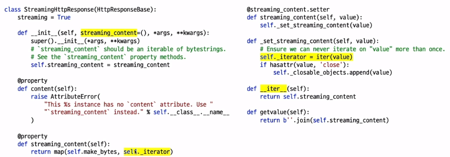

# Django

​        

### 사전 지식

> Django를 배우기 전에 다음과 같은 기초 지식이 필요합니다.

- [x] **Python**
- [x] **jQuery**
- [x] **HTML / CSS / Javascript **

​     

### Goal

- [x] **Django HTML Form**
- [x] **HttpRequest와 HttpResponse**
- [x] **Django Form**
- [x] **Cross Site Request Forgery**
- [x] **Model Form** 
- [x] **Form Validation**
- [x] **Messages Framework**
- [x] **Built-in CBV를 통한 Form 처리**


## I. Django HTML Form

   

   

- HTML Form(클라이언트 측)
  - 클라이언트에서 사용자에게 입력폼을 제공하고, 이를 서버로 전송코자 할 때

- Django Form(서버 측)
  - 클라이언트로부터 전달받은 값들에 대한 **유효성 검사를 수행하고, 이를 데이터베이스에 저장**하는 등의 처리
  - **HTML Form을 생성하는 기능**을 제공합니다. 이를 활용하거나, 인터페이스만 맞춰 직접 HTML Form을 코딩해도 괜찮습니다.


### 1. HTML Form

- HTML 웹 페이지에서는 `<from></form>` 태그를 통해, 입력폼을 구성하고, submit시에 지정 action URL로 뎅이터 전송을 시도
  - ex) 로그인 폼, 댓글 폼
- 하나의 `<form>` 태그는 하나 이상의 Widget을 가집니다.

```html
<form action="" method="POST">
    <input type="text" />
    <textarea></textarea>
    <select></select>
    <input type="checkbox" />
    <input type="radio" />
</form>
```


### 2. HTML `<form>` 태그 필수 속성


- action : 요청을 보낼 주소
- method : 전송 방식
  - "GET" : 주로 데이터 조회 요청 시에 사용
  - "POST" : 파괴적인 액션(생성/수정/삭제)에서 사용
- enctype : 인코딩 방식
  - POST 요청에서만 유효
  - GET 요청에서는 한 enctype으로 강제됨.


### 3. `<from>` 의 enctype


- "application/x-www-form-urlencoded" (디폴트)
  - GET 요청에서는 이 유형이 강제됨.
  - 인자들을 "URL 인코딩"을 수행하여, QueryString 형태로 전달
    - 파일 업로드 불가
- "multipart/form-data"
  - 파일 업로드 가능
- "text/plain"
  - 실제로 사용되지는 않는 유형
  - 공백만 "+"로 변환


### 4. url encode

  

- key=value 값의 쌍이 & 문자로 이어진 형태
- 공백은 +로 인코딩하며, Special 문자들은 ascii 16진수 문자열, UTF8 인코딩 16진수 문자열로 변환


```python
from urllib.parse import urlencode
print(urlencode({'key1': 'value1','key2': 10, 'name': '방탄소년단'}))
print('방탄소년단'.encode('utf8'))
print(''.join('%{:X}'.format(ch) for ch in '방탄소년단'.encode('utf8')))
```


### 5. Form Method


#### (1) Form 요청에서 인자 보내는 2가지 방법


1. 요청 URL 뒤에 ? 를 붙이고, 인자를 실어서 보내기.
   - x-www-form-urlencoded 인코딩의 값만 실을 수 있습니다.
   - 이 인자를 Query String 인자라고 부릅니다.
   - GET 요청에서 주로 사용하기에 GET 인자라고도 합니다,
     - POST 요청에서도 요청 URL 뒤에 QueryString을 실을 수 있습니다.
2. 요청 Body에 모든 인코딩의 인자를 실어서 보냅니다.
   - x-www-form-urlencoded 인코딩의 값도 OK
   - multipart/form-data 인코딩의 값도 OK  >>> 파일 업로드 가능


#### (2) 2가지 Form Method


- GET 방식
  - 엽서에 비유. 물건을 보낼 수 없다.
  - application/x-www-form-urlencoded 만이 강제되며, 인코딩된 문자열을 QueryString으로 전달
- POST 방식
  - 택배에 비유. 다양한 물건을 보낼 수 있다.
  - 다양한 인코딩을 모두 사용 가능하며 (application/x-www-form-urlencoded 및 multipart/form-data), 인코딩된 데이터를 "요청  Body"에 담아서 전달


#### (3) GET 요청 예시


- enctype은 붙여도 의미가 없기에 붙이지 않습니다.
  - 디폴트 : application/x-www-form-urlencoded로 강제
- 주로 검색폼에서 인자를 넘길 때 씁니다.  >>> 조회 목적


#### (4) Post 요청 예시


파일 업로드를 수행한다면, 필히 enctype을 multipart/form-data로 지정 >>> 오타에 유의


```html
<form method="POST" action=="" enctype="multipart/form-data">
    <input type="text" name="title" />
    <textarea name="content"></textarea>
    <input type="file" name="photo" />
    <input type="submit" value="저장" />
</form>
```


### 6. 장고 뷰에서의 인자 접근


- request.GET
  - 모든 QueryString 인자 목록
    - QueryString을 파싱한 QueryDict 객체
  - GET/POST 요청에서 모두 가능
- request.POST
  - POST 요청에서만 가능
  - 파일 내역은 제외한 모든 POST인자 목록
    - "요청 BODY"를 파싱한 QueryDict 객체
- request.FILES
  - POST 요청에서만 가능
  - "요청 BODY"에서 파일내역만 파싱한 MultiValueDict 객체

   

  


## II. HttpRequest와 HttpResponse


### 1. HttpRequest 객체

  

- 클라이언트로부터의 모든 요청 내용을 담고 있으며
  - 함수 기반 뷰 : 매 요청 시마다 뷰 함수의 첫번째 인자 request로 전달
  - 클래스 기반 뷰 : 매 요청 시마다 self.request를 통해 접근
- Form 처리 관련 속성들
  - .method : 요청 종류 "GET" 또는 "POST"로서 모두 대문자
  - .GET : GET 인자 목록 (QueryDict 타입)
  - .POST : POST 인자 목록 (QueryDict 타입)
  - .FILES : POST 인자 중에서 파일 목록 (MultiValueDict 타입)


### 2. MultiValueDict


- dict을 상속받은 클래스
- 동일 key의 다수 value를 지원하는 사전
  - http 요청에서는 하나의 key에 대해서 여러 값을 전달 받을 수 있어야만 합니다.
  - URL의 QueryString은 같은 Key로서 다수 Value지정을 지원 ex) name=Tom&name=Steve&name=Tomi


#### (1) 동일 Key의 다수 Value를 지원하는 사전

 


#### (2) 수정 불가능한 (Immutable) 특성

 


### 3. QueryDict

> 수정 불가능한 MultiValueDict

  

```python
class QueryDict(MultiValueDict):
    _mutable = True
    _encoding = None
    
    def __init__(self, query_string=None, mutable=False, encoding=None):
        # ...
        self.mutable = mutable
    def _assert_mutable(self):
        if not self._mutable:
            raise AttributeError("This QueryDict instance is immutable")
    def __setitem__(self, key, value):
        self._assert_mutable()
        #...
    def __delitem__(self, key):
        self._assert_mutable()
        #...
    # ...
```


### 4. HttpResponse


#### (1) django.http.HttpResponse


- 다양한 응답을 Wrapping : HTML 문자열, 이미지 등등
- View에서는 반환값으로서 HttpResponse 객체를 대체
  - Middleware에서 HttpResponse 객체를 대체


```python
# 프로젝트/settings

# MIDDLEWARE는 순서가 있는 list이다.
MIDDLEWARE = [
    'debug_toolbar.middleware.DebugToolbarMiddleware',
    'django.middleware.security.SecurityMiddleware',
    'django.contrib.sessions.middleware.SessionMiddleware',
    'django.middleware.common.CommonMiddleware',
    'django.middleware.csrf.CsrfViewMiddleware',
    'django.contrib.auth.middleware.AuthenticationMiddleware',
    'django.contrib.messages.middleware.MessageMiddleware',
    'django.middleware.clickjacking.XFrameOptionsMiddleware',
]
```


#### (2) 파일-like 객체

 

- .write(content)
- .flush()
- .tell()


#### (3) 사전-like 인터페이스로 응답의 커스텀 헤더 추가 / 삭제


```python
response = HttpResponse()
response['Age'] = 120
del response['Age']
```


#### (4) 파일 첨부로 처리되기를 브라우저에게 알리기


```python
response = HttpResponse(excel_data, content_type='application/vnd.ms-excel')
response['Content-Disposition'] = 'attachment'; filename="foo.xls"
```


 ### 5. django.http.JsonResponse (1)

  


### 6. django.http.JsonResponse (2)

  


### 7. django.http.StreamingHttpResponse (1)


- 효율적인 큰(긴) 응답을 위함
  - 혹은 메모리를 많이 먹는 응답 : iteraotr를 통한 응답
- 하지만 Django는 short-lived 요청에 맞게 디자인
  - 큰(긴) 응답 시에는 극심한 성능 저하로 이어질 수 있습니다.
- HttpResponse를 상속받지 않음.
  - 필히 iterator를 지정해야만 제대로 동작
  - .content 속성 사용 X  : .streaming_content 사용
  - .tell(), .write() 사용 X


### 8. django.http.StreamingHttpResponse (2)

 




### 9. django.http.StreamingHttpResponse (3)

> Streaming large SCV files

 


### 10. django.http.FileResponse

> FileResponse(open_file, as_attachment=False, filename='', **kwargs)


- StreamingHttpResponse를 상속 받음.
  - 파일 내용 응답에 최적화
  - Content-Length, Content-Type, Content-Disposition 헤더 자동 지정
- 인자
  - open_file : Streaming Content
  - as_attachment : Content-Disposition 헤더 지정 여부
  - filename


```python
from django.http import FileResponse
response = FileResponse(open('myfile.png', 'rb'))
response = FileResponse(open('myfile.pdf', 'rb'), as_attachment=True)
```


## III. Django Form


- 장고를 더욱 장고스럽게 만들어주는 주옥같은 Feature
- 주요 역할
  - 입력폼  HTML 생성
  - 입력폼 값에 대한 유효성 검증 (Validation) 및 값 변환
  - 검증을 통과한 값들을 dict형태로 제공


```python
# myapp/forms. py
from django import forms

class PostForm(forms.Form):
    title = forms.CharField()
    content = forms.CharField(widget=form.Textarea)
```


### 1. Django Style의 Form 처리 (1)


- 하나의 URL (하나의 View)에서 2가지 역할을 모두 수행
  1. 빈 폼을 보여주는 역할
  2. 폼을 통해 입력된 값을 검증하고 저장하는 역할


### 2. Django Style의 Form 처리 (2)


- GET 방식으로 요청받았을 때
  - New/Edit 입력폼을 보여줍니다.
- POST 방식으로 요청받았을 때
  - 데이터를 입력받아 (request.POST, request.FILES) 유효성 검증 수행
  - 검증 성공 시 : 해당 데이터를 저장하고 SUCCESS URL로 이동
  - 검증 실패 시 : 오류 메시지와 함께 입력폼을 다시 보여줌


```python
def post_new(request):
    if request.metho == 'POST':
        form = PostForm(request.POST, request.FILES)
        if form.is_valid():
            post = Post(**self.cleaned_data)
            post.save()
            return redirect(post)
        else:
            form = PostForm()
            
        return render(request, 'blog/post_form.html', {
            'form': form
        })
```


### 3. Form / ModelForm 클래스 정의


#### (1) 일반 Form

```python
# myapp/forms. py
from django import forms

class PostForm(forms.Form):
    title = forms.CharField()
    content = forms.CharField(widget=form.Textarea)
```


#### (2) Form의 경우 필드 별로 유효성 검사 함수 추가 적용


#### (3) ModelForm

  


#### (4) View 함수 내에서 method에 따라 Form 객체 생성


### (5) POST 요청에 한해 입력값 유효성 검증


#### (6) 템플릿을 통해 HTML 폼 노출


1. GET 요청일 때
   - 유저가 Form을 채우고 Submit  >>> POST 요청
2. POST 요청이지만 유효성 검증에서 실패했을 때
   - Form 인스턴스를 통해 HTML 폼 출력
   - 오류메세지도 있다면 같이 출력
     - 유저가 Form을 채우고 Submit  >>> POST 재요청

```html
<table>
    <form action="" metho="post">
        
        <table>{{ form.as_table }}</table>
        <input type="submit" />
    </form>
</table>
```


### 4. Form Fields


- Model Fields 와 유사
  - Model Fields : Database Field 들을 파이썬 클래스화
  - Form Fields : HTML Form Field 들을 파이썬 클래스화
- 필드 종류
  - BooleanField, CharField, ChoiceField, DataField, DateTimeField, EmailField, FileField, ImageField,
    FloatField, IntegerField, RegexField 등


  

  

## IV. Cross Site Request Forgery

> 사이트 간 요청 위조 공격

  

- 사용자가 의도하지 않게 게시판에 글을 작성하거나, 쇼핑을 하게 하는 등의 공격
  - 특정 웹사이트가 유저의 웹브라우저를 신용하는 상태를 노린 것


### 1. 공격을 막기 위해 Token을 통한 체크

> 요청을 받는 서버 입장에서

  

- POST 요청에 한해 CsrfViewMiddleware 를 통한 체크
  - POST 요청을 받을 때 Token값이 없거나 유효하지 않다면, 403 응답
- 처리 순서
  1. 입력 Form을 보여줄 때, CSRF Token 값도 값이 할당
     - CSRF Token은 User마다 다르며, 계속 변경된다.
  2. 그 입력 Form을 통해 Token값이 전달이 되면, Token 유효성 검증


### 2. 이를 적용하기 위한 단 1줄의 코드

-  장고 프로젝트 기본 세팅으로 CsrfViewMiddleware가 적용되어 있습니다.

 


#### 주의 사항

- CSRF Token != 유저인증 Token
- CSRF Token != JWT (JSON Web Token)


### 3. CSRF Token 체크 기능을 끈다?

- 가급적이면 끄지 마세요.
  - 기본 제공되는 보안기능이며,
  - 이를 유지하는 데에 비용이 거의 들지 않는다.
- 특정 View에 한해, CSRF Token 체크에서 배제할려면?
  - 해당 뷰에 #csrf_exempt 장식자를 적용


```python
from django.views.decorators.csrf import csrf_exempt

@csrf_exempt
def post_new_for_api(request):
    # blah blah blah
```


### 4. 앱 API 에서는 꺼주세요.


- django-rest-framework의 APIView에서는 csrf_exempt가 적용되어 있습니다.


## V. Model Form


- 장고 Form을 상속
- 지정된 Model로부터 필드정보를 읽어들여, Form Fields를 세팅
- 내부적으로 Model Instance를 유지
- 유효성 검증에 통과한 값들을 통해 지정 Model Instance로의 저장(save)을 지원 
  - Create 또는 Update

```python
class PostForm(forms.ModelForm):
    class Meta:
        model = Post
        # 전체 필드 지정. 혹은 list로 읽어올 필드명 지정
        fields = '__all__'
```


### 1. Form/ModelForm


### 2. ModelForm.save(commit=True)


- Form의 cleaned_data를 Model Instance 생성에 사용하고, 그 Instance를 리턴
- commit - True
  - model instance의 save() 및 form.save_m2m()을 호출
  - form.save() != instance.save()
- commit = False
  - instance.save() 함수 호출을 지연시키고자할 때 사용


### 3. View에서의 ModelForm 처리 (New)


### 4. View에서의 ModelForm 처리 (Edit)


### 5. ModelForm.save(commit=False) 예시 (1)


### 6. ModelForm.save(commit=False) 예시 (2)


#### 당부 : Form을 끝까지 써주세요.


## VI. Form Validation


### 1. Form 유효성 검사가 수행되는 시점


```python
# myapp/views.py

def post_new(request):
    if request.method == 'POST':
        form = PostForm(request.POST, request.FILES)
        if form.is_valid(): #유효성 검사가 수행됩니다.
            form.save()
            # SUCCESS 후 처리
        else:
            form = PostForm()
```


### 2. 유효성 검사 호출 로직

> form.is_valid() 호출 당시

  

1. form.full_clean() 호출
   1. 각 필드 객체 별로
      - 각 필드객체.clean() 호출을 통해 각 필드 Type에 맞춰 유효성 검사
   2. Form 객체 내에서
      - 필드 이름 별로 Form객체.clean_필드명() 함수가 있다면 호출해서 유효성 검사
      - Form객체.clean() 함수가 있다면 호출해서 유효성 검사
2. 에러 유무에 따른 True/False 리턴


### 3. Form에서 수행하는 2가지 유효성 검사

1. Validator 함수를 통한 유효성 검사
   - 값이 원하는 조건에 맞지 않을 때, ValidationError 예외를 발생
     - 주의: 리턴값은 사용되지 않습니다.
2. Form 클래스 내 clean, clean_ 멤버함수를 통한 유효성 검사 및 값 변경
   - 값이 원하는 조건에 맞지 않을 때, ValidationError 예외를 발생
   - 리턴값을 통해 값 변환


### 4. 함수형/클래스형 Validator (1)


- 함수형
  - 유효성 검사를 수행할 값 인자를 1개 받은 Callable Object
- 클래스형
  - 클래스의 인스턴스가 Callable Object


### 5. 모델 필드 정의 시에 지정

  


### 6. ModelForm 이지만, Form Field 직접 지정


### 7. 빌트인 Validator

- RegexValidator
- EmaiValidator
- URLValidator
- valiate_email
- validate_slug
- validate_unicode_slug
- validate_ipv4_address, validate_ipv6_address, validate_ipv46_address
- validate_comma_separated_integer_list
- int_list_validator
- MaxValueValidator
- MinValueValidator
- MaxLengthValidator
- MinLengthValidator
- DecimalValidator
- FileExtensionValidator : 파일 확장자 허용 여부
  - 주의 : 확장자만으로 정확히 그 포맷 임을 확정할 수는 없습니다.
- validate_image_file_extension
  - 이미지 확장자 여부. Pillow 설치 필수
- ProhibitNullCharactersValidator : 문자열에 '\x00' 포함 여부


### 8. 모델 필드에 디폴트 적용된 validators


- models.EmailField(CharField)
  - validators.validate_email 적용
- models.URLField
  - validators.URLValidator() 적용
- models.GenericIPAddressField
  - validators.ip_address_validators 적용
- models.SlugField
  - validators.validate_slug 적용


### 9. Form clean 멤버함수에게 기대하는 것


1. "필드별 Error 기록" 혹은 "Non 필드 Error 기록"
   - 값이 조건에 안 맞으면 ValidationError 예외를 통해 오류 기록
   - 혹은 add_error(필드명, 오류내용) 직접 호출을 통해 오류 기록
2. 원하는 포맷으로 값 변경
   - 리턴값을 통해 값 변경하기


### 10. 멤버 함수별, 검사/변경의 책임


- clean_필드명() 멤버함수
  - 특정 필드별 검사/변경의 책임
  - ValidationError 예외 발생 시, 해당 필드 Error로 분류
- clean() 멤버함수
  - 다수 필드에 대한 검사/변경의 책임
  - ValidationError 예외 발생 시, non_field_errors로 분류
  - add_error(...) 함수를 통해 필드별 Error 기록도 가능


### 11. 언제 validator를 쓰고, 언제 clean을?


- 가급적이면 모든 validators는 모델에 정의하고, ModelForm을 통해 모델의 validators 정보도 같이 가져오는 것이 좋다.
- clean이 필요할 때
  - 특정 Form에서 1회성 유효성 검사 루틴이 필요할 때
  - 다수 필드값에 걸쳐서 유효성 검사가 필요할 때
  - 필드 값을 변경할 필요가 있을 때
    - validator는 값만 체크할 뿐, 값을 변경할 수는 없습니다.


### 12. 예시 코드


#### 위 코드를 개선한 코드


## VII. Messages Framework


### 1. Messages Framework


- 현재 User를 위한 1회성 메시지를 담는 용도
  - ex) "저장했습니다." "로그인되었습니다"
- HttpRequest 인스턴스를 통해 메시지를 남깁니다.
  - 즉 View에서만 사용 가능
- 메시지는 1회 노출이 되고 사라집니다.
- View를 통한 템플릿 시스템을 통해 노출을 하며, 템플릿 내에서 JavaScript를 통한 노출도 가능


### 2. Message Level을 통한 메시지 분류

- 파이썬 로깅 모듈의 Level을 차용
- 레벨에 따라 로깅 여부 판단
  - 혹은 템플릿에서 다른 스타일로 노출
- 레벨 종류
  - DEBUG : 디폴트 설정으로 무시되는 레벨
    - 개발관련된 메세지이며, 실서비스에서는 무시
  - INFO : 해당 유저에 대한 정보성 메세지
  - SUCCESS : 액션이 성공적으로 수행되었음을 알림
  - WARNING : 실패가 아직 발생하진 않았지만, 임박했다.
  - ERROR : 액션이 수행되지 않았거나, 다른 Failure가 발생했다.


### 3. Message 등록 코드


```python
# blog/views.py
from django.contrib import messages

def post_new(request):
    if form.is_valid():
        post = form.save()
        # 방법1
        messages.add_message(request, messages.SUCCESS, "새 글이 등록되었습니다.")
        
        # 방법2 (shortcut 형태)
        messages.success(request, '새 글이 등록되었습니다.') 
        
        return redirect(post)
```


### 4. messages 소비

> 주로 템플릿을 통해서 소비

  

- messages context_processors를 통해 messages 목록에 접근
  - .tags 속성을 통해 레벨을 제공
  - .messages 속성을 통해 내용을 제공(=str(message))

```html

	<ul class="messages">
       
        	<li>
            	[{{ message.tags }}] {{ message.message }}
        	</li>
       
	</ul>

```


#### 참고 Context Processors

> https://github.com/django/django/blob/2.1/django/template/context.py#L246


- 템플릿 기본 로딩 변수목록을 생성시켜주는 함수 목록


### 5. Bootstrap4 alert 스타일과 대응해보기


### 6. Bootstrap4 alert HTML 마크업


#### 방법 1. 출력 tags 변경하기

> 프로젝트/settings.py

 

```python
from django.contrib.messages import constants as messages_constants

MESSAGE_TAGS = {
    messages_constants.DEBUG: 'secondary',
    messages_constants.ERROR: 'danger',
}
```


#### 방법2. MESSAGE_LEVEL 변경하기

> 메세지 노출 최소 레벨(프로젝트/settings.py)

 

```python
from django.contrib.messages import constants as messages_constants


MESSAGE_LEVEL = messages_constants.INFO # 디폴트 설정
MESSAGE_LEVEL = messages_constants.DEBUG
```


### 7. django-bootstrap4의 템플릿 태그


- bootstrap4/messages.html 활용


### 8. 기본 Form/Messages 템플릿

> django-bootstrap4를 활용


## VIII. Built-in CBV를 통한 Form 처리


- Generic editing views
  - FormView
    - TemplateResponseMixin, BaseFormView
  - CreateView
    - SingleObjectTemplateResponseMixin
    - BaseCreateView : ModelFormMixin, ProcessFormView
  - UpdateView
    - SingleObjectTemplateResponseMixin
    - BaseUpdateView : ModelFormMixin, ProcessFormView
  - DeleteView
    - SingleObjectTemplateResponseMixin
    - BaseDeleteView : DeletionMixin, BaseDetailView


### 1. Form CBV 관계도


### 2. Create 구현의 다양한 예


#### 방법1


#### 방법2


#### 방법3


#### 방법 4

